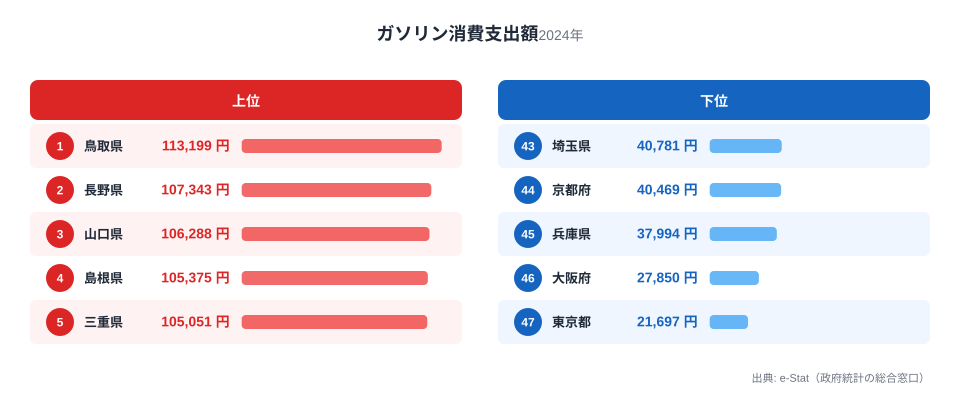
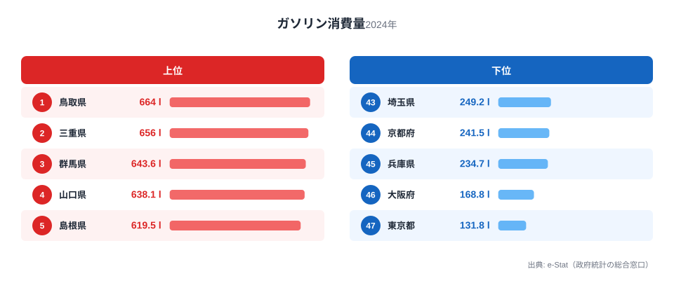

同じ日本に住んでいても、車を持つかどうかで家計の重みはまったく違います。総務省「家計調査」の2024年データによると、1世帯あたりのガソリン消費支出額は都道府県によって最大5.2倍もの開きがあります。

もっとも支出が多いのは鳥取県で年間113,199円。もっとも少ないのは東京都で21,697円です。同じガソリン1リットルの価格差ではなく、「どれだけ車に乗る必要があるか」という生活構造そのものの差がここに表れています。

この記事では、支出額と消費量の両方のランキングを見比べながら、なぜこれほど大きな地域差が生まれるのかを探ります。

> [!NOTE]
> 本データは総務省「家計調査」の1世帯あたり年間支出額（2024年）です。地方ほど1世帯あたりの自動車保有台数が多く、通勤・買い物の移動距離が長い傾向があるため、単純な「ガソリン価格」の地域差だけでは説明できません。

## ガソリン消費支出額ランキング　上位と下位

支出額の上位には、鳥取県（113,199円）、長野県（107,343円）、山口県（106,288円）、島根県（105,375円）、三重県（105,051円）が並びます。上位10県の地域分布を見ると、山陰・北関東・北陸がそれぞれ2県ずつ入っており、公共交通網が都市部ほど密でない地域に集中していることがわかります。

一方、下位は東京都（21,697円）、大阪府（27,850円）、兵庫県（37,994円）、京都府（40,469円）、埼玉県（40,781円）と、三大都市圏の府県が並びます。下位10県の地域分布では南関東が4県、近畿が3県を占めており、鉄道・地下鉄・バスといった公共交通が発達した地域ほどガソリン支出が抑えられている構図が浮かびます。

<source-link href="/ranking/gasoline-consumption-expenditure">ガソリン消費支出額ランキングをもっと見る</source-link>

> [!WARNING]
> ガソリン価格そのものにも地域差はありますが、家計調査の支出額は「価格 × 使用量」の掛け算です。ここでの差の主因は使用量（走行距離・保有台数）側にあることは、次の消費量ランキングを見ると裏付けられます。

## ガソリン消費量ランキングでも同じ顔ぶれ

消費量（リットル）で見ても、1位鳥取県（664.01リットル）、2位三重県（655.993リットル）、3位群馬県（643.604リットル）、4位山口県（638.148リットル）、5位島根県（619.49リットル）と、支出額ランキングの上位県とほぼ同じ顔ぶれが並びます。最下位も東京都（131.797リットル）、大阪府（168.789リットル）、兵庫県（234.682リットル）、京都府（241.495リットル）、埼玉県（249.248リットル）と一致しており、支出額の差が「価格差」ではなく「使用量の差」に由来することがはっきりと確認できます。

支出額の倍率が5.2倍、消費量の倍率が5.0倍とほぼ同水準である点も、価格差の寄与が小さいことを示しています。

<source-link href="/ranking/gasoline-consumption-quantity">ガソリン消費量ランキングをもっと見る</source-link>

## なぜ地方ほどガソリン支出が多いのか

上位県に共通するのは、鉄道網の密度が低く、通勤・通学・買い物のいずれも自家用車が主な移動手段になっている点です。[鳥取県](/areas/31000)や島根県のような山陰地方、群馬県・茨城県・栃木県といった北関東は、県内移動における鉄道のカバー率が低く、1世帯あたりの自動車保有台数も全国平均を上回る傾向があります。

対照的に、東京都・大阪府・兵庫県・京都府といった大都市圏は、地下鉄・私鉄・バスが網の目のように整備されており、車を持たない、あるいは持っていても使用頻度が低い世帯が多くなります。実際、[軽自動車の保有台数ランキング](/ranking/kei-car-count)を見ると、地方部で保有率が高い傾向が確認でき、ガソリン消費との関連が見えてきます。

> [!TIP]
> 車の保有・維持コストは購入費・保険・車検・駐車場代も含めた総額で考える必要があります。[自動車購入費の消費支出ランキング](/ranking/car-purchase-consumption-expenditure)と合わせて見ると、地方の「車ありき」の家計構造がより立体的に見えてきます。

[仮説] 公共交通の運行頻度・カバー率とガソリン消費支出には強い相関があると考えられますが、本記事のデータだけでは検証できません。国土交通省の公共交通統計と突き合わせた分析が今後の検証課題です。

支出上位の県には、通勤・通学の足として自家用車が事実上の必須インフラになっている地域が多く含まれます。鉄道の運行本数が1時間に1-2本程度の路線が中心の地域では、通院・買い物・子どもの送迎まで車に依存せざるを得ず、1世帯で2台以上を保有するケースも珍しくありません。ガソリン支出はこうした「複数保有」の積み上げでもあります。

## 読者の生活への含意

この地域差は、単なる「地方は不便」という話にとどまりません。ガソリン代は物価高騰の影響を直接受ける支出項目であり、地方在住世帯ほど原油価格・為替変動の家計インパクトを強く受けることを意味します。逆に都市部在住世帯は、電気代や公共交通運賃の値上げの影響をより強く受ける構造です。

さらに、EV（電気自動車）シフトが進んだ場合の家計への影響も、地域によって非対称になる可能性があります。ガソリン支出が大きい地方ほど燃料費削減の恩恵は大きい一方、充電インフラの整備が都市部に偏っている現状では、地方の家庭ほど乗り換えの初期ハードルが高くなるという矛盾も抱えています。

移住や転勤で生活環境が変わる際、「車を持つ前提の生活か、持たない前提の生活か」で年間の実質的な生活コストは大きく変わります。鳥取県と[東京都](/areas/13000)の差額は年間で約9万円にのぼり、これは決して無視できる金額ではありません。

## まとめ

- ガソリン消費支出額の1位は鳥取県（113,199円）、最下位は東京都（21,697円）で5.2倍の差
- 消費量ランキングも同じ顔ぶれで、支出差の主因は価格差ではなく使用量差
- 上位は山陰・北関東・北陸など公共交通網が薄い地域、下位は南関東・近畿の大都市圏
- 車社会の地方ほど家計に占める燃料費の比重が大きく、原油価格変動の影響も受けやすい
- 移住・転勤時の生活コスト試算では、ガソリン代を含めた総移動コストの比較が欠かせない

## データ出典

総務省「家計調査」（2024年）を基に、e-Stat（政府統計の総合窓口）経由で集計しています。
