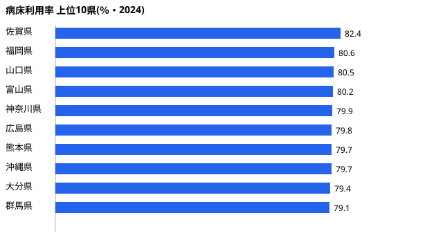

「同じ病気でも、住んでいる県によって入院しやすい県としにくい県がある」──そう言われたら直感に反するだろうか。だが一般病床の**病床利用率**(平均してどれだけのベッドが埋まっているか)を都道府県別に並べると、その差は無視できない大きさになる。

2024年のデータでは、最も病床が埋まっている佐賀県が **82.4%**、最も余裕のある福島県が **66.4%**。同じ日本の医療制度の下で、ベッドの稼働状況には **16.0ポイント**もの開きがある。全国平均は **76.5%** だ。

利用率が高いほど「ベッドが足りない=医療逼迫に近い」と単純化されがちだが、実態はそう一筋縄ではいかない。この記事では、**なぜ西日本に高い県が集まり、福島だけが唯一60%台なのか**という問いを軸に、医療提供体制の地域差を読み解く。

> [!NOTE]
> 病床利用率とは、一般病床の許可病床数に対して、実際に入院患者が利用したベッドの割合(年間平均)を指す。100%に近いほどベッドがフル稼働、低いほど空きベッドが多い状態を意味する。出典は厚生労働省「病院報告」で、本記事は2024年値を用いている。

## 全国の病床利用率はどう分布しているか

2024年の全国平均は **76.5%**。47都道府県は概ね70%台前半から80%台前半の帯に収まっており、極端な外れ値は少ない。ただし上位・下位の顔ぶれを見ると、地理的な偏りがはっきりと現れる。

上位には佐賀県(82.4%)、福岡県(80.6%)、山口県(80.5%)といった**九州・中国地方の県**が並ぶ。一方、下位には岐阜県(71.4%)、茨城県(71.8%)、岩手県(71.9%)など、東日本の県が目立つ。そして最下位の福島県(66.4%)は、47都道府県で唯一70%を割り込み、**ただ一県だけ60%台**という突出した低さだ。

> [!TIP]
> 病床利用率は「需要(患者)÷供給(ベッド数)」で決まる。利用率が高い県は患者に対してベッドが相対的に少なく、低い県はベッドが相対的に多い、という供給側の事情も大きく効いている。「利用率が低い=医療が手薄」と即断はできない。

## 利用率が高い県:佐賀・福岡・山口が示す西日本の傾向

まず上位10県を実数で確認する。

<!-- data-source: bed-utilization-rate-prefecture-rankings.json -->

トップの[佐賀県](/areas/41000)は82.4%で、唯一の82%台。続く[福岡県](/areas/40000)80.6%、山口県80.5%、富山県80.2%が80%台に並ぶ。そして注目すべきは、上位10県のうち福岡・山口・広島・熊本・沖縄・大分という**6県が九州・中国・沖縄に集中**している点だ。富山県と群馬県、そして人口稠密な神奈川県が例外的に上位に食い込む。

西日本に高利用率県が集まる背景には、これらの地域が人口あたりの病床数で全国上位に位置しながらも、高齢化の進行で入院需要が高止まりしている事情がある。ベッドが多いだけでなく、それを埋める需要も大きいという二重の構造が読み取れる。

<source-link href="/ranking/bed-utilization-rate">病床利用率ランキングの全47都道府県を見る</source-link>

## 利用率が低い県:福島だけが唯一の60%台という意外

次に下位を見る。最下位の福島県は66.4%で、その上の岐阜県(71.4%)とのあいだに **5ポイント**の段差があり、47都道府県で福島だけが孤立して低い。岐阜の上には茨城県(71.8%)、岩手県(71.9%)が続き、下位グループはいずれも70%台前半に張り付いている。

<!-- data-source: bed-utilization-rate-prefecture-rankings.json -->

福島県の突出した低さは何を意味するのか。利用率が低い=空きベッドが多いということは、需要(入院患者)に対してベッドの供給が過剰、あるいは患者が他県・他施設へ流れている可能性を示す。福島の場合、震災後の医療提供体制の再編や人口減少の影響が背景にあると考えられる。利用率の低さが医療資源の余剰なのか、それとも患者の受け皿不足なのかは、病床数・在院日数のデータと併せて確認する必要がある。

> [!WARNING]
> 病床利用率の高低だけで「医療が充実している/逼迫している」とは判断できない。低利用率は(a)ベッドが余っている、(b)在院日数が短く回転が速い、(c)患者が県外へ流出している、など複数の要因で起こりうる。利用率は医療提供体制を読むための一つの指標にすぎない。

## 医療逼迫の構造:利用率の高さは何を語るか

平時の病床利用率が高い県ほど、感染症の流行や災害といった**急な入院需要の増加に対する余力(バッファ)が小さい**。佐賀県のように82.4%が常態化していると、平常時にすでに8割以上のベッドが埋まっているため、有事に空けられるベッドの数が限られる。

一方で利用率が低すぎると、ベッドや医療スタッフが遊休状態になり、経営効率の面で課題を抱えることになる。医療提供体制は「高すぎず低すぎず」のバランスが求められる領域であり、全国平均の76.5%前後がひとつの目安と見ることもできる。

> [!NOTE]
> 病床利用率は医療機関の経営指標であると同時に、地域の医療逼迫リスクを測る先行指標でもある。新型コロナの流行期には、平時の利用率が高い都市部ほど確保病床のひっ迫が早く顕在化した。平時の数字に余力があるかどうかは、有事の備えと直結している。

医療提供体制の地域差をさらに掘り下げるには、病床数そのものや医療アクセスの指標と組み合わせて読むのが有効だ。関連する地域差の分析は以下の記事でも扱っている。

<source-link href="/blog/medical-access-regional-gap">医療アクセスの地域差をさらに読む</source-link>

## 利用率の地域差を読む複合要因

病床利用率を押し上げる需要側の主因は高齢化だ。高齢者は入院の頻度が高く、在院日数も長くなりやすいため、高齢化率の高い地域では入院需要が構造的に高止まりしやすい。

ただし、供給側（人口あたり病床数）の影響も大きい。西日本に高利用率県が多い背景には、これらの地域が比較的早くから高齢化が進んできた事情に加え、人口あたりの病床数が多い傾向が重なっていると考えられる。さらに、院外処方率の高低が入院期間に影響するという指摘もある。利用率を正しく読むには、高齢化率・人口あたり病床数・平均在院日数の3指標を組み合わせて初めて地域差の立体的な構造が見えてくる。

> [!TIP]
> 「利用率が高い県=高齢化が深刻」と短絡せず、ベッドの供給側(病床数)も併せて確認するのがコツだ。同じ高利用率でも、ベッドが少なくて埋まっているのか、需要が多くて埋まっているのかで、政策的な意味合いはまったく異なる。

地域ごとの医療・福祉の総合的なプロフィールは、各都道府県のエリアページでも確認できる。利用率1位の佐賀県、最下位の福島県それぞれの背景を見比べると、需要と供給のバランスの違いが浮かび上がる。

- 佐賀県のエリアプロフィール: [/areas/41000](/areas/41000)
- 福島県のエリアプロフィール: [/areas/07000](/areas/07000)

## まとめ

2024年の一般病床利用率は佐賀県82.4%（1位）と福島県66.4%（最下位）で16ポイント開いた。西日本・九州に高利用率県が集まり、福島が唯一の60%台として孤立して低いこの構図は、高齢化・病床供給・在院日数という複数要因が地域ごとに重なり合った結果だ。平時に利用率が高い県ほど有事のバッファが小さく、低すぎる県は経営効率の課題を抱える。この数字を「入院しやすさ」と単純化せず、地域の医療提供体制の余力を測る複合的な先行指標として読んでほしい。

## データ出典

- 厚生労働省「病院報告」(2024年) — 一般病床の病床利用率
- e-Stat(政府統計の総合窓口)経由で整備。出典データはクリエイティブ・コモンズ(CC BY 4.0)に基づき利用しています

