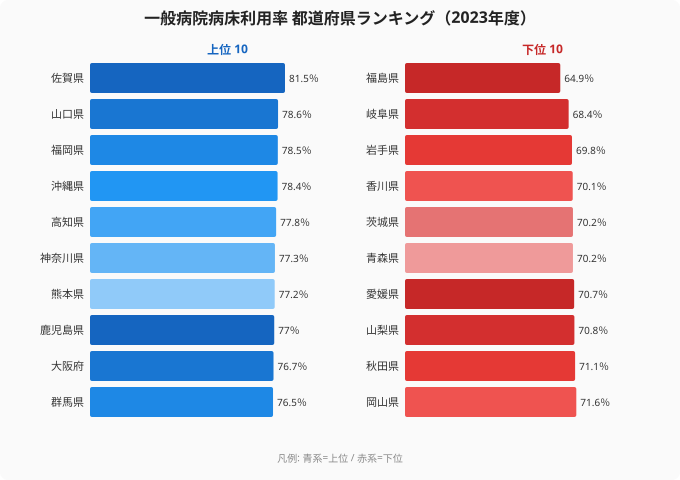

「病床利用率が高い病院に入院したい」と感じる人は少なくありません。常に患者で埋まっている病院は、人気があって信頼されているように見えるからです。ところが医療政策の現場では、この直感はしばしば逆になります。**病床利用率が高すぎる地域は「いざというときに入院できないリスク」を抱えている**のです。

2023年度の都道府県別一般病院病床利用率を見ると、最も高い佐賀県は81.5%、最も低い福島県は64.9%で、その差は16.6ポイントです。一見すると佐賀は「病院がよく使われている健全な県」に見えます。しかし80%という水準は、医療現場では「これ以上の急な入院を受け入れる余地が乏しい」ことを意味します。この記事では、利用率の高低が何を語っているのか、そしてなぜ高い県と低い県の双方にリスクが潜むのかを、47都道府県の数字から読み解いていきます。

> [!NOTE]
> 「一般病院病床利用率」は、一般病院が持つ許可病床数に対する1日あたり平均在院患者数の割合（％）。100%に近いほど病床がほぼ常時埋まっている状態を示す。本記事の数値は厚生労働省「医療施設調査」を社会・人口統計体系経由で整備した2023年度値。精神科病床や療養病床を含む「全病床」とは別系統の指標である点に注意。

## 全体像 — 47都道府県は64.9%〜81.5%に収まる

まず全体の分布を押さえておきましょう。一般病院病床利用率は、最高の佐賀県81.5%から最低の福島県64.9%まで、16.6ポイントの幅に47都道府県が並んでいます。中位の県は74%前後で、多くの県が70%台前半〜後半に集中しています。

倍率で見れば佐賀と福島の比は約1.3倍にとどまり、所得や物価のように何倍も開く指標ではありません。だからこそ、わずか数ポイントの違いが「入院できるか・できないか」「病院が黒字か・赤字か」を分ける繊細な指標として読む必要があります。

上位は佐賀（81.5%）・山口（78.6%）・福岡（78.5%）・沖縄（78.4%）・高知（77.8%）と続き、下位は香川（70.1%）・岩手（69.8%）・岐阜（68.4%）・福島（64.9%）が並びます。上位5県と下位5県の差は、最大でも佐賀81.5%と福島64.9%の16.6ポイントです。この狭いレンジの中に47都道府県がひしめいている点が、この指標の読み解きを難しくしています。

<source-link href="/ranking/general-hospital-bed-occupancy-rate">47都道府県の一般病院病床利用率ランキングを詳しく見る</source-link>

なぜ上位と下位がこう並ぶのか。上位に九州・西日本が、下位に東北が集まるのには、それぞれ医療供給構造と地域事情の理由があります。次の2つの章で、高い県と低い県を順に掘り下げていきます。

> [!TIP]
> 病院経営・医療政策では、病床利用率80%前後が一つの目安とされる。これを超えると新規入院や救急の受け入れ余力が薄くなり、逆に大きく下回ると採算が取りづらくなる。「高ければ良い」「低ければ余裕がある」と単純に読まず、適正水準からの距離で評価するのが基本。

## 上位はなぜ高いのか — 九州・西日本が並ぶ

上位の顔ぶれを見ると、1位の佐賀県（81.5%）を筆頭に、山口県（78.6%）、福岡県（78.5%）、沖縄県（78.4%）、熊本県（77.2%）、鹿児島県（77.0%）と、九州・西日本の県が目立ちます。TOP10に並ぶ佐賀・福岡・熊本・鹿児島の4県は、いずれも九州です。

注目すべきは、**80%を超えているのは佐賀県（81.5%）ただ1県**だという点です。2番手の山口県でも78.6%で、80%には届きません。佐賀は全国で唯一、平均的に見て病床がほぼ満床に近い状態にあります。

九州・西日本でこの指標が高い背景には、人口あたりの病床数（病床密度）が多い「西高東低」の医療供給構造があります。これらの地域は古くから民間病院が多く、入院医療が地域に根づいてきました。供給された病床がしっかり使われている状態は、地域に入院需要が安定して存在することの裏返しでもあります。利用率が高いということは、それだけ病床が遊んでいない＝医療資源が無駄なく回っているとも言えるわけです。

ただし、この「効率の良さ」は手放しで歓迎できるものではありません。なぜなら、埋まっているということは空けておく余白が小さいということでもあるからです。次の警告でその裏側を整理しておきましょう。

> [!WARNING]
> 利用率が高いことは、裏を返せば「急な需要増に弱い」ことを意味する。感染症の流行期や災害・大規模事故で入院患者が急増したとき、平常時から80%前後で運用している病院には受け入れの余白が少ない。利用率の高さは効率の良さであると同時に、緊急時の脆さでもある——ここが「高い県ほど入院しにくい」という逆説の核心。

## 下位はなぜ低いのか — 東北と福島の事情

一方、下位グループには東北の県が集まります。最下位は福島県（64.9%）で、全国で唯一65%を下回っています。岩手県（69.8%）、青森県（70.2%）、秋田県（71.1%）と、東北各県が下位に並びます。岐阜県（68.4%）のように東北以外の県も混じりますが、ランキング下位10県のうち秋田・青森・岩手・福島の4県が東北です。下位5県を低い順に並べると、福島（64.9%）・岐阜（68.4%）・岩手（69.8%）・香川（70.1%）・茨城（70.2%）となります。

福島県の64.9%は、その上の岐阜県（68.4%）からさらに3.5ポイント低く、最下位グループの中でも突出して低い水準です。**[仮説]** 東日本大震災・原発事故（2011年）に伴う医療機能の移転・再編や、その後の人口流出・高齢化による入院需要の構造変化が背景にある可能性があります。ただしこれは利用率という単一指標から直接立証できるものではなく、病床数や患者の受療動向との突き合わせが必要です（検証には病床密度・受療率データとの照合が要ります）。

低い利用率は、患者にとっては「入院しやすい」ように見えます。しかし病院経営の観点では話が違ってきます。空いている病床は収入を生まないため、利用率の低さは病院の財務を静かに蝕んでいくからです。この患者目線と経営目線のねじれを、次の章で正面から扱います。

> [!WARNING]
> 下位の県を「入院しやすくて恵まれている」と単純に読むのは早計。利用率が低い背景には人口減少による入院需要そのものの縮小がある場合が多く、それは「将来この地域の病院が維持できなくなる」前兆でもある。低利用率＝余裕、という直感は逆方向のリスクを見落とす。

## 逆説の構造 — 「入院しやすい県」は経営難の県でもある

ここまでの上位・下位を、もう一段深く読み解きましょう。一般病院病床利用率は、患者目線と経営目線で意味が正反対になる指標です。

- **高い県（佐賀81.5%など）**：病床がよく埋まっている＝経営は安定しやすいが、急な入院・救急の受け入れ余力が少ない。混雑時には「入院待ち」が起きやすい。
- **低い県（福島64.9%など）**：空床に余裕があり一見「入院しやすい」が、病床あたりの収入が稼げず経営が圧迫されやすい。

日本の診療報酬制度では、一定の病床利用率を維持できないと採算が悪化します。利用率が慢性的に低い病院は、病床削減や診療科の縮小、最悪の場合は撤退に追い込まれます。つまり**「空いている病院」は、長い目で見ればその地域から消えてしまうリスクを抱えている**のです。低利用率は「余裕」ではなく「将来の医療アクセス低下の予兆」になりうるのです。

逆に高利用率の地域も、平常時に効率よく回っているからといって安心はできません。緊急時の余力（サージキャパシティ）が乏しければ、感染症の波が来たときに真っ先に逼迫します。佐賀のような県の医療機関は、平常時の効率と緊急時の余白という二律背反の中で運用していることになります。

> [!NOTE]
> だからこそ、病床利用率は単独で読むのではなく人口あたりの病床数（病床密度）とセットで見ることが欠かせない。利用率が高くても病床密度の高い九州のような地域は、絶対的な受け入れ能力そのものが大きい。逆に利用率が低くても病床数が少ない地域では、わずかな需要増ですぐ満床になる。利用率と密度を組み合わせて初めて、その地域の「入院しやすさ」の実像が見えてくる。

地域ごとの医療供給の厚みは、各県のプロフィールからも確認できます。たとえば[佐賀県のエリア別統計](/areas/41000)と[福島県のエリア別統計](/areas/07000)を比べると、利用率の差の背後にある人口構成や医療資源の違いが読み取れます。社会保障に関わる他の指標は[社会保障カテゴリの統計一覧](/category/socialsecurity)から横断的に確認できます。

## データ出典

本記事のランキングは以下のデータに基づきます。

- 厚生労働省「医療施設調査」（社会・人口統計体系経由 / e-Stat）2023年度

数値の元データは、各都道府県の一般病院における許可病床数と平均在院患者数から算出された病床利用率（％）です。年次や定義の更新により過去記事と数値が一致しない場合がある点に留意してください。利用率の元になる順位・実数値は[一般病院病床利用率ランキング](/ranking/general-hospital-bed-occupancy-rate)で全47都道府県分を確認できます。

## まとめ

- 2023年度の一般病院病床利用率は、佐賀県81.5%・福島県64.9%で**16.6ポイント差**。倍率では約1.3倍と、開きの小さい繊細な指標です。
- **80%を超えるのは佐賀県のみ**。九州・西日本の県が上位に多く、TOP10に並ぶ九州勢は佐賀・福岡・熊本・鹿児島の4県です。
- 下位は東北が中心で、最下位の福島県（64.9%）は全国で唯一65%を割り込んでいます。
- 利用率が高い県ほど緊急時の入院余力が乏しく、低い県は経営難で医療機能が縮小するリスクを抱えます——患者目線と経営目線で意味が反転する指標です。
- 病床利用率は単独ではなく、人口あたりの病床数（病床密度）とセットで読むことで初めて地域医療の実像が見えてきます。
