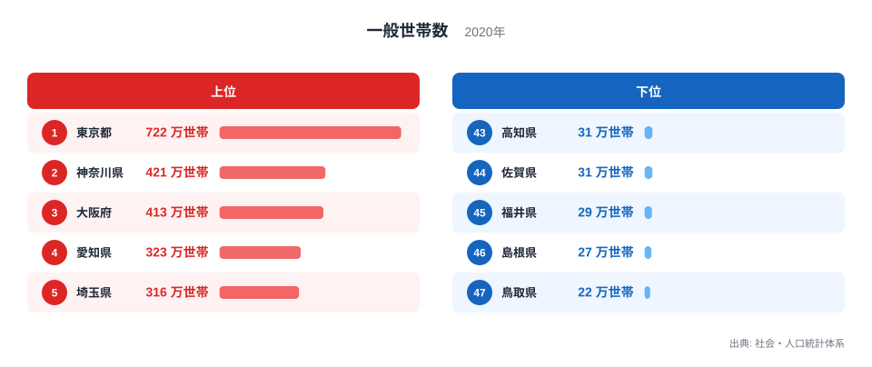

## 一般世帯数には、なぜ大きな県差があるのか

2020年の一般世帯数を都道府県別に比べると、東京都が722万世帯で最多、鳥取県が22万世帯で最少です。単純に割ると、その差は約32.8倍になります。同じ「1都道府県」という単位でも、そこに暮らす世帯の総数には想像以上の開きがあります。

ただし、この数字だけを見て「東京都では世帯を持つ人が多い」「鳥取県では世帯を持つ人が少ない」と解釈するのは早計です。一般世帯数は割合ではなく総数なので、まず人口規模の違いを強く反映します。さらに、都道府県の境界、都市圏への人口集中、住宅の集まり方などが重なって生まれた数字です。

> [!NOTE]
> 一般世帯とは、住居と生計をともにする人の集まりや、一戸を構えて住む単身者などを数える統計上の区分です。寮や病院などに暮らす「施設等の世帯」とは分けて集計されます。

この記事では、まず上位と下位の県を確認し、次に総数ランキングから何が分かり、何までは分からないのかを整理します。順位そのものよりも、数字が表す地域の規模を丁寧に読むことが目的です。

## 上位には大都市圏の都府県が並ぶ

<source-link href="/ranking/general-households">一般世帯数ランキングをもっと見る</source-link>

一般世帯数の上位5都府県は、東京都722万世帯、神奈川県421万世帯、大阪府413万世帯、愛知県323万世帯、埼玉県316万世帯です。東京圏から東京都・神奈川県・埼玉県の3都県が入り、大阪圏と名古屋圏の中心となる府県も並びます。

6位の千葉県は277万世帯、8位の兵庫県は240万世帯です。中心都市だけでなく、その周辺で住宅地を抱える県も上位に位置しています。この並びからは、一般世帯が行政区域の中だけで完結せず、通勤・通学や住宅供給を通じて都市圏全体に広がっている様子が読み取れます。

一方、下位5県は高知県31万世帯、佐賀県31万世帯、福井県29万世帯、島根県27万世帯、鳥取県22万世帯です。徳島県も31万世帯で42位となっており、四国・山陰など人口規模の小さい県が下位側に並びます。

> [!TIP]
> 総数ランキングでは、1位と47位だけでなく、中心都市を持つ県と周辺県がどの位置にいるかを見ると、都市圏の広がりを捉えやすくなります。

東京都と鳥取県の差は700万世帯です。しかし、この差をそのまま生活の豊かさや家族の多さに結びつけることはできません。ここで比較しているのは、一世帯あたりの人数でも、世帯を形成する確率でもなく、それぞれの地域に存在する一般世帯の合計だからです。

## 「世帯が多い県」と「世帯を作りやすい県」は別です

一般世帯数が多い県は、住宅、電力、上下水道、ごみ収集、行政手続きなど、多数の世帯を支える基盤が必要です。その意味で、この指標は地域サービスの需要規模を考える入口になります。企業にとっても、小売や配送、通信、住宅関連サービスの潜在的な利用単位を大まかに把握する材料になります。

ただし、総数だけでは世帯の中身までは分かりません。同じ100万世帯でも、単身世帯が多い地域と、夫婦や子どもを含む世帯が多い地域では、必要な住宅やサービスが異なります。また、世帯数が増えていても、人口が増えているとは限りません。世帯の小規模化によって、人口が横ばいでも世帯数だけが増えることがあるためです。

> [!WARNING]
> 一般世帯数は人口規模の影響を受ける絶対数です。人口に対する比率や一世帯あたり人員を確認せず、県民の暮らし方や家族観の違いを説明することはできません。

たとえば東京都は一般世帯数で突出していますが、この数字だけから単身世帯の割合や持ち家率を判断することはできません。反対に鳥取県が最少であることも、住宅需要が弱い、あるいは地域の生活条件が劣るという評価にはつながりません。規模を測る指標と、構成や質を測る指標を分けて読む必要があります。

## 県を比較するときに重ねたい3つの視点

第一に確認したいのは総人口です。一般世帯数と人口を並べれば、世帯数の差の多くが地域の人口規模と対応していることを確かめられます。そのうえで一世帯あたり人員を見ると、同じ人口規模でも世帯の分かれ方が違う地域を探せます。

第二は世帯構成です。単独世帯、夫婦のみの世帯、子どものいる世帯などの比率を重ねると、住宅需要や生活支援の違いが見えやすくなります。一般世帯数は大きな入口ですが、政策や事業の判断には構成比まで掘り下げることが欠かせません。

第三は時系列です。2020年の1時点だけでは、世帯数が増加局面にあるのか、減少局面にあるのかを判定できません。人口減少が進む地域でも、世帯規模の縮小によって世帯数の減少が遅れて表れる場合があります。現在の順位と過去からの変化は、別々の問いとして確認するのが安全です。

> [!NOTE]
> 県境をまたぐ都市圏では、中心部の雇用と周辺部の住宅が一体になっています。都道府県ランキングは便利ですが、実際の生活圏と行政区域が一致しない点にも注意が必要です。

東京都の詳細は[東京都のデータブック](/areas/13000)、最少の鳥取県は[鳥取県のデータブック](/areas/31000)で確認できます。47都道府県の全順位と各県の値は[一般世帯数ランキング](/ranking/general-households)に掲載しています。人口に関する別の指標を探す場合は[人口カテゴリ](/category/population)から比較できます。

## ランキングから分かるのは地域の「受け皿」の大きさです

2020年の一般世帯数は、最多の東京都722万世帯から最少の鳥取県22万世帯まで約32.8倍の差がありました。上位には東京・大阪・名古屋の大都市圏を構成する都府県が並び、下位には人口規模の小さい県が多く並びます。

このランキングが直接示すのは、各都道府県にどれだけの一般世帯が存在するかという地域の規模です。住宅や生活サービスを受け止める「受け皿」の大きさを把握するには役立ちますが、世帯の暮らしやすさ、家族構成、将来の増減を単独で説明する指標ではありません。

総数を入口にし、総人口、一世帯あたり人員、世帯構成、時系列を重ねると、単なる順位表から地域の実像へ一歩近づけます。ランキングを見るときは「多いか少ないか」に加えて、「何の大きさを数えているのか」を確認することが大切です。

## データ出典

- 総務省統計局「社会・人口統計体系」（2020年）
