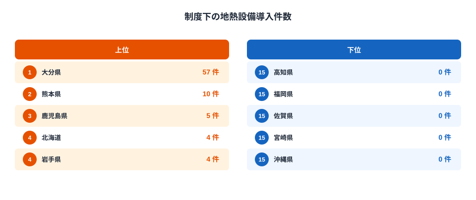
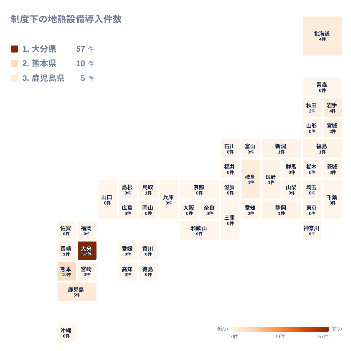

## 地熱発電施設数とは

地熱発電施設数は、地下深くの熱水や蒸気を利用して発電する施設の数を都道府県別に集計した指標です。国土数値情報の2013年データをもとに、発電所や発電設備が立地している地点の件数を数えています。売電量や発電容量ではなく、あくまで「施設がいくつあるか」という件数の指標です。

47都道府県のこの指標を見ると、すぐに気づく特徴があります。値を持つ県はわずか8県しかなく、残りの39県はすべて0か所です。全国の合計は17か所にとどまり、日本地図のほとんどの県で地熱発電施設が存在しません。なぜこれほど偏るのか、そしてどこに集中しているのかを、この記事では順に見ていきます。

> [!NOTE]
> 地熱発電施設数は「発電所の数」を数えたものであり、発電量や出力（MW）ではありません。小さなバイナリー式の地熱発電所も、大規模な蒸気タービン式の発電所も、同じ1施設として数えられます。件数の多さがそのまま発電量の大きさを意味するわけではない点に注意してください。

## 施設がある8県とゼロが並ぶ39県

<source-link href="/ranking/geothermal-power-plant-count">地熱発電施設数ランキングをもっと見る</source-link>

大分県は6か所で全国1位です。鹿児島県は3か所で2位、岩手県は2か所で3位、秋田県も2か所で4位に並びます。北海道は1か所で5位、宮城県も1か所で6位、福島県も1か所で7位、東京都も1か所で8位となっています。

ここまでの8県が、この指標で値を持つすべての県です。9位以降の39県はすべて0か所で、順位表の後半は延々とゼロが並びます。全国の合計17か所のうち、上位2県である大分県と鹿児島県だけで9か所を占めており、施設のある県の中でもさらに偏りがあることが分かります。

上位に並ぶ県の顔ぶれを見ると、東北の岩手県・秋田県・宮城県・福島県と北海道、そして九州の大分県・鹿児島県という組み合わせです。中部、近畿、四国、山陰といった地域には1つも入っておらず、関東では東京都の1か所だけです。上位2県を詳しく見たい場合は、[大分県のデータ](/areas/44000)と[鹿児島県のデータ](/areas/46000)からそれぞれの地域の特徴を確認できます。どちらも火山が多い地域という共通点があります。

## 地図で見る東北・北海道と九州への集中

タイルマップにすると、施設のある県が飛び地のように点在していることがよく分かります。大分県と鹿児島県のある九州南部と、岩手県・秋田県・宮城県・福島県のある東北、そして北海道という、離れた3つの地域にまとまって現れます。関東平野の内陸部や近畿、瀬戸内海沿岸のような人口が多い地域には施設がありません。

やや意外なのは東京都です。関東地方の中で唯一1か所を持っていますが、これは本州の関東平野ではなく、伊豆・小笠原諸島など火山活動が活発な島しょ部の施設だと考えられます。[仮説] 東京都という行政区分だけを見ると関東地方の施設のように見えますが、実際には地理的に離れた火山島の資源を利用したものである可能性が高く、都道府県という単位が必ずしも火山帯の分布と一致しないことを示す例といえます。この点はデータからは県単位の合計しか分からないため、島しょ部の内訳までは確認できません。

> [!WARNING]
> このデータは国土数値情報の2013年時点の値です。その後に新設・廃止された施設は反映されていません。近年は小規模なバイナリー式地熱発電所の新設が各地で進んでいるため、最新の施設数はここで示した値と異なっている可能性があります。過去の一時点を切り取った数値として読んでください。

## なぜ2つの火山帯に偏るのか

地熱発電に使える蒸気や熱水は、地下にマグマだまりが近い火山地帯でなければ得にくい資源です。日本列島には千島火山帯から東北日本火山帯を経て、九州の霧島・雲仙まで続く火山の帯があり、施設のある8県はほぼこの帯の上に位置しています。逆に、火山が少ない関東平野や近畿、四国、瀬戸内といった地域では、そもそも地熱発電に適した地点が少ないことが背景にあると考えられます。

一方で、日本は世界でも有数の地熱資源量を持つ国だとされながら、施設数が8県・17か所にとどまっている点は、資源量だけでは説明がつきません。[仮説] 温泉地や国立公園と地熱資源が重なる地域が多く、開発に時間がかかってきたことが一因である可能性があります。ただし、このデータからは開発が進まなかった理由そのものは確認できないため、あくまで仮説として捉えてください。

> [!TIP]
> 0か所という値は、その県に地熱資源がまったく無いことを必ずしも意味しません。地熱発電に向く地点が火山帯沿いに限られるため、火山の少ない地域では0が標準的な値になります。0を「資源が無い県」ではなく「火山帯から外れた県」として読むと、[同じカテゴリの統計一覧](/category/energy)にある他のエネルギー関連の指標とも比較しやすくなります。

## まとめ

- 1位は大分県で6か所、2位は鹿児島県で3か所です。
- 施設を1つでも持つ県は8県のみで、残りの39県はすべて0か所です。
- 全国の合計は17か所で、上位2県だけで9か所を占めています。
- 施設は東北・北海道と九州南部という、離れた2つの火山帯沿いの地域に分かれて分布しています。
- 東京都にも1か所ありますが、[仮説] 関東平野ではなく火山活動が活発な島しょ部の施設だと考えられます。

## データ出典

国土数値情報（地熱発電施設データ、2013年）をもとに集計しています。
