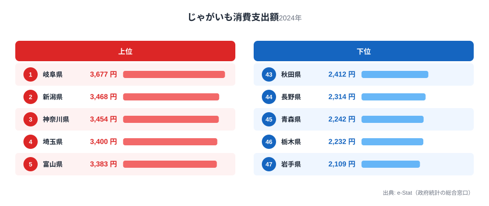
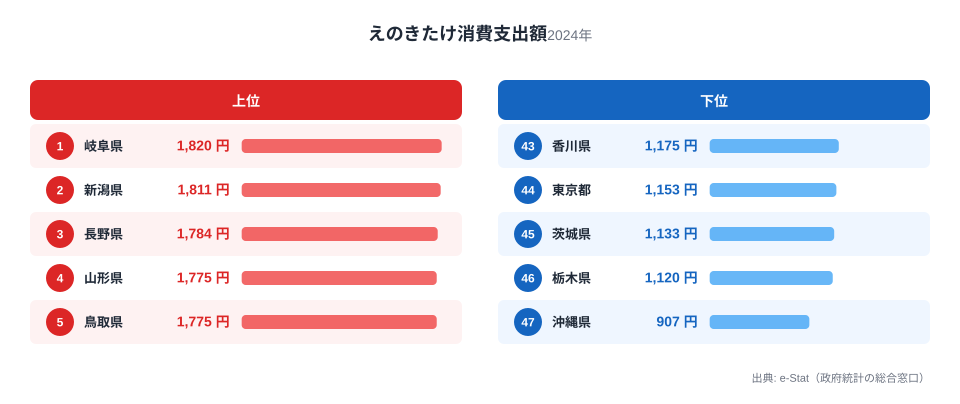
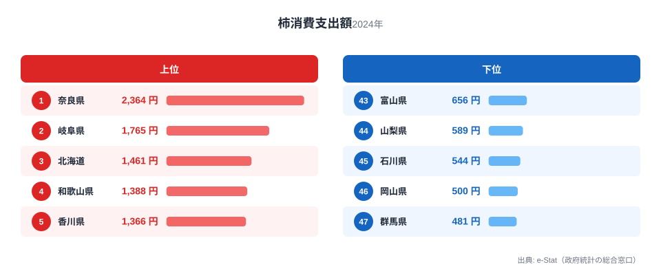
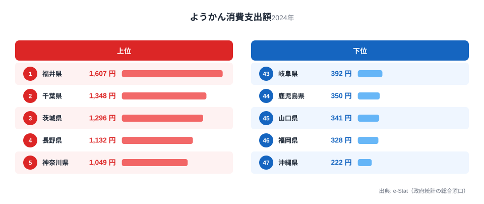

岐阜県の食卓を数字で覗くと、意外なほど「山」の存在感が強いことに気づきます。じゃがいも消費支出額は全国1位、えのきたけ消費支出額も全国1位、柿消費支出額は全国2位。いずれも山あいの気候と近接する産地が育んだ結果です。ところがその同じ岐阜で、甘味の代表格である羊羹の消費支出額は43位。豊かな山の幸と、伸び悩む甘味文化という対照が、この県の食卓には同居しています。

家計調査の品目別データ（2024年、県庁所在市・二人以上世帯）を都道府県ごとに集計すると、岐阜が全国トップクラスに立つ品目と、下位に沈む品目がはっきり分かれます。この記事では、じゃがいも・えのきたけ・柿・羊羹の4品目を通して、岐阜の食卓を貫く一本の軸を探ります。[岐阜県の地域プロフィール](/areas/21000)や[経済カテゴリ一覧](/category/economy)と合わせて読むと、県の産業構造との結びつきも見えてきます。

> [!NOTE]
> このデータは総務省統計局「家計調査（品目別）」の県庁所在市（岐阜県は岐阜市）・二人以上世帯を対象にした消費支出額です。実際の消費量（グラム数など）ではなく、1世帯あたりの年間支出額（円）で比較しています。産地であっても自家消費・贈答分は集計に含まれないため、統計上の「支出額」と体感の「地元での消費量」がずれる場合がある点に留意してください。

## じゃがいも — 全国1位3677円、山あいの土が育てた主役

<source-link href="/ranking/potato-consumption-expenditure">じゃがいも消費支出額ランキングをもっと見る</source-link>

岐阜県のじゃがいも消費支出額は年間3677円で全国1位です。2位の新潟県（3468円）、3位の神奈川県（3454円）を上回り、最下位の岩手県（2109円）とは1.7倍の差がついています。

岐阜県は北部の飛騨地方に冷涼な高原地帯を抱え、じゃがいもの栽培に適した気候が広がっています。飛騨地域では「ひだ雪っ娘」などのブランド品種も生産され、地元の食卓に日常的に上る野菜として定着してきました。加えて、飛騨牛の朴葉味噌焼きや煮物など郷土料理の付け合わせとしても頻繁に使われるため、購入頻度そのものが底上げされていると考えられます。じゃがいもが上位に来る県は東北や北陸など冷涼な産地県に多く、岐阜もその系譜に連なる形です。

## えのきたけ — 全国1位1820円、きのこ王国の面目躍如

<source-link href="/ranking/enoki-consumption-expenditure">えのきたけ消費支出額ランキングをもっと見る</source-link>

えのきたけ消費支出額でも岐阜県は年間1820円で全国1位に立ちます。2位の新潟県（1811円）、3位の長野県（1784円）と僅差の首位で、最下位の沖縄県（907円）とは2.0倍の開きがあります。

岐阜県はえのきたけの生産量でも全国有数の産地です。中部地方は冷暗所での菌床栽培に適した気候・立地が整っており、県内の生産者から地元スーパーへの流通ルートが確立しています。鍋料理や味噌汁の具材として通年で消費されるきのこ類は、四季を通じて食卓に定着しやすい品目です。新潟・長野という同じ中部・北陸圏の産地県が2位・3位に並ぶことからも、産地と消費地が近接する地域ほどきのこの消費支出額が高くなる傾向がうかがえます。

## 柿 — 全国2位1765円、奈良には一歩及ばず

<source-link href="/ranking/persimmon-consumption-expenditure">柿消費支出額ランキングをもっと見る</source-link>

柿消費支出額は岐阜県が年間1765円で全国2位です。首位の奈良県（全国1位・2364円）には及ばないものの、3位の北海道（1461円）を引き離しており、最下位の群馬県（481円）とは4.9倍の格差があります。

岐阜県南部の美濃地方は柿の産地として知られ、「堂上蜂屋柿」という干し柿の名産品も生産されています。柿は収穫期が秋に限られる果物ですが、干し柿として加工すれば保存が利くため、季節を超えて食卓に上りやすい果物です。奈良県が渋柿の名産地として圧倒的な首位を保っているのに対し、岐阜は僅差の2位につけており、中部から近畿にかけての柿の産地ベルトが消費支出額の分布にも表れている形です。

> [!WARNING]
> 家計調査は「支出額」であり「消費量」ではありません。柿のように贈答や庭先の自家消費が多い品目は、実際の消費量に対して支出額が過小に出ている可能性があります。岐阜の干し柿文化がこの数字にどこまで反映されているかは、支出額だけでは判断しきれない点に注意してください。

## 羊羹 — 43位392円、山の幸に隠れた甘味の弱さ

<source-link href="/ranking/yokan-consumption-expenditure">ようかん消費支出額ランキングをもっと見る</source-link>

一転して羊羹消費支出額を見ると、岐阜県は年間392円で43位と下位に沈みます。首位の福井県（全国1位・1607円）とは4.1倍、羊羹消費で全国最下位の沖縄県（222円）との差は170円まで縮まっています。

[福井の食卓](/blog/fukui-food-culture)では羊羹消費支出額が全国1位で紹介されていますが、岐阜はその対極に近い位置にいます。羊羹をはじめとする和菓子の消費支出額が高い県は、北陸や関東の一部に集中する傾向があり、地域ごとの和菓子文化の濃淡がはっきり分かれる品目です。岐阜には「鮎菓子」や「柿羊羹」といった郷土和菓子も存在しますが、家計調査の「ようかん」区分としての購入頻度には結びついていないようです。じゃがいも・えのきたけ・柿という「素材そのもの」の消費が強い一方、加工度の高い甘味文化は必ずしも強くない、という構図が見えてきます。

## 岐阜の食卓を貫くもの

じゃがいも・えのきたけ・柿という3品目に共通するのは、いずれも「素材そのもの」を日常の食卓に取り入れる文化だという点です。飛騨の高原野菜、県内産のきのこ、美濃の柿。いずれも県内の産地と食卓の距離が近く、加工を経ずに食卓へ届く食材ほど岐阜の消費支出額は高くなる傾向があります。

これは、りんごという単一の名産品で首位に立つ[青森の食卓](/blog/aomori-food-culture)や、ぶり・いか・昆布・餅と海産物中心に日本一を並べる[富山の食卓](/blog/toyama-food-culture)とは異なる型です。岐阜の強みは「1品目の圧倒的な突出」ではなく、「複数の素材系品目にわたる地味な強さ」にあります。羊羹という加工菓子だけが下位に沈んでいるのも、この「素材優位・加工劣位」という軸で見ると腑に落ちる結果です。

> [!TIP]
> 岐阜のように「素材系は上位、加工菓子は下位」という組み合わせが見える県では、同じ家計調査の中でも「野菜・きのこ・果物」カテゴリと「和菓子・洋菓子」カテゴリを分けて比較すると、県民性というより産地立地の効果が強く出ていることが分かります。数字だけを見て「岐阜は甘いものが嫌い」と結論づけるのは早計で、実際には近隣に強い和菓子産地（福井・北陸）がなく、購買行動が素材購入に偏っている可能性のほうが高いといえます。

## まとめ

- じゃがいも消費支出額は岐阜県が年間3677円で全国1位、2位新潟県（3468円）を上回る
- えのきたけ消費支出額も岐阜県が年間1820円で全国1位、2位新潟県（1811円）と僅差
- 柿消費支出額は岐阜県が年間1765円で全国2位、首位は奈良県（全国1位・2364円）
- 羊羹消費支出額は岐阜県が43位392円と下位で、首位福井県（全国1位・1607円）との差は4.1倍
- 山あいの産地に近い「素材系」品目に強く、「加工菓子系」品目に弱いという対照的な構図が読み取れる

## データ出典

総務省統計局「家計調査（品目別）」2024年、都道府県庁所在市・二人以上世帯（e-Stat経由で整備）
