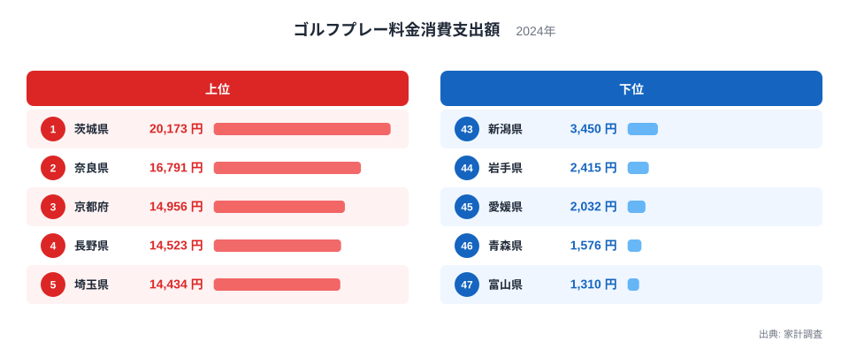
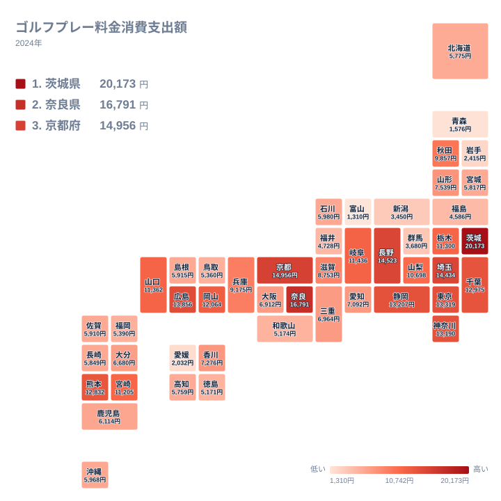
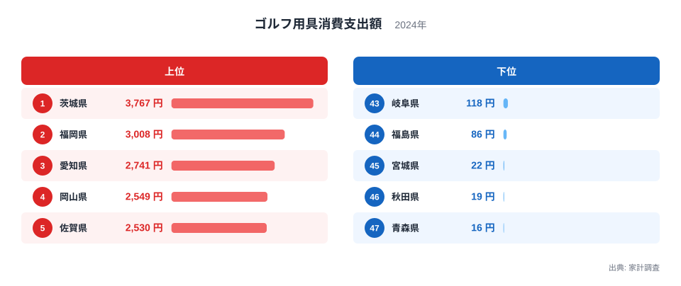

ゴルフはお金持ちのスポーツ、というイメージを持つ人は多いはずです。では実際に、ゴルフのプレー料金にいちばんお金を払っているのはどの都道府県でしょうか。

総務省「家計調査」(2024年、都道府県庁所在市の二人以上世帯)によると、年間のゴルフプレー料金消費支出額は**茨城県が2万173円で全国トップ**でした。2位以下は奈良県1万6,791円、京都府1万4,956円と続きますが、1位の茨城県は2位に3,382円の差をつけて単独で頭ひとつ抜けています。最下位の富山県1,310円との間には15.4倍の差が生まれています。

興味深いのは、実際にゴルフを「した」人の割合を示す行動者率では、全国トップは愛知県だという点です。プレーする人が多い県と、プレー料金にお金をかける県は必ずしも一致しません。本記事では2024年のゴルフプレー料金消費支出額を47都道府県で比較し、そのズレの正体を探ります。

> [!NOTE]
> この記事の金額は総務省「家計調査」の**都道府県庁所在市**(茨城県なら水戸市)における二人以上世帯の年間消費支出額で、都道府県全体の平均ではありません。また県庁所在市データは対象となる世帯数が少なく、同じ県でも年によって数値が大きく上下しやすい性質があります。1年分の数字を「その県の実力」と断定せず、あくまで目安として読んでください。

## ゴルフプレー料金消費支出額の格差は15.4倍―トップ5とワースト5

上位5県を見ると、1位の茨城県2万173円に続き、2位奈良県1万6,791円、3位京都府1万4,956円、4位長野県1万4,523円、5位埼玉県1万4,434円と、いずれも1万円を大きく上回っています。下位5県は43位新潟県3,450円、44位岩手県2,415円、45位愛媛県2,032円、46位青森県1,576円、47位富山県1,310円で、いずれも上位県の3分の1にも届きません。

地図で見ると、支出額が多い県は関東平野から近畿・中部にかけて広がっており、東北や日本海側、四国では総じて低い水準にとどまっています。都市圏から車や電車で通いやすい距離にゴルフ場が集まっている地域と、そうでない地域の差が、そのままプレー料金の支出額の差になっているように見えます。

<source-link href="/ranking/golf-green-fee-consumption-expenditure">ゴルフプレー料金消費支出額ランキングをもっと見る</source-link>

## なぜ茨城県がトップなのか―都心から通える北関東のゴルフ場密集地帯

茨城県は都心から高速道路で1時間程度の距離に位置し、関東平野の広い平地を生かしたゴルフ場が数多く立地しています。首都圏に住む高所得層が週末に車で気軽に足を延ばせる環境が整っていることが、プレー料金の消費支出額を押し上げている大きな理由と考えられます。

2位の奈良県、3位の京都府も近畿の大都市圏に近く、都市近郊型のゴルフ場が支出額を支えている点は共通しています。一方、下位に沈む東北・北陸・四国は、冬場の積雪や大都市圏からの距離がプレー機会を制約している可能性がありそうです。実際、最下位の富山県は日本海側で積雪が多く、屋外でプレーできる期間が他地域より短いことが影響しているのかもしれません。

[茨城県のデータブック](/areas/08000)を見ると、ゴルフ以外にも都心近郊ならではの消費傾向が読み取れます。首都圏の生活圏に組み込まれていることが、この県の消費支出額の全体的な特徴を形づくっているようです。

## ゴルフ用具消費支出額でも茨城が首位―プレー代とは違う上位の顔ぶれ

プレー料金だけでなく、クラブやウェアなどの**ゴルフ用具消費支出額**でも茨城県が3,767円で全国トップです。ただし2位以下の顔ぶれはプレー料金とは異なり、2位は福岡県3,008円、3位は愛知県2,741円と、九州や中部の県が上位に食い込んできます。下位も違っていて、46位秋田県19円、47位青森県16円と、ほぼゼロに近い水準まで落ち込む県が目立ちます。1位と最下位の差は235.4倍にのぼり、プレー料金の15.4倍よりもはるかに大きな開きです。

用具とプレー料金の両方で1位に立っているのは茨城県だけで、ゴルフ場に通いやすい環境と用具にお金をかける文化の両方が揃っている県だと言えそうです。一方、用具消費支出額で3位に入った愛知県は、プレー料金の消費支出額では23位にとどまっており、道具は買うもののプレー料金への世帯あたりの年間支出額は控えめという消費パターンがうかがえます。

<source-link href="/ranking/golf-equipment-consumption-expenditure">ゴルフ用具消費支出額ランキングをもっと見る</source-link>

## 発見―「プレーする県」と「お金を払う県」がずれる理由

この記事で使うデータのうち、プレー料金・用具の消費支出額は2024年、行動者率と公共ゴルフ場数は2021年の数値で、3年の開きがあります。その前提を踏まえたうえで、以下の対比を見ていきます。

ここまで見てきたゴルフプレー料金消費支出額の1位は茨城県でしたが、実際にゴルフを「した」人の割合を示す行動者率でも、茨城県は6位・8.1%と、全国トップの愛知県9.0%にほぼ並ぶ上位県です。つまり茨城県は、プレーする人の多さと支出額の大きさが両立している県だと言えます。一方、行動者率で全国トップの愛知県は、プレー料金の支出額では23位、用具の支出額では3位にとどまっており、プレーする人は多いものの、世帯あたりの年間支出額はそれほど大きくありません。「プレーする人が多い県」と「お金を払う県」がずれる実例は、この愛知県に集約されていると言えます。プレーする人の広がりを詳しく見たい方は[ゴルフの行動者率ランキング](/ranking/sports-participation-rate-golf)も参考にしてください。数字の全体像を知りたい方には[ゴルフ実施率は愛知9%vs青森2.8%で3.2倍｜なぜ宮崎が大阪と並ぶ?](/blog/golf-participation-prefecture-gap)もおすすめです。

支出額と結びつかないデータはもうひとつあります。公共のゴルフ場数を都道府県別に見ると、北海道が66施設で全国トップ、群馬県も24施設で2位と、広い土地を生かした地方の県が上位を占めます。ところが北海道は34位、群馬県は42位とプレー料金では下位グループに沈んでおり、公共ゴルフ場が多いことと住民が高い料金を払ってプレーすることは、まったく別の現象だとわかります。地方自治体が整備したアクセスしやすいゴルフ場が多い県と、都市近郊の民間コースで高い料金を払う県は、はっきり分かれているようです。詳しい内訳は[公共ゴルフ場数ランキング](/ranking/golf-course-public)で確認できます。

> [!WARNING]
> 「ゴルフ場の数が多い県ほどプレー料金への支出も多い」とは限りません。公共ゴルフ場数がトップクラスの北海道・群馬県は、プレー料金の消費支出額では下位グループに入ります。施設の数は「気軽にプレーできる環境があるか」を示す指標であり、「高い料金を払ってプレーする人がどれだけいるか」を示す消費支出額とは、見ている対象が異なる点に注意してください。

> [!TIP]
> この記事の支出額ランキングと、[ゴルフの行動者率ランキング](/ranking/sports-participation-rate-golf)を重ねて見ると、「プレーする人の広がり(行動者率)」と「世帯あたりの年間支出額(消費支出額)」という2つの軸でゴルフ市場を捉えられます。ただし家計調査の支出額だけでは、プレー回数と1回あたりの単価に分解することはできません。愛知県のように行動者率は高いが世帯あたりの支出額は控えめな県もあれば、茨城県のように行動者率も支出額もともに上位に入る県もあり、同じ「ゴルフが盛ん」という言葉でも中身は県によって違います。

## まとめ

- プレー料金の消費支出額は1位が茨城県2万173円、最下位が富山県1,310円で、15.4倍の差でした。
- 用具の消費支出額でも茨城県が1位で3,767円、プレー料金と用具の両方でトップに立つ唯一の県です。
- 2位以下は奈良県・京都府など近畿・中部の都市近郊県が並び、東北・北陸・四国は下位に集中しました。
- 行動者率トップの愛知県はプレー料金では23位にとどまり、プレーする人の多さと支出額の大きさは一致しませんでした。
- 公共ゴルフ場数トップの北海道と2位の群馬県は、プレー料金の消費支出額ランキングでは下位グループに沈んでおり、施設数の多さと住民の支出額は別の指標だとわかりました。

## データ出典

- 総務省統計局「家計調査」(都道府県庁所在市・二人以上の世帯、2024年) ゴルフプレー料金消費支出額・ゴルフ用具消費支出額
- 総務省統計局「社会・人口統計体系」(2021年度) ゴルフ場数(公共)
- 総務省統計局「社会生活基本調査」(2021年) ゴルフの行動者率

いずれもe-Stat経由でstats47が取得・加工して掲載しています。
