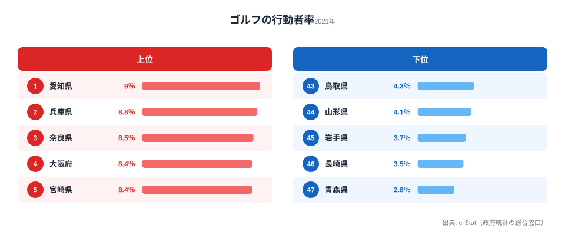

「同じ日本に住んでいても、ゴルフをする人の割合が3倍以上違う」──そう聞くと、まず思い浮かぶのは「所得が高い県ほどゴルフをするのだろう」という説明ではないでしょうか。

総務省の社会生活基本調査(2021年)によると、過去1年間にゴルフ(練習を除く)を行った人の割合=ゴルフの行動者率は、**1位の愛知県が9.0%、最下位の青森県が2.8%で、その差は3.2倍**にのぼります。10人に1人弱がゴルフをする県と、35人に1人しかしない県が同居しているわけです。

ところが上位の顔ぶれを見ると、「所得が高い県ほど高い」という単純な図式は崩れます。温暖な**宮崎県が8.4%で、大都市の大阪府(8.4%)とまったく同じ水準**に食い込む一方、所得水準の高い**東京都は7.4%で13位**にとどまります。本記事では2021年のゴルフ行動者率を47都道府県で並べ、「所得だけでは説明できない」地域差の正体を読み解きます。

> [!NOTE]
> ここで言う「行動者率」とは、過去1年間にその活動を1回以上行った人の割合(10歳以上人口に占める比率)を指します。プレー頻度や上達度ではなく「やったかどうか」を測る指標なので、年に数回しか回らないライト層も含まれます。出典は総務省「社会生活基本調査」(2021年)です。

## ゴルフ行動者率の上位と下位

まず上位5県と下位5県を見てみましょう。

上位を眺めると、明確なパターンが2つ見えてきます。

ひとつは**大都市圏とその周辺**です。1位の愛知県(9.0%)に加え、近畿圏の兵庫県(8.8%)・奈良県(8.5%)・大阪府(8.4%)が上位を占めます。もうひとつは**北関東のゴルフ場密集地帯**です。茨城県(8.1%)が6位、栃木県(8.0%)が7位、群馬県(7.6%)が10位に並びました。北関東は首都圏向けゴルフ場が集中し、車で気軽に行ける環境が整っているエリアです。

そして上位の中で異彩を放つのが、温暖な南国・**宮崎県が8.4%で5位**に入ったことです。これは4位の大阪府とまったく同じ数値で、わずかな差で順位が分かれただけです。所得水準で言えば近畿の大都市に大きく劣る宮崎が、ここで肩を並べる──この「ねじれ」こそが本記事の核心です。

<source-link href="/ranking/sports-participation-rate-golf">ゴルフの行動者率ランキングをもっと見る</source-link>

## 下位グループは東北・日本海側に集中する

下位5県をあらためて確認すると、最下位の青森県は2.8%で、1位愛知県(9.0%)の約3分の1にとどまります。下位グループには**東北勢が目立ち**、青森(47位)・岩手(45位)・山形(44位)に加え、秋田県も4.5%で41位と低水準です。

これは「冬の長さ」と整合的に読めます。雪が深く屋外プレー期間が短い地域では、ゴルフが日常的なレジャーとして根づきにくい──という構造的な要因が考えられます。実際、北海道も5.2%で33位とやや低めです。ただし日本海側の鳥取(4.3%・43位)や、雪は少ないはずの長崎(3.5%・46位)も下位に入っており、気候だけでは説明しきれない部分も残ります。屋外スポーツでも[グラウンドゴルフの行動者率](/ranking/sports-participation-rate-ground-golf)とは上位・下位の顔ぶれが大きく異なり、種目ごとに地域性が違うことがうかがえます。

> [!WARNING]
> 行動者率は「県の魅力」や「ゴルフ場の数そのもの」を直接示すわけではありません。観光客や近隣県からの来訪者がプレーしても、それはその県の住民の行動者率には反映されないからです。あくまで「その県に住む人がどれだけゴルフをするか」を測る指標である点に注意してください。

## 発見:所得だけでは説明できない「東京13位・宮崎5位」

最も興味深いのは、**所得の高さと行動者率が一致しない**ことです。代表的なねじれを並べてみましょう。

- **宮崎県** … 8.4%で**5位**。4位の大阪府と同じ数値で、温暖な気候で年間を通じてプレーできることが効いていると考えられます。
- **沖縄県** … 7.5%で**11位**。同じく通年でプレーできる温暖な地域です。
- **東京都** … 7.4%で**13位**。所得水準は全国トップクラスながら、上位グループには届きませんでした。
- **北海道** … 5.2%で**33位**。広大でゴルフ場も多いものの、住民の行動者率は中位以下です。

つまり「お金があるから(所得が高いから)ゴルフをする」という単純な図式では、宮崎が大阪と肩を並べ、東京が13位にとどまる理由は説明できません。

ここから読み取れる **[仮説]** は、行動者率を押し上げる要因が「所得」よりも「**プレーしやすい環境**」(温暖で通年プレーできる気候・車でアクセスできるゴルフ場の密度)に強く左右される、というものです。宮崎・沖縄の温暖さ、北関東のゴルフ場密度がそれを後押しし、逆に冬の長い東北では行動者率が伸びにくい──と整理できます。

> [!TIP]
> この仮説を確かめるには、各県の年間ゴルフ可能日数(積雪・気温データ)やゴルフ場数を行動者率と突き合わせる必要があります。本記事のデータ単独では因果は確定できないため、あくまで「気候・環境が所得以上に効いている可能性が高い」という読み筋として捉えてください。なお[ゴルフ用具への消費支出](/ranking/golf-equipment-consumption-expenditure)と並べて見ると、お金の使い方と「やる頻度」が必ずしも一致しないことも見えてきます。

ちなみに人口規模の大きい都市圏が上位に多いのは、母数となる人口が多くゴルフ場ビジネスが成立しやすいという面もあります。それでも東京が13位という事実は、「都市の規模 = 行動者率の高さ」でもないことを示しています。

<source-link href="/ranking/sports-participation-rate-golf">都道府県別ゴルフ行動者率の全47位を確認する</source-link>

## まとめ

- **1位は愛知県の9.0%**です。大都市圏の愛知・兵庫・奈良・大阪が上位を固めました。
- **最下位は青森県の2.8%**で、1位との差は**3.2倍**です。東北勢(青森47位・岩手45位・山形44位・秋田41位)が下位に集中しました。
- **温暖な宮崎県が8.4%で5位**(4位の大阪府と同じ数値)、沖縄県も7.5%で11位と、南国勢が健闘しました。
- 一方で**所得トップ級の東京都は7.4%で13位**、広い北海道も5.2%で33位にとどまり、「所得が高い=ゴルフをする」という図式は成立しませんでした。
- **[仮説]** 行動者率を左右するのは所得よりも、通年プレーできる気候とゴルフ場へのアクセスのしやすさ(環境)である可能性が高いと考えられます。スポーツ全般の地域差は[教育・スポーツのランキング一覧](/category/educationsports)も参考にしてください。

## データ出典

総務省統計局「社会生活基本調査」(2021年)を出典としています。e-Stat(政府統計の総合窓口)経由で整備したデータをもとに、47都道府県のゴルフ行動者率(過去1年間に1回以上ゴルフを行った10歳以上人口の割合)を集計しています。
