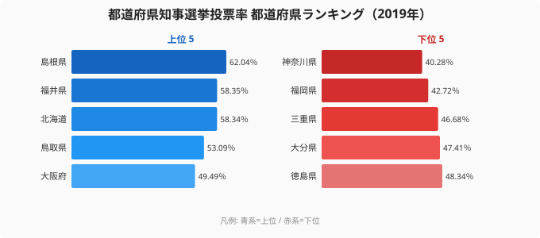

「同じ『知事を選ぶ選挙』なのに、なぜ住む県でこれほど投票率が違うのか?」──都道府県知事選挙の投票率を並べると、その差の大きさに驚かされます。

都道府県知事選挙投票率とは、各都道府県の知事を選ぶ選挙で、有権者のうち実際に投票した人の割合(％)です。2019年度に知事選が行われた都道府県を見ると、最も高い[島根県](/areas/32000)が62.04％だったのに対し、最も低い[神奈川県](/areas/14000)は40.28％。その差は約22ポイント、倍率にして1.5倍にのぼります。

**本記事のデータは2019年度に知事選が実施された11都道府県のみが対象です。**知事選は4年任期で実施年が都道府県ごとに異なるため、47都道府県全体のランキングではありません。以下の発見・傾向はこの11県の範囲での分析となります。

> [!NOTE]
> 知事の任期は4年で、選挙の実施年は都道府県ごとにバラバラです。本記事の数値は「2019年度に知事選が行われた11都道府県」の投票率を比較したもので、47都道府県すべてが同じ年に投票したわけではありません。集計は総務省「社会・人口統計体系」(e-Stat 経由)を用いています。

なぜ地方の県で投票率が高く、大都市圏で低くなるのか。この記事では、投票率の高い県と低い県のデータから、知事選の投票行動を左右する構造を見ていきます。

## 知事選投票率が高い都道府県 (2019年度)

2019年度に知事選が行われた都道府県のうち、投票率が高かった順に並べると次の通りです。

1位は島根県（62.04％）、以下は福井県（58.35％）・北海道（58.34％）・鳥取県（53.09％）・大阪府（49.49％）・奈良県（48.49％）・徳島県（48.34％）・大分県（47.41％）・三重県（46.68％）・福岡県（42.72％）と続き、最下位は神奈川県（40.28％）でした。

上位を占めたのは島根県・福井県・北海道・鳥取県といった、人口規模が比較的小さい地方の県でした。1位の島根県は62.04％と唯一60％台に乗り、2位の福井県(58.35％)、3位の北海道(58.34％)が僅差で続きます。地方の県では候補者と有権者の距離が近く、県政が暮らしに直結しやすいため、関心が高まりやすいと考えられます。

<source-link href="/ranking/voter-turnout-governor">都道府県知事選挙投票率ランキングをもっと見る</source-link>

> [!TIP]
> 同じ「投票率」でも、知事選は国政選挙(衆院選・参院選)より低くなりがちです。知事選は争点が地域に限られ、全国的なニュースになりにくいため、メディア露出の差が投票率に影響します。

## 投票率が低い都道府県 (2019年度)

最下位は神奈川県の40.28％で、唯一40％台前半まで沈みました。次いで福岡県(42.72％)が低く、いずれも都市部を多く抱える地域です。

大都市圏で投票率が下がりやすいのには、いくつかの構造的な背景が考えられます。第一に、人口が多く転入・転出が活発なため、地域とのつながりが薄い有権者が多いこと。第二に、勤め先が県外にある通勤者が多く、平日の生活圏と投票する県が一致しにくいこと。そして第三に、候補者の知名度や争点が、広い人口に対して相対的に薄まりやすいことです。

> [!WARNING]
> 投票率の低さは「政治への無関心」だけが原因とは限りません。無投票当選(対立候補が出ず投票自体が行われない)や、有力候補が早期に当確と見られる選挙では、結果が見えていることで投票率が下がる傾向もあります。年度ごとの選挙構図の違いに注意が必要です。

## 発見1: 地方ほど高く、大都市ほど低い（2019年度・11県の範囲）

2019年度のデータを並べ替えると、この11県の範囲では、上位は島根県・福井県・北海道・鳥取県と地方の県が並び、下位は神奈川県・福岡県と大都市圏が占めるという、きれいなコントラストが見えます。1位の島根県(62.04％)と最下位の神奈川県(40.28％)の差は約22ポイント。同じ「知事を選ぶ」という行為でありながら、住む場所によって投票への参加度がここまで開くのです。

この傾向は、知事選に限らず地方選挙全般で繰り返し観察されてきたパターンと重なります。地方では一票の重みが体感しやすく、県政の判断が農林水産業や交通・医療など生活基盤に直接響くため、投票へのモチベーションが保たれやすいと考えられます。ただし、この11県に限った観察であり、47都道府県全体での傾向として断定するには複数年・全選挙の検証が必要です。

## 発見2: 北海道は安定して上位、神奈川は安定して下位

[仮説] 投票率の高低は単年の偶然ではなく、地域ごとの「投票文化」として定着している可能性があります。たとえば北海道は2019年度に58.34％で上位に入りましたが、過去の知事選でも比較的高い水準を保ってきた地域です。逆に神奈川県は、複数回の知事選で下位にとどまる傾向が見られます。

ただし、これは単年スナップショットからの推測であり、断定はできません。各県の選挙構図(候補者数・争点・無投票の有無)が年度ごとに変わるため、長期トレンドとして「地域の投票文化」と言い切るには、複数回の選挙を通じた検証が必要です。

> [!NOTE]
> 同じ県でも、注目度の高い一騎打ちの選挙では投票率が跳ね上がり、有力現職の安定した再選では下がる、という振れ幅があります。県別の差を見るときは「その年にどんな選挙だったか」も合わせて確認すると、より正確に読み解けます。

## まとめ

- 2019年度の知事選投票率は、1位の島根県が62.04％で唯一60％台。
- 最下位は神奈川県の40.28％で、上位との差は約22ポイント・倍率1.5倍。
- 上位は島根県・福井県・北海道・鳥取県と、人口規模の小さい地方の県が占めた。
- 下位は神奈川県・福岡県など、転入出が多く通勤圏が広い大都市圏が並んだ。
- 投票率の差は「地方ほど高く大都市ほど低い」構造を示すが、各年度の選挙構図(無投票・争点・候補者数)にも左右される点に注意。

## データ出典

総務省「社会・人口統計体系」(都道府県知事選挙投票率)。e-Stat(政府統計の総合窓口)経由で整備した2019年度のデータを使用しています。各都道府県の知事選は実施年が異なるため、本記事は「2019年度に知事選が行われた都道府県」を比較対象としています。

本記事の対象データ: [関連カテゴリ](/category/administrativefinancial)
