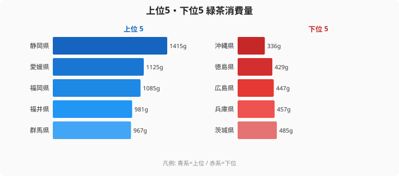

緑茶消費量のランキングを見たとき、「静岡が1位なのは当然だ」と思った人は多いだろう。茶産地の筆頭であり、県民が誇りを持って飲む文化がある。しかし2位が奈良県、3位が京都府、そして最下位が沖縄県というデータを見ると、話は単純ではないことに気づく。

沖縄には「さんぴん茶（ジャスミン茶）」という独自のお茶文化が根付いている。にもかかわらず緑茶消費は全国最下位の336gだ。一方、北海道や東北の各県が下位に並ぶのを見て、「寒い地域ほどお茶をたくさん飲むはず」という直感を持つ人もいるかもしれないが、それも裏切られる。2024年の家計調査が描く緑茶消費の地図は、産地・文化・食習慣が複雑に絡み合った日本の縮図でもある。

## 上位5県と下位5県：産地が消費を決めるわけではない

<source-link href="/ranking/green-tea-consumption-quantity">緑茶消費量ランキングの全件データを見る</source-link>

1位の静岡県は年間1,415g（二人以上世帯・一世帯あたり）、最下位の沖縄県は336gで、その差は実に4.2倍にもなる。上位5県は静岡、奈良、京都、三重、鹿児島の順だ。

静岡が1位である理由は複数ある。まず、県内で茶が生産されているため流通コストが低く、消費者が新鮮で安価な茶葉を手に入れやすい。「お茶は買うもの」ではなく「もらうもの・安く手に入るもの」という感覚が根付いており、日常的に大量に消費する文化が醸成されている。産地の「地産地消」が消費量を底上げするという、食品全般に共通するパターンがここにも現れている。

3位の京都は茶の湯文化と宇治茶のブランドが後押しする。抹茶・玉露をふくむ高品質な茶葉へのアクセスが良く、お茶を「生活の一部」として捉える文化的背景が消費を支えている。

下位5県は北海道、青森、秋田、岩手、そして沖縄という顔ぶれだ。東北4県が連続して下位に入るのは単なる偶然ではなく、地域の食文化と深く関わっている。

> [!NOTE]
> 本データの「緑茶」は煎茶・番茶・玄米茶・抹茶・ほうじ茶等の「緑茶類」を指す家計調査の費目分類に基づく。ペットボトル入り緑茶飲料は「茶類飲料」として別集計されており、本ランキングには含まれない。茶葉・粉末など家庭で購入する緑茶製品の支出量を換算したものである。

## 奈良2位の謎：産地でもないのになぜ？

静岡や三重、鹿児島は著名な茶産地であり、上位に入ることは理解しやすい。しかし奈良が2位というのは意外に感じられるかもしれない。実は奈良にも「大和茶」という歴史ある茶の産地がある。奈良県南部の山岳地帯、とくに月ヶ瀬や田原地区で栽培される大和茶は、知名度こそ静岡茶や宇治茶に劣るが、生産の歴史は日本最古級とも言われる。

さらに重要なのは文化的背景だ。仏教とお茶の結びつきは奈良時代にさかのぼる。遣唐使が持ち帰った茶の習慣が最初に根付いたのは都である奈良と京都であり、その長い歴史が現代の消費習慣にも影響を与えていると考えられる。寺院や神社が多く、来客時にお茶を出す習慣が今も残っているという側面も無視できない。

[奈良県のエリアデータ](/areas/29000)を見ると、農業・食文化に関連する指標でも独特の位置づけにあることがわかる。

> [!TIP]
> 緑茶消費量が多い地域は概して「茶葉を急須で淹れる文化」が残っている。急須文化の衰退がペットボトル茶の普及と表裏一体であることを考えると、本データは「急須でお茶を飲む習慣の強さ」の代理指標としても読み解ける。[農業カテゴリの他の指標](/category/agriculture)と合わせて地域の食文化を比較すると面白い視点が得られる。

## 沖縄最下位の逆説：さんぴん茶があるのになぜ

沖縄県が最下位（336g）というデータは、表面的には矛盾して見える。沖縄にはお茶文化がないのかといえば、まったく逆だ。「さんぴん茶」と呼ばれるジャスミン茶は沖縄の日常飲料として深く浸透しており、スーパーやコンビニでも大量に並んでいる。

問題は分類だ。さんぴん茶はジャスミン茶（花茶）であり、家計調査の「緑茶」費目には含まれない。沖縄の人々はお茶を飲まないのではなく、「緑茶」以外のお茶を飲んでいるのだ。加えて、沖縄の食文化はもともと大陸・東南アジアの影響を受けており、本土とは異なる飲料文化が根付いている。泡盛をはじめとするアルコール飲料や、独自のソフトドリンク文化も消費パターンを分散させる要因だ。

「緑茶消費最下位=お茶を飲まない県」という読み方は誤りであり、これは指標の定義を正確に理解しなければ生まれる典型的な誤読である。

> [!WARNING]
> 緑茶消費量が低い県が「健康に無関心」あるいは「茶の文化がない」と解釈するのは誤りである。沖縄のさんぴん茶のように、別の茶類や飲料が地域の需要を満たしている場合がある。また、ペットボトル緑茶飲料は本データに含まれないため、若年層が多い都市部では実際の「緑茶摂取量」が過小評価されている可能性がある。2018年に家計調査の品目分類が改定されており、それ以前との単純比較には注意が必要だ。

## 東北・北海道はなぜ下位か：コーヒー文化との逆相関

岩手412g、秋田445g、青森467g、北海道489gと、東北・北海道勢が下位を占める。寒い地域ほど温かい飲み物を多く消費するという直感はあながち間違いではないが、その「温かい飲み物」が緑茶ではないのだ。

東北・北海道ではコーヒーの消費量が全国的に見ても高い傾向がある。喫茶文化や「コーヒーを飲む習慣」が緑茶の消費を相対的に押し下げていると考えられる。また、これらの地域では古くからそば茶や麦茶、番茶の一種である「黒豆茶」「どくだみ茶」といった地場の飲み物が親しまれており、緑茶に限定した消費が低くなる構造がある。

食文化の観点からも、東北は発酵食品・保存食を中心とした独自の食体系を持つ。緑茶よりも食事の邪魔をしない飲み物が好まれるという側面もあるかもしれない。[青森県のエリアページ](/areas/02000)や[岩手県のエリアページ](/areas/03000)では、こうした食文化の違いを他の指標とあわせて確認できる。

## まとめ

- 1位の静岡（1,415g）は産地の「地産地消」効果と県民の文化的誇りが消費を底上げしている
- 奈良（2位・1,287g）は大和茶の産地であることと、仏教・来客文化に根ざした歴史的背景が寄与している
- 沖縄（最下位・336g）はさんぴん茶（ジャスミン茶）文化が強く、「緑茶」費目の消費は見かけ上低い——お茶文化がないのではなく、別のお茶を飲んでいる
- 東北・北海道の下位は、コーヒー文化や地場の他茶飲料が緑茶消費を代替していることが主因と考えられる
- 静岡と沖縄の4.2倍差は、日本国内の食・飲料文化の多様性を端的に示す数字だ

## データ出典

総務省「家計調査」2024年（二人以上世帯・都道府県庁所在地別）。e-Stat 経由で整備。費目「緑茶」は煎茶・番茶・玄米茶・抹茶・ほうじ茶等の緑茶類を対象とし、茶類飲料（ペットボトル等）は含まない。
