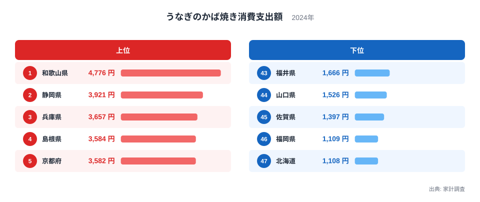
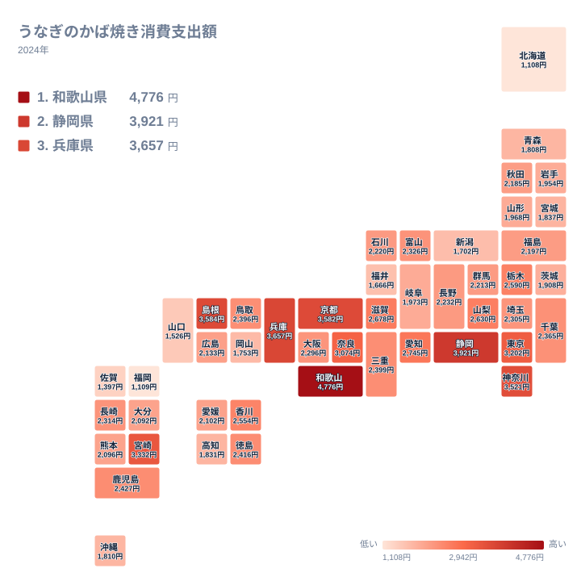

夏の土用の丑の日が近づくと、スーパーの店頭にはうなぎのかば焼きが並びます。ですが、家庭がうなぎに使う金額は、全国どこでも同じというわけではありません。総務省の家計調査から都道府県庁所在市の年間消費支出額を見ると、支出が最も多い県と最も少ない県のあいだには4倍を超える開きがあります。うなぎは決して安い食材ではないため、この差は家計の余裕だけでなく、地域ごとの食習慣や産地との距離を映し出していると考えられます。

この記事では、2024年の家計調査をもとにした都道府県別のうなぎのかば焼き消費支出額から、上位と下位の顔ぶれ、地理的な広がり、そして差が生まれる背景を読み解きます。

## 上位5県と下位5県、4倍を超える開き

<source-link href="/ranking/grilled-eel-consumption-expenditure">うなぎのかば焼き消費支出額ランキングをもっと見る</source-link>

上位に並ぶのは、和歌山県、静岡県、兵庫県、島根県、京都府です。和歌山県は年間4,776円を支出して1位となり、2位の静岡県を800円以上引き離しています。3位の兵庫県は3,657円、4位の島根県は3,584円、5位の京都府は3,582円と続き、いずれも3,500円台に集まっています。上位5県のうち3県までが近畿から山陰にかけての地域にあり、うなぎに対する支出が特定の広がりを持った地域で高くなっている様子がうかがえます。

下位に目を移すと、北海道が47位で1,108円、福岡県が46位で1,109円、佐賀県が45位で1,397円という結果でした。北海道と福岡県はわずか1円差で最下位を分け合う形になっています。1位の和歌山県と47位の北海道を比べると、年間の支出額には4倍を超える差があり、同じ全国統計の中でこれほど開きが出る品目は多くありません。うなぎのかば焼きは1食あたりの単価が高いため、購入回数のわずかな違いがそのまま支出額の大きな差になって表れやすい特徴があります。

## 地理的な広がりを見る

地図で全体を見渡すと、単純な東西や南北の分布ではなく、支出額が高い県が近畿地方を中心にまだらに分布していることが分かります。7位には宮崎県が3,332円で入り、九州の中でも南部に位置する県が上位に食い込んでいます。一方、15位の鹿児島県は2,427円で中位にとどまっており、九州内でも県ごとに差があります。うなぎの産地として知られる地域が必ずしも上位に集まるわけではなく、購入する側の食習慣が県ごとに独立して差を生んでいると考えられます。

東北や北海道は総じて支出額が低い傾向にあります。34位の山形県は1,968円、35位の岩手県は1,954円、40位の青森県は1,808円と、いずれも全国平均を下回っています。寒冷な地域では産地からの輸送距離が長くなりやすく、鮮度を保ったまま流通させるコストが小売価格に上乗せされやすい面もあります。ただし、これは価格差の一因にすぎず、地域ごとの食文化の違いも同時に働いていると見るべきでしょう。

## なぜこれほどの地域差が生まれるのか

うなぎのかば焼きは、静岡県の浜名湖周辺や愛知県の三河地方、鹿児島県の大隅地方など、養殖の産地として知られる地域が全国に点在しています。2位の静岡県が上位に入っているのは、こうした産地としての土地柄が、地元での消費習慣にもつながっている可能性を示唆しています。一方で1位の和歌山県は、うなぎの主要な養殖地としては特に有名というわけではなく、産地であることだけでは1位という結果を十分に説明できません。

[仮説] 和歌山県で支出額が特に高い背景には、うなぎのかば焼きが贈答用や慶事の食事として選ばれやすい高級食材であることが関係している可能性があります。年間を通じた家計の消費行動には、家族の記念日や来客時のもてなしといった機会消費の頻度や、地元の飲食店・小売店での取り扱いの厚みが反映されると考えられますが、これを裏付ける個別の統計は本記事のデータには含まれておらず、検証が必要な仮説にとどまります。全国一律の習慣ではなく、県ごとの生活文化の違いが積み重なった結果としてこの順位が生まれている可能性がある、という見立てとして読んでください。

また、9位の奈良県は3,074円、10位の愛知県は2,745円と、いずれも上位10県に入っています。奈良県は和歌山県と隣接しており、京都府や兵庫県ともあわせて考えると、近畿一円でうなぎを食べる習慣が根強く残っている地域圏があるように見えます。愛知県は三河一色を中心とした養殖の産地でもあり、産地としての土地柄と地元の消費文化が重なり合っている例といえるでしょう。こうした県境をまたいだ広がりは、うなぎのかば焼きが単一の県だけの好みではなく、地域全体で受け継がれてきた食文化であることを示しています。

## 他の食料品の支出額とあわせて読む

うなぎのかば焼きのように単価の高い食材は、日常的な食品よりも支出額の地域差が大きく出やすい傾向があります。米や野菜など毎日の食卓に欠かせない品目では地域差が小さくなりやすい一方、季節行事に結びついた高級食材では、購入する家庭の割合そのものが県によって変わりやすいためです。同じ家計調査には、他にも多くの食料品や生活関連の支出額データが収録されています。うなぎに限らず地域ごとの消費傾向を比較したい場合は、[同じカテゴリの統計一覧](/category/economy)から関連する品目のランキングをたどってみると、地域性の輪郭がより立体的に見えてきます。

うなぎの消費額が特に高かった[和歌山県のデータ](/areas/30000)や、[静岡県のデータ](/areas/22000)を個別に見ると、うなぎ以外の指標でもその県の産業構造や生活スタイルが浮かび上がってきます。1つの品目だけでなく、複数の指標を組み合わせて眺めることで、なぜその地域で特定の消費が多いのかという背景がより理解しやすくなります。

> [!NOTE]
> このデータは総務省の家計調査による都道府県庁所在市の二人以上の世帯を対象にした年間消費支出額です。都道府県全体の平均ではなく、県庁所在市に住む世帯の支出を代表値として使っている点に注意が必要です。単身世帯の消費行動は含まれていません。

> [!WARNING]
> うなぎのかば焼きは土用の丑の日などの特定の時期に購入が集中しやすい品目です。年間を通じた平均支出額であるため、特定の月だけを見た消費動向とは一致しません。また家計調査は標本調査であり、対象世帯数が少ない県ほど年による変動の影響を受けやすい点にも注意してください。

> [!TIP]
> 支出額の順位だけでなく、地図で近隣県との位置関係を見ると、産地からの距離や食文化の広がりが読み取りやすくなります。単価の高い食材ほど「買うか買わないか」という消費頻度の差が支出額に直結しやすいため、量ではなく金額の指標であることを踏まえて読み解くとよいでしょう。

## まとめ

- 1位は和歌山県で、年間4,776円をうなぎのかば焼きに支出しています
- 47位は北海道で1,108円、46位の福岡県とはわずか1円差でした
- 1位と47位のあいだには4倍を超える支出額の差があります
- 上位5県は近畿から山陰にかけての地域に多く分布しています
- 東北や北海道では総じて支出額が低く、産地からの距離や食文化の違いが背景にあると考えられます

## データ出典

総務省統計局「家計調査」（2024年、都道府県庁所在市の二人以上の世帯を対象とした年間消費支出額）を利用しています。
