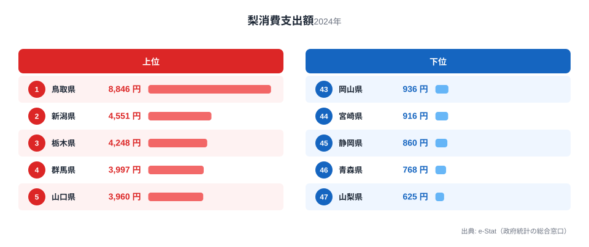
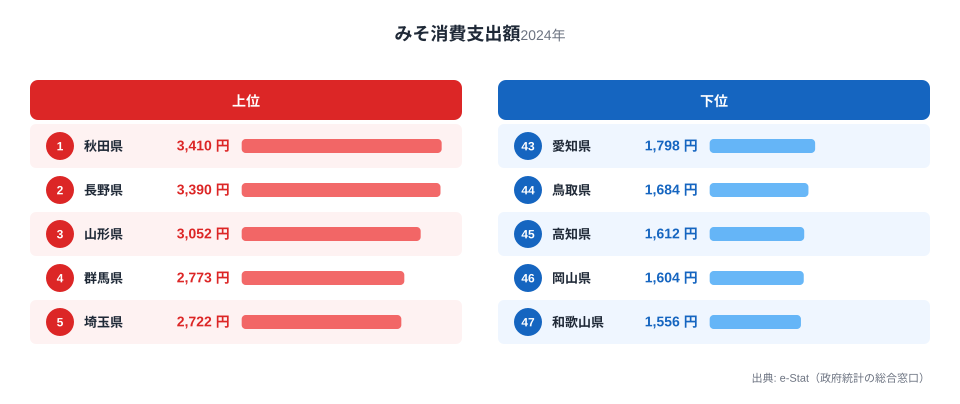
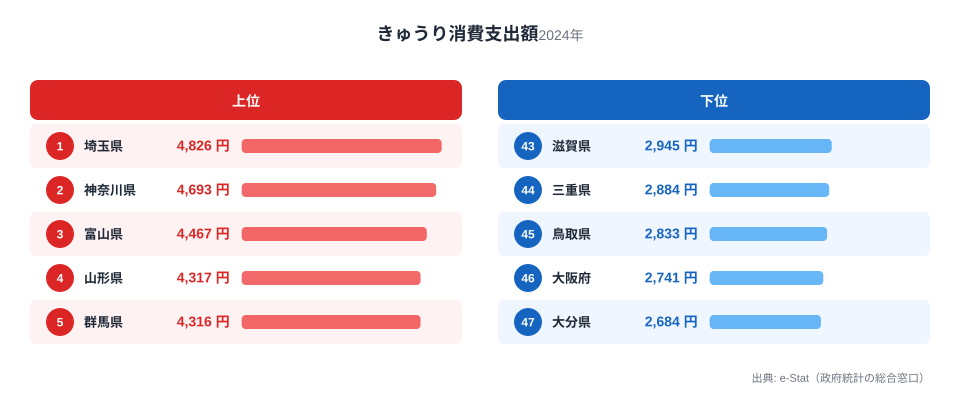
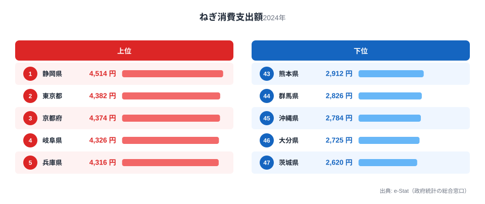

群馬県は「からっ風」と呼ばれる乾いた冬の季節風と、日照時間の長さで知られる内陸県です。海がない代わりに、盆地と扇状地が広がる地形が果樹や野菜の産地を育ててきました。総務省「家計調査」の品目別データを見ると、この地形の恩恵は梨・みそ・きゅうりという3つの品目にはっきり表れています。

ところが、群馬を代表する名産のひとつである「下仁田ねぎ」は、家計調査の品目別支出額ランキングでは全国44位という低い順位にとどまっています。産地として名高い品目が、なぜ地元の食卓の支出額には反映されないのでしょうか。この記事では、群馬が上位に立つ3品目と、意外に低迷する1品目を通して、群馬の食卓の実像を読み解きます。

> [!NOTE]
> 本記事のデータは総務省統計局「家計調査（品目別）」2024年の値です。対象は都道府県庁所在市（群馬県は前橋市）の二人以上世帯の1世帯あたり年間支出額で、実際の消費量そのものではありません。県全体ではなく県庁所在市の世帯の購買行動を反映した数値である点にご留意ください。

## 梨 — 全国4位、3,997円

<source-link href="/ranking/pear-consumption-expenditure">梨消費支出額ランキングをもっと見る</source-link>

梨の支出額で首位に立つのは鳥取県（全国1位・8,846円）で、群馬の3,997円はその半分以下にとどまりますが、それでも全国4位という高い順位です。群馬県内には「川場村」や「昭和村」など梨の産地があり、県央から西毛にかけての扇状地は水はけがよく、寒暖差の大きい内陸性気候が梨の糖度を高めます。

首位鳥取県が圧倒的な理由は二十世紀梨の一大産地であることに加え、県民自身が地元産の梨を日常的に買い支える文化が根付いているためです。群馬の場合は鳥取ほどの単一ブランド力はないものの、複数の産地が分散して支出を底上げしている構図が見えます。梨は秋の贈答文化とも結びつきやすく、季節性の高い果物であることも支出額を押し上げる一因と考えられます。

## みそ — 全国4位、2,773円

<source-link href="/ranking/miso-consumption-expenditure">みそ消費支出額ランキングをもっと見る</source-link>

みそのランキングでは秋田県（全国1位・3,410円）が首位で、群馬は2,773円で全国4位に入っています。群馬県は小麦の栽培が盛んな土地柄で、実は麦みそ（田舎みそ）の生産地としても知られています。冬場の気温が低く乾燥する「からっ風」の気候は、みその発酵・熟成に向いた環境でもあり、家庭で味噌汁や煮物にみそを使う頻度の高さがこの順位に表れていると考えられます。

首位秋田県から3位山形県までを東北勢が占める中、群馬が関東の県として4位に食い込んでいる点は注目に値します。上位の東北勢は寒冷な気候ゆえにみそが保存食・発酵食として発達した歴史がありますが、群馬もまた盆地特有の寒暖差と乾燥した冬の気候がみそ文化を支えてきたとみられます。

## きゅうり — 全国5位、4,316円

<source-link href="/ranking/cucumber-consumption-expenditure">きゅうり消費支出額ランキングをもっと見る</source-link>

きゅうりの支出額は埼玉県（全国1位・4,826円）が首位で、群馬は4,316円で全国5位です。上位には埼玉県・神奈川県・富山県といった関東・中部の県が並び、群馬もこの一角に加わっています。群馬県は嬬恋村の高原野菜や、平野部の施設栽培できゅうりの生産量が多く、地元産の新鮮なきゅうりが食卓に上りやすい環境が整っています。

きゅうりは夏場の食卓に欠かせない野菜で、浅漬けやサラダなど調理の幅が広いことも消費を支える要因です。群馬の年間を通じた日照時間の長さは露地栽培にも適しており、県内産地からの供給の安定が家庭での購入頻度を押し上げていると考えられます。

## ねぎ — 全国44位、2,826円

<source-link href="/ranking/leek-consumption-expenditure">ねぎ消費支出額ランキングをもっと見る</source-link>

ねぎの支出額で首位に立つのは静岡県（全国1位・4,514円）で、群馬は2,826円と全国44位に沈んでいます。群馬県には全国的に知られる「下仁田ねぎ」という名産品がありますが、家計調査の品目別支出額ではその存在感がほとんど見えません。

この食い違いにはいくつかの理由が考えられます。下仁田ねぎは太く辛みが強い品種で、鍋物などの季節料理に使われる「ハレの日」の食材という側面が強く、日常的に頻繁に購入する葉物野菜とは性格が異なります。また、下仁田ねぎは11月から12月頃に収穫期が集中する季節限定の野菜であり、年間を通じた支出額の平均では他県の周年供給されるねぎに見劣りしてしまう可能性があります。産地であることと家庭での日常消費額の高さは、必ずしも一致しないという典型例といえるでしょう。

> [!WARNING]
> 家計調査の支出額は「購入した金額」であり、消費量そのものではありません。下仁田ねぎのように単価が高く年に数回しか買わない食材は、購入頻度の低さゆえに年間支出額のランキングでは順位が低く出やすい傾向があります。逆に日常的に少量ずつ買う野菜は、支出額の合計が積み上がりやすくなります。

## 群馬の食卓を貫くもの

梨・みそ・きゅうりという3つの上位品目に共通するのは、いずれも群馬特有の内陸性気候（寒暖差・乾燥した冬・長い日照時間）に支えられた農産物である点です。海に面していない群馬県は、水産物では目立った順位を持ちませんが、盆地と扇状地が育てる果樹・野菜・発酵食品では全国トップクラスの存在感を示しています。

一方でねぎに象徴されるように、「名産地であること」と「家庭での日常的な支出額が高いこと」は必ずしも同じ軸で測れません。同様の「名産と消費統計のねじれ」は他県でも見られ、たとえば[青森の食卓](/blog/aomori-food-culture)では「りんご王国」でありながら支出額の首位を岩手県に譲るという逆転現象が起きています。群馬のねぎも構造としては近く、産地としてのブランド力と、日常の食卓での購買頻度は別の指標であることを教えてくれます。

> [!TIP]
> 梨で全国1位の[鳥取県の食卓](/blog/tottori-food-culture)、みそで全国1位の[秋田県の食卓](/blog/akita-food-culture)と読み比べると、同じ品目でも「首位県」と「上位に食い込む県」の背景条件の違いが見えてきます。鳥取・秋田はいずれも単一品目への依存度が高い一方、群馬は複数品目でバランスよく上位に入る「広く浅く強い」タイプの食文化県といえます。群馬県の統計をさらに詳しく見たい方は[群馬県の地域プロフィール](/areas/10000)、他の家計関連指標は[経済カテゴリ一覧](/category/economy)もあわせてご覧ください。

## まとめ

- 梨は全国4位（3,997円）、首位は鳥取県（8,846円）
- みそは全国4位（2,773円）、首位は秋田県（3,410円）
- きゅうりは全国5位（4,316円）、首位は埼玉県（4,826円）
- ねぎは全国44位（2,826円）、名産の下仁田ねぎがありながら家計調査の支出額には反映されにくい構造的なねじれが見られる

## データ出典

総務省統計局「家計調査（品目別）」2024年、都道府県庁所在市 二人以上世帯。e-Stat経由で取得したデータをもとに作成しています。
