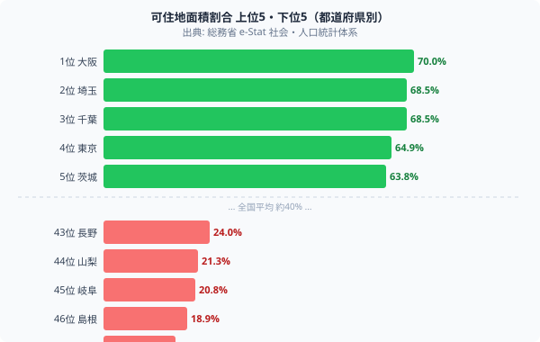
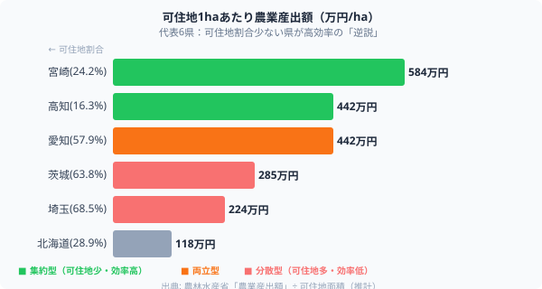

「北海道は面積が広いから人が住みやすい土地も多い」──そう思いがちですが、データを見ると違います。

**[北海道](/areas/01000)の可住地面積割合は28.9%（全国30位）**。広大な原野・湿地・火山地帯を除くと、実際に人が住める土地は総面積の3割以下です。一方、**[大阪府](/areas/27000)は面積46位の小さな府でありながら可住地割合70.0%でトップ**。そして最も逆説的なのは、可住地割合最下位の[高知県](/areas/39000)（16.3%）が**農業産出額ベースの土地生産性では可住地68.5%の埼玉より上位に来る**という事実です。

「住める土地が少ない = 不利」という直感が、このデータで覆ります。[国土・気象の都道府県統計一覧](/category/landweather)も合わせてご覧ください。

## 可住地面積割合ランキング──大阪70% vs 高知16%の4.3倍差

**可住地面積** = 総面積 − 林野面積 − 湖沼面積。この計算で「実質的に人が住める土地」の割合を都道府県別に出すと、上位と下位でまったく対照的な地理が現れます。

上位5はすべて関東圏か大阪都市圏。**大阪（70.0%）・[埼玉](/areas/11000)（68.5%）・[千葉](/areas/12000)（68.5%）・東京（64.9%）・茨城（63.8%）** という顔ぶれで、日本最大の平野に広がる都市圏が可住地割合を押し上げています。可住地の「面積」ではなく「割合」で見ると、北海道ではなく大阪が1位になる逆転が起きます。

下位5は高知（16.3%）・島根（18.9%）・岐阜（20.8%）・山梨（21.3%）・長野（24.0%）。急峻な山地と深い渓谷が海岸線まで迫る四国南部・中国山地・日本アルプス地帯が集まります。高知・島根では、県総面積の8割以上が林野で占められ、住める平地が極端に少ない構造です。

> [!NOTE]
> 可住地面積の計算では「林野面積」に農地も含む雑木林・草地が入ることがあり、厳密な「居住可能地」よりやや広くなります。高知・島根など林野率が8割超の県では、残る可住地のほとんどが海沿いや川沿いの低地に限定されます。

<source-link href="/ranking/habitable-area-ratio">可住地面積割合ランキングをもっと見る</source-link>

## なぜこの分布になるのか──地形パターン3類型

可住地割合の地図を見ると、日本の地形が作る3つのパターンが浮かびます。

**第1パターン「関東平野・大阪平野型」**: 大阪・埼玉・千葉・東京・茨城・神奈川の6都府県が60%超。日本最大の沖積平野が広がるこの地域は、可住地割合が構造的に高くなります。関東ローム台地のように平坦で農業・住宅の双方に使いやすい土地が積み重なった結果です。

**第2パターン「中部山岳型」**: [岐阜](/areas/21000)（20.8%）・山梨（21.3%）・長野（24.0%）は日本アルプスと南アルプスが総面積の大部分を占め、住める土地が2割前後にとどまります。ただし残った谷底の平地では果樹栽培や精密機械産業が集積し、限られた土地を高密度に活用しています。

**第3パターン「北海道型」**: 特殊な事例が北海道（28.9%・30位）です。可住地の「絶対値」は22.7万haで全国1位（2位新潟の約5倍）ですが、広大な原野・湿地・火山地帯があるため割合では中位に留まります。「広いが使いこなせていない土地が多い」という北海道固有の課題が、この数字に表れています。

> [!WARNING]
> 可住地面積割合は都道府県全体の土地利用から算出されます。同じ県内でも平野部と山間部では居住環境が大きく異なるため、移住先の検討では市区町村レベルのデータを合わせて確認することを推奨します。

## 逆説──住める土地が少ない県ほど土地を効率的に使う

ここが最も興味深い発見です。可住地面積割合と土地生産性（可住地1haあたりの農業産出額）の関係を見ると、**住める土地が少ない県ほど土地を効率的に活用している**傾向が現れます。

図が示すとおり、可住地24.2%の[宮崎県](/areas/45000)（584万円/ha）は、可住地68.5%の埼玉（224万円/ha）の2.6倍の土地生産性を持ちます。同じ「可住地が少ない」高知（16.3%）も442万円/haで埼玉を上回ります。

なぜか。可住地が乏しいと、その限られた土地に農業・産業・人口が集約されます。高知は土佐沿岸の温暖な気候を活かしたナス・ピーマン・ショウガの施設園芸を集約し、宮崎は狭い平野に畜産・野菜栽培が高密度に集積しています。制約が「何を作るか」の選択を鋭くさせる効果があります。

一方、可住地が広い埼玉（68.5%）・茨城（63.8%）は首都圏のベッドタウンとして住宅地が分散し、農地は転用圧力を受けて生産性向上が難しい構造があります。「土地が広い = 農業・産業が強い」は成立せず、**「制約が集中を生む」**という逆説が土地利用にも当てはまります。

愛知県（可住地57.9%・442万円/ha）は「両立型」の例外で、広い可住地とトヨタ自動車産業の集積が土地効率を同時に押し上げています。北海道（可住地28.9%）は118万円/haと最低水準で「低活用型」——広大な農地があっても粗放的な大規模農業のため面積当たり産出額は低くなります。

> [!TIP]
> 宮崎が土地生産性で上位に入る背景には「ピーマン・キュウリ・日向夏」という差別化した高単価作物への集約があります。「可住地が少ない = 農業には向かない」ではなく、**制約があるからこそ高付加価値作物に特化した**という逆説が土地データに表れています。

<source-link href="/ranking/land-productivity-per-ha">土地生産性（農業産出額ベース）ランキングをもっと見る</source-link>

## 道路密度への影響──可住地割合が高いほどインフラが密

可住地割合は道路密度にも直結します。**道路実延長密度（1km²あたりの道路延長）** 上位は埼玉（12.46km/km²）・東京（11.09km/km²）・神奈川（10.69km/km²）と、可住地割合の上位県が並びます。

**最下位は北海道（1.15km/km²）**。広大な可住地があっても道路整備コストが高く密度は低い。高知（2.01km/km²）も下位で、山地が多いと道路建設コストが跳ね上がります。道路密度という観点では、可住地割合の低い山地型県は整備コストが高く「住む不利」が数字に表れています。

住居専用地域面積比率では**東京（57.6%）と沖縄（57.4%）が1・2位**。大阪（38.2%）は可住地割合が高くても商業・工業用地として活用されているため、住居専用比率は意外に低くなっています。「住める土地」の「使い方」が都市の産業構造を反映しているわかりやすい例です。

<source-link href="/ranking/road-length-per-km2">道路密度（km²あたり道路延長）ランキングをもっと見る</source-link>

## データ出典

- 総務省「社会・人口統計体系」e-Stat（可住地面積・林野面積・道路密度・住居専用地域）
- 内閣府「県民経済計算」（土地生産性算出用）
