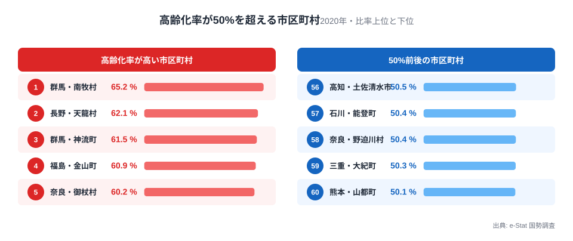
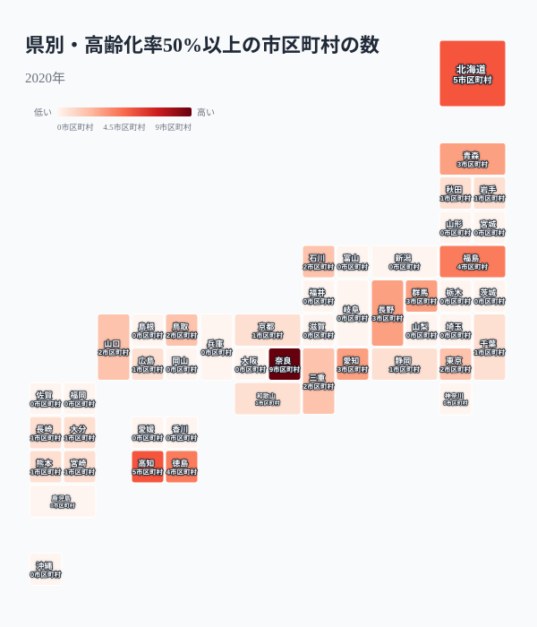
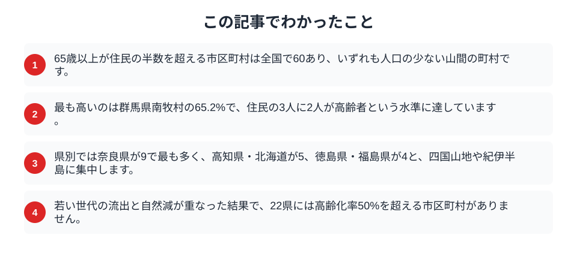

高齢化率が高い県として秋田や高知がよく挙げられますが、それでも県全体では30%台後半です。ところが市区町村まで細かく見ると、住民の半分以上が65歳以上という地域が確かに存在します。2020年の国勢調査で数えると、高齢化率が50%を超える市区町村は全国で60。いずれも人口の少ない山間の町村で、そこでは「高齢者が多数派」という、県単位の平均からは想像しにくい暮らしが現実になっています。

## 半数を超えるのは山間の小さな町村

まず、高齢化率が50%を超える市区町村を高い順に並べます。

<data-source label="e-Stat 国勢調査" note="65歳以上人口割合（2020年）"></data-source>

最も高いのは群馬県南牧村の65.2%で、住民の3人に2人が高齢者という水準に達しています。続く長野県天龍村が62.1%、群馬県神流町が61.5%、福島県金山町が60.9%、奈良県御杖村が60.2%と、上位はいずれも山あいの村です。下位を見ても、50%をわずかに超えた市町が並びます。つまり「半数が高齢者」の一線を越える地域は、大都市の郊外ではなく、鉄道や幹線道路から離れた小規模自治体に限られます。これらの町村では、成人の暮らしを支える医療・介護・買い物の担い手そのものが高齢者、という状況が生まれています。60市区町村のうち大半は人口数百人から数千人規模で、かつては林業や農業でにぎわった集落が、産業の縮小とともに人口を減らしてきました。高齢化率という一つの数字の裏に、地域経済が細っていった長い歴史が刻まれています。

<source-link href="/ranking/elderly-population-ratio">都道府県別の高齢化率ランキングを見る</source-link>

## 県別では奈良・四国・北海道に集中する

次に、50%を超える市区町村が各県にいくつあるかを地図で見ます。

<data-source label="e-Stat 国勢調査" note="65歳以上人口割合（2020年）"></data-source>

最も多いのは奈良県で9市区町村。次いで北海道と高知県が5、福島県と徳島県が4と続きます。紀伊半島の南部、四国山地、そして北海道の内陸部という、いずれも山が深く集落が点在する地域に固まっています。奈良県は県北部に人口が集まる一方、南部の吉野・十津川方面は山地が広がり、御杖村や東吉野村のように高齢化率が6割に迫る村が連なります。県のなかで平地と山地の落差が大きい地域ほど、極端に高齢化した集落を抱えやすいと言えます。

一方で、高齢化率が50%を超える市区町村が1つもない県は22にのぼりました。都市圏に人口が集まり、周辺の市町も通勤圏として保たれている県では、こうした集落は生まれにくいのです。県単位の[高齢化が進む県ほど子どもが少ない](/blog/aging-rate-akita-vs-okinawa)という傾向は、市区町村まで見ると、特定の山村に凝縮して現れます。同じ県のなかでも、高齢化の進み方は場所によって大きく違うということです。

<source-link href="/ranking/elderly-population-ratio">高齢化率の都道府県ランキングを見る</source-link>

## なぜここまで高齢化したのか

半数を超える高齢化は、一朝一夕には起こりません。

> [!NOTE]
> 高度経済成長期に若い世代が進学や就職で都市へ流出し、その後も戻らなかった地域では、残った世代がそのまま年齢を重ねていきます。出生数が細るなかで高齢者だけが相対的に増える「若年層の空洞化」が、数十年かけて進んだ結果が、この高い比率です。

こうした町村では、高齢者が地域の担い手でもあります。消防団や自治会、農地や山林の管理を高齢者が支え、[高齢者のひとり暮らし](/blog/aging-solo-living-crisis)も増えています。若い世代が少ないぶん、集落を維持する仕事の多くが高齢者に委ねられ、その負担は年々重くなります。医療や介護のサービスをどう届けるかは切実で、[医療機関の多くが過疎地域に置かれている](/blog/depopulation-area-medical-facilities)背景には、こうした地域の存在があります。買い物や通院の足を確保するための乗り合いサービスや、医師が巡回する仕組みなど、半数が高齢者という前提に立った暮らしの設計が、これらの町村では先行して進んでいます。

## 数字を読むときの注意

高い高齢化率をそのまま「限界集落」と決めつける前に、いくつか確認すべき点があります。

> [!WARNING]
> 上位には福島県飯舘村（57.3%）のように、原発事故後の避難と帰還によって人口構成が大きく変わった自治体も含まれます。災害や政策による特殊な人口変動と、緩やかに進んだ高齢化は区別して読む必要があります。

> [!TIP]
> 高齢化率は割合であって人数ではありません。人口が数百人の村では、若い世代が数人転出するだけで比率が跳ね上がります。地域の実像をつかむには、高齢化率だけでなく総人口や年少人口の推移もあわせて見ることが欠かせません。

半数が高齢者という数字は衝撃的に映りますが、それは同時に、その地域が全国に先んじて超高齢社会の暮らし方を模索してきたことの表れでもあります。

## まとめ

この記事でわかったことを整理します。

住民の半数が高齢者という市区町村は全国で60。大都市ではなく、山間の小さな町村に偏り、奈良県・四国・北海道に集中していました。これらの地域は、若年層の流出と自然減が数十年かけて重なった先にあります。将来の介護需要については[2040年に介護人材69万人不足](/blog/nursing-care-shortage-2040)や[高齢社会のテーマページ](/themes/aging-society)からも展望できます。極端に高齢化した集落の存在を知ることは、これからの地域医療や生活支援を考える手がかりになります。

## データ出典

- e-Stat（政府統計の総合窓口）国勢調査「市区町村別 65歳以上人口割合」（2020年）
- 市区町村（県名を除いた市・町・村・特別区）単位で集計し、政令指定都市の行政区は市に含めています。
