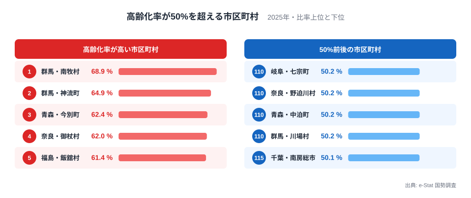
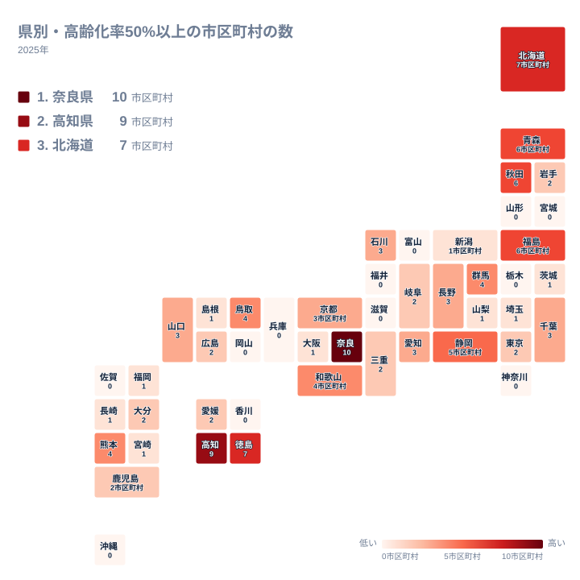
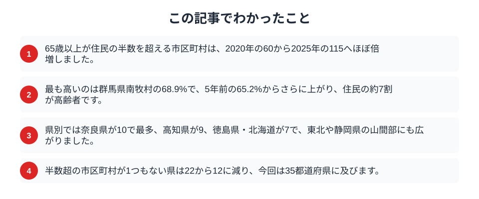

高齢化率が高い県として秋田や高知がよく挙げられますが、それでも県全体で見れば、半数には届きません。ところが市区町村まで細かく見ると、住民の半分以上が65歳以上という地域が確かに存在します。2025年の国勢調査で数えると、高齢化率が50%を超える市区町村は全国で115。2020年の調査では60だったので、5年でほぼ倍になりました。最も高いのは群馬県南牧村の68.9%で、住民の約7割が高齢者です。「高齢者が多数派」という暮らしは、一部の例外ではなく、全国の山間部に広く及びつつあります。

## 半数を超えるのは山間の小さな町村

まず、高齢化率が50%を超える市区町村を高い順に並べます。

<data-source label="e-Stat 国勢調査" note="65歳以上人口割合（2025年）"></data-source>

最も高いのは群馬県南牧村の68.9%です。2020年は65.2%でしたから、5年でさらに3.7ポイント上がりました。続くのが群馬県神流町の64.9%、青森県今別町の62.4%、奈良県御杖村の62.0%、福島県飯舘村の61.4%で、60%を超えるのは10市町村です。2020年に60%を超えていたのは5つだけでした。115のうち町が76、村が30を占め、市は北海道歌志内市の56.2%や夕張市の55.3%など9にとどまります。下位を見ると、千葉県南房総市の50.1%のように、50%をわずかに超えたばかりの自治体が並びます。50%台前半にとどまるのは81、55%から60%が24で、大半は「半数を超えたばかり」の層です。つまり半数の一線を越えるのは、大都市の郊外ではなく、鉄道や幹線道路から離れた小規模自治体に限られます。買い物や通院、介護の担い手そのものが高齢者という状況が、これらの町村では日常になっています。

<source-link href="/ranking/elderly-population-ratio">都道府県別の高齢化率ランキングを見る</source-link>

## 県別では奈良・高知・徳島・北海道に集中する

次に、50%を超える市区町村が各県にいくつあるかを地図で見ます。

<data-source label="e-Stat 国勢調査" note="65歳以上人口割合（2025年）"></data-source>

最も多いのは奈良県の10市区町村です。次いで高知県が9、北海道と徳島県が7、青森県・秋田県・福島県が6と続きます。紀伊半島の南部、四国山地、そして北海道や東北の内陸部という、山が深く集落が点在する地域に固まっています。2020年と比べると、高知県は5から9、秋田県は1から6、静岡県は1から5へと増え、これまで目立たなかった県でも山間部の町村が一線を越えました。静岡県では熱海市の50.3%のほか、伊豆半島の南伊豆町・松崎町・西伊豆町、川根本町が加わっています。

一方で、高齢化率が50%を超える市区町村が1つもない県は12にとどまりました。2020年は22でしたから、10県で新たに該当が生まれたことになります。それでも宮城・山形・栃木・神奈川・富山・福井・滋賀・兵庫・岡山・香川・佐賀・沖縄の12県は該当ゼロで、都市圏に人口が集まり、周辺の市町も通勤圏として保たれている県では、こうした集落は生まれにくいことがうかがえます。県単位の[高齢化が進む県ほど子どもが少ない](/blog/aging-rate-akita-vs-okinawa)という傾向は、市区町村まで見ると、特定の山村に凝縮して現れます。同じ県のなかでも、高齢化の進み方は場所によって大きく違います。

## なぜ5年で倍になったのか

半数を超える高齢化は、一朝一夕には起こりません。

> [!NOTE]
> 2020年に50%を超えていた60市区町村のうち、2025年も超えているのは59です。抜けたのは奈良県上北山村だけ(51.8%から48.3%)で、残る56は新たに一線を越えた自治体です。「倍増」の中身は、既存の高齢化の進行というより、40%台後半から50%台へ上がってきた自治体が大量に加わったことです。

上昇幅が大きかったのは、熊本県球磨村の44.7%から52.8%(8.1ポイント増)、青森県今別町の55.3%から62.4%(7.1ポイント増)、奈良県下市町の46.8%から53.9%(7.0ポイント増)、福島県川内村の47.7%から54.1%(6.5ポイント増)などです。5年で6ポイント以上も上がる速さは、この記事のデータだけでは理由まで特定できません。[仮説] 若い世代の転出と高齢者の残留が重なった可能性があり、確かめるには各自治体の年齢階級別人口と転入出の推移を見る必要があります。

こうした町村では、高齢者が地域の担い手でもあります。消防団や自治会、農地や山林の管理を高齢者が支え、[高齢者のひとり暮らし](/blog/aging-solo-living-crisis)も増えています。若い世代が少ないぶん、集落を維持する仕事の多くが高齢者に委ねられ、その負担は年々重くなります。医療や介護のサービスをどう届けるかは切実で、[医療機関の多くが過疎地域に置かれている](/blog/depopulation-area-medical-facilities)背景には、こうした地域の存在があります。買い物や通院の足を確保するための乗り合いサービスや、医師が巡回する仕組みなど、半数が高齢者という前提に立った暮らしの設計が、これらの町村では先行して進んでいます。

## 数字を読むときの注意

高い高齢化率をそのまま「限界集落」と決めつける前に、いくつか確認すべき点があります。

> [!WARNING]
> 上位には福島県飯舘村(2020年57.3%、2025年61.4%)のように、原発事故後の避難と帰還によって人口構成が大きく変わった自治体も含まれます。災害や政策による特殊な人口変動と、緩やかに進んだ高齢化は区別して読む必要があります。

もう一つ、比率という指標そのものにも読み方のコツがあります。

> [!TIP]
> 高齢化率は割合であって人数ではありません。人口が数百人の村では、若い世代が数人転出するだけで比率が跳ね上がります。地域の実像をつかむには、高齢化率だけでなく総人口や年少人口の推移もあわせて見ることが欠かせません。

半数が高齢者という数字は衝撃的に映りますが、それは同時に、その地域が全国に先んじて超高齢社会の暮らし方を模索してきたことの表れでもあります。そしてその「先行地域」は、5年で60から115へと確実に増えています。

## まとめ

この記事でわかったことを整理します。

住民の半数が高齢者という市区町村は、2025年に全国で115となり、2020年の60からほぼ倍増しました。大都市ではなく山間の小さな町村に偏り、奈良県・高知県・徳島県・北海道に集中する一方、東北や静岡県の山間部にも広がっています。将来の介護需要については[2040年に介護人材69万人不足](/blog/nursing-care-shortage-2040)や[高齢社会のテーマページ](/themes/aging-society)からも展望できます。極端に高齢化した集落の存在を知ることは、これからの地域医療や生活支援を考える手がかりになります。

## データについて

- e-Stat（政府統計の総合窓口）国勢調査「市区町村別 65歳以上人口割合」（2020年・2025年）
- 市区町村（県名を除いた市・町・村・特別区）単位で集計し、政令指定都市の行政区は市に含めています。
- 2025年(令和7年国勢調査)の値は原数値で、年齢「不詳」を除いて算出しています。報道などで使われる不詳補完値とは小数点以下が異なることがあります。2020年との比較も同じ算出方法にそろえています。
