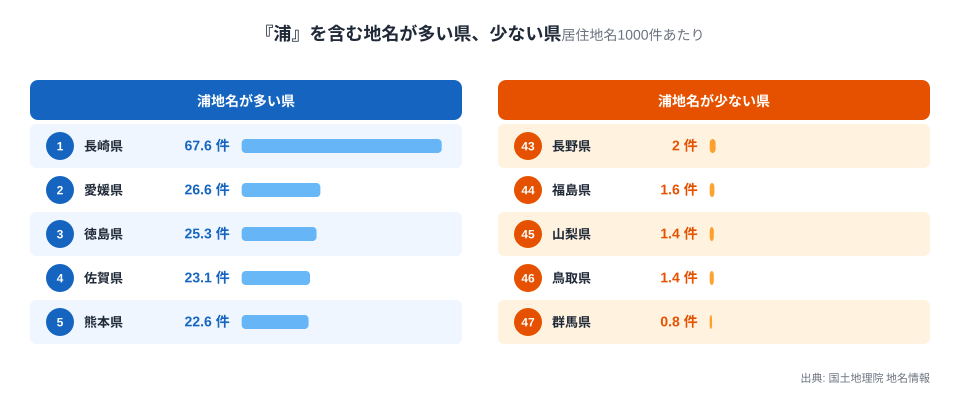
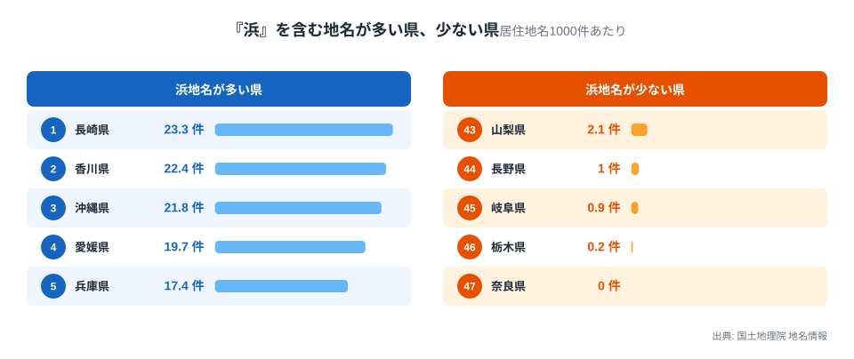
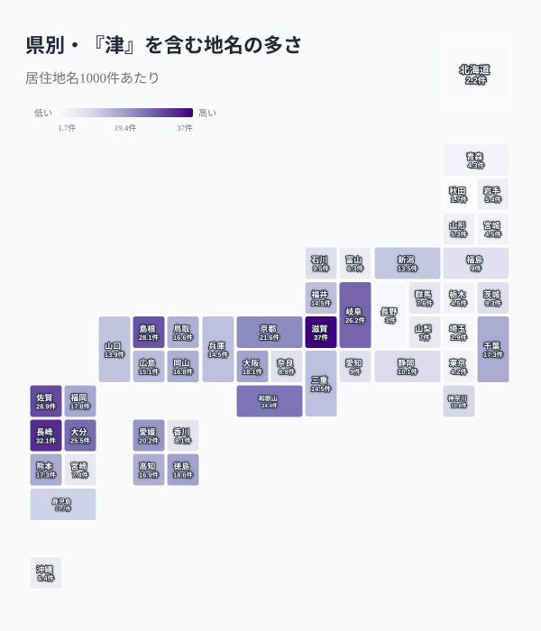
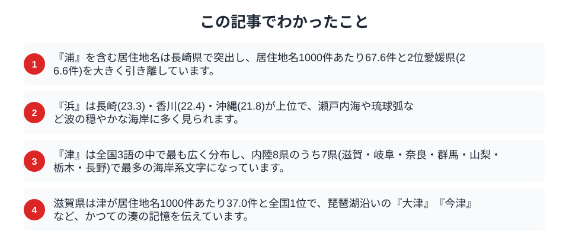

「浜」「浦」「津」は、どれも海や水辺に面した土地を意味する漢字です。海水浴場を「浜」、入り江を「浦」、港町を「津」と呼ぶように、同じ海岸でも使われる文字は場面によって違います。この使い分けが、地名になるとどう表れるのでしょうか。国土地理院の地名情報から、居住地名に「浜」「浦」「津」がどれだけ含まれるかを都道府県ごとに数えると、地形によってはっきり分かれる分布と、海から遠く離れた内陸に色濃く残る意外な文字が見えてきました。

## 「浦」は長崎が突出し、リアス海岸と重なる

まず、居住地名1000件あたりに「浦」を含む地名がいくつあるかを、県ごとに比べます。

<data-source label="国土地理院 地名情報" note="居住地名1000件あたりの『浦』を含む地名数（電子国土基本図・地名情報）"></data-source>

最も多いのは長崎県で、居住地名1000件あたり67.6件に「浦」が含まれます。これは2位の愛媛県(26.6件)の2.5倍以上、全国平均を大きく上回る突出ぶりです。県内には346件もの「浦」地名があります。3位以下も徳島県25.3件、佐賀県23.1件、熊本県22.6件、大分県20.9件と、九州西部から四国にかけての県が上位に並びます。反対に「浦」がほとんどないのは群馬県(0.8件)や鳥取県・長野県などの内陸・日本海側の県です。

「浦」は本来、海が陸地に入り込んだ入り江や湾を指す言葉です。長崎県は五島列島や西彼杵半島など、海岸線が複雑に入り組んだリアス海岸が続く地形を持ちます。小さな入り江のひとつひとつに集落ができ、それぞれが「〇〇浦」という地名で呼ばれてきたことが、この突出した数字に表れています。徳島・熊本・大分も、豊後水道や宇土半島・国東半島周辺など、入り組んだ海岸線を持つ点で長崎に近い地形です。一方で愛媛・香川・広島は瀬戸内海に面しており、瀬戸内海はリアス海岸というより多くの島が点在する多島海の地形ですが、湾入した入り江が随所にあり、そこにも「浦」の地名が多く残っています。[長崎県の地域プロフィール](/areas/42000)を見ると、離島や半島が多く海岸線が全国有数の長さを持つことが確認できます。

> [!NOTE]
> 「浦」は万葉集の時代から使われてきた古い言葉で、入り江や海辺の集落を指します。単に海に面しているだけでなく、湾入した地形を持つ土地に多く付けられる傾向がありますが、地形と文字の対応は絶対的なものではなく、同じ入り江でも「浜」「津」で呼ばれる例外もあります。

## 「浜」は瀬戸内と琉球弧に多い

同じ海岸を指す「浜」を数えると、上位の顔ぶれが少し変わります。

<data-source label="国土地理院 地名情報" note="居住地名1000件あたりの『浜』を含む地名数（電子国土基本図・地名情報）"></data-source>

長崎県は「浦」だけでなく「浜」でも居住地名1000件あたり23.3件と全国で最も多く、香川県22.4件、沖縄県21.8件がこれに続きます。愛媛県19.7件、兵庫県17.4件、宮城県17.3件も上位に並びます。「浜」は波の穏やかな砂浜や海水浴場を連想させる言葉で、瀬戸内海の島々や琉球弧の隆起サンゴ礁の海岸など、遠浅で砂浜の多い地形と結びつきやすい傾向があります。長崎県のように「浦」と「浜」の両方が多い県もあれば、香川県や沖縄県のように「浜」が優勢な県、逆に「浦」だけが突出する県もあり、海岸地形の細かな違いが文字の選び方に影響していることがうかがえます。

## 「津」は内陸8県のうち7県で最多という意外

「津」を数えると、他の2字とはまったく違う分布が見えてきます。

<data-source label="国土地理院 地名情報" note="居住地名1000件あたりの『津』を含む地名数（電子国土基本図・地名情報）"></data-source>

全国1位は滋賀県で、居住地名1000件あたり37.0件。2位の長崎県(32.1件)を上回り、海に面していない滋賀県がトップに立ちます。3位佐賀県28.9件、4位島根県28.1件、5位岐阜県26.2件と、海沿いの県と内陸の県が入り混じって並びます。

ここで注目したいのは、日本で海に面していない8つの内陸県(栃木・群馬・埼玉・山梨・長野・岐阜・滋賀・奈良)における「浜」「浦」「津」の内訳です。滋賀県(津37.0・浜13.9・浦5.1)、岐阜県(津26.2・浜0.9・浦4.5)、奈良県(津8.9・浜0・浦3.2)、群馬県(津7.6・浜3.2・浦0.8)、山梨県(津7.0・浜2.1・浦1.4)、栃木県(津4.5・浜0.2・浦2.9)、長野県(津3.0・浜1.0・浦2.0)と、埼玉県(浦3.8・津2.9)を除く7県すべてで「津」が最も多く残る海岸系の文字になっています。海のない土地に、なぜ港を意味する文字が最も色濃く残っているのでしょうか。

答えは「津」の意味の広さにあります。「津」は本来、船着き場や渡し場を指す言葉で、必ずしも海に限りません。滋賀県の「大津」「今津」「彦根の松原の津」といった地名は、琵琶湖という国内最大の湖を舞台にした水運の拠点を記録したものです。岐阜県の「津」地名の多くも、木曽川・長良川・揖斐川の水運や渡し場に由来します。山や谷の多い内陸の地形では、川や湖が唯一の輸送路であり、その拠点に「津」の名が刻まれてきました。「浜」「浦」が海岸線の形そのものを指すのに対し、「津」は水運の機能を指すため、海から遠く離れた土地にも残り得たのです。

> [!WARNING]
> 「津」を含む地名がすべて水運の拠点に由来するとは限りません。人名や字(あざな)の一部として付けられた地名、他の意味から転じた地名も含まれている可能性があり、表記だけから由来を断定することはできません。

## 3語の全体像

47都道府県それぞれについて「浜」「浦」「津」の居住地名1000件あたりshareを比べ、最も高い文字をその県の優勢な文字と判定して集計すると、津が24県、浦が12県、浜が11県で最多という結果になりました。津が最も広く分布する背景には、湖沼や河川の水運という、海に限らない意味の広がりがあります。

> [!TIP]
> 海岸地名を都道府県単位で比べる際は、海岸線の長さや複雑さ(リアス海岸か砂浜海岸か)、県の面積といった条件が異なる点に注意が必要です。ここでは県内の居住地名1000件あたりの件数で正規化していますが、海岸線が短い県ではサンプル数自体が少なく、数値が振れやすくなります。

同じ「水辺」を意味する文字でも、地形の違いや水運の歴史によって、残り方はこれほど違います。[新田開発の歴史が地名に残る「新田」](/blog/development-history-place-name-map)や、[丘陵地の谷を指す「谷戸」「谷津」](/blog/yato-yatsu-place-name-boundary)と同じように、地名は土地の成り立ちを伝える手がかりです。海のない滋賀県で「津」が最も多く残っているという事実は、地名が単なる海岸の記録ではなく、人と水の関わり方そのものを映す鏡であることを教えてくれます。

## データ出典

- 国土地理院「電子国土基本図（地名情報）」の居住地名を使用（出典明示により商用利用可・PDL1.0）
- 居住地名（大字・町・丁目等）1000件あたりに「浜」「浦」「津」を含む地名数を都道府県別に集計。自然地名は都道府県コードを持たないため対象外としています。
