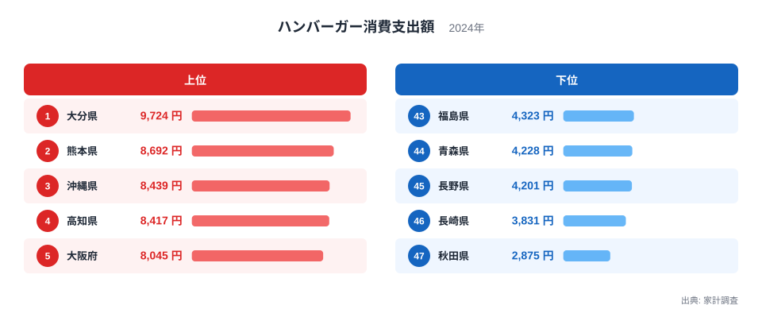
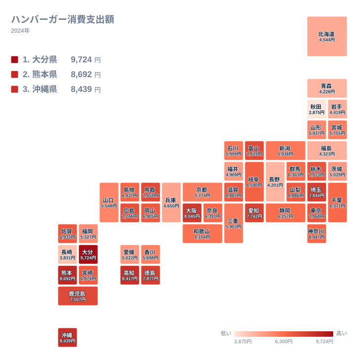

ハンバーガーは全国どこでも食べられるファストフードの代表格です。ところが家計調査でハンバーガーへの年間消費支出額を都道府県別に見ると、大きな地域差があることが分かります。2024年の家計調査によると、1位の大分県は9,724円、最下位の秋田県は2,875円で、その差はおよそ3.4倍にのぼります。

この記事では、なぜ大分県をはじめとする九州・沖縄勢がハンバーガー消費で全国上位を占めるのか、そして東北勢が軒並み下位に沈むのはなぜかを、データから読み解いていきます。結論を先に示すと、上位県には「ファストフード店の店舗密度」と「外食文化の浸透度」という共通点があり、下位県には「郷土食の強さ」と「外食機会そのものの少なさ」という共通点が見えてきます。

## 上位と下位の顔ぶれ

<source-link href="/ranking/hamburger-consumption-expenditure">ハンバーガー消費支出額ランキングをもっと見る</source-link>

上位5県を見てみましょう。1位は大分県で9,724円、2位は熊本県で8,692円、3位は沖縄県で8,439円、4位は高知県で8,417円、5位は大阪府で8,045円となっています。上位5県のうち3県が九州、1県が四国、1県が近畿という構成で、東京圏や中部圏の大都市が上位に入っていない点が目を引きます。

大分県が1位になった背景には、地方都市特有の車社会があると考えられます。地方都市ではロードサイド型の店舗が発達しやすく、ドライブスルーを併設したハンバーガーチェーンが日常的な外食先として定着しやすい環境があります。また大分県は肉料理を好む食文化を持つ地域でもあり、とり天や豊後牛といった肉食文化がハンバーガーという「肉を挟んだ料理」への抵抗感を薄めている可能性があります。熊本県や鹿児島県といった九州の他県も同様の傾向を持ち、9位の鹿児島県は7,507円と全国平均を大きく上回っています。

沖縄県が3位に入っている点も特徴的です。沖縄県は戦後にアメリカ統治下にあった歴史を持ち、ハンバーガーを含むアメリカ由来のファストフード文化が本土よりも早く根付いた地域として知られています。県内には地元発祥のハンバーガーチェーンも存在し、観光客だけでなく地元住民の日常食としても定着していることが、消費支出の高さにつながっていると見られます。

続いて下位5県を確認します。43位は福島県で4,323円、44位は青森県で4,228円、45位は長野県で4,201円、46位は長崎県で3,831円、47位は秋田県で2,875円です。下位5県のうち3県が東北地方で占められており、地域的な偏りがはっきりと見られます。

## 地理分布から見えるもの

地図で全国を俯瞰すると、九州・沖縄・四国・近畿の西日本と、東北の対比が際立ちます。西日本では大分県、熊本県、沖縄県、高知県、徳島県、鳥取県、佐賀県、岡山県、山口県など、九州・中国・四国のほぼ全域が全国平均に近いか、それを上回る水準にあります。一方で東北地方は岩手県が4,419円、福島県が4,323円、青森県が4,228円と軒並み低く、秋田県は47位の2,875円まで落ち込みます。

この東西差の一因として、外食産業そのものの店舗展開の差が挙げられます。ハンバーガーチェーンは人口密度が高く道路インフラが整った地域に出店が集中する傾向があり、東北地方の中でも人口が少なく積雪の多い地域では、店舗数自体が西日本の同規模都市より少ない可能性があります。加えて東北地方は郷土料理の食文化が根強く、わんこそばやきりたんぽ、じゃじゃ麺といった地域固有の食文化が外食の選択肢として優先されやすく、ハンバーガーのような外来食への支出が相対的に抑えられているとも考えられます。

長野県が45位という中部地方の中でも際立った低さを示している点も注目に値します。長野県は内陸に位置し海に面していない県で、そばや野沢菜漬けといった伝統的な和食文化が強く根付いています。都市部から離れた家庭的な食生活が主流となりやすい地域性が、ファストフード消費の低さに表れていると見ることができます。

## 大都市圏の意外な二極化

大都市圏に注目すると、単純に「都市部が高い」とは言えない構図が見えてきます。5位に入った大阪府は8,045円と高水準ですが、14位の東京都は7,068円、21位の神奈川県は6,447円と、大分県との差は決して小さくありません。埼玉県は7位で7,844円と首都圏の中では健闘していますが、東京都・神奈川県は全国平均をやや上回る程度にとどまっています。

大阪府が上位に入っている背景には、「粉もん文化」に象徴される外食への積極性や、庶民的なファストフードへの心理的なハードルの低さがあると考えられます。一方で東京都や神奈川県は外食の選択肢自体が非常に多く、ハンバーガーチェーン以外にも多国籍料理や専門店が数多く存在するため、消費が分散しやすい構造にあると見られます。[仮説] この分散仮説は本データだけでは検証できず、外食全体の支出構成を確認する必要があります。

## まとめ

- 1位は大分県の9,724円、最下位は秋田県の2,875円で、その差は約3.4倍です。
- 上位5県は大分県、熊本県、沖縄県、高知県、大阪府で、九州・四国・近畿が中心です。
- 下位5県は福島県、青森県、長野県、長崎県、秋田県で、東北地方が3県を占めています。
- 西日本は全体的に高水準、東北地方は全体的に低水準という地域的な偏りがはっきり見られます。
- 大都市圏の中でも大阪府と東京都・神奈川県で明確な差があり、都市規模だけでは説明できません。

> [!NOTE]
> この数値は家計調査における「ハンバーガー」への支出額で、外食としてハンバーガーチェーンで食べた場合に加え、テイクアウトして自宅で食べた場合の支出も含まれます。ハンバーガーショップでの飲み物やサイドメニューの支出は別の分類に計上されるため、実際の店舗での支払い総額とは一致しません。

> [!WARNING]
> 家計調査は各世帯の家計簿から集計されるため、単身世帯が多い都市部ではサンプルの世帯構成が地方と異なる場合があります。世帯構成の違いが数値に影響している可能性があるため、この順位だけで「その県の人がハンバーガーを好む度合い」を断定することはできません。

> [!TIP]
> ハンバーガー消費支出額を読み解く際は、単独の順位だけでなく、隣接する都道府県の傾向も合わせて見ると地域性がつかみやすくなります。九州・沖縄のように近隣県がそろって上位に入っている場合は、気候や食文化といった地域共通の要因を疑う手がかりになります。

もう少し広く経済統計を確認したい方は、[同じカテゴリの統計一覧](/category/economy)から他の消費支出データもあわせてご覧ください。1位の[大分県のデータ](/areas/44000)や2位の[熊本県のデータ](/areas/43000)では、ハンバーガー以外の消費傾向も確認できます。

## データ出典

家計調査（2024年）を基に作成しています。
