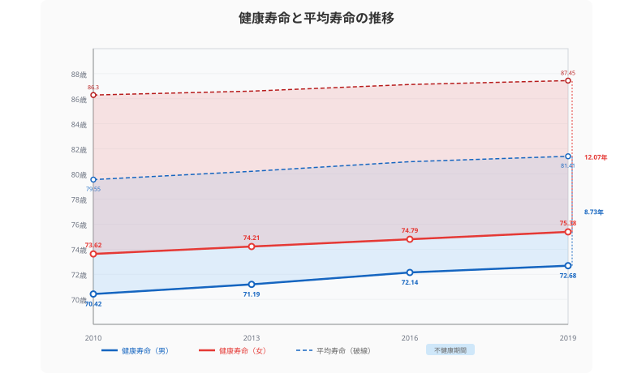
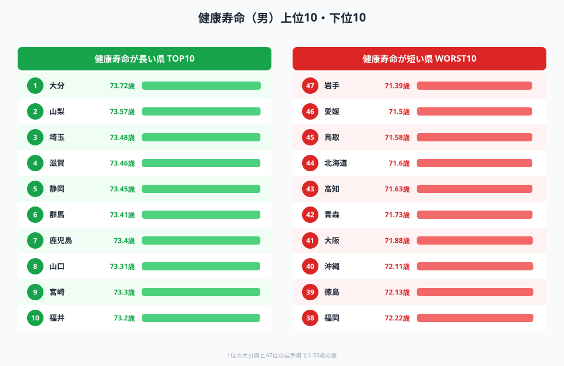
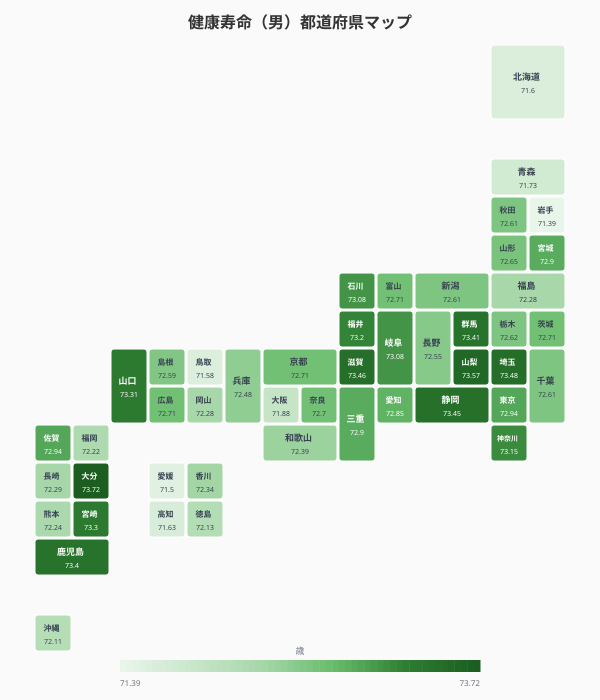
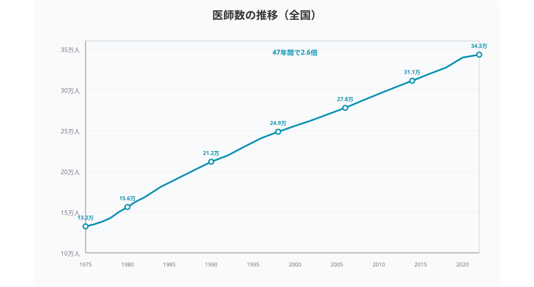
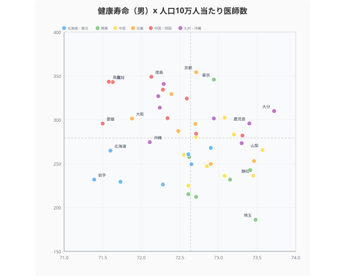
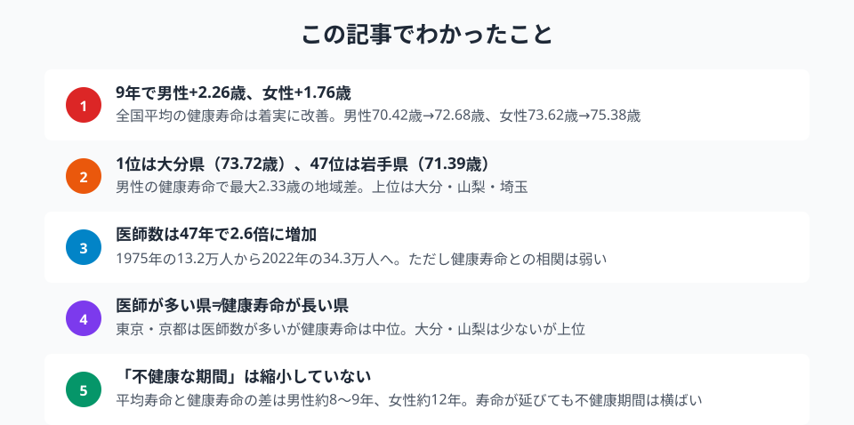

日本の平均寿命は男性**81.41歳**、女性**87.45歳**（2019年）で世界トップクラスです。しかし「健康寿命」──日常生活に制限なく過ごせる期間──はそこから**男性で約8.7年、女性で約12.1年**短い。長生きできるようになっても、不健康な期間は縮まっていません。

47都道府県の健康寿命データを追い、どの県が「健康に長生き」できているか、医師数の増加は健康寿命の改善に結びついているかを検証します。

> [!NOTE]
> 本記事の「健康寿命」は厚生労働省が3年ごとに算定する「日常生活に制限のない期間の平均」です。国民生活基礎調査の「あなたは現在、健康上の問題で日常生活に何か影響がありますか」に対する回答をもとに算出されます。

## 健康寿命の推移──9年で男性+2.26歳、しかし「不健康期間」は縮まらない

<data-source url="https://www.e-stat.go.jp/dbview?sid=0000010109" label="e-Stat 社会生活統計指標"></data-source>

健康寿命は男女ともに着実に伸びています。**男性は2010年の70.42歳から2019年の72.68歳**へ、9年で+2.26歳。**女性は73.62歳から75.38歳**へ、+1.76歳の改善です。

しかしグラフの塗り部分に注目してください。実線（健康寿命）と破線（平均寿命）の間が「不健康な期間」です。2019年時点で**男性8.73年、女性12.07年**。平均寿命も同時に延びているため、不健康期間はほとんど縮小していません。

男性の平均寿命は79.55歳→81.41歳（+1.86歳）と伸びましたが、健康寿命の伸び（+2.26歳）がわずかに上回りました。女性は平均寿命86.30歳→87.45歳（+1.15歳）に対し健康寿命+1.76歳で、こちらも差は縮まる方向ですが、依然として**12年以上の不健康期間**が残ります。

> [!TIP]
> 健康寿命は3年ごとの算定（2010年、2013年、2016年、2019年）です。コロナ禍の影響を受けた2022年以降のデータはまだ社会生活統計指標に反映されていません。

## 健康寿命ランキング──1位は大分県、47位は岩手県

<data-source url="https://www.e-stat.go.jp/dbview?sid=0000010109" label="e-Stat 社会生活統計指標"></data-source>

**1位は[大分県](/areas/44000)の73.72歳**。2位は山梨県（73.57歳）、3位は埼玉県（73.48歳）と続きます。上位には滋賀・静岡・群馬など、必ずしも温暖な地域だけではありません。

**47位は[岩手県](/areas/03000)の71.39歳**、46位は愛媛県（71.50歳）、45位は鳥取県（71.58歳）。1位と47位の差は**2.33歳**。同じ日本に住んでいても、健康に過ごせる期間が2年以上異なるという現実です。

> [!WARNING]
> 女性のランキングは男性と大きく異なります。女性1位は三重県（77.58歳）、47位は京都府（73.68歳）。男性で上位の大分は女性でも4位ですが、男性26位の秋田が女性では15位に浮上するなど、男女の順位差が大きい県もあります。

### 全国マップ

<data-source url="https://www.e-stat.go.jp/dbview?sid=0000010109" label="e-Stat 社会生活統計指標"></data-source>

マップで俯瞰すると、**東北・北海道が薄い色**（健康寿命が短い）に見えます。岩手・北海道・青森は71歳台。一方、**九州南部の大分・鹿児島・宮崎は73歳台**で濃い色が集中しています。

関東では埼玉（73.48歳）が突出して高い一方、千葉（72.61歳）は中位にとどまり、隣接する県でも差があります。

<source-link href="/ranking/health-life-expectancy-male">47都道府県の健康寿命ランキングをもっと見る</source-link>

<ad-slot></ad-slot>

## 医師数の推移──47年で2.6倍

<data-source url="https://www.e-stat.go.jp/dbview?sid=0000010109" label="e-Stat 社会生活統計指標"></data-source>

全国の医師数は1975年の**13.2万人**から2022年の**34.3万人**へ、47年で**2.6倍**に増加しました。人口10万人当たりに換算すると、約120人から約270人へとほぼ倍増しています。

増加ペースは一貫しており、2000年代以降もほぼ直線的に伸びています。2008年の「医学部定員増」政策が効果を出し始めた2016年以降、やや加速傾向も見られます。

これだけ医師が増えたにもかかわらず、「医師不足」が語られるのは、**地域偏在**と**診療科偏在**が原因です。次の散布図でその構造を確認します。

## 健康寿命と医師数──相関は意外に弱い

<data-source url="https://www.e-stat.go.jp/dbview?sid=0000010109" label="e-Stat 社会生活統計指標"></data-source>

> [!NOTE]
> 医師数は2022年、健康寿命は2019年とデータ年次が異なります。医師数の地域分布は短期間では大きく変動しないため、比較の参考になります。

散布図を見ると、医師数が多い県が健康寿命も長いという**明確な正の相関は確認できません**。

**右下**（健康寿命が長いが医師数は少ない）には**山梨（266人）、大分（310人）**。山梨は人口10万人当たり医師数が全国平均以下ですが健康寿命2位。大分は健康寿命1位ですが医師数は中位にとどまります。

**左上**（健康寿命が短いが医師数は多い）には**東京（346人）、京都（354人）**。東京は医師が人口10万人当たり約346人と多いのに、健康寿命は72.94歳で14位。京都も354人と上位ですが健康寿命は72.71歳で19位タイにとどまります。

この結果は、**医師の数を増やすだけでは健康寿命は延びない**ことを示唆しています。実際、[外来受療率（人口10万人あたりの外来患者数）](/ranking/outpatient-rate-per-100k)を見ても、受診機会の多寡と健康寿命は必ずしも一致しません。健康寿命に影響するのは、運動習慣・食生活・社会参加など、医療以前の生活習慣要因が大きいと考えられます。

<source-link href="/correlation?x=health-life-expectancy-male&y=doctor-count">健康寿命と医師数の相関を都道府県別に確認する</source-link>

<ad-slot></ad-slot>

## まとめ

健康寿命のデータを追った結果、「医師が多ければ健康」「都市部が有利」という単純な構図ではないことが見えてきました。

日本の高齢化対策は「寿命を延ばす」ことに成功しましたが、「健康に生きる期間を延ばす」ことにはまだ十分な成果が出ていません。男性で約8.7年、女性で約12.1年ある「不健康な期間」は、介護需要と社会保障費を押し上げ続けています。

健康寿命の地域差は、医療体制よりも生活習慣や地域コミュニティの在り方と強く結びついている可能性があります。大分や山梨が上位に入る理由を掘り下げることが、全国的な健康寿命の改善につながるかもしれません。

## データ出典

本記事のデータはe-Stat（政府統計の総合窓口）を基に作成しています。

本記事の対象データ: [関連カテゴリ](/category/socialsecurity)
