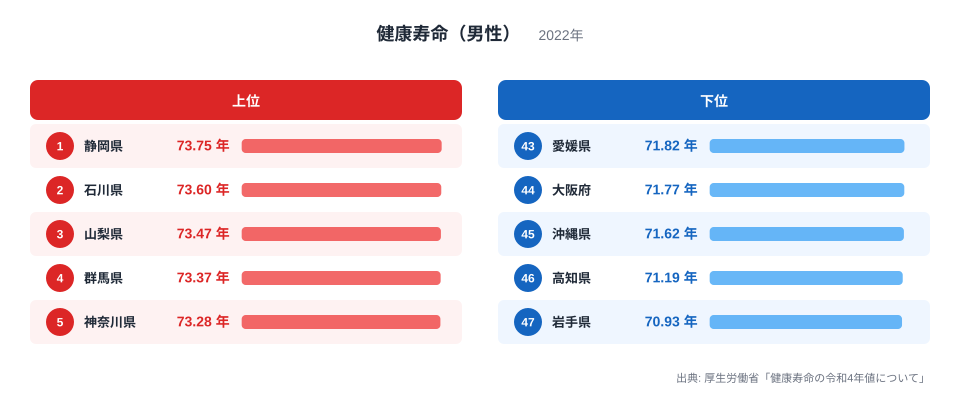
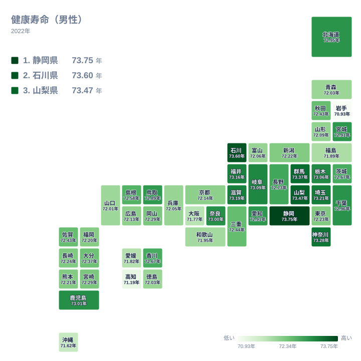
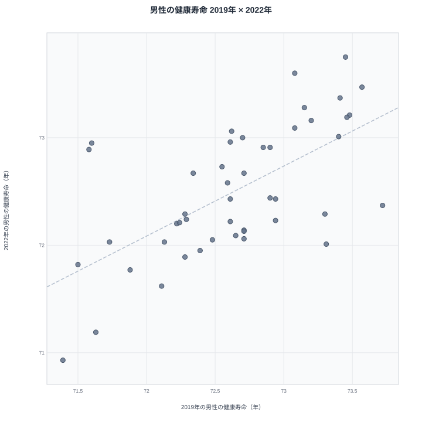
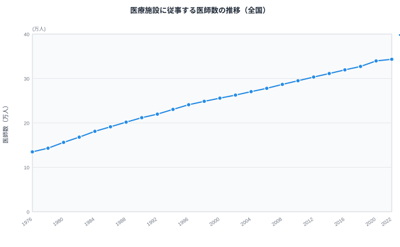
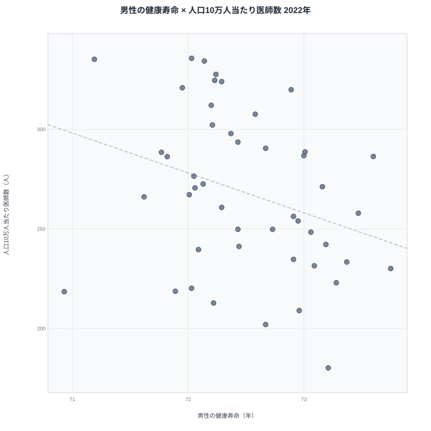

健康寿命は、健康上の問題で日常生活が制限されることなく生活できる期間の平均です。2022年の男性の健康寿命は、静岡県が73.75年で47都道府県の1位、岩手県が70.93年で47位でした。その差は2.82年です。

ところが、3年前の2019年に1位だった[大分県](/areas/44000)は、2022年に25位まで下がりました。上位の顔ぶれが入れ替わる一方で、岩手県は2019年も2022年も最下位のままです。この記事では、順位がなぜ3年で大きく動くのかを47県の値から確かめ、あわせて「医師が多い県ほど健康寿命は長いのか」も検証します。

> [!NOTE]
> 本記事の健康寿命は、厚生労働省が都道府県別に推計した男性の値です。このサイトが2026年10月時点で収録している最新の値は2022年値で、その前の2019年値と比べます。推計値には不確実性があり、原資料は95%信頼区間を示しています。小さな順位差や年差だけで、県ごとの健康状態の差を断定することはできません。

## 2022年の男性の健康寿命ランキング──1位は静岡県、47位は岩手県

**1位は[静岡県](/areas/22000)の73.75年**です。2位は石川県の73.60年、3位は山梨県の73.47年、4位は群馬県の73.37年、5位は神奈川県の73.28年と続きます。上位10県は、静岡県、石川県、山梨県、群馬県、神奈川県、埼玉県、滋賀県、福井県、岐阜県、栃木県です。関東から中部・北陸を通って滋賀県に至る帯に集中していて、北海道、東北、中国、四国、九州の県は1つも入っていません。

**47位は[岩手県](/areas/03000)の70.93年**で、46位は高知県の71.19年、45位は沖縄県の71.62年です。44位は大阪府の71.77年、43位は愛媛県の71.82年で、下位5県は東北、四国、近畿、沖縄にまたがります。上位と違って、地域のまとまりは見えません。

1位と47位の差は2.82年ですが、この差は均等に開いているわけではありません。10位の栃木県73.06年から40位の山口県72.01年までの31県は、1.05年の幅にひしめいています。一方、41位の和歌山県71.95年から47位の岩手県70.93年までは、7県で1.02年も開いています。上位10県の差は0.69年です。真ん中が密集し、とくに下位の端が間延びした分布だと言えます。この密集は、次の節で見る順位の入れ替わりを理解する手がかりになります。

上位が関東から中部に偏る理由は、この記事では確かめていません。

<source-link href="/ranking/healthy-life-expectancy-male">男性の健康寿命ランキングをもっと見る</source-link>

### 全国マップ

マップにすると、濃い緑が関東から中部、北陸へと連なる様子が見えます。73年以上は12県で、上位10県に鹿児島県の73.01年と奈良県の73.00年が加わります。九州では鹿児島県だけが濃く、近畿では滋賀県と奈良県が目立ちます。

一方、72年を下回るのは7県です。岩手県、高知県、沖縄県、大阪府、愛媛県、福島県、和歌山県で、薄い色は東北、四国、近畿の府県と沖縄県に散らばっています。北海道は72.95年で14位と、地図の上では中位より濃い色です。2019年は44位でしたから、3年で大きく位置が変わりました。

## 3年で入れ替わる順位──大分県は1位から25位へ

横軸に2019年、縦軸に2022年の男性の健康寿命を取り、47県を重ねたのが上の図です。点は右上がりに並ぶので、2019年に長かった県は2022年も長い傾向があります。ただし相関係数は0.63（47点から計算）で、点はかなり散らばっています。図の破線は回帰直線で、変化なしを表す線ではありません。

最も大きく動いたのは大分県です。2019年は73.72年で1位でしたが、2022年は72.37年で25位になりました。1.35年短くなり、47県で最大の低下です。山口県は73.31年で8位から72.01年で40位へ、宮崎県も73.30年から72.29年へと、いずれも1年以上短くなりました。反対に、北海道は71.60年で44位から72.95年で14位へ、鳥取県は71.58年で45位から72.89年で17位へと、1.3年以上延びています。図で探すと、大分県は右端にあり、縦軸では中ほどの高さです。山口県は右寄りの低い位置にあります。北海道と鳥取県は左端に近く、縦軸では高い位置に並んでいます。静岡県は図の中で最も高い点、岩手県は左下の隅の点です。

全体では、2022年が2019年より短くなったのは31県、長くなったのは16県です。47県の単純平均は72.64年から72.50年へ0.14年短くなりましたが、人口で重み付けた全国値ではありません。2019年から2022年の間には新型コロナウイルス感染症の流行期があり、その影響が県によって違う形で出た可能性があります。このデータだけでは確かめられません。

順位がこれだけ動く背景の一つは、値が狭い範囲に密集していることです。静岡県は2019年の73.45年から2022年の73.75年へ0.30年伸びただけで、5位から1位になりました。栃木県は72.62年から73.06年へ0.44年伸びて、25位から10位に上がっています。

もう一つは、推計値に不確実性があることです。47県のうち28県は、健康寿命が3年で0.3年以上動いていて、順位の動きは中央値で6つ分でした。原資料は95%信頼区間を示していますが、その幅はこのサイトが持つデータには含まれていません。1位の静岡県と2位の石川県の差は0.15年ですが、この程度の差で順位の優劣を判断するには慎重さが要ります。

順位表を読むときは、個々の順位よりも、上位10県と下位10県の平均のようなまとまりで見るほうが安定します。上位10県の平均は2019年の73.43年から2022年の73.32年へ、下位10県の平均は71.78年から71.72年へ動き、両者の差は1.65年から1.59年へとほぼ同じでした。一方、1位と47位の差は2.33年から2.82年に広がりました。1位の値はほとんど変わっておらず、広がった0.49年のうち0.46年は、岩手県が71.39年から70.93年へ短くなった分です。岩手県の低下が実際の悪化なのか推計のゆらぎなのかは、このデータだけでは分かりません。地域差の全体が広がったとは言えない結果です。

女性の順位や、平均寿命との差である不健康期間は別の記事で扱っています。男女の比較は[男女別の健康寿命の記事](/blog/healthy-life-expectancy-male-female-gap)、不健康期間は[不健康期間の男女差の記事](/blog/unhealthy-period-gender-prefecture-gap)をご覧ください。

あわせて見る: [女性の健康寿命ランキング](/ranking/healthy-life-expectancy-female)

## 医師数は46年で2.5倍──それでも県差は残る

全国の医師数は、1976年の13.49万人から2022年の34.33万人へ、46年で2.5倍に増えました。この図の医師数は、医療施設に従事する医師を47都道府県で合計した値です。ただし、県ごとの差は大きく、2022年の人口10万人当たり医師数は、1位の徳島県が335.7人、47位の埼玉県が180.2人で、約1.9倍の開きがあります。医師の総数が増えても、県ごとの医師数がそろうわけではありません。次の散布図で、この県差と健康寿命の関係を確かめます。

## 健康寿命と医師数──多い県ほど長い、とは言えない

男性の健康寿命を横軸、人口10万人当たり医師数を縦軸に取ると、点は右下がりに並びます。どちらも2022年の値で、相関係数は−0.31です。図の破線は回帰直線です。医師が多い県ほど健康寿命が長いという右上がりの関係は見えず、弱い逆向きの関係が出ています。

右下には、健康寿命が長いのに医師数の少ない県が並びます。静岡県は健康寿命が1位の73.75年ですが、人口10万人当たり医師数は230.1人で39位です。埼玉県は健康寿命が6位の73.21年なのに、医師数は180.2人で47位と最も少なくなっています。神奈川県も健康寿命は5位の73.28年で、医師数は223.0人の40位です。

左上には、医師数が多いのに健康寿命が中位以下の県があります。高知県は医師数が335.2人で2位と多い一方、健康寿命は71.19年で46位です。京都府は医師数が334.3人で3位ですが、健康寿命は72.14年で33位です。東京都は医師数が324.6人で5位と多い一方、健康寿命は72.23年で29位と中位以下にとどまります。左下の岩手県は健康寿命が47位で、医師数も218.5人の43位と、どちらも低い位置にいます。

> [!WARNING]
> 相関係数は因果の強さを示すものではありません。病気や高齢の人が多い県に医師が集まっているため、医師が多い県で健康寿命が短く見えている可能性もあります。このデータだけでは確かめられず、年齢構成をそろえた比較など、別の検証が必要です。

この47県の比較では、医師数が多い県ほど健康寿命が長いという関係は見えませんでした。ただし、医師数が健康寿命に影響するかどうかは、この図だけでは分かりません。健康寿命と結びつきの強い指標は、ランキングページの「相関が高い指標」で確認できます。

<source-link href="/ranking/physicians-in-medical-facilities-per-100k">人口10万人当たり医師数のランキングをもっと見る</source-link>

## まとめ

2022年の男性の健康寿命は、順位表の見た目ほど安定したものではありませんでした。

- 1位は静岡県の73.75年、47位は岩手県の70.93年で、差は2.82年です。2019年の2.33年より広がりましたが、広がった分の大半は岩手県の低下で、上位10県と下位10県の平均の差は1.65年から1.59年とほぼ同じでした。
- 2019年に1位だった大分県は25位に下がり、31県で健康寿命が短くなりました。16県では長くなっています。
- 10位から40位までの31県が1.05年の幅に密集していて、静岡県のように0.30年伸びるだけで5位から1位に上がるなど、小さな変化でも順位が動きます。個々の順位より、上位10県と下位10県の平均のようなまとまりで見るほうが安定します。
- この47県の比較では、医師数が多い県ほど健康寿命が長いという関係は見えず、2022年の人口10万人当たり医師数と男性の健康寿命の相関係数は−0.31でした。

次に読むなら、[社会保障のカテゴリ](/category/socialsecurity)から、介護や医療に関わる指標を探してください。

## データについて

健康寿命は、厚生労働省が推計した都道府県別の男性の値で、2019年値と2022年値を使いました。医師数は、医療施設に従事する医師で、2022年12月31日現在の届出が基です。健康寿命は2022年の推計値、医師数は2022年12月31日現在の値です。47県の単純平均、上位10県と下位10県の平均、相関係数、順位の変化は、図と同じ47県の値から計算した派生値で、人口で重み付けた全国値ではありません。上位10県と下位10県の平均の差は、丸める前の平均から計算しています。医師数の全国合計は47都道府県の合計で、図の横軸の間隔をそろえるため、1976年から2年おきの値を使っています。
