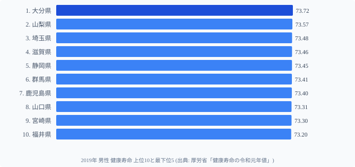
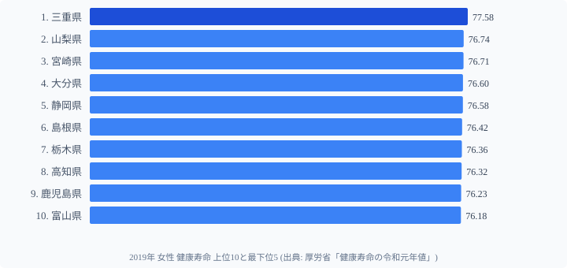
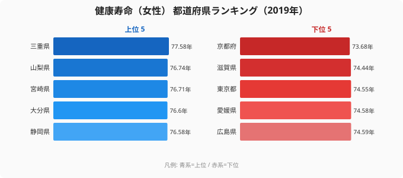

「健康寿命」とは、**介護を必要とせず自立して暮らせる期間** のことです。厚生労働省の定義では「健康上の問題で日常生活が制限されることなく生活できる期間」とされ、平均寿命との差は **「不健康期間」**= 介護や治療が必要な期間 を意味します。

本記事では、厚労省「健康寿命の令和元年値」(2019年集計、3年に一度更新) をもとに、47都道府県の健康寿命を **男女別** に整理しました。データを見ると **男性 1 位は[大分県](/areas/44000) (73.72年)**、**女性 1 位は[三重県](/areas/24000) (77.58年)** と男女で異なる結果に。さらに **女性の地域差は男性の約 1.7 倍** という意外な発見もありました。

> [!NOTE]
> 健康寿命は国勢調査・国民生活基礎調査を組み合わせた厚労省の推計値です。3年ごとに更新され、2019年値が現時点での最新確定値です。平均寿命との差が「不健康期間（介護・治療が必要な期間）」を意味します。

## 男性 健康寿命 TOP10 と最下位

男性の健康寿命は **大分県 (73.72年)** が 1 位。続いて 山梨・埼玉・滋賀・静岡 が並びます。最下位は **岩手県 (71.39年)** で、1 位との差は **2.33 年** です。

上位 10 県のうち、**九州・中国・近畿圏が 5 県** を占めています。一方、東北・北海道は下位に集中しており、北海道 (44 位 71.60 年)、岩手 (47 位 71.39 年) と寒冷地で短い傾向が見えます。

<source-link href="/ranking/healthy-life-expectancy-male">男性 健康寿命ランキングをもっと見る</source-link>

## 女性 健康寿命 TOP10 と最下位

女性の 1 位は **三重県 (77.58年)** で、男性 1 位の大分県を **0.86 年差** で大きく上回ります。最下位は **[京都府](/areas/26000) (73.68年)** で、1 位との差は **3.90 年** に達します。

女性の最下位グループは **京都・滋賀・東京** と意外な都市部が並びます。男性ランキングで上位だった **滋賀** (男 4 位) が女性では最下位 (46 位) と男女逆転の現象も見られます。

<source-link href="/ranking/healthy-life-expectancy-female">女性 健康寿命ランキングをもっと見る</source-link>

> [!WARNING]
> 都市部が健康寿命で下位に来ることを「都市生活は不健康」と単純に解釈するのは誤りです。高齢者の人口構成・就労継続率・医療アクセスの充実度など複数の要因が絡み合っており、一面的な説明は避けてください。たとえば京都府の生活習慣病死亡率（人口10万人あたり619.6人）は全国37位で中位にあり、健康寿命の低さが単純に生活習慣の悪化を意味するわけではありません。

## 女性の地域差は男性の 1.7 倍

健康寿命の都道府県差を男女で比較すると、明確な違いがあります。

- 男性: 大分 73.72 年 - 岩手 71.39 年 = **2.33 年**
- 女性: 三重 77.58 年 - 京都 73.68 年 = **3.90 年**

女性の地域差は男性の **約 1.67 倍**。同じ国の中で **4 年近い** 健康寿命の差は、平均寿命の地域差 (約 1〜2 年) より明らかに大きい数字です。

> [!TIP]
> 女性の地域差（3.90年）は男性（2.33年）の約1.7倍。地域によって女性の健康寿命には最大4年近い差がある計算です。

なぜ女性のばらつきが大きいのかは、本データ単体では断定できません。仮説としては以下が考えられます。

- **[仮説] 高齢期の社会参加・就労継続の地域差** — 地域コミュニティへの参加度が女性の健康維持に強く影響する可能性
- **[仮説] 食生活の地域文化** — 塩分摂取量・野菜摂取量など食習慣の地域差が女性の長寿に影響しやすい可能性
- **[仮説] 介護インフラの差** — 女性は男性より長く要介護期間を経験するため、地域の医療・介護インフラ差が反映されやすい可能性

いずれも個別の検証が必要な仮説です。本ランキングの数字そのものは、要因を一意に説明するものではありません。

注目すべきは**生活習慣病死亡率との関係**です。生活習慣病死亡率が高い東北（岩手 3 位 841.6 人、秋田 1 位 881.7 人）は男性健康寿命でも下位に集中しており、生活習慣病の負担が健康寿命を短縮している構造がデータから読み取れます。一方、女性最下位の京都府は生活習慣病死亡率が全国 37 位（619.6 人）と中位であり、女性の健康寿命低下が生活習慣病だけでは説明できないことを示しています。都市部特有の高齢者の孤立や、活発な地域コミュニティの欠如が影響している可能性を否定できません。

## 男女両方上位の県 vs 両方下位の県

男女の TOP10 を重ねると、両方で上位に入る県が見えてきます。

**男女両方 TOP10 入り (5 県)**

- 山梨県 (男 2 / 女 2)
- 宮崎県 (男 9 / 女 3)
- 大分県 (男 1 / 女 4)
- 静岡県 (男 5 / 女 5)
- 鹿児島県 (男 7 / 女 9)

**男女両方下位 (3 県)**

- 鳥取県 (男 45 / 女 41)
- 岩手県 (男 47 / 女 42)
- 愛媛県 (男 46 / 女 44)

上位共通の 5 県は山梨・静岡を除き **九州〜中国地方** に集中。下位共通の 3 県は **東北・山陰・四国** という人口減少地域に集中しています。地域グループとしてのクラスター構造が見えるのも特徴です。

## まとめ

- **男性 1 位は大分 (73.72年)**、**女性 1 位は三重 (77.58年)** で男女で異なる
- 男性最下位は岩手 (71.39年・2.33年差)、女性最下位は京都 (73.68年・3.90年差)
- 女性の地域差は男性の **約 1.7 倍** で、女性の健康寿命のほうがばらつきが大きい
- 山梨・宮崎・大分・静岡・鹿児島の **5 県は男女両方で上位**
- 鳥取・岩手・愛媛の **3 県は男女両方で下位**

健康寿命は **3 年に一度** の集計のため、2019 年値が現時点で最新の確定値です。次回更新値が公表され次第、本記事も追記する予定です。

## データ出典

- 厚生労働省「健康寿命の令和元年値について」(2019 年集計値)
- e-Stat 経由で都道府県別に整備
