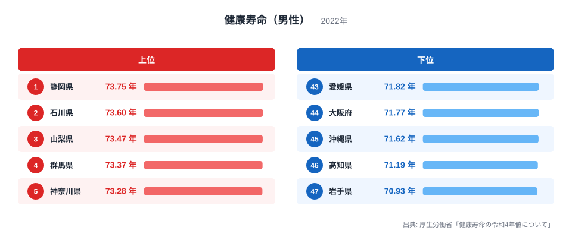
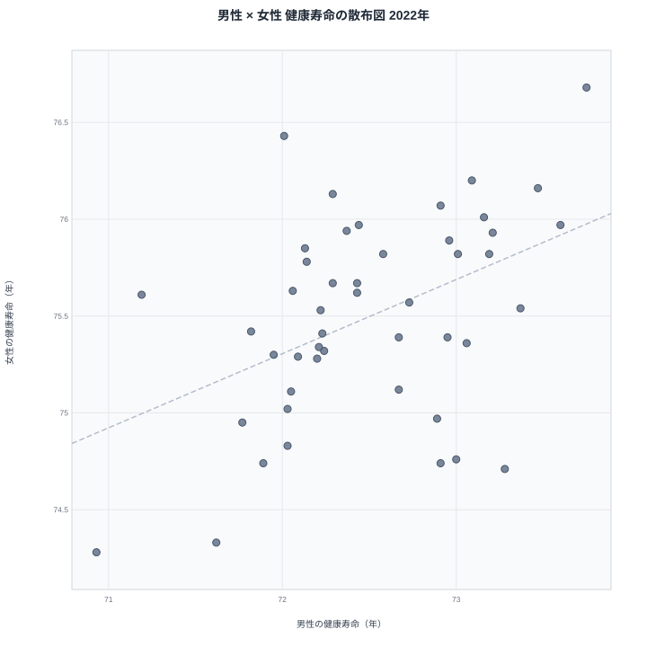

「健康寿命」とは、**健康上の問題で日常生活が制限されることなく生活できる期間** のことです。国民生活基礎調査で「日常生活に影響があるか」を尋ねた自己申告の回答にもとづく推計値で、平均寿命との差が **不健康期間**、つまり日常生活に制限のある期間にあたります。

本記事では、厚生労働省「健康寿命の令和4年値について」(2022年値) をもとに、47都道府県の健康寿命を **男女別** に並べました。結論を先に書くと、**男性も女性も1位は[静岡県](/areas/22000)** で、男性は73.75年、女性は76.68年です。最下位も男女とも **[岩手県](/areas/03000)** で、男性は70.93年、女性は74.28年でした。両端だけを見れば、男女の顔ぶれは同じです。

ところが間を見ると様子が違います。[神奈川県](/areas/14000)は男性が5位なのに女性は45位、[山口県](/areas/35000)は男性が40位なのに女性は2位と、男女で順位が大きくずれる県があります。男女のランキングはどこまで重なるのか、重ならない県はどこなのかを、2022年値で確かめます。

## 男性の上位は東日本の中央部、下位は散らばる

男性の1位は静岡県の73.75年で、石川県の73.60年、山梨県の73.47年が続きます。4位は群馬県で73.37年、5位は神奈川県で73.28年です。

上位5県は関東甲信、東海、北陸にまたがり、東日本の中央部に固まっています。1位から5位までの差は0.47年しかなく、上位は僅差の争いです。

最下位は岩手県の70.93年で、1位との差は2.82年です。下位5県を順に見ると、46位の高知県が71.19年、45位の沖縄県が71.62年、44位の大阪府が71.77年、43位の愛媛県が71.82年と並びます。東北の岩手県、四国の高知県と愛媛県、沖縄県、そして大都市の大阪府という顔ぶれで、「北ほど短い」「都市部ほど短い」といった一つの切り口では説明できません。

下位は上位よりも散らばりが大きいことも特徴です。43位から47位の差は0.89年で、上位5県の差0.47年の約2倍あります。とくに最下位の岩手県は、46位の高知県からさらに0.26年離れています。

> [!NOTE]
> 健康寿命は厚生労働省が公表する推計値で、国民生活基礎調査の自己申告にもとづくため、客観的な疾病データではありません。原資料は95%信頼区間を示しており、静岡県と石川県の0.15年差のような小さな差で順位の優劣は断定できないため、順位は目安として読んでください。

<source-link href="/ranking/healthy-life-expectancy-male">男性 健康寿命ランキングをもっと見る</source-link>

## 女性の上位は散らばり、下位は東北に偏る

女性の1位も静岡県で76.68年です。2位は山口県の76.43年、3位は岐阜県の76.20年、4位は山梨県の76.16年、5位は宮崎県の76.13年で、1位から5位までの差は0.55年です。

男性の上位が東日本の中央部に固まっていたのに対し、女性の上位は東海、甲信、中国、九州に散らばり、地域のまとまりが見えません。男性では40位だった山口県が女性では2位に入っていることが、その象徴です。

最下位は岩手県の74.28年で、1位との差は2.40年です。46位は沖縄県の74.33年、45位は神奈川県の74.71年です。宮城県と福島県はともに74.74年で、同じ値は同順位とするため、ともに43位タイになります。下位5県のうち3県が東北で、残りが神奈川県と沖縄県という構成です。

43位から47位の差は0.46年で、上位5県の差0.55年とほぼ同じ幅です。男性では下位5県の幅が上位5県の約2倍に広がっていたので、女性は上位と下位の散らばりが同程度という点で形が違います。

<source-link href="/ranking/healthy-life-expectancy-female">女性 健康寿命ランキングをもっと見る</source-link>

## 男女の上位10県は半分が重なり、偶然の2倍以上

同じ県の男性と女性の健康寿命を、横軸に男性、縦軸に女性として並べたのが次の散布図です。右上ほど男女とも長く、左下ほど男女とも短い県で、破線は47点に最もよく当てはまる直線です。

点は右上がりに並びますが、散らばりは大きく、47県の男性値と女性値から相関係数を計算すると約0.45でした。相関係数は値が直線的にそろう度合いを表し、1に近ければ男女の値が直線的にそろうと言えます。0.45は「ゆるやかに連動する」程度にとどまります。

順位の重なりでも確かめます。男性の上位10県と女性の上位10県で共通するのは、静岡県、石川県、山梨県、福井県、岐阜県の5県です。38位以下の下位10県で共通するのは、青森県、徳島県、福島県、大阪府、沖縄県、岩手県の6県でした。2つの順位がまったく無関係なら、10県どうしの重なりは平均で約2.1県 (10×10÷47) と見込まれるので、5県と6県は偶然の2倍強から3倍近くにあたります。男女は連動していますが、上位でも下位でも4〜5割の県は入れ替わっています。

破線より下に離れるのは、男性の値に比べて女性が短い県です。回帰直線から最も下に離れるのは神奈川県で、男性73.28年に対して女性74.71年、約1.1年下です。次いで奈良県が男性73.00年・女性74.76年、宮城県が男性72.91年・女性74.74年で、ともに約0.9年下です。男性は神奈川県が5位、奈良県が12位、宮城県が15位タイなのに、女性は45位、42位、43位タイまで下がります。

反対に、破線より上に離れるのは、男性に比べて女性が長い県です。最も上に離れるのは山口県で、男性72.01年に対して女性76.43年、約1.1年上です。宮崎県が男性72.29年・女性76.13年で、約0.7年上に続きます。

順位の入れ替わりで見ると、女性のほうが40位下がる神奈川県と、38位上がる山口県が最大です。高知県も男性46位から女性22位へ24位上がります。男性の下位に沈む県でも、女性では中位に入ることがあります。

> [!WARNING]
> 散布図の相関は、男女の値が連動する度合いを示すだけで、片方がもう片方の原因という意味ではありません。同じ県に住んでいることによる共通の要因で連動しても不思議はありませんが、その要因が何かは本データでは特定できません。

あわせて見る: [男性 健康寿命ランキング](/ranking/healthy-life-expectancy-male) / [女性 健康寿命ランキング](/ranking/healthy-life-expectancy-female)

## 男女差は県によって1.4年から4.4年まで開く

男女差は、女性の値から男性の値を引いて求めます。47県の平均は約3.0年ですが、県ごとの幅は大きく、最も小さいのは神奈川県の1.43年です。女性74.71年から男性73.28年を引いた値で、次いで奈良県の1.76年、宮城県の1.83年が続きます。

反対に最も大きいのは山口県と高知県で、ともに4.42年です。宮崎県が3.84年、広島県が3.72年で、女性が男性を大きく上回る県は西日本に目立ちます。男女差が最大の山口県と最小の神奈川県の間には、約3.0年の違いがあります。

なぜ県によって男女差がこれほど違うのかは、本データだけでは断定できません。考えられる仮説を二つ挙げますが、いずれも別のデータでの検証が必要です。

- **[仮説] 男女で異なる生活習慣の地域差** — 喫煙、飲酒、食塩摂取のように、男女で地域差のパターンが違う生活習慣が影響している可能性があります。県別・男女別の生活習慣調査との突き合わせが必要です。
- **[仮説] 自己申告の回答傾向の男女差** — 健康寿命は「日常生活に影響があるか」という自己申告にもとづくため、同じ健康状態でも「影響がある」と答える傾向に男女や地域で差があれば、男女差に表れる可能性があります。受療状況など、自己申告以外の指標との突き合わせが必要です。

いずれも仮説にとどまり、この記事の数字だけで要因を一つに決めることはできません。平均寿命にあたる0歳時点の平均余命には男女別のランキングがありますが、最新が2020年で2022年の健康寿命とは年が違うため、本記事では突き合わせていません。

あわせて見る: [男性 平均余命](/ranking/life-expectancy-0-male) / [女性 平均余命](/ranking/life-expectancy-0-female)

## 地域差の逆転は、主に女性の差が縮んだため

1位と最下位の差で測ると、2022年値は男性が73.75年から70.93年を引いた2.82年、女性が76.68年から74.28年を引いた2.40年で、男性の地域差のほうが約1.2倍大きくなります。47県の標準偏差で比べても男性は約0.61年、女性は約0.52年で、同じ向きです。

2019年値は逆でした。同じランキングの2019年値では、1位は男性が大分県の73.72年、女性が三重県の77.58年でした。最下位は男性が岩手県の71.39年、女性が京都府の73.68年で、差は男性2.33年、女性3.90年と、女性の地域差が男性の約1.7倍ありました。2019年から2022年にかけて、男性の地域差は2.33年から2.82年へ0.49年広がり、女性は3.90年から2.40年へ1.50年縮んだことになります。

逆転は主に女性の差が縮んだためです。標準偏差で見ても、女性は約0.73年から約0.52年へ縮み、男性は約0.59年から約0.61年とほぼ横ばいでした。女性の最長値は77.58年から76.68年へ0.90年下がり、最短値は73.68年から74.28年へ0.60年上がっています。2019年に女性で最短だった京都府は、2022年値では女性17位の75.78年です。男性は最長値がほぼ同じ73.75年のまま、最短値が71.39年から70.93年へ0.46年下がりました。ただし、どちらの年も95%信頼区間つきの推計値なので、年による変化の原因までは本データで断定できません。

また、2022年値の差は両端の県に左右されます。男女それぞれの最下位2県を除いて45位までで測ると、男性は73.75年から71.62年を引いた2.13年、女性は76.68年から74.71年を引いた1.97年で、倍率は約1.1倍まで縮みます。最下位2県が広げた幅は、男性が0.69年、女性が0.43年です。男女の地域差の開きは0.42年から0.16年に縮むので、男性の地域差が大きく見える理由の多くは、高知県と岩手県が下位で大きく離れていることにあります。

平均寿命との差である不健康期間の男女差は、健康寿命の2019年値と平均寿命の2020年値を組み合わせた[不健康期間の男女差はなぜ京都で最大](/blog/unhealthy-period-gender-prefecture-gap)で扱っています。男性の健康寿命の順位が2019年から2022年にかけてどう入れ替わったかと、医師数との関係は[健康寿命トップはなぜ3年で変わる?](/blog/health-life-expectancy-structure)で確かめています。

## まとめ

- 男女とも1位は静岡県で、男性73.75年、女性76.68年です。最下位は男女とも岩手県で、男性70.93年、女性74.28年でした。
- 男女の上位10県で共通するのは5県、下位10県で共通するのは6県で、無関係なら約2.1県なので偶然の2倍強から3倍近くです。相関係数は約0.45で、男女は連動するものの、4〜5割の県は入れ替わります。
- 神奈川県は男性5位で女性45位、山口県は男性40位で女性2位と、順位が大きくずれる県があります。
- 男女差は神奈川県の1.43年から、山口県と高知県の4.42年まで開いています。
- 地域差は男性2.82年、女性2.40年で、2019年値の男性2.33年、女性3.90年とは逆になりました。主な理由は女性の差が縮んだことで、最下位2県を除くと男性の優位は約1.1倍に縮みます。

健康寿命は[社会保障のカテゴリ](/category/socialsecurity)で他の指標とあわせて見られます。次の更新値が公表された時点で、順位のずれが続くのかを確かめる価値があります。
