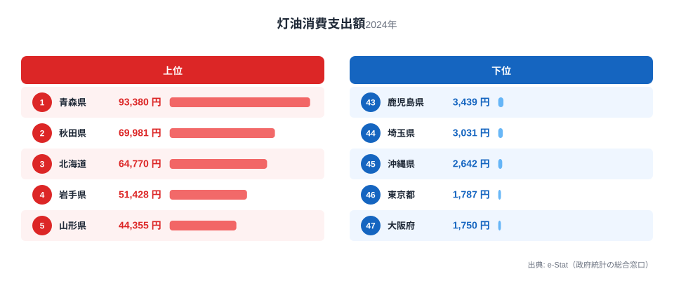
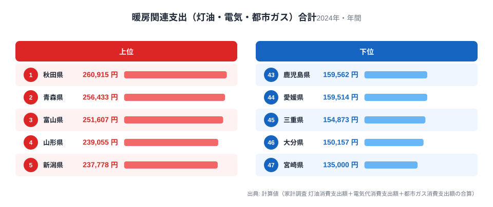
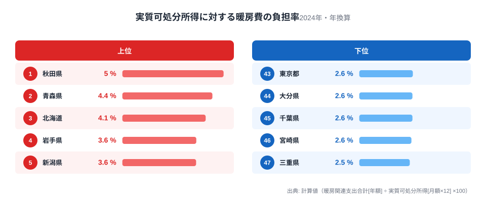

「東京より地方の方が暮らしやすい」とよく言われます。家賃は安く、実質可処分所得（物価を考慮した購買力）も地方の方が高い県は珍しくありません。しかし、その手取りから灯油・電気・都市ガスの支出を差し引いてみると、印象は変わってきます。

家計調査（都道府県庁所在市・二人以上世帯）から灯油・電気代・都市ガス代の年間消費支出額を都道府県ごとに合算すると、暖房関連支出が最も重い秋田県は年間約26万円、最も軽い宮崎県は約14万円と、1.9倍の差があります。この差を実質可処分所得（年換算）に対する割合で見ると、秋田県は4.97%、三重県は2.48%と、負担率にして約2倍の開きになります。

この記事では、灯油消費支出額・電気代・都市ガス代・実質可処分所得という4つの家計調査系ランキングを重ね合わせ、「同じ手取りでも、暖房費を引いた後にどれだけ残るか」という視点で都道府県を比較します。結論を先に言うと、秋田県・青森県・北海道は可処分所得のランキングでも下位に近く、その上で暖房費負担率も上位に来る「二重の不利」を抱えています。

## 灯油消費支出額に見る「暖房事情」の地域差

<source-link href="/ranking/kerosene-consumption-expenditure">灯油消費支出額ランキングをもっと見る</source-link>

2024年の灯油消費支出額（二人以上世帯・年間）を都道府県別に見ると、1位は青森県で93,380円、2位は秋田県で69,981円、3位は北海道で64,770円です。最下位は大阪府の1,750円で、青森県とは53.4倍の差があります。灯油は主に石油ストーブやファンヒーターの燃料として使われるため、冬季の暖房需要が大きい東北・北海道で突出して高くなる一方、都市ガスや電気暖房が普及した大都市圏ではほとんど使われていません。

ここで注意したいのは、灯油支出が少ない県が「暖房費が安い」とは限らないという点です。都市ガスのインフラが整備されている都市部では、灯油の代わりに都市ガスや電気で暖房をまかなっているため、灯油だけを見ると暖房費の全体像を見誤ります。次の章では、電気代・都市ガス代も合わせた「暖房関連支出の合計」で比較します。

> [!NOTE]
> 本記事の灯油・電気・都市ガスの消費支出額は、家計調査（総務省）の「都道府県庁所在市・二人以上世帯」の年間支出額です。世帯全体の平均や、単身世帯・持ち家世帯だけの平均とは値が異なります。都道府県の代表値として県庁所在市のデータを使っている点にご留意ください。

## 電気・都市ガスも合わせた「暖房関連支出合計」

あわせて見る: [電気代消費支出額ランキング](/ranking/electricity-consumption-expenditure)・[都市ガス消費支出額ランキング](/ranking/city-gas-consumption-expenditure)

灯油・電気代・都市ガス代の年間消費支出額を単純に合算すると、1位は秋田県の260,915円、2位は青森県の256,433円、3位は富山県の251,607円でした。最下位は宮崎県の135,000円で、4位鹿児島県、5位熊本県と九州勢が下位に並びます。

面白いのは、灯油支出では1位だった青森県が、合計ランキングでは秋田県に次ぐ2位になる点です。逆転の決め手は電気代ではありません。秋田県の電気代は148,851円で、青森県の155,718円よりむしろ低く、47都道府県の中では20位、全国平均（146,301円）をわずかに上回る程度にとどまります。灯油・電気代の両方で秋田県は青森県に及ばないのです。

逆転の決め手は都市ガス代でした。秋田県の都市ガス代は42,083円（17位）である一方、青森県はわずか7,335円で47都道府県中最下位です。灯油と電気で青森県に譲る秋田県が、都市ガス代の差（34,748円）でそれを跳ね返し、合計で首位に立った形になります。都市ガス代だけを見ると、実は大阪府（75,240円）・愛知県（73,117円）・京都府（68,413円）といった都市部が上位を占めており、都市ガスの導管網が寒冷地の農村部まで届いていないため、青森県では暖房も給湯もほぼ灯油と電気に頼っている、という構造が数字から読み取れます。暖房費の順位は「都会は安い、地方は高い」という単純な構図ではなく、都市ガスというインフラの有無ひとつで大きく入れ替わることがわかります。

> [!WARNING]
> 「暖房関連支出合計」は本記事が灯油・電気代・都市ガス代の3つの家計調査系ランキングを単純合算して独自に算出した値で、e-Statや家計調査に「暖房費」という単一の統計項目があるわけではありません。電気代には冷房・家電使用分も含まれるため、真冬の暖房費だけを厳密に切り出した数値ではない点にご注意ください。

## 可処分所得と並べて見える「隠れコスト」

<source-link href="/ranking/real-disposable-income">実質可処分所得ランキングをもっと見る</source-link>

暖房関連支出合計（年額）を実質可処分所得（月額を12倍して年換算した額）で割った「暖房費負担率」を計算すると、1位は秋田県の4.97%、2位は青森県の4.42%、3位は北海道の4.09%でした。最も負担率が低いのは三重県の2.48%で、次いで宮崎県2.56%、千葉県2.61%と続きます。上位と下位で負担率はおよそ2倍の開きです。

この負担率と実質可処分所得そのものの関係を都道府県ごとに突き合わせると、両者には緩やかな負の相関が見られます（相関係数はおよそ-0.3）。つまり、可処分所得が低い県ほど、暖房費の負担率が高くなる傾向があるということです。実質可処分所得のランキングで見ると、秋田県は45位（437,103円/月）、青森県は39位（483,557円/月）と、いずれも下位グループに位置します。一方、可処分所得トップクラスの埼玉県（618,720円/月、1位）や東京都（613,421円/月、2位）は、暖房費負担率がそれぞれ2.70%、2.63%と全国平均（3.14%）よりも低く抑えられています。

言い換えると、秋田県や青森県の家計は「他の県より少ない手取りから、他の県より多い暖房費を払っている」状態にあります。可処分所得のランキングだけを見ていると気づきにくいこの「二重の不利」が、暖房費という切り口を重ねることで見えてきます。

> [!TIP]
> 暖房費負担率が低い県が必ずしも「暮らしやすい」わけではありません。沖縄県のように暖房需要自体が小さい地域は負担率が下がりやすい一方、家賃や車の維持費など暖房費以外の生活コストで差がつくこともあります。暖房費はあくまで家計を見る切り口の一つとして捉えてください。

## 秋田・青森に見る「所得も低く、暖房費も高い」二重の不利

[秋田県](/areas/05000)と[青森県](/areas/02000)は、実質可処分所得のランキングで下位グループに入りながら、暖房関連支出合計のランキングでは1位・2位という対照的な位置にいます。可処分所得だけで比較すると「そこまで大きな差ではない」ように見える県でも、暖房費という固定費の重さを重ねると、実際に自由に使えるお金の差はさらに開きます。

例えば秋田県の実質可処分所得は月額437,103円で、暖房関連支出合計は年額260,915円（月換算で約21,743円）です。単純に月々の可処分所得から暖房費の月割り分を差し引くと、手元に残る額は415,360円になります。これに対し、可処分所得トップの埼玉県は月額618,720円から暖房費の月割り分（約16,709円）を引いても602,011円が残ります。もともとの所得差に加えて、暖房費の差の分だけ、実質的な生活の余裕にはさらに差がつく計算です。

> [!WARNING]
> [仮説] 前段の相関はサンプル数47（都道府県）による単純な線形相関であり、家賃・車の保有率・世帯構成といった他の要因を統制していません。「所得が低いから暖房費の負担が重くなる」という因果関係を示すものではなく、あくまで両者に緩やかな傾向が見られるという観察にとどまります。

## まとめ

- 暖房関連支出合計（灯油＋電気＋都市ガス）の1位は秋田県（260,915円）、最下位は宮崎県（135,000円）
- 灯油単体では青森県が1位（93,380円）だが、都市ガス代の差（秋田42,083円 vs 青森7,335円）で秋田県が合計1位に入れ替わる
- 実質可処分所得に対する暖房費負担率は秋田県が4.97%で最大、三重県が2.48%で最小（約2倍の開き）
- 暖房費負担率と実質可処分所得には緩やかな負の相関（-0.3程度）があり、所得が低い県ほど負担率が高い傾向
- 秋田県・青森県は可処分所得ランキングでも下位グループに入り、所得と暖房費の両面で不利が重なっている

## データ出典

- 総務省統計局「家計調査」（都道府県庁所在市・二人以上世帯、灯油消費支出額・電気代消費支出額・都市ガス消費支出額、2024年）
- 総務省統計局「社会・人口統計体系」（可処分所得（二人以上の世帯のうち勤労者世帯）、2024年度）を消費者物価地域差指数で実質化した実質可処分所得
- 暖房関連支出合計・暖房費負担率は、上記の家計調査系ランキングをもとに本記事が独自に算出した値です
- e-Stat（政府統計の総合窓口）経由で整備されたデータをもとに作成しています

物価や実質所得の地域差をさらに詳しく知りたい方は、[実質所得のテーマページ](/themes/real-income)や[消費者物価のテーマページ](/themes/consumer-prices)もあわせてご覧ください。
