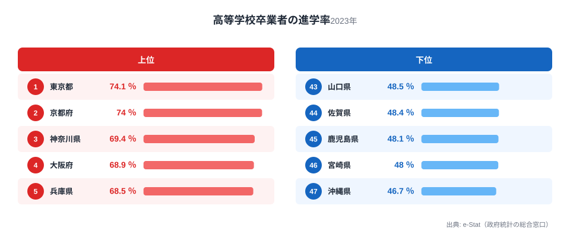
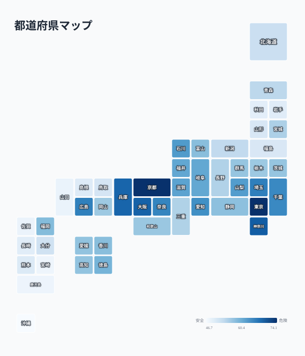

「進学率が高い県ほど教育が優れている」——そう考えたくなりますが、実際のデータを見るとその前提は崩れます。高校卒業者のうち大学等（大学・短大）へ進学した人の割合を都道府県別に見ると、最も高い東京都は74.1%、最も低い沖縄県は46.7%で、その差は1.6倍にのぼります。しかし上位には東京・京都・大阪・兵庫といった大都市圏が並び、下位には九州・東北の県が集中するという分布は、教育の質の差というより、大学の立地・産業構造・家計所得といった「進学しやすい環境」の差を映し出しています。

この記事では2023年度の学校基本調査データをもとに、進学率の地域差の実態と、その背後にある構造を見ていきます。進学率だけで地域の教育を評価することの危うさも、あわせて考えます。

> [!NOTE]
> ここでいう「高等学校卒業者の進学率」は、その年度に高校を卒業した人のうち、大学・短期大学（通信教育・別科等を除く）へ進学した人の割合です。専門学校や就職は含まれません。したがって進学率が低い県が「教育熱心でない」とは限らず、専門学校進学や地元就職を選ぶ人が多い地域では、この指標だけでは実態を捉えきれません。

## 上位と下位

<source-link href="/ranking/high-school-advancement-rate">大学等進学率ランキングをもっと見る</source-link>

上位5県は東京都74.1%、京都府74%、神奈川県69.4%、大阪府68.9%、兵庫県68.5%と、いずれも三大都市圏に属します。この5県に共通するのは、大学そのものの立地数が多いことです。東京都・京都府・大阪府・兵庫県はいずれも私立大学・国公立大学が密集するエリアで、自宅から通学できる大学の選択肢が豊富にあります。神奈川県も東京都に隣接し、通学圏として都内の大学を選べる地理的条件があります。

進学率の高さは、単に「教育熱心な家庭が多い」というより、「大学に通うためのハードルが低い」ことの反映という見方ができます。地元に大学があれば、下宿や仕送りといった追加コストなしに進学できます。埼玉県6位・千葉県9位も同様で、東京都心への通学圏に含まれることが進学率を押し上げている可能性があります。1位の[東京都](/areas/13000)は大学数だけでなく人口・経済規模でも突出しており、進学率の高さと合わせて総合的な教育インフラの厚みがうかがえます。

一方、下位5県は佐賀県48.4%、鹿児島県48.1%、宮崎県48%、そして[沖縄県](/areas/47000)46.7%が最下位です。これらの県には共通して大規模な大学集積地が少なく、進学するなら地元を離れて下宿するか、県外の大学を選ぶ必要があります。家計への負担が大きくなることが、進学率を押し下げる一因と考えられます。

## 進学率が低い＝教育が劣るわけではない

> [!WARNING]
> この指標は大学等への「進学」だけを数えており、専門学校進学や公務員・地元企業への就職は反映されません。地域によっては専門学校や就職を選ぶ生徒が多く、その場合は進学率が低く出ても「学ぶ意欲や能力が低い」ことを意味しません。産業構造や雇用機会の地域差を無視して進学率だけで教育水準を語るのは早計です。

沖縄県が最下位である背景には、大学進学のための本土への移動コストという特殊事情があります。離島県であるため、県外の大学に進学する場合は交通費・生活費の負担が本土の他県よりも大きくなりがちです。加えて、観光業を中心とした産業構造の中で、地元での就職を選ぶ選択肢も相対的に太い道として存在します。

九州・東北の下位県に共通するのは、地場産業（農業・製造業・地方公務員など）における新卒採用の需要が一定程度あることです。就職先の選択肢が地元にあること自体は地域経済にとって健全な状態であり、それが進学率の低さとして表れているにすぎません。進学率のランキングは「教育の優劣」ではなく「進学という選択肢がどれだけ選ばれやすい環境にあるか」を示す指標だと捉えるほうが実態に近いといえます。

## 発見：47都道府県で見る進学率と大学立地の重なり

<source-link href="/ranking/high-school-advancement-rate">大学等進学率の全47都道府県を見る</source-link>

地図で見ると、進学率の高い地域は南関東（東京都・神奈川県・埼玉県・千葉県）と近畿（京都府・大阪府・兵庫県・奈良県・滋賀県）に集中し、東海（愛知県・岐阜県）や北陸（石川県・福井県）にも比較的高い県が点在します。これらはいずれも大学進学率の高い都市圏か、大学進学率の高い都市圏への通学が可能な近接県です。対照的に、九州（佐賀県・鹿児島県・宮崎県・長崎県）と東北（秋田県・岩手県・福島県・山形県）は下位に集中し、地理的に大都市圏から離れた地域ほど進学率が低くなる傾向がはっきり表れています。

この分布は、大学収容力（人口あたりの大学定員数）と所得水準の両方が影響していると考えられます。都市部は大学が多いだけでなく、平均世帯所得も相対的に高く、学費や下宿費用を負担できる家庭が多い傾向にあります。一方で地方では、大学進学に伴う下宿費用が家計の大きな負担となり、進学を断念したり専門学校・就職を選んだりするケースが増えます。[仮説] 大学収容力と世帯所得のどちらがより強く進学率に影響するかは、本データだけでは切り分けられません。[県民所得ランキング](/category/economy)や大学収容力の指標と重ね合わせた分析が必要です。

> [!TIP]
> 進学率の地域差を読み解くときは、大学収容力（その県にどれだけ大学定員があるか）と合わせて見ると、「地元で完結できる進学」と「県外に出る前提の進学」の違いが見えてきます。地元完結型の県ほど進学率が高く出やすい構造です。

## まとめ

- 大学等進学率1位は東京都74.1%、2位は京都府74%
- 最下位は沖縄県46.7%で、東京都との差は1.6倍
- 上位は東京・京都・大阪・兵庫など大学が密集する大都市圏
- 下位は佐賀・鹿児島・宮崎・沖縄など九州勢が目立ち、地場産業の雇用機会も背景にある
- 進学率は「教育の質」ではなく「進学のしやすさ」を映す指標であり、専門学校進学や地元就職を選ぶ地域では低く出やすい

## データ出典

総務省統計局「社会・人口統計体系」（文部科学省「学校基本調査報告書」に基づく、2023年度）を出典としています。e-Stat（政府統計の総合窓口）経由で整備したデータをもとに集計しました。
