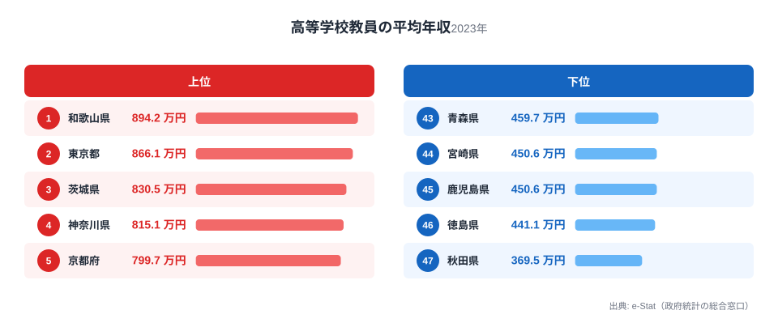
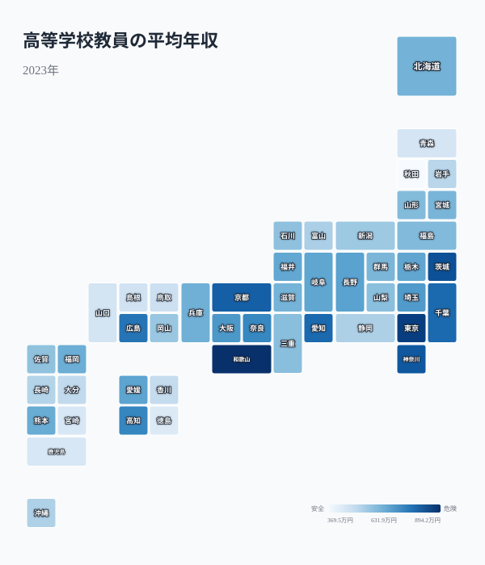

「教員の給与は東京や大阪のような都市部が高いはず」——そう考える人は多いはずです。ところが2023年の高等学校教員の平均年収データを見ると、1位は和歌山県（894.2万円）でした。2位に東京都（866.1万円）が続きますが、3位は茨城県（830.5万円）、4位は神奈川県、5位に京都府と、大阪府や愛知県といった大都市圏は上位5県に一つも入っていません。最下位は秋田県（369.5万円）で、1位との差は2.4倍に達します。なぜ地方の和歌山県が全国トップに立てるのか。その答えは、給与そのものの高さではなく「平均年収という数字がどう作られるか」という構造にあります。

## 上位5県と下位5県：どれだけ違うのか

<source-link href="/ranking/high-school-teacher-annual-income">高等学校教員の平均年収ランキングの全件データを見る</source-link>

2023年の上位5県は、和歌山（894.2万円・1位）・東京（866.1万円・2位）・茨城（830.5万円・3位）・神奈川（815.1万円・4位）・京都（799.7万円・5位）でした。東京と神奈川は首都圏の物価・地価に応じた地域手当が上乗せされるため上位に来るのは想定どおりですが、和歌山と茨城が東京を挟むように並ぶのは直感に反します。

一方、下位5県は徳島（441.1万円）・秋田（369.5万円）に加えて、宮崎・鹿児島（ともに450.6万円）、青森（459.7万円）が並びます。東北と九州南部に低い県が集中している点は、地域手当の対象外エリアが多いことと関係していますが、それだけでは和歌山の1位を説明できません。

> [!NOTE]
> この指標は賃金構造基本統計調査（厚生労働省）の「きまって支給する現金給与額」を年換算し、賞与相当額を加えた推計値です。都道府県の給料表そのものではなく、実際にその県で働く教員の**平均**給与である点が重要です。

## 和歌山が東京を超える理由：平均年収は「誰が働いているか」で決まる

高校教員の給与は、国が定める給料表をベースに、勤続年数と年齢に応じて号給が上がっていく仕組みです。つまり同じ役職・同じ年齢でも都道府県間の基本給差は本来小さいはずですが、平均年収は在職している教員の年齢構成に強く左右されます。

[和歌山県](/areas/30000)のように新規採用数が少なく年配の教員の比率が高い県では、勤続年数の長いベテラン層が平均値を押し上げます。総務省統計局の学校教員統計調査でも、和歌山県は公立高校教員の平均年齢が全国的に高い部類に入ることが知られており、これが894.2万円という数字の主因と考えられます。[東京都](/areas/13000)・神奈川県が上位に来るのは、若手教員も多い一方で地域手当（都市部の物価調整分）が給与に上乗せされるためで、和歌山とは異なる仕組みで上位に押し上げられています。

> [!WARNING]
> **[仮説]** 和歌山県の1位は年齢構成（平均年齢の高さ）が主因という見立てですが、本データには年齢別の内訳が含まれていません。年齢構成を都道府県別に照合した検証は行っていないため、確定的な結論ではなく仮説として扱ってください。

## 地理的な分布を地図で見る

<source-link href="/ranking/high-school-teacher-annual-income">地図データの詳細をランキングページで見る</source-link>

地図で見ると、南関東（東京・神奈川・千葉）と近畿（和歌山・京都・奈良）に濃い色が集まり、東北と南九州、四国に薄い色が集中していることが分かります。近畿の中でも大阪府（682.8万円・11位）は和歌山より低く、必ずしも「近畿全体が高い」わけではありません。府県単位で見ると、大都市圏の地域手当がある地域と、和歌山のように年齢構成で押し上げられている地域が混在し、単純な都市・地方の二分法では説明できない分布になっています。

> [!TIP]
> 地域手当の対象は人事院規則で「級地区分」が定められており、東京23区や大阪市など指定地域のみ上乗せされます。同じ都道府県内でも市町村によって手当率が異なるため、県単位の平均はその県内の市町村構成にも影響を受けます。

## 下位グループの共通点：地域手当の対象外エリアが多い

[秋田県](/areas/05000)・青森（いずれも東北）と宮崎・鹿児島（南九州）が下位5県に並ぶ背景には、地域手当の対象地域がほとんど存在しないという事情があります。人事院規則の級地区分は都市部を中心に設定されており、これらの県では公立高校の大半が手当支給対象外の「無級地」にあたります。加えて **[仮説]** 東北・南九州は若手教員の採用が比較的活発とされ、年齢構成の面でも平均値を押し下げる可能性がありますが、年齢別の内訳は本データに含まれないため確定はできません。

徳島県が下位5県に入っている点は、四国の中でも徳島は高知（721.6万円・9位）と対照的で、同じ四国内でも大きな差があることを示しています。

## 小中学校教員との比較：ランキングの顔ぶれが違う

<source-link href="/ranking/school-teacher-annual-income">小中学校教員の平均年収ランキングも見る</source-link>

小中学校教員の平均年収ランキングでは、1位は愛知県（885.9万円）、2位京都府、3位北海道で、東京都は4位でした。高校教員ランキングの1位が和歌山県であるのに対し、小中学校では和歌山県は34位（536.0万円）で上位に入っていません。同じ都道府県でも学校段階によって教員の年齢構成や採用政策が異なるため、ランキングの顔ぶれが一致しないのです。これは「教員給与＝その県の財政力」という単純な図式ではなく、学校段階ごとの人事管理の違いが平均値に表れていることを示しています。

## まとめ

- 高等学校教員の平均年収は1位和歌山県894.2万円、最下位秋田県369.5万円で2.4倍の差
- 上位5県は和歌山・東京・茨城・神奈川・京都で、大阪・愛知など大都市圏は入っていない
- 和歌山が東京を上回る背景には、都市部の地域手当とは異なる「年齢構成」の影響がある可能性（仮説）
- 下位は東北・南九州に集中し、地域手当の対象外エリアが多いことと関連する
- 小中学校教員ランキング（1位愛知）とは顔ぶれが異なり、学校段階ごとに人事構造が違う

高校教員の給与を都道府県で比較したい場合は<source-link href="/ranking/high-school-teacher-annual-income">高等学校教員の平均年収ランキング</source-link>で全47都道府県の値を確認できます。教育分野の他の指標は[教育・文化テーマページ](/themes/education-culture)にまとまっています。給与全般の地域差は[経済カテゴリ](/category/economy)でも確認できます。

## データ出典

賃金構造基本統計調査（厚生労働省）を基に、e-Stat（政府統計の総合窓口）経由で整備したデータです。集計年は2023年。
