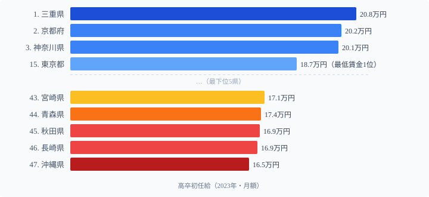

「最低賃金が高い都道府県ほど初任給も高い」──そう思う人は多いが、データは逆のことを示す場面がある。

最低賃金が全国1位（1,163円）の[東京都](/areas/13000)の**高卒初任給は15位**（18.7万円）。1位は**[三重県](/areas/24000)**（20.8万円）で、東京より月1.1万円高い。この逆転が生まれる理由は、最低賃金と高卒初任給が「別の労働市場」を反映しているからです。

さらに大卒初任給を見ると、**高卒で45位の秋田県が大卒では1位**（26.8万円）に逆転する。地方の人材争奪戦は、学歴によってまったく異なる構造で動いています。

## 高卒初任給ランキング（2023年）

<data-source url="https://www.e-stat.go.jp/dbview?sid=0003084610" label="e-Stat 賃金構造基本統計調査"></data-source>

**1位は三重県**（20.8万円）。2位京都府（20.2万円）、3位神奈川県（20.1万円）と続きます。上位には製造業が盛んな県が目立ちます。

一方、最下位は**[沖縄県](/areas/47000)**（16.5万円）。長崎県（16.9万円）、秋田県（16.9万円）と続き、下位は東北・九州に集中しています。1位と最下位の差は**4.3万円**で、年収に換算すると約51万円の格差になります。

> [!NOTE]
> 初任給は「きまって支給する現金給与額」で、残業代を含みます。事業所規模10人以上が対象。2023年の賃金構造基本統計調査に基づきます。

<source-link href="/ranking/starting-salary-highschool">高卒初任給ランキング全47県</source-link>

## 最低賃金1位の東京が15位にとどまる構造

最低賃金と高卒初任給はなぜ乖離するのか。

| 指標 | 東京都 | 三重県 |
|---|---|---|
| 高卒初任給 | 18.7万円（15位） | 20.8万円（1位） |
| 最低賃金 | 1,163円（1位） | 1,023円（31位） |

最低賃金は**パート・アルバイトを含む全労働者の下限**です。一方、高卒初任給は**正社員の給与**であり、企業の人材獲得競争の結果を反映します。

三重県が1位になる背景には、**四日市コンビナートを中心とする石油化学・半導体産業**の存在があります。製造業の大手企業は高卒人材を即戦力として採用し、競合他社より高い初任給を提示します。東京はサービス業・情報通信業が中心で、高卒採用より大卒採用に重点を置く企業が多いため、高卒初任給は相対的に低くなります。

同様に、2位の京都府は任天堂・村田製作所等の製造業、5位の滋賀県（19.9万円）はダイキン・パナソニック等の工場集積が初任給を押し上げています。**太平洋ベルト地帯の製造業集積が高卒初任給の地図を描いている**のです。

> [!TIP]
> 「初任給が高い地域で就職したい」という高校生・保護者の方へ：製造業の工場が多い三重・京都・神奈川・滋賀は高卒初任給が高い傾向があります。ただし、残業・交代勤務・転勤の有無など条件面の確認も必要です。初任給の高さだけでなく、職種・産業構造も考慮した就職先の検討をおすすめします。

## 大卒初任給では秋田が1位──学歴で逆転する人材争奪戦

高卒と大卒で初任給ランキングを比較すると、順位が大きく入れ替わります。

**大卒初任給1位は秋田県**（26.8万円）。高卒初任給では45位（16.9万円）の秋田が大卒では1位に浮上します。秋田県は大卒人材の流出が深刻で、地元に残る大卒者を確保するために企業が初任給を引き上げている構造です。

三重県は高卒1位ですが、大卒では中位にとどまります。製造現場では高卒の技術者が重宝される一方、大卒は本社機能が集中する東京・大阪に流れるためです。

この逆転現象が示すのは、**地方の人材獲得戦略が学歴によってまったく異なる**ことです。

- **高卒**: 製造業の現場人材として地元で争奪戦 → 製造業集積地が有利（三重・京都・神奈川）
- **大卒**: 都市部への流出を防ぐために初任給高騰 → 人口流出が深刻な地方が有利（秋田・岩手・青森）

同じ「初任給」でも、背景にある労働市場の構造はまったく異なります。

<source-link href="/ranking/starting-salary-university">大卒初任給ランキング全47県</source-link>

## 地域パターン──太平洋ベルトが高卒初任給を左右する

高卒初任給の地域分布には明確なパターンがあります。

**上位の特徴**:
- 太平洋ベルト地帯の製造業県──三重・滋賀・広島・静岡・群馬と、自動車・電機・化学の工場が集積する県
- 大都市圏の周辺県──神奈川・埼玉・千葉は工業団地も多い

**下位の特徴**:
- 東北北部──秋田・青森は製造業の集積が薄い（逆に大卒は人材確保のため初任給が高い）
- 九州南部・離島──沖縄・長崎・宮崎は第一次産業・中小サービス業が中心

注目すべきは、**愛知県が19位**（18.6万円）と中位にとどまる点です。トヨタのお膝元でありながら上位に入らないのは、愛知の自動車産業が下請け構造を含む広い裾野を持ち、中小企業の初任給が平均を押し下げるためです。

> [!WARNING]
> 高卒初任給の地域差（1位三重20.8万 vs 47位沖縄16.5万）は月4.3万円・年51万円ですが、これはあくまで「初任給」の差です。数年後の昇給率・賞与・退職金・生活コストまで含めた生涯所得での比較は、初任給ランキングだけでは判断できません。特に首都圏は生活費が高いため、「初任給が低い=生活水準が低い」とは限りません。

## まとめ

高卒初任給の構造的発見：

1. **最低賃金と初任給のずれ**: 最低賃金1位・東京は高卒初任給15位（18.7万）。三重（20.8万）が1位の理由は製造業集積
2. **太平洋ベルトの製造業が地図を描く**: 三重・京都・神奈川・滋賀は工場集積で高卒を高給で争奪
3. **学歴による逆転**: 高卒45位の秋田が大卒では1位（26.8万）──人材流出防止のための高賃金戦略
4. **年収51万円差の重さ**: 月4.3万円差は地方の高卒就職者の生涯設計に直結する

高卒初任給の地域差は、製造業の空間分布・最低賃金制度・大卒vs高卒の人材市場構造が複合した結果です。単純な「賃金格差」ではなく、産業立地と労働市場の構造を読み解く指標として活用することが重要です。

## データ出典

- 厚生労働省「賃金構造基本統計調査」(2023年)
- [e-Stat 政府統計の総合窓口](https://www.e-stat.go.jp/) (統計コード: 0003084610)
- 対象：事業所規模10人以上、新規学卒者（高校卒）の初任給（きまって支給する現金給与額）
