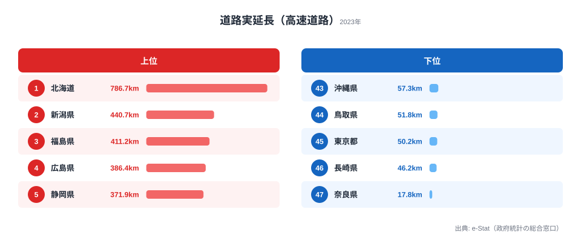

「日本初の高速道路はいつ・どこに開通したか」と聞かれて、すぐに答えられる人は多くないはずです。

正解は **1962年5月、名神高速道路の栗東〜尼崎間** のうち、**たった 3.3km** が部分開通したのが最初です。
そこから 58 年、2020 年時点で日本の高速道路は **累計 14,805 km / 1,420 区間** にまで広がりました。地球を 3 分の 1 周する長さが、戦後のわずか 60 年弱で日本列島に張りめぐらされたことになります。

この記事の中核となる問いはひとつです。**なぜ高速道路は「太平洋ベルト」から先に伸び、北海道や東北のような広い県が後回しになったのか。** そして 2023 年の最新データを見ると、いまや高速道路がいちばん長いのは大都市ではなく **北海道** で、**東京は 47 都道府県中 45 位** という意外な順位になっています。本記事では、国土交通省「国土数値情報 N06 (高速道路時系列データ)」を地図アニメーションで可視化しながら、その背景を読み解いていきます。

## 1962→2020 を 30 秒で可視化

<video controls preload="metadata" poster="" width="100%" style="border-radius: 12px; max-width: 540px;">
  <source src="https://storage.stats47.jp/blog/highway-japan-58years/video.mp4" type="video/mp4" />
  お使いのブラウザは動画再生に対応していません。
</video>

毎年の新規開通区間 (黄色の線) が日本列島に伸びていく様子と、累計区間数・累計距離が右下にカウントアップで表示されます。線がまず関西と東海をつなぎ、次に関東へ、そして放射状に地方へ広がっていく様子は、戦後日本の経済重心がどこにあったかをそのまま写したものです。

> [!NOTE]
> 距離は各区間のジオメトリ長から geo-length で算出しています。N06 の N06_002 (供用開始年度) を年次フィルタとして使用しているため、ここでの「累計距離」は供用済み区間の合計を指します。バイパスや一般有料道路の扱いは別統計と一致しない場合があります。

## マイルストーン: なぜこの順序だったのか

高速道路網の拡張は、ランダムに進んだわけではありません。**当時の人口・産業・経済力が集まっていた場所から順につながっていった**のが実態です。年表で追うと、その優先順位がはっきり見えてきます。

### 1965 名神高速 全通 (290 km)

日本初の都市間高速です。**京阪神 → 名古屋** を結び、大阪万博 (1970) の輸送インフラとして決定的な役割を果たしました。1963 年の栗東〜尼崎を皮切りに、わずか 3 年で大津〜西宮の約 190 km がつながります。最初の路線が東京発ではなく関西発だった点は、当時の関西経済圏の存在感を物語っています。

### 1969 東名高速 全通 (累計 816 km)

**東京 → 名古屋** が高速で結ばれた瞬間です。1962〜1969 の 7 年で、日本の太平洋ベルト地帯は事実上「高速で1日圏」になりました。名神と東名が接続したことで、東京〜大阪が一本の高速で貫かれ、物流と人の流れが一気に変わります。

> [!TIP]
> 名神が先・東名が後という順序は、用地買収の難易度 (名神は田園地帯中心、東名は静岡県の山地と都市部が連続) と、高度経済成長期の輸送需要 (関西経済圏が先行していた) の両方が背景にあります。「東京が一番栄えていたのだから東京から作ったはず」という直感は、実は当時の実情とずれているのが面白いところです。

### 1982 中央自動車道 全通 (累計 3,500 km)

東京 → 名古屋を結ぶ **山岳ルート** です。富士・八ヶ岳・中央アルプスを抜ける難工事のため、東名から 13 年遅れての全通となりました。同じ東京〜名古屋でも、平地を行く東名と山を越える中央道とで完成に十年以上の差がついたことは、地形がインフラ整備のコストをいかに左右するかを示しています。

### 1985 関越自動車道 全通 (累計 4,672 km)

**東京 → 新潟** が直結しました。これにより日本海側へのアクセスが大幅に改善し、スキー・温泉観光が大衆化します。太平洋側を優先して整備してきた高速網が、ようやく本格的に日本海側へ手を伸ばし始めた節目でした。

### 1995 阪神高速 大震災で被災

兵庫県南部地震で阪神高速 3 号神戸線の橋脚が倒壊しました。高速道路の耐震設計を根本から見直す転機となり、以降の新設・改修では耐震基準が大きく引き上げられます。延伸一辺倒だった高速道路史に、「いかに壊れないか」という観点が刻まれた出来事でした。

### 2005 圏央道 部分開通 (累計 10,882 km)

**首都圏中央連絡自動車道** の部分開通です。東京の通過交通を都心から外に逃がす環状ネットワークの始まりで、2020 年時点では約 9 割が開通済みです。ここに至って高速道路の役割は「都市と都市をつなぐ」から「都市の渋滞をさばく」へと重心を移していきます。

## 高速道路がいちばん長い県は、大都市ではない

ここまでは「いつ開通したか」という時間軸の話でした。では現在、**高速道路がもっとも長く敷かれているのはどこか**。直感では人口の多い大都市を思い浮かべますが、2023 年度の都道府県別データ (高速道路の実延長) はその予想を大きく裏切ります。

1 位は **北海道で 786.7 km**。2 位の新潟県 (440.7 km) を大きく引き離す独走です。福島・広島・静岡が続き、上位はいずれも面積が広く、複数の都市を高速で結ぶ必要がある県が並びます。一方で最下位は **奈良県の 17.8 km**、その上は **長崎県 (46.2 km)**、そして驚くことに **東京都は 50.2 km で 45 位** にとどまっています。最長の北海道と最短の奈良では **44.2 倍** もの開きがあります。

なぜ大都市ほど高速道路が短いのか。理由は単純で、**都市内は一般道や鉄道が密に発達しており、長距離の高速を県内に何本も通す必要がないから**です。東京や大阪のように面積が小さく可住地が詰まった都市では、高速はむしろ環状線として短く高密度に整備されます。逆に北海道や東北は、都市と都市の間に長い距離があるため、それをつなぐ高速の実延長が必然的に伸びます。「高速が長い＝便利」ではなく、「高速が長い＝都市間距離が長い」という地理の裏返しなのです。

<source-link href="/ranking/road-expressway-length">道路実延長（高速道路）ランキングをもっと見る</source-link>

> [!WARNING]
> この都道府県ランキングは「高速道路の実延長 (2023年度)」で、記事前半で扱った N06 の「供用開始年度から累計した距離」とは集計の出発点が異なります。前半は時系列の累計、後半は最新年の県別ストックを見ているため、数値を直接足し引きしないでください。また実延長は県境をまたぐ路線を各県内分に按分するため、特定の路線の総距離とも一致しません。

## TOP 5 路線は東北・中国・北陸が長い

県別だけでなく、路線単位でも「太平洋ベルト＝最長」とは限りません。累計距離で長い路線は、むしろ広い地方を縦貫するものが上位に来ます。N06 データから累計距離の長い路線を並べると、次のような顔ぶれになります。

- **東北縦貫自動車道弘前線** — 累計 764 km / 31 区間。東北を縦に貫く日本屈指の長距離路線
- **中国縦貫自動車道** — 累計 718 km / 45 区間。中国地方の内陸を東西に走る
- **北陸自動車道** — 累計 593 km / 39 区間。日本海側を新潟〜福井方面へ結ぶ

東名や名神といった「先に開通した有名路線」は、距離そのものでは上位に来ません。早くつながった路線ほど都市間が近く、距離が短いからです。**開通の早さと路線の長さは別の軸**であることが、ここでも確認できます。

> [!TIP]
> 路線の「区間数」と「距離」は別の指標として読むのがコツです。短い IC 区間が多い首都圏は区間数が多くても総距離は短く、逆に地方の縦貫路線は区間が少なくても 1 区間が長いため総距離が伸びます。混雑の度合いを知りたいなら距離より交通量を見るのが適切です。

## 自分の街の道路インフラを数字で確かめる

高速道路の長さは「都市間距離」の裏返しでしたが、生活実感に近い道路インフラは別の指標で見えてきます。交通量や道路の総延長まで含めて自分の住む県を比べてみてください。

- [道路実延長（高速道路）ランキング](/ranking/road-expressway-length) — 本記事で見た県別の高速道路の長さ
- [道路実延長（総延長）ランキング](/ranking/road-total-length) — 一般道も含めた道路全体の長さ
- [自動車交通量（平均）ランキング](/ranking/average-road-traffic-volume) — 実際にどれだけ車が走っているか
- [東京都の地域プロフィール](/areas/13000) — 高速は短いが交通密度が高い東京の全体像

## データ出典

- **国土交通省 国土数値情報 N06 (高速道路時系列データ)** — [配布ページ](https://nlftp.mlit.go.jp/ksj/gml/datalist/KsjTmplt-N06-v1_1.html)
- バージョン: N06-20 (2020 年度更新版)
- 含まれる属性: 路線名 / 整備計画年 / 供用開始年度 / 供用終了年度 / IC 数 / 車線数 等
- 都道府県別の高速道路実延長 (2023年度) は e-Stat「社会・人口統計体系」(政府統計の総合窓口) を経由して整備したデータを使用しています。

## まとめ

- 1962 年の **3.3km** から、58 年で **14,805 km** へ広がりました
- マイルストーンは 1965 名神全通 → 1969 東名全通 → 1985 関越全通 → 2005 圏央道です
- 日本の高速網は **「太平洋ベルト → 山陽・東北 → 環状連絡」** の順で構築されました
- 高速道路が長い県は大都市ではなく **北海道 (786.7km)** で、**東京は 45 位 (50.2km)** にとどまります
- 最長の北海道と最短の奈良 (17.8km) では **44.2 倍** の開きがあります

戦後日本のインフラ史を 30 秒で振り返ると、経済成長・自然災害・都市集中といった時代背景が地図上の線の伸び方に色濃く現れています。動画を保存して、自分の住む街にいつ高速が来たかを家族や友人と確かめてみてください。
