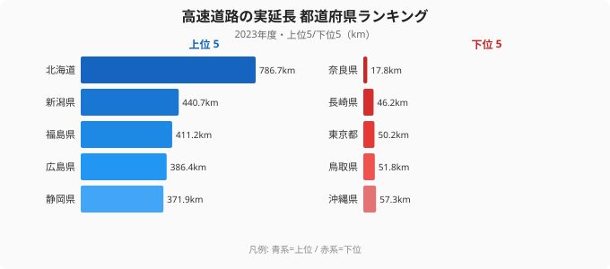

「日本初の高速道路はいつ・どこに開通したか」と聞かれて、すぐ答えられる人は多くないはずです。

正解は **1962年5月、名神高速道路の栗東〜尼崎間** のうち、**たった 3.3km** が部分開通したのが最初です。そこから 58 年、2020 年時点で日本の高速道路は **累計 14,805 km / 1,420 区間** にまで広がりました。わずか 3km が約 4,500 倍に伸びた計算になります。

本記事では、国土交通省「国土数値情報 N06（高速道路時系列データ）」を地図アニメーションで可視化し、戦後日本のインフラ拡張の軌跡を 30 秒の動画にまとめました。先に結論を言うと、この 58 年の伸び方は「ランダムに各地へ広がった」わけではありません。**太平洋ベルト → 山岳・日本海側 → 環状連絡** という明確な順序があり、その順序こそが戦後日本の経済地理を映しています。

## 1962→2020 を 30 秒で可視化

<video controls preload="metadata" poster="" width="100%" style="border-radius: 12px; max-width: 540px;">
  <source src="https://storage.stats47.jp/blog/highway-japan-58years/video.mp4" type="video/mp4" />
  お使いのブラウザは動画再生に対応していません。
</video>

毎年の新規開通区間（黄色の線）が日本列島に伸びていく様子と、累計区間数・累計距離が右下にカウントアップで表示されます。動画を眺めていると、最初の 10 年は関西から名古屋・東京へと太平洋側に集中し、その後ようやく内陸や日本海側、最後に首都圏の環状路へと「面」が広がっていく流れが見て取れます。線が増えるテンポも一定ではなく、高度経済成長期にいっきに伸び、近年は環状連絡道の細かな区間がつながっていきます。

> [!NOTE]
> 距離は各区間のジオメトリ長から geo-length で算出しています。N06 の N06_002（供用開始年度）を年次フィルタとして使用し、複数年にまたがる区間は最初に供用された年度に計上しています。

## マイルストーン：なぜこの順序だったのか

高速道路の伸び方を理解する鍵は「どの都市間が先につながったか」です。ここでは累計距離の節目になった主要な開通を時系列で並べ、その背後にある経済・地形の事情を読み解いていきます。

### 1965 名神高速 全通（290 km）

日本初の都市間高速です。**京阪神 → 名古屋** を結び、大阪万博（1970）の輸送インフラとして決定的な役割を果たしました。1963 年の栗東〜尼崎を皮切りに、わずか数年で大津〜西宮の区間がつながっていきます。最初の高速が東京周辺ではなく関西で開通したのは、関西経済圏の輸送需要が先行していたことと、ルート沿いが田園地帯中心で用地買収が比較的容易だったことが背景にあります。

### 1969 東名高速 全通（累計 816 km）

**東京 → 名古屋** が高速で結ばれた瞬間です。1962〜1969 の 7 年で、日本の太平洋ベルト地帯は事実上「高速で 1 日圏」になりました。名神が先・東名が後という順序は、静岡県の山地や都市部を通る東名のほうが用地取得と工事が難しかったこと、そして経済の中心がまず関西から立ち上がっていたことの裏返しでもあります。

> [!TIP]
> 「最初の高速はどこか」を考えるとき、人口や首都の位置だけでなく「用地買収のしやすさ」と「当時の輸送需要の重心」を合わせて見ると順序が腑に落ちます。名神先・東名後は偶然ではなく、地形と経済地理の合理的な帰結でした。

### 1982 中央自動車道 全通（累計 3,500 km）

東京 → 名古屋を結ぶ **山岳ルート** です。富士・八ヶ岳・中央アルプスを抜ける難工事で、東名から 13 年遅れての全通となりました。太平洋側の平地ルートが先に完成し、内陸の山岳ルートが後回しになったのは、トンネルや橋梁の工事難度がそのまま開通時期の差に現れたためです。

### 1985 関越自動車道 全通（累計 4,672 km）

**東京 → 新潟** が直結しました。これにより日本海側へのアクセスが大幅に改善し、スキー・温泉観光が大衆化していきます。太平洋ベルトの整備が一段落したあと、ようやく本州を縦断して日本海側へ抜ける軸が引かれたことが、累計距離の伸びからも読み取れます。

### 1995 阪神高速 大震災で被災

兵庫県南部地震で阪神高速 3 号神戸線の橋脚が倒壊しました。高速道路の耐震設計を根本から見直す転機となり、以降の新規区間は耐震基準を引き上げて建設されていきます。距離の伸びだけを見ていると気づきませんが、この年を境に「いかに速く伸ばすか」から「いかに安全に保つか」へと、高速道路に求められる質が変わりました。

### 2005 圏央道 部分開通（累計 10,882 km）

**首都圏中央連絡自動車道** の部分開通です。東京の通過交通を都心から外へ逃がす環状ネットワークの始まりで、2020 年時点で約 9 割が開通済みとなりました。都市間を結ぶ「軸」の時代から、都市圏の交通をさばく「環」の時代へ移ったことを象徴する区間です。

> [!WARNING]
> N06 データの区間定義は「IC 間」ベースです。短い IC 区間が多い首都圏は区間数が多くても距離は短く出ます。逆に北海道のように区間が長い地域は、区間数が少なくても距離は大きくなります。区間数と距離は別の軸として読む必要があります。

## いまの高速道路は都道府県でどれだけ違うか

58 年かけて伸びた高速道路網は、2023 年時点で都道府県ごとに大きな差があります。下のチャートは、各都道府県内を走る高速道路の実延長（km）の上位 5 と下位 5 です。

上位は **北海道（786.7km）・新潟・福島・広島・静岡** が並びます。北海道が突出して長いのは、単純に面積が広く都市間距離が長いためで、1 本の高速で結ぶべき距離そのものが本州とは桁違いだからです。新潟・福島・静岡といった「縦に長い」「複数の幹線が通過する」県が続くのも、面積と通過交通の多さが効いています。動画で見た「太平洋ベルト → 縦断軸」の整備順が、そのまま延長の長い県の顔ぶれに重なっている点が読みどころです。

一方、下位は **沖縄・鳥取・東京・長崎・奈良（17.8km）** です。最上位の北海道と最下位の奈良では実延長が約 44 倍も開きます。ここで注目したいのは、人口が多く経済規模も大きい **東京が下位に入る** ことです。これは「高速道路が足りない」のではなく、面積が狭く、都市内交通の多くを一般道や首都高（都市高速）が担っているためで、実延長の長短がそのまま利便性の高低を意味しないことを示しています。奈良や沖縄が短いのも、面積の狭さや島嶼という地理条件が背景にあります。

<source-link href="/ranking/road-expressway-length">高速道路の実延長ランキングをもっと見る</source-link>

> [!TIP]
> 「実延長が短い＝不便」と早合点しないことが大切です。東京のように面積あたりの交通量が極端に多い地域は、高速の総延長は短くても都市高速や鉄道が交通を分担しています。延長ランキングは「面積」「通過交通」「都市構造」と合わせて読むと、順位の意味が立体的に見えてきます。

道路インフラ全体の広がりや、別の切り口での都道府県差は、以下のランキングからも確認できます。

- [道路の総実延長ランキング](/ranking/road-total-length)
- [高速道路を含む道路実延長ランキング](/ranking/road-total-length-with-expressway)
- [道の駅の数ランキング](/ranking/roadside-station-count)

## データ出典

- **国土交通省 国土数値情報 N06（高速道路時系列データ）** — [配布ページ](https://nlftp.mlit.go.jp/ksj/gml/datalist/KsjTmplt-N06-v1_1.html)
- バージョン: N06-20（2020 年度更新版）
- 含まれる属性: 路線名 / 整備計画年 / 供用開始年度 / 供用終了年度 / IC 数 / 車線数 等
- 都道府県別の高速道路実延長は **社会・人口統計体系（e-Stat 経由）** の 2023 年度値を使用

## まとめ

- 1962 年の **3.3km** から、58 年で **14,805 km** へ広がりました
- マイルストーンは 1965 名神全通 → 1969 東名全通 → 1985 関越全通 → 2005 圏央道です
- 日本の高速網は **「太平洋ベルト → 山岳・日本海側 → 環状連絡」** の順で構築されました
- 2023 年の都道府県別実延長は北海道が最長（786.7km）で、最短の奈良（17.8km）との差は約 44 倍です
- 実延長の長短は面積・通過交通・都市構造で決まり、利便性の高低とは別物です

戦後日本のインフラ史を 30 秒で振り返ると、経済成長・自然災害・都市集中といった時代背景が地図上の線の伸び方に色濃く現れています。動画を保存して、自分の住む街にいつ高速が来たか、家族や友人と確認してみてください。
