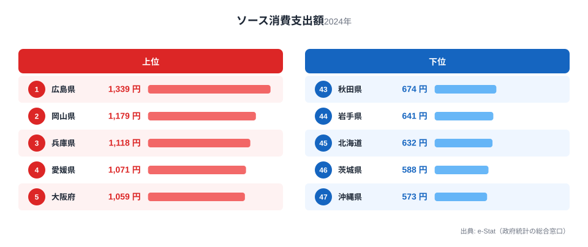
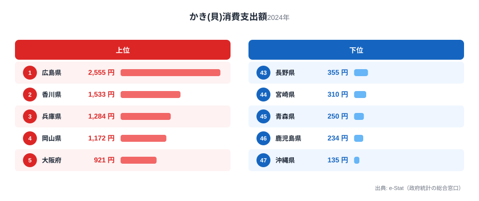
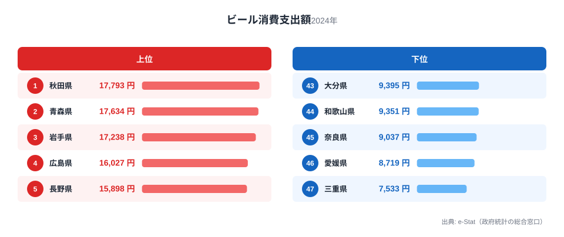
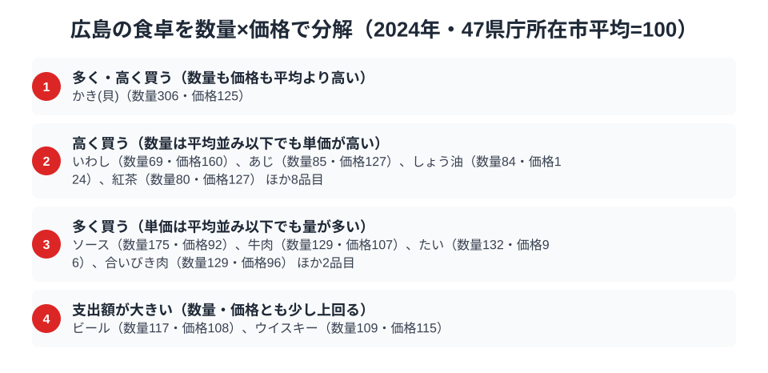

広島県の食卓には、他の都道府県には見られない偏りがあります。総務省「家計調査（品目別）」の2024年データを見ると、広島はソース消費支出額とかき消費支出額の2品目で全国1位を独占しています。全国どこを探しても、この2つを同時に1位で持つ県は他にありません。

さらにビールの消費支出額でも全国4位と高水準にあり、飲食の支出パターン全体に「濃い味付けと海の幸を、よく飲んで食べる」という一貫した傾向が浮かび上がります。この記事では、なぜ広島の食卓がこの形になったのかを、産業構造と食文化の両面から読み解きます。

> [!NOTE]
> 本記事の数値は総務省統計局「家計調査（品目別）」2024年、都道府県庁所在市（広島市）の二人以上世帯における年間支出額です。世帯単位の平均値であり、県全体の消費量そのものではありません。

## ソース消費支出額 — 全国1位1,339円、お好み焼きが根づかせた調味料

<source-link href="/ranking/sauce-consumption-expenditure">ソース消費支出額ランキングをもっと見る</source-link>

広島県のソース消費支出額は1,339円で全国1位です。2位は岡山県で1,179円、3位は兵庫県で1,118円と続き、上位は瀬戸内海沿岸の県が並びます。最下位は沖縄県で573円にとどまり、広島の半分以下です。

広島がソースで突出する理由は明快です。お好み焼きという「ソースをかけて食べる」料理が県民食として定着しており、外食だけでなく家庭でお好み焼きを焼く習慣が根強く残っています。ウスターソースを主体に、とんかつソースや専用のお好み焼きソースまで複数の種類を使い分ける家庭も多く、調味料としての使用頻度そのものが他県と一段違います。上位の岡山県・兵庫県も同じ瀬戸内圏で、粉もの文化とソースの結びつきが地域的に共有されていることがうかがえます。

## かき消費支出額 — 全国1位2,555円、養殖日本一の産地が生む食卓の距離感

<source-link href="/ranking/oyster-consumption-expenditure">かき消費支出額ランキングをもっと見る</source-link>

かき消費支出額でも広島は2,555円で全国1位です。2位は香川県で1,533円と大差をつけ、3位の兵庫県は1,284円で、瀬戸内の3県が上位を占めます。最下位は沖縄県で135円にとどまり、広島の18.9倍という開きがあります。

広島湾は日本有数の牡蠣養殖地であり、生産量で全国シェアの大部分を占める産地です。産地が家庭のすぐそばにあることで、旬の時期には鮮度の高い牡蠣を買う機会そのものが多く、購入頻度と量が他県より底上げされます。ただし単価は平均並みではなく、むしろ全国平均を上回る水準です。殻付きや地物といった鮮度・品質を重視した高付加価値の形態で購入される割合が高いことがうかがえ、スーパーの鮮魚売り場に牡蠣が定番商品として並ぶ地域も限られています。これは「近くで獲れるものを、多く、かつ相応の価格でよく食べる」という産地立地の効果がそのまま支出額に表れた典型例です。

## ビール消費支出額 — 全国4位16,027円、外食文化と合わさる飲酒習慣

<source-link href="/ranking/beer-consumption-expenditure">ビール消費支出額ランキングをもっと見る</source-link>

ビール消費支出額は16,027円で全国4位です。首位は秋田県で17,793円、僅差で青森県が17,634円、岩手県が17,238円と東北勢が上位を固める中、広島は西日本の県として唯一トップ5に入っています。最下位は三重県で7,533円にとどまり、広島の半分にも届きません。

東北の上位県は寒冷地の家飲み文化が支出を押し上げていると考えられますが、広島の場合は事情が異なります。お好み焼き店や海鮮居酒屋など、ソースの効いた料理や牡蠣料理を提供する外食店が多く、そうした店でビールを合わせて飲む機会が日常的に組み込まれていると見られます。つまり広島のビール消費は、単独の飲酒習慣というより、ソースと牡蠣という2つの食文化が生み出す「外食との相性」の副産物という側面が強いと考えられます。

> [!WARNING]
> 家計調査の支出額は「購入金額」であり、消費量そのものではありません。牡蠣は個別の外食店での消費（お好み焼き店や牡蠣小屋での食事）が集計に含まれないため、実際の牡蠣消費の広島県内シェアは、この家庭内購入額が示す以上に大きい可能性があります。

## 広島の食卓を貫くもの

3つの品目に共通するのは、「産地」と「郷土料理」という2つの軸がそのまま家計支出に直結している点です。かきは広島湾という産地が支出量を底上げし、ソースはお好み焼きという郷土料理が消費頻度を引き上げ、ビールはその両方を外食で楽しむ生活習慣の副産物として高水準を維持しています。[青森の食卓](/blog/aomori-food-culture)がカップ麺・ほたて貝・りんごという毛色の異なる複数品目でそれぞれ独立に全国トップ級を記録する「多面型」であるのに対し、広島はソースとかきという2品目が郷土料理と外食習慣を介して互いに結びつく「連動型」の食文化を持つ点が特徴的です。

> [!TIP]
> ソース1位とかき1位が同一県に重なるのは全国で広島だけです。単品目のランキングだけを見ると偶然に見えますが、「粉もの文化」と「海の幸の産地」という異なる2つの要因が同じ地域に集中したことで、この組み合わせが生まれています。他の都道府県で同様の「複数1位の重なり」を探すと、その地域の食文化の核が見えてきます。

## 数量×価格で分解する広島市の食卓

<source-link href="/ranking/sauce-consumption-quantity">ソース消費量ランキングをもっと見る</source-link>

ここまで見てきた支出額は、実は「数量×単価」に分解できます。総務省「家計調査」は品目ごとの購入数量（ソース消費量など）と支出額を別々に集計しており、47都道府県庁所在市の平均を100とした指数で比べると、広島がどちらの要因で上位に立っているかが見えてきます。ソース消費支出額の場合、広島市のソース消費量にあたる数量指数は175と全国トップですが、価格指数は92で全国平均をやや下回ります。つまり広島の突出は「高いソースを買っている」からではなく、「安価なソースを日常的に大量消費している」頻度の高さそのものが支出額を押し上げているのです。お好み焼き店だけでなく家庭内でも消費される裾野の広さが、この数量の高さに表れています。

一方、かき消費支出額は数量指数306・価格指数125と、数量・価格の両方が全国平均を上回る珍しいパターンです。数量が突出するのは広島湾が国内有数の養殖地で購入機会そのものが多いためですが、価格指数も平均を超えているのは、鮮度の高い地物や殻付きなど高付加価値の形態で購入される割合が高いことを示唆します。単に「安くたくさん」ではなく「多く、かつ相応の単価で」買っているのが広島のかき消費の特徴です。

ビール消費支出額は数量指数117・価格指数108で、どちらも平均をわずかに上回る「支出額大」の型に分類されます。ソースやかきのように片方の指数が突出するのではなく、量も単価も少しずつ高いことが積み重なって支出額を押し上げている構図です。逆に、いわしのように数量指数69と平均以下でも価格指数160と際立って高い品目もあり、広島市の食卓は「よく買うもの」と「たまに高く買うもの」が混在する複合的な消費パターンを持っています。

> [!TIP]
> 数量×価格の分解は「支出額が高い理由」を切り分ける手がかりになります。ソースのように数量で稼ぐ品目は買い物の頻度・習慣が根づいている証拠、かきのように数量・価格の両方が高い品目は産地立地に加えて品質面での需要も伴っている証拠と読めます。

> [!NOTE]
> 指数の基準は47都道府県庁所在市の単純平均を100とした値で、家計調査の全国平均そのものではありません。価格指数は同一品目内の品種・ブランド差を平均化した値なので、実際の店頭価格差とは一致しない場合があります。数値はいずれも2024年、二人以上世帯の年間データです。

## まとめ

- ソース消費支出額は広島県が1,339円で全国1位（2位岡山県1,179円、3位兵庫県1,118円）
- かき消費支出額も広島県が2,555円で全国1位（2位香川県1,533円、最下位沖縄県135円で18.9倍差）
- ビール消費支出額は16,027円で全国4位（1位秋田県17,793円、2位青森県17,634円）
- お好み焼き文化と牡蠣養殖という2つの地場要因が、広島の食卓の支出パターンを形づくっている

[広島県の地域プロフィール](/areas/34000)や[経済カテゴリ一覧](/category/economy)では、広島の他の家計データも確認できます。

## データ出典

総務省統計局「家計調査（品目別）」2024年、都道府県庁所在市（広島市）二人以上世帯のデータをe-Stat経由で整備しました。
