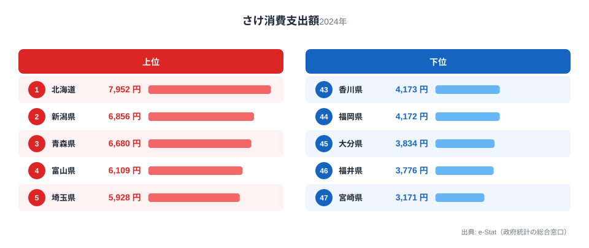
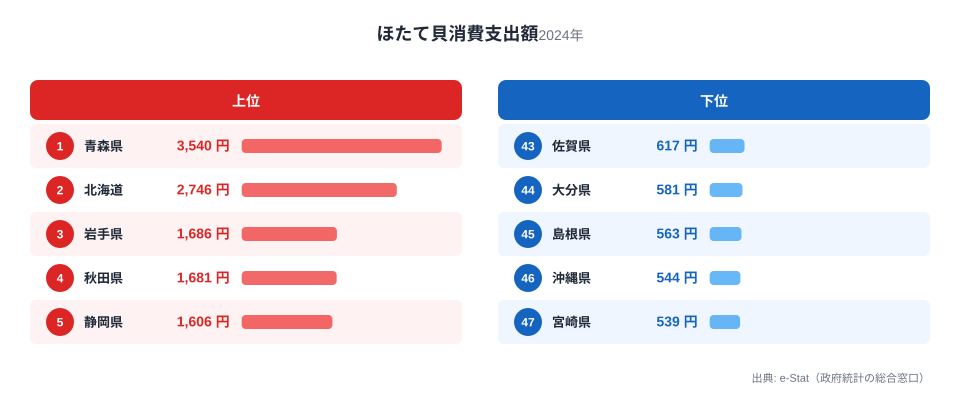
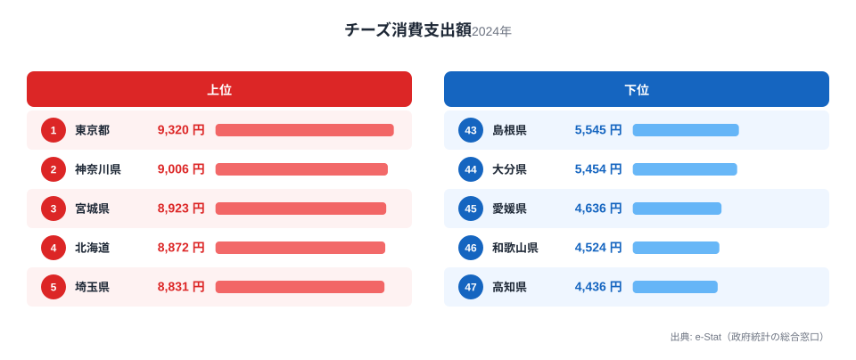

北海道の食卓と聞いて思い浮かぶのは、鮭やほたてといった海の幸、そして牛乳やチーズといった酪農の恵みではないでしょうか。総務省の家計調査（品目別）で札幌市の二人以上世帯を見ると、そのイメージは数字にもはっきり表れています。鮭の消費支出額は7,952円で全国1位。ところがほたて貝になると、北海道は惜しくも2位。首位はお隣、青森県（全国1位・3,540円）でした。

海に囲まれ、広大な大地で酪農が営まれる北海道。この記事では、鮭・ほたて・チーズという3つの品目を横断しながら、「海の幸トップの道民が、なぜほたてでは1位を逃すのか」という意外な点も含めて、北海道民のリアルな食卓を読み解きます。

> [!NOTE]
> 家計調査の都道府県データは、県庁所在市（北海道は札幌市）の二人以上世帯を対象にした年間支出額です。道全体ではなく札幌市在住世帯の家計簿から見た傾向であり、支出「金額」であって消費「量」そのものではない点にご注意ください。

## 鮭 — 全国1位7,952円、道民のソウルフード

<source-link href="/ranking/salmon-consumption-expenditure">鮭消費支出額ランキングをもっと見る</source-link>

北海道の鮭消費支出額は7,952円で全国1位です。2位の新潟県6,856円を引き離し、最下位の宮崎県3,171円と比べると2.5倍の開きがあります。鮭は北海道近海で豊富に獲れる魚であり、道民にとってはまさにソウルフードと呼べる存在です。

塩鮭を焼いて食べるのはもちろん、「石狩鍋」に代表される鍋料理、鮭とキャベツを鉄板で焼く「ちゃんちゃん焼き」、新巻鮭や筋子・いくらといった加工品まで、鮭は北海道の食文化のあらゆる場面に登場します。地元で大量に水揚げされる魚が家庭の食卓の中心を占めるという「産地=消費地」型の典型で、新潟県が2位に入るのも同じく鮭（新潟の「塩引き鮭」）の食文化が根づいているためと考えられます。

## ほたて貝 — 首位に一歩届かず、全国2位2,746円

<source-link href="/ranking/scallop-consumption-expenditure">ほたて貝消費支出額ランキングをもっと見る</source-link>

ほたて貝の消費支出額を見ると、北海道は2,746円で全国2位でした。首位は青森県（全国1位・3,540円）で、北海道はわずかに及ばなかったのです。北海道はオホーツク海や噴火湾でほたて養殖・地まき漁業が盛んな、日本を代表するほたて産地です。それでも消費額で首位に届かず2位になるのは興味深い点です。

理由の一つは、北海道のほたてが地元消費以上に「移出・輸出向け」の性格が強いことにあります。オホーツク産のほたては全国のブランド市場や海外へ大量に出荷されるため、地元の家計調査ベースの支出額としては、陸奥湾のほたてを日常的に食べる青森ほど突出しない可能性があります。産地であることと家計の支出額が必ずしも一致しない構図は、[青森県の食卓](/blog/aomori-food-culture)（ほたて1位）と読み比べるとより鮮明になります。

## チーズ — 酪農王国らしく全国4位8,872円

<source-link href="/ranking/cheese-consumption-expenditure">チーズ消費支出額ランキングをもっと見る</source-link>

海の幸だけでなく、大地の恵みも北海道の食卓を特徴づけます。チーズの消費支出額は8,872円で全国4位。1位は東京都（9,320円）、2位神奈川県、3位宮城県と続き、上位は首都圏・都市部が占めますが、そのなかで生乳生産量日本一の北海道が4位に食い込んでいるのは、酪農王国ならではです。

チーズ支出の上位が都市部中心なのは洋食文化・購買力の影響が大きいためですが（[チーズ消費支出の記事](/blog/cheese-expenditure-ranking)で詳述）、北海道は「産地であること」を武器に都市圏に伍して上位に入っています。地元産の多彩なナチュラルチーズが手に入る環境が、家庭でのチーズ消費を後押ししていると考えられます。

> [!WARNING]
> 家計調査は支出金額の調査であり、消費量そのものではありません。特に北海道のように産地からの移出・輸出が多い品目（ほたて等）では、地元で消費される量が多くても、家計の購入支出額としては産地の実力ほど高く出ないことがあります。「支出額の順位＝食べている量の順位」と単純には読めない点にご注意ください。

## 北海道の食卓を貫くもの

北海道民の食卓を貫くのは、「海の幸と大地の恵みの同居」です。鮭という道民のソウルフードには全国一の支出を注ぎ、ほたては産地でありながら移出向けの性格ゆえ2位にとどまり、チーズは酪農王国の底力で都市圏に伍して上位に入る。3つの品目それぞれが、北海道の広大な海と大地、そして「作って全国に送り出す」産業構造を映し出しています。

高知の「黒潮のかつお特化」、沖縄の「琉球の出汁文化」と並べると、北海道は「海と大地、両方の一次産業に支えられた豊穣型」の食卓と言えます。同じ「食にお金を使う地域」でも、その中身は地理と産業によってまったく異なることが、地域比較から見えてきます。

> [!TIP]
> 産地の食卓を家計調査で読むときは、「地元消費が多い品目」と「移出・輸出が多い品目」を見分けると発見があります。北海道の鮭（地元消費が厚く1位）とほたて（移出が多く2位）の違いのように、同じ産地の食材でも、家計の支出額に表れ方が変わります。

## まとめ

- 鮭消費支出額は北海道が全国1位（7,952円）、道民のソウルフード
- ほたて貝は全国2位（2,746円）、首位の青森県（全国1位・3,540円）に移出の多い北海道は惜しくも届かず
- チーズは全国4位（8,872円）、生乳生産量日本一の酪農王国らしい上位入り
- 「海の幸と大地の恵みの同居」「作って全国に送り出す」産業構造が北海道の食卓を特徴づける

北海道の他の統計は[北海道の地域プロフィール](/areas/01000)、食品・家計消費の地域差は[経済カテゴリ一覧](/category/economy)からご覧いただけます。

## データ出典

総務省統計局「家計調査（品目別）」（2024年、都道府県庁所在市 二人以上世帯）をもとに、e-Stat（政府統計の総合窓口）経由で整備したデータを使用しています。
