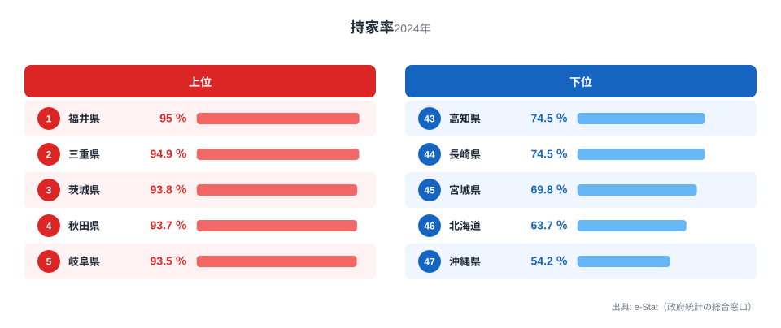

「一戸建てを持つのが当たり前」という感覚は、実は住む県によって大きく違います。家計調査（二人以上世帯）の2024年データによると、持家率が最も高いのは福井県の95.0%。調査対象世帯のほとんどが持家に住んでいる計算です。一方、最も低いのは沖縄県の54.2%で、福井県との差は1.8倍にのぼります。

この記事では、なぜ北陸勢が軒並み上位に並び、沖縄・北海道・宮城が下位に沈むのかを、地価・世帯構成・都市化の3つの視点から読み解きます。結論を先に言うと、持家率の地域差は「土地の値段」と「家族の暮らし方」の二重構造で決まっています。地価が安く親世代の土地を継ぎやすい地方ほど持家率が高く、地価が高騰し単身・転勤者が多い大都市圏や、特殊な土地事情を抱える沖縄では持家率が低くなる傾向がはっきり出ています。

> [!NOTE]
> この持家率は「家計調査の調査世帯（都道府県庁所在市の二人以上世帯）」を対象にした割合です。総務省が5年ごとに行う「住宅・土地統計調査」（全世帯対象）とは調査方法が異なり、水準が一致しない場合があります。単身世帯や町村部の世帯は含まれていない点に注意してください。

## 持家率が高い県・低い県

2024年の持家率上位は、福井県95.0%、三重県94.9%、茨城県93.8%、秋田県93.7%、岐阜県93.5%と続きます。上位10県のうち神奈川県を除く9県が地方県で、東北・北陸・東海に集中しているのが特徴です。福井県は2021年以降3年連続で1位を維持しており、単なる一時的な数値ではなく構造的に持家率が高い地域だとわかります。

<source-link href="/ranking/home-ownership-rate-kakei">持家率ランキングの全47都道府県データを見る</source-link>

北陸（福井・富山・石川）や東北の県で持家率が高いのは、地価の安さと、親から受け継いだ土地に家を建てる文化が根強く残っているためと考えられます。地方では核家族化が進んだ現在でも、実家の敷地内や近隣に新居を構えるケースが多く、土地取得コストを抑えられることが持家取得のハードルを下げています。また、公共交通機関が限られる地域では車での移動が前提となるため、郊外に広い戸建てを構えやすいという住環境の違いも影響しています。[福井県](/areas/18000)の地域データを見ると、持家率の高さと合わせて他の住宅関連指標にも地方らしい傾向が表れています。

## 持家率が低い県のグループ

下位を見ると、宮城県69.8%、北海道63.7%、そして沖縄県54.2%が突出して低くなっています。沖縄県は2007年から2024年までの18年間、一貫して47位（最下位）です。一度も順位が変わっていない点は、この地域の持家率の低さが年ごとの変動ではなく、構造的な要因によるものであることを示しています。

沖縄県の持家率が低い背景には複数の要因が重なっています。第一に、県土面積の約8%を米軍施設が占め、民間が利用できる土地が限られているため地価・地代が割高になりやすいこと。第二に、那覇市を中心とした都市部への人口集中が進み、単身世帯や賃貸アパート住まいの若年層が多いこと。第三に、沖縄県は出生率が高く若年人口の比率が全国トップクラスで、持家取得世代（40〜60代）の構成比が相対的に低いことが挙げられます。

[北海道](/areas/01000)と宮城県が下位に入るのは、札幌市・仙台市という政令指定都市への人口集中が大きな要因です。地方圏でありながら県庁所在地が突出して大きい「一極集中型」の県は、賃貸マンション需要が高く、持家率が伸びにくい傾向があります。[沖縄県](/areas/47000)を含め、下位グループの地域データも合わせて確認すると、都市構造の違いがより見えてきます。

> [!WARNING]
> 家計調査は都道府県庁所在市（政令指定都市を含む）の世帯が対象で、県内全域を代表しているわけではありません。特に北海道・宮城県のように県庁所在都市の人口比率が高い県では、都市部の賃貸居住者の割合が県全体の数値に強く反映されやすい点に注意してください。

## 東京・大阪の持家率は「意外と低くない」

大都市というと持家率が低いイメージがありますが、実際の順位を見ると必ずしもそうとは言えません。2024年の東京都は83.8%で29位、大阪府は79.4%で36位と、下位グループとは一線を画しています。東京都は2007年の73.4%（27位）から2024年の83.8%（29位）まで、順位はほぼ横ばいながら数値自体は10ポイント近く上昇しました。

> [!TIP]
> 東京都・大阪府の持家率が突出して低くならない理由の一つに、家計調査の対象が「都道府県庁所在市の二人以上世帯」に限定されている点が挙げられます。単身世帯やワンルームマンション居住者が多い都心部の実態は、この統計にはあまり反映されません。持家率の絶対水準よりも、年ごとの推移や順位変動を見る方が地域の住宅事情の変化をつかみやすくなります。

家賃相場の高さも持家取得の判断に影響します。都市部では民営賃貸住宅の家賃が高い分、早期に住宅ローンを組んで持家に切り替える世帯も一定数存在し、これが極端な持家率の低下を防いでいると考えられます。

<source-link href="/ranking/private-rental-housing-rent-per-3-3m2">3.3㎡あたり家賃ランキングを見る</source-link>

近年の新設住宅着工にも同じような地域差が表れています。持家として新たに建てられる住宅の動向を見ると、この記事で見た持家率の高い県と重なる部分が多く、地方における「持家志向」の強さを裏づけています。

<source-link href="/ranking/new-owner-occupied-starts">新設持家着工戸数ランキングを見る</source-link>

## この記事でわかったこと

- 持家率1位は福井県95.0%、最下位は沖縄県54.2%で1.8倍の差
- 上位は東北・北陸・東海の地方県が中心。福井県は2021年以降3年連続で1位
- 沖縄県は2007年から2024年まで18年連続で最下位。米軍施設による土地制約・都市集中・若年人口比率の高さが背景
- 北海道・宮城県は札幌市・仙台市への一極集中が持家率を押し下げている
- 東京都・大阪府は大都市ながら極端な低水準ではなく、それぞれ29位・36位

## データ出典

総務省統計局「家計調査」（2007年〜2024年、都道府県庁所在市の二人以上世帯）を基に、e-Stat（政府統計の総合窓口）経由で集計しています。
