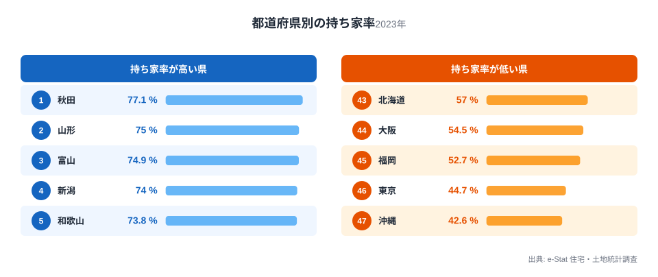
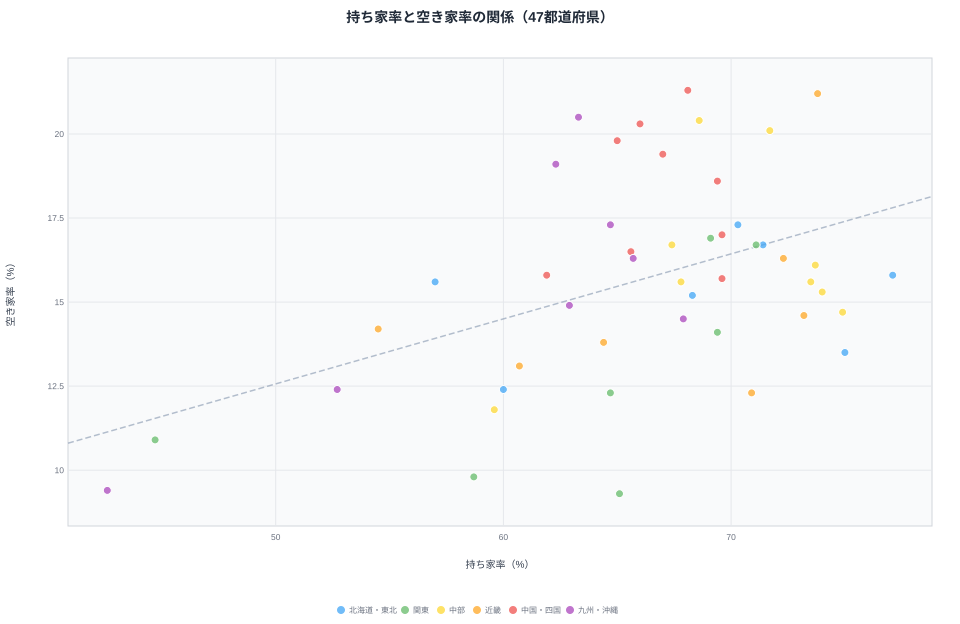
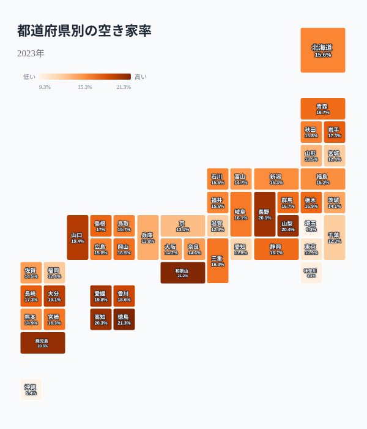
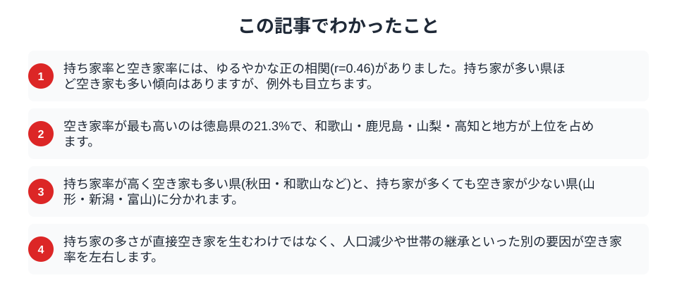

「持ち家が多い地域は、家が余って空き家も増えるのではないか」。そんな仮説を、データで確かめてみます。使うのは同じ2023年の住宅・土地統計調査から得た、都道府県ごとの持ち家率と空き家率です。同じ調査の数字なので、比較の土台はそろっています。結論を先に言えば、両者にはゆるやかな正の相関があるものの、それだけでは説明しきれない例外が数多く見られました。持ち家の多さと空き家の多さは、重なるようで完全には一致しないのです。

## 二つの指標をそろえる

まず、それぞれの指標を確認します。持ち家率は、住宅に住む世帯のうち持ち家に住む世帯の割合です。都道府県別に見ると、東北や北陸で高く、都市部で低くなります。

<data-source label="e-Stat 住宅・土地統計調査" note="持ち家率（2023年）"></data-source>

持ち家率が最も高いのは秋田県で77.1%、続いて山形県、富山県、新潟県、和歌山県と続きます。反対に低いのは沖縄県の42.6%、東京都44.7%、福岡県52.7%です。賃貸住宅が多い都市部と、持ち家が中心の地方という、はっきりした対比が見えます。この持ち家率の高い県で、空き家も同じように多いのかどうかが、この記事の問いです。

<source-link href="/ranking/owner-occupied-housing-ratio">都道府県別の持ち家率ランキングを見る</source-link>

## 散布図で見ると、ゆるやかに右上がり

持ち家率を横軸、空き家率を縦軸にとって、47都道府県を1点ずつ置いてみます。

<data-source label="e-Stat 住宅・土地統計調査" note="持ち家率・空き家率（2023年）"></data-source>

点の並びは、ゆるやかに右上がりです。相関係数は0.46で、持ち家率が高い県ほど空き家率も高い傾向が確かにあります。ただし、点は一本の線の上にきれいに乗っているわけではなく、上下に大きくばらついています。相関があると言っても、持ち家率だけで空き家率が決まるわけではないことが、この散らばりから読み取れます。持ち家率が同じくらいの県でも、空き家率は数ポイント違うことが珍しくありません。

## 県は4つのタイプに分かれる

散布図を平均値で4つに区切ると、県はきれいに性格分けできます。

第1のタイプは、持ち家率も空き家率も高い県です。青森・秋田・和歌山・徳島などがここに入ります。持ち家中心の地域で人口が減り、住み手を失った家がそのまま残っています。第2は、持ち家率は高いのに空き家率が低い県です。山形・新潟・富山・福井などで、持ち家が多くても世帯がしっかり住み継いでいるため、空き家になりにくいのが特徴です。第3は、持ち家率が低く空き家率が高い県で、高知・鹿児島・大分などが該当します。賃貸中心ながら、別荘や過疎地の空き家が率を押し上げています。第4は、持ち家率も空き家率も低い都市型の県で、東京・大阪・愛知・沖縄が並びます。同じ「持ち家が多い」でも、空き家になるかどうかは県によって道が分かれるのです。

## 空き家率が高いのは地方の県

空き家率そのものを地図で見ると、その偏りがよくわかります。

<data-source label="e-Stat 住宅・土地統計調査" note="空き家率（2023年）"></data-source>

空き家率が最も高いのは徳島県の21.3%で、和歌山県21.2%、鹿児島県20.5%、山梨県20.4%、高知県20.3%と続きます。5軒に1軒が空き家という県が、四国や紀伊半島、九州南部に固まっています。反対に空き家率が低いのは埼玉県9.3%、沖縄県9.4%、神奈川県9.8%と、人口が流入し続ける都市圏です。[なぜ徳島は空き家が5軒に1軒なのか](/blog/vacant-house-crisis)という問いは、この地図の頂点にある県を掘り下げたものです。

<source-link href="/ranking/vacant-housing-ratio">都道府県別の空き家率ランキングを見る</source-link>

## なぜ完全には一致しないのか

持ち家率と空き家率がゆるやかにしか結びつかないのは、両者の間に別の要因が挟まっているからです。

> [!NOTE]
> 空き家が生まれる直接の引き金は、持ち家の多さそのものではなく、人口や世帯の減少です。持ち家が多い地域でも、子や孫が住み継げば空き家にはなりません。逆に、相続した家に誰も住まなくなれば、持ち家はそのまま空き家に変わります。持ち家率は「空き家になりうる家の母数」を示すにすぎず、実際に空き家になるかどうかは別の条件が決めます。

だからこそ、持ち家率が同じ県でも、人口が減り続ける県では空き家率が高く、世帯が維持されている県では低く抑えられます。[空き家率と高齢化はなぜ相関する](/blog/vacant-housing-vs-aging)のかを見ると、この「別の要因」の正体が高齢化と人口減少にあることがわかります。

## 数字を読むときの注意

相関があるからといって、因果を早合点しないことが大切です。

> [!WARNING]
> 相関係数0.46は「関係がある」ことを示しますが、「持ち家が多いから空き家が増える」という原因と結果を証明するものではありません。持ち家率も空き家率も、人口減少という共通の背景から同時に影響を受けている可能性が高く、見かけの相関である部分を含みます。

> [!TIP]
> 空き家率には、別荘やセカンドハウス、賃貸の募集中住宅なども含まれます。放置され管理が行き届かない「問題のある空き家」だけを指すわけではありません。地域の空き家対策を考えるときは、どの種類の空き家がどれだけあるのかまで踏み込んで見る必要があります。

持ち家率と空き家率は、ゆるやかにつながりながらも、それぞれ別の物語を持っています。二つを重ねて見ることで、住宅が余っていく地域の姿が立体的に浮かび上がります。

## まとめ

この記事でわかったことを整理します。

持ち家率と空き家率にはゆるやかな正の相関があるものの、県は4つのタイプに分かれ、持ち家の多さが直接空き家を生むわけではありませんでした。空き家を左右するのは人口減少と世帯の継承であり、持ち家率はその母数を示すにすぎません。地価との関係は[空き家が多い県ほど地価は下がるのか](/blog/vacant-housing-vs-land-price)、住宅全体の姿は[住まいと住宅のテーマページ](/themes/living-housing)からも確認できます。二つの指標を並べて見ることが、空き家問題の構造を理解する手がかりになります。

## データ出典

- e-Stat（政府統計の総合窓口）住宅・土地統計調査「都道府県別 持ち家率・空き家率」（2023年）
- 持ち家率・空き家率はいずれも2023年の同一調査の値を使用しています。
