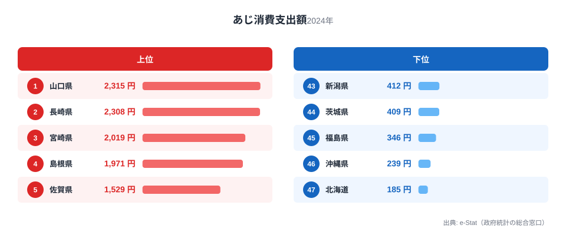
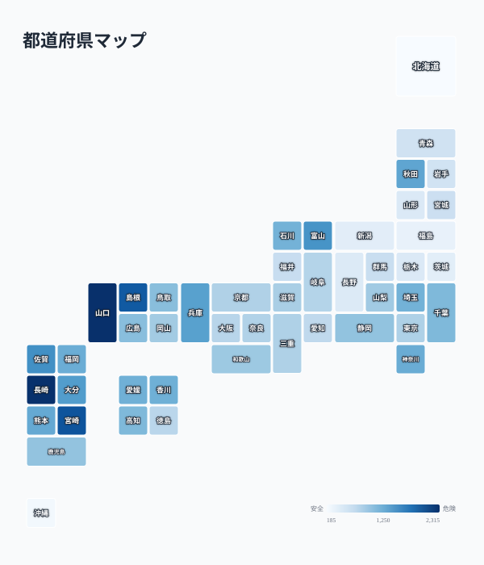

あじは焼いても揚げても刺身でもおいしい、日本の食卓で最もなじみ深い青魚のひとつです。総務省の家計調査（品目別）によると、都道府県庁所在市の二人以上世帯が2024年に支出したあじの年間消費支出額は、全国で最大12.5倍もの差がありました。

1位は山口県の2,315円。ところが2位の長崎県は2,308円と、わずか7円差というほぼ横並びの結果でした。一方、最下位の北海道はわずか185円で、山口県の8分の1にも届きません。

なぜこれほどの差が生まれるのでしょうか。この記事では、あじの消費額が高い県・低い県の顔ぶれと、その背景にある漁場・食文化の結びつきを見ていきます。

> [!NOTE]
> この指標は「都道府県庁所在市」の二人以上世帯における年間支出額（円）です。県全体の平均ではなく、県庁所在市在住世帯の家計調査サンプルに基づく点に注意してください。地方の漁港近郊では自家消費や直売分が支出額に反映されないケースもあります。

## 上位と下位

<source-link href="/ranking/horse-mackerel-consumption-expenditure">あじ消費支出額ランキングをもっと見る</source-link>

上位5県は次の通りです。1位山口県2,315円、2位長崎県2,308円、3位宮崎県2,019円、4位島根県1,971円、5位佐賀県1,529円。TOP10のうち5県が九州（長崎・宮崎・佐賀・大分・熊本）で占められており、あじが西日本、とりわけ九州で強く支持されていることがわかります。

山口県が1位に立った背景には、日本海側と瀬戸内海の両方に面する地理的条件があります。下関をはじめとする県内の漁港は、対馬暖流が運ぶ好漁場に恵まれ、あじの水揚げ量が全国でも上位に入ります。県内では「岩国あじ」のようにブランド化された銘柄もあり、刺身・たたき・南蛮漬けなど食べ方のレパートリーが豊富です。

長崎県も、五島列島や対馬周辺の好漁場を抱える漁業県です。長崎は漁港数・水揚げ量ともに全国有数で、あじの消費が生活に深く根づいています。トップの山口県とわずか7円差というのは偶然ではなく、どちらも「新鮮なあじが日常的に手に入る土地」という共通の条件が支出額を押し上げていると考えられます。

4位の島根県も山陰の好漁場を持つ県で、日本海側の漁業県が軒並み上位に入る構図が見えてきます。あじは回遊性が高く、対馬暖流に沿った西日本の沿岸で特に漁獲されやすい魚です。

## 最下位グループ

下位5県は、46位沖縄県239円、47位北海道185円のほか、45位福島県346円、44位茨城県409円、43位新潟県412円と続きます。東北・北関東の県が下位に集中しているのが特徴です。

北海道が最下位となった理由は明快です。北海道近海はあじの主要な漁場ではなく、むしろ鮭・ホタテ・タラといった寒流系の魚介が食文化の中心を占めます。あじは温暖な海域を好む魚のため、北海道の食卓に上る機会自体が少ないのです。

東北勢（福島・宮城・岩手・青森・山形）が軒並み下位に沈んでいるのも同じ理由です。三陸沖はサンマやサバの漁場としては知られますが、あじの水揚げは西日本ほど多くありません。地元で獲れる魚が日常の食卓を形づくるという傾向が、ここでも表れています。

沖縄県が46位と低い順位にとどまっているのは意外に思えるかもしれません。沖縄近海にもあじは生息しますが、県内の魚食文化はグルクン（タカサゴ）やマグロなど独自の魚種に重心があり、本土で一般的な「あじ」の消費額としては低く出る傾向があります。

> [!WARNING]
> 家計調査は品目別の支出額調査であり、漁獲量や消費量そのものではありません。物価水準や購入頻度の違いも金額に影響するため、「支出額が低い=消費していない」と単純に読み替えることはできません。

## 発見: 西高東低の構造とわずか7円差の1-2位

<source-link href="/ranking/horse-mackerel-consumption-expenditure">あじ消費支出額の全47都道府県を見る</source-link>

地図にすると、あじ消費支出額の「西高東低」が一目で分かります。色の濃い（支出額が高い）エリアが九州北部から山陰・山陽・北陸の日本海側〜瀬戸内海側に帯状に連なり、東北・北関東・北海道は一様に色が薄くなっています。TOP10の大半が九州・山陰・山陽・北陸で占められ、東北・北関東・北海道が軒並み下位に沈むのは偶然ではなく、対馬暖流という海流が運ぶ好漁場の分布と、そこに根づいた食文化がそのまま支出額に反映された結果だと考えられます。

この地域分布は、他の魚種と比べるといっそう際立ちます。同じ家計調査でも、まぐろは遠洋漁業基地を抱える静岡が突出し、かつおは太平洋側の高知が圧倒的で、あじの「日本海側〜瀬戸内海の西日本集中」とはまったく異なる地図を描きます。つまり魚種ごとに「どの海流・どの漁場に依存するか」が地域差を決めており、あじの場合は対馬暖流という特定の海流に結びついた分布になっているわけです。[まぐろ消費量](/blog/tuna-consumption-quantity)や[かつおと牡蠣の東西対比](/blog/bonito-vs-oyster-fish-map)、[いか消費量](/blog/squid-consumption-quantity)と読み比べると、日本の魚食文化が単一の「海の幸」ではなく、海流と漁場ごとに分かれたモザイクであることが見えてきます。

[仮説] トップ2県が7円差という僅差だった点は、両県がともに「対馬暖流沿いの好漁場を持つ漁業県」という共通条件を満たしているためと考えられます。検証には両県の漁港別水揚げ統計との突き合わせが必要です。

> [!TIP]
> 魚の消費地図を読むときは「その魚がどの海流で獲れるか」を重ねると理解が深まります。あじ・さば・ぶりは対馬暖流沿いの日本海側〜西日本、かつお・まぐろは太平洋側、ほたて・鮭は寒流系の北日本というように、魚種ごとに支持基盤となる漁場が分かれています。

あじの消費傾向をさらに深掘りしたい方は、[経済カテゴリの他ランキング](/category/economy)や[山口県の地域データ](/areas/35000)も参考にしてください。

## まとめ

- 1位は山口県2,315円、僅差2位は長崎県2,308円（7円差）
- 最下位は北海道185円、1位との差は12.5倍
- TOP10のうち5県が九州（長崎・宮崎・佐賀・大分・熊本）
- 下位は東北・北関東が中心（福島・宮城・岩手・青森・山形、茨城・栃木・群馬）
- 対馬暖流沿いの漁業県で支出額が高く、寒流系漁場を持つ地域で低い「西高東低」の構造

## データ出典

総務省統計局「家計調査（品目別）」（2024年、都道府県庁所在市 二人以上世帯）。e-Stat（政府統計の総合窓口）経由で整備したデータを使用しています。
