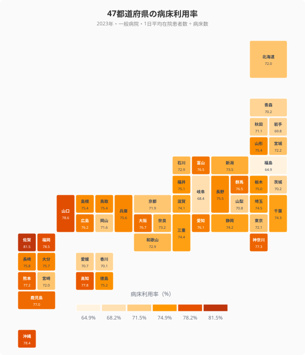
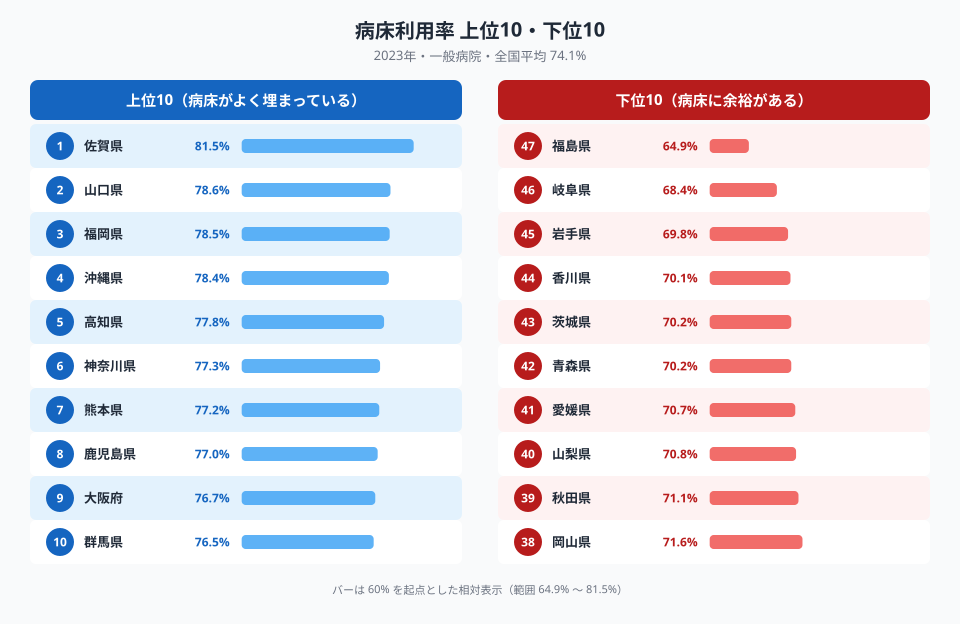
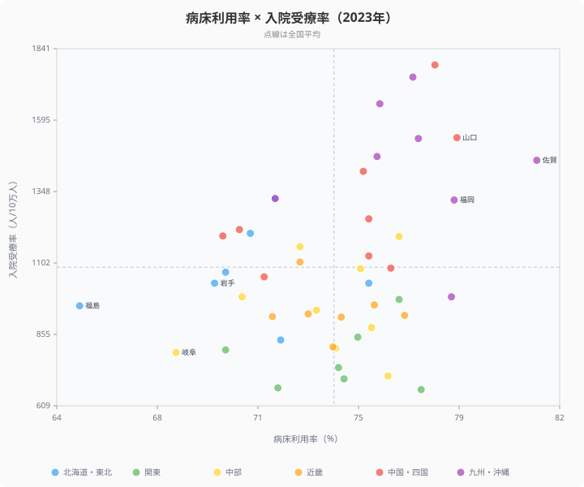
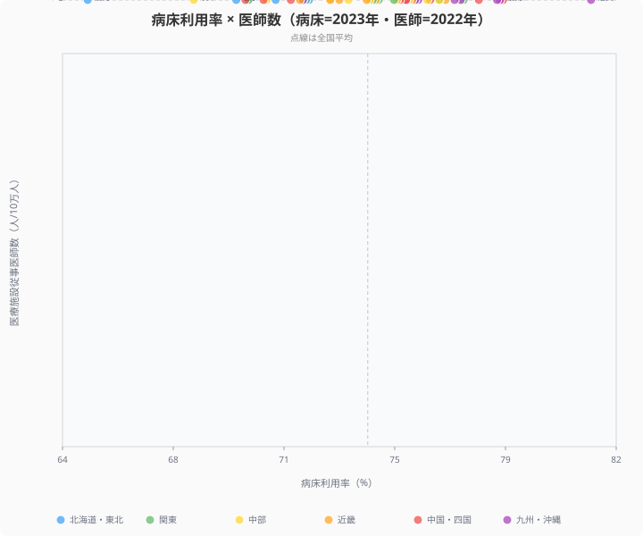

「病床は足りているのか、それとも余っているのか」── 47都道府県で実際に計算すると、答えは地域によって大きく異なります。

一般病院の **1日平均在院患者数 ÷ 病床数** で求める病床利用率の全国平均は **74.1%**。1位の**佐賀県は81.5%**で病床はほぼ埋まっている一方、47位の**福島県は64.9%**で 4 床に 1 床は空いている計算です。差は **16.6ポイント**。九州・沖縄 (平均77.0%) と東北・北海道 (70.8%) という地域構造の存在も見えてきました。

## 47都道府県の病床利用率マップ

<data-source url="https://www.e-stat.go.jp/stat-search/files?stat_infid=000040167070" label="e-Stat 医療施設調査・患者調査"></data-source>

色が濃いほど病床利用率が高く、医療現場のひっ迫度が大きい地域です。**九州・沖縄ブロック**が全体的に濃く塗られている一方、**東北・北海道ブロック**は薄い色が目立ちます。関東・中部・近畿はおおむね中間の値に集中しており、地域差は東西よりも**南北軸**で鮮明に出ています。

<source-link href="/ranking/avg-daily-inpatients-general-hospital-per-100k">一般病院 1日平均在院患者数ランキング</source-link>

> [!NOTE]
> 病床数・在院患者数はいずれも「人口10万人あたり」で揃えているため、単純な除算で利用率 (%) が求まります。一般病院のみを対象とし、精神科病院・療養型医療施設は除外しています。データは 2023年医療施設調査・患者調査。

## 病床利用率トップ・ボトム

**1位は佐賀県** (81.5%)。2位 山口県 (78.6%)、3位 福岡県 (78.5%)、4位 沖縄県 (78.4%)、5位 [高知県](/areas/39000) (77.8%) と続きます。上位10位中**6県が九州・沖縄ブロック**に集中しています。

最下位は**福島県** (64.9%)。46位 岐阜県 (68.4%)、45位 岩手県 (69.8%) と続き、下位10位中**5県が東北・北信越ブロック**に偏っています。

1位 佐賀県と47位 福島県を 3 軸で比べると差は明確です。

- 病床利用率: 佐賀 81.5% vs 福島 64.9%（差 16.6pt）
- 病床数（人口10万人あたり）: 佐賀 1,447.8床 vs 福島 1,047.5床（差 400.3床）
- 1日平均在院患者数（同）: 佐賀 1,179.9人 vs 福島 680.3人（差 499.6人）

佐賀県は病床数も多いうえに在院患者数も多く、**「病床も需要も多い」典型例**。福島県は病床数は中位ながら在院患者数が少なく、**「相対的に空きが多い」状態**となっています。

<ad-slot></ad-slot>

## 地域差: 九州 77% vs 東北 71%

地域ブロック別に病床利用率の平均を計算すると、明確な階層構造が現れます。

- 九州・沖縄: 平均 77.0%（8県）
- 中国・四国: 平均 74.6%（9県）
- 関東: 平均 74.3%（7県）
- 近畿: 平均 74.1%（7県）
- 中部: 平均 73.7%（9県）
- 北海道・東北: 平均 70.8%（7県）

九州・沖縄と北海道・東北の差は **6.2ポイント**。同じ日本でありながら、ブロック間でこれほど病床稼働率に差が出る背景には何があるのでしょうか。

## 需要 (受療率) と供給活用度の関係

病床がよく埋まっている県は「**入院需要が多い県**」と一致するのか、相関を見てみます。

<data-source url="https://www.e-stat.go.jp/stat-search/files?stat_infid=000040153153" label="e-Stat 患者調査"></data-source>

X軸は病床利用率 (%)、Y軸は入院受療率 (人口10万人あたりの入院患者数)。**右上に位置する県ほど「需要も多く供給活用度も高い」状態**で、医療現場のひっ迫度が大きい地域です。

- **右上 (高需要・高活用)**: 高知・佐賀・山口・鹿児島など九州・四国地方。高齢化と急性期医療施設の集約が同時進行
- **左下 (低需要・低活用)**: 茨城・千葉・岐阜など関東外縁部。在宅医療・介護施設への移行が進む地域
- **右下 (高活用・低需要)**: 該当県は少なく、需要と供給活用は概ね相関する

入院受療率と病床利用率の正の相関は明確で、**「需要が多い地域ほど病床稼働も高くなる」**という直感的な構造が確認できます。

<source-link href="/ranking/inpatient-rate-per-100k">入院受療率ランキング</source-link>

<ad-slot></ad-slot>

## 医師数との関係

医師供給と病床稼働の関係も検証します。

X軸は病床利用率、Y軸は医療施設従事医師数 (人口10万人あたり)。**医師数と病床利用率には弱い正の相関**が見られますが、ばらつきも大きく、医師数だけで利用率は説明できません。

注目すべきは**右下に位置する沖縄県**。医師数は266人/10万人で全国中位ですが、病床利用率は78.4%と高水準です。一方**左上の岡山県**は医師数324人/10万人と上位ながら、病床利用率は71.6%で下位グループ。**医師供給と病床稼働は別軸の現象**として捉える必要があります。

<source-link href="/ranking/physicians-in-medical-facilities-per-100k">医療施設従事医師数ランキング</source-link>

## データの読み方と限界

この分析には次の制約があります。

- **一般病院のみ**: 精神科病院・療養型医療施設は対象外。これらを含めると東北の利用率はやや上がる可能性
- **2023年単年**: コロナ禍前後の推移は別途検証が必要
- **平均値のスナップショット**: 季節変動・繁忙期・地震等の特殊要因は平均化されている
- **病床「数」と「種類」の違い**: 急性期・回復期・慢性期で病床利用の意味は異なる

> [!WARNING]
> 病床利用率は「1日平均在院患者数 ÷ 病床数」の比率であり、低いほど医療がひっ迫していないとは限りません。東北・北海道で利用率が低い背景には、人口減少による病床の過剰と、在宅医療・施設介護への移行が重なっています。利用率を「余裕の指標」と単純解釈せず、受療率や医師数との掛け合わせで読む必要があります。

> [!TIP]
> 九州・沖縄の高利用率は「医療現場のひっ迫」と「高齢化による需要増」の両方が絡みます。どちらが主因かは、高齢化率や人口動態との相関から読み解くことが重要です。佐賀81.5%・山口78.6%が上位にいる一方、高知は病床数が全国最多（2,056床/10万人）のため分母が大きく利用率は5位（77.8%）に落ちます。分子（患者数）と分母（病床数）の両方を見ることで、地域医療の実態が見えてきます。

それでも 47 都道府県を**同一の物差し**で比較した結果として、九州・沖縄の医療ひっ迫と東北の稼働余裕という構造は、今後の医療資源配分を考える出発点になります。

<ad-slot></ad-slot>

## まとめ

47 都道府県の一般病院病床利用率を計算した結果、次の 3 点が明確になりました。

1. **地域構造**: 九州・沖縄 (77.0%) > 北海道・東北 (70.8%) で 6.2 ポイント差。南北軸で病床稼働に明確な階層が存在
2. **個別差**: 1位 佐賀県 (81.5%) と 47位 福島県 (64.9%) の差は 16.6 ポイント。佐賀は病床も需要も多い「ひっ迫型」、福島は病床中位だが需要少ない「余裕型」
3. **医師数との独立性**: 医師数と病床利用率の相関は弱い。医師は多くても病床は空いている県・医師は中位だが病床は満杯の県が混在し、両者は別軸の医療指標

「病床数が足りているか」を議論する際、絶対数だけでなく**実際にどれだけ埋まっているか**を見る視点が重要です。データは医療資源配分の地域特性を映す鏡として、今後の地域医療計画の出発点になります。

## データ出典

本記事のデータはe-Stat（政府統計の総合窓口）を基に作成しています。

本記事の対象データ: [関連カテゴリ](/category/socialsecurity)・[神奈川県](/areas/14000)
