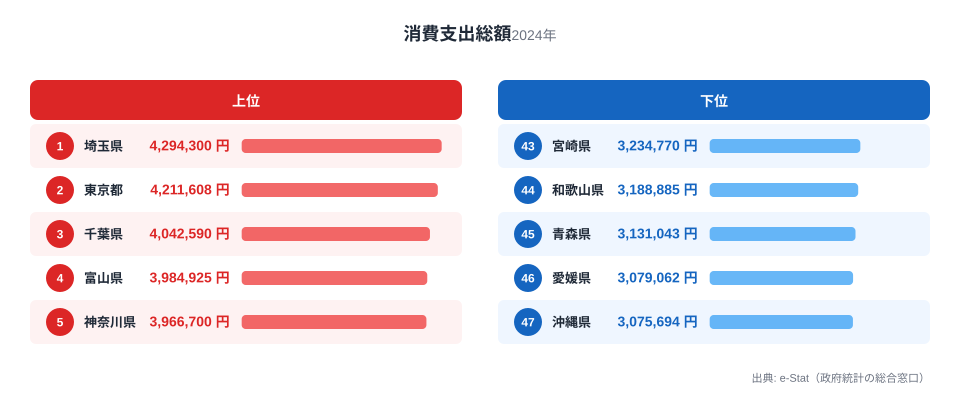

「生活費が高い県」と聞くと、多くの人が家賃の高い都市部を思い浮かべるはずです。ですが総務省の家計調査（2024年）で二人以上世帯の年間消費支出総額を都道府県庁所在市別に比べると、1位の埼玉県は429万4,300円、最下位の沖縄県は307万5,694円で、その差は約1.4倍にとどまります。

年収や地価の地域差は数倍にもなることを考えると、生活費そのものの差は驚くほど小さいのです。この記事では、消費支出総額の上位・下位の顔ぶれと、なぜ差が縮まるのかという構造を、47都道府県のデータから確認していきます。

## 消費支出総額の上位と下位

まず全体像を見てみましょう。

<source-link href="/ranking/consumption-expenditure-total">消費支出総額ランキングをもっと見る</source-link>

1位は埼玉県で429万4,300円、2位は東京都で421万1,608円、3位は千葉県で404万2,590円でした。上位5県のうち4位は富山県（398万4,925円）、5位は神奈川県（396万6,700円）です。

首都圏の3県（埼玉・東京・千葉）が上位3位を独占している点は予想通りですが、注目すべきは4位に富山県が入っていることです。富山県は持ち家率・自動車保有率が全国トップクラスで、住居費こそ抑えられる一方、光熱・自動車関連費が膨らみやすい家計構造を持ちます。消費支出総額という「合計」で見ると、都市の物価高と地方の生活インフラ支出の高さが、似た水準に着地するケースがあることがわかります。6位の栃木県（396万952円）、7位の静岡県（390万5,145円）も同様に、地方部でありながら上位に食い込んでおり、支出総額の高さが必ずしも都市集中を意味しないことを示しています。

さらに8位熊本県（390万4,288円）、9位岡山県（388万9,847円）、10位山形県（387万7,124円）と、上位10県の顔ぶれを見ても首都圏一色ではありません。むしろ首都圏3県を除けば、北陸・中部・九州・東北と全国からまんべんなく顔を出しており、「消費支出総額が高い＝大都市である」という単純な図式は成り立たないことがわかります。教育費や自動車関連費、持ち家世帯の住宅設備費など、地域ごとに支出が膨らみやすい費目が異なるため、合計額だけを見ると意外な組み合わせが生まれるのです。

> [!NOTE]
> 本ランキングの対象は「二人以上世帯」の家計調査（総務省）です。単身世帯は含まれず、都道府県単位ではなく**都道府県庁所在市**（および政令指定都市の一部）の調査世帯が対象になります。県全体の平均ではない点に注意してください。

## 最下位グループの構造

下位を見ると、46位が愛媛県（307万9,062円）、47位が沖縄県（307万5,694円）でした。42位長崎県（324万3,455円）、43位宮崎県（323万4,770円）、44位和歌山県（318万8,885円）、45位青森県（313万1,043円）と、九州・四国・沖縄・東北の非都市圏県が下位に集中しています。

これらの県に共通するのは、平均世帯所得が全国平均より低い傾向にあることです。消費支出は基本的に可処分所得に連動するため、所得水準の低い地域ほど支出総額も抑えられます。ただし、これは「生活が苦しい」ことを単純に意味するわけではありません。物価水準そのものが低い地域では、同じ生活水準を保つのに必要な支出額も少なくて済むためです。

特に沖縄県は「離島ゆえに物価が高い」というイメージを持たれがちですが、消費支出総額では最下位です。輸送コストが上乗せされる食料品・日用品の単価自体は決して安くない一方で、持ち家率や自動車保有率、教育関連費といった他の費目の支出水準が全国的に低いため、合計額としては小さく出ていると考えられます。「物価が高い＝支出総額も高い」という単純な関係ではなく、地域ごとの世帯構成や生活スタイルの違いが、合計額の順位を大きく左右していることがうかがえます。[食料費](/ranking/food-expenditure-total)のように費目を絞ったランキングと突き合わせると、こうしたズレの正体がより見えやすくなります。

> [!WARNING]
> 消費支出総額が低い＝生活水準が低い、と短絡的に読むのは危険です。地方は物価（特に住居費）が低い一方、都市部は物価と所得の両方が高いため、名目支出額だけでは実質的な暮らし向きの差を測れません。実質的な生活水準を比較するには、後述するエンゲル係数や物価地域差指数など、他の指標と合わせて見る必要があります。

## 発見: なぜ格差はたった1.4倍なのか

47都道府県の消費支出総額を比べると、最大値（埼玉429万円）と最小値（沖縄308万円）の比率は1.4倍です。これは所得や地価のランキングで見られる数倍規模の格差と比べて、かなり小さい数字です。

[仮説] この要因として、消費支出は「生活必需品への支出」が土台にあるため、所得が高い県ほど贅沢品や娯楽費に多く回す一方、所得が低い県でも食料・光熱・住居といった基礎的支出は一定水準を下回りにくい、という下方硬直性が働いている可能性があります。この仮説を検証するには、消費支出の内訳（食料費・住居費・教養娯楽費など）を県別に分解し、どの費目が格差を縮小させているかを確認する必要があります。

一つの手がかりが[エンゲル係数](/ranking/engel-coefficient)（消費支出に占める食料費の割合）です。エンゲル係数は所得水準と逆相関することが知られており、消費支出総額が低い県ほどエンゲル係数が高くなる傾向があります。つまり、支出総額の差は小さくても、その中身（何にどれだけ使っているか）の構成比には、所得を反映した違いが表れやすいと考えられます。[食料費](/ranking/food-expenditure-total)そのものの絶対額もあわせて見ると、支出総額の順位と食料費の順位が必ずしも一致しない地域があり、これも生活費構造の地域差を示す材料になります。

<source-link href="/ranking/engel-coefficient">エンゲル係数ランキングを見る</source-link>

> [!TIP]
> このランキングを読み解くコツは、「総額」だけでなく「何にいくら使っているか」の内訳まで見ることです。特にエンゲル係数と組み合わせると、同じ支出額でも生活の余裕度が異なる県が見えてきます。

## まとめ

- 消費支出総額1位は埼玉県（429万4,300円）、2位は東京都（421万1,608円）、3位は千葉県（404万2,590円）
- 最下位は沖縄県（307万5,694円）、46位は愛媛県（307万9,062円）
- 1位と最下位の差は約1.4倍と、所得・地価の地域差に比べて小さい
- 上位は首都圏3県に加え、住居費が低い一方で光熱・自動車費がかさみやすい富山県が4位に入る
- 下位は九州・四国・沖縄・東北の非都市圏県が中心で、所得水準の低さが影響していると見られる

## データ出典

総務省統計局「家計調査」（品目別、二人以上世帯）を基に、都道府県庁所在市別の年間消費支出総額（2024年）を集計。e-Stat（政府統計の総合窓口）経由でデータを整備しています。
