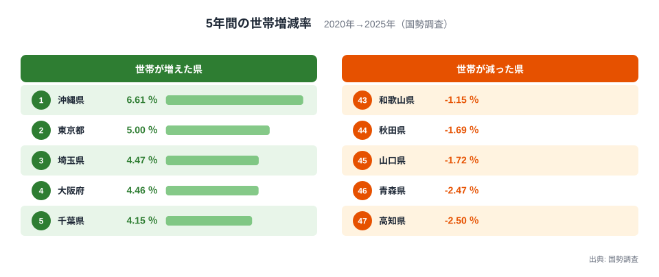
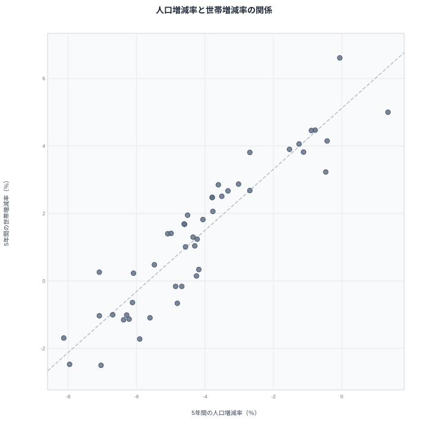
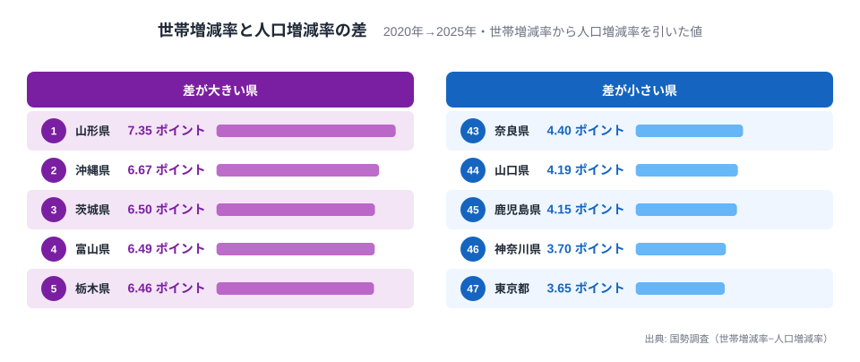

2026年9月29日に公表された令和7年国勢調査で、多くの県が「人口は減ったのに世帯は増えた」という一見矛盾した結果を示しました。2020年から2025年までの5年間で人口が増えた都道府県は[東京都](/areas/13000)の1つだけですが、世帯数が増えた都道府県は33に上ります。つまり人口が減った46道府県のうち、32の道府県では世帯数のほうは増えています。

たとえば山形県は人口が7.09%減りましたが、世帯数は0.26%増えました。住む人が減っているのに、家の数え方である世帯は増えているのです。この記事では、5年間の世帯増減率と人口増減率を47都道府県で突き合わせ、「世帯だけが増える」現象がどこで、どれほど大きく起きているのかを確かめます。

## 世帯が増えたのは33都道府県、減ったのは14道府県

まず世帯数そのものの増減から見ます。5年間の世帯増減率が最も高いのは[沖縄県](/areas/47000)の+6.61%で、東京都の+5.00%、埼玉県の+4.47%、大阪府の+4.46%、千葉県の+4.15%が続きます。上位5都府県のうち4つが東京圏と大阪圏で、沖縄県だけが例外です。一方、最下位は高知県の-2.50%で、青森県が-2.47%、山口県が-1.72%、秋田県が-1.69%、和歌山県が-1.15%と続き、下位は西日本と東北の人口減少が進む県で占められています。

世帯が減ったのは北海道、青森県、岩手県、秋田県、福島県、島根県、和歌山県、徳島県、愛媛県、高知県、山口県、長崎県、宮崎県、鹿児島県の14道府県です。裏を返せば、残る33都道府県は世帯が増えています。なかでも沖縄県は、人口の増減率がほぼ横ばいの-0.06%にとどまるのに世帯増減率は全国最大で、若い世代が多く世帯を新たに構える動きが強い地域だと考えられます(これは本記事のデータだけでは確かめられないため[仮説]です)。

同じ「増えた県」でも中身は二種類あります。東京都・埼玉県・大阪府・千葉県のように人口の増減が小さいか増えている県では、人が集まったぶんだけ世帯も増えています。一方、山形県や新潟県のように人口が6%を超えて減っている県で世帯が微増に踏みとどまる例もあり、こちらは「人が減っても世帯数が支えられている」状態です。次の節では、この二つを分ける手がかりとして、人口と世帯の増減率を1枚の図に重ねます。

> [!NOTE]
> 世帯増減率は、2025年国勢調査の世帯数を2025年10月1日現在の境域に組み替えた2020年の世帯数と比べた値です。人口増減率も同じ組み替えで求めているため、年次の人口推計に基づく増減率とは期間も出典も異なります。

あわせて見る: [単独世帯割合ランキング](/ranking/single-person-household-ratio) / [一般世帯の平均人員ランキング](/ranking/average-persons-per-general-household)

## 世帯は人口に連動する、ただし全県で人口より速く増える

横軸に人口増減率、縦軸に世帯増減率をとると、47都道府県はきれいに右上がりに並びます。二つの増減率の相関係数は0.93と非常に高く、人口が減る県ほど世帯も伸びにくいという基本関係は保たれています。世帯増減率が最下位の高知県は、人口増減率も-7.04%と下位に位置しています。

この図でもう一つ大切なのは、全47点が「人口の増減率と世帯の増減率が等しい」斜めの線より上にあることです。すべての都道府県で、世帯増減率が人口増減率を上回っています。人口が増えたのは東京都の+1.35%だけですが、世帯数はその東京都で+5.00%まで伸びました。人口が0%付近にある沖縄県や千葉県では、世帯増減率が+4%から+7%に達しています。

人口の減少率が最も大きいのは秋田県の-8.13%ですが、世帯増減率は-1.69%にとどまり、人口の減り方の約5分の1です。人口が減るスピードと世帯が減るスピードが一致せず、世帯のほうがいつも「減りにくい」あるいは「増えやすい」ことが、この散布図の縦横の差から読み取れます。ただし相関が高いことは、人口の動きが世帯の動きを決めていることを意味しません。転入超過という同じ原因が人口と世帯の両方を押し上げている可能性もあるため、因果は別に確かめる必要があります。

> [!WARNING]
> 相関係数0.93は、人口増減率と世帯増減率が47都道府県でほぼ同じ向きに動くことを示すだけです。世帯の増加を「暮らしの豊かさが増した」「住宅需要が伸びた」と読み替えることはできません。

## 世帯が「余分に」増える幅は山形が最大、東京が最小

世帯増減率から人口増減率を引いた差を見ると、47都道府県で3.65〜7.35ポイントの幅があります。単純平均は5.52ポイントで、最大の山形県は最小の東京都の約2.0倍にあたります。

差が最も大きいのは山形県の7.35ポイントで、沖縄県の6.67ポイント、茨城県の6.50ポイント、富山県の6.49ポイント、栃木県の6.46ポイントが続きます。逆に差が最も小さいのは東京都の3.65ポイントで、神奈川県が3.70ポイント、鹿児島県が4.15ポイント、山口県が4.19ポイント、奈良県が4.40ポイントです。山形県では人口が減った分だけ、世帯が「余分に」7ポイント以上増えたことになります。

この差の正体は、1世帯あたりの人数が減ったことです。人口を世帯数で割った比は、(1+人口増減率)÷(1+世帯増減率)の倍率で動きます。この式で計算すると、1世帯あたりの人数は全47都道府県で減っており、減少幅は東京都の3.48%から山形県の7.34%までの範囲です。世帯の規模は日本中で同時に縮んでいますが、その縮み方には県ごとの差があります。

縮み幅の差は、2020年時点の世帯の大きさとよく対応します。2020年の一般世帯の平均人員は山形県が2.61人、東京都が1.92人で、単独世帯割合は山形県が28.43%、東京都が50.24%でした。47都道府県で見ると、2020年の平均人員が大きい県ほど1世帯あたり人数の縮み幅が大きく、相関係数は-0.81です。三世代同居や親子同居が多く残る県には、世帯が分かれて小さくなる余地が大きかった一方、東京都はすでに世帯がかなり小さく、これ以上縮む余地が限られていたと読めます。

これは2020年の水準と2020年から2025年の変化を並べた観察で、家族が実際に別居した結果かどうかまでは示していません。同居の解消、高齢者の単身化、未婚化、若い世代の転入など、複数の要因が重なっている可能性があります。2025年の世帯人員別や家族類型別の集計が取り込まれた時点で、どの要因が効いたかを分けて検証します。

あわせて見る: [日本の世帯は「小さく」なった](/blog/household-structure-transformation) / [高齢者の5人に1人がひとり暮らし](/blog/aging-solo-living-crisis)

## 小規模化は2020年までの統計でも一貫していた

世帯の小規模化は、今回の調査で突然起きたわけではありません。国勢調査の単独世帯数を47都道府県で合計すると、1975年は約424万世帯、1990年は約939万世帯、2020年は約2,115万世帯と、45年間で約5.0倍に増えています。単独世帯が増え続けるという構造は、数十年にわたって確認できることになります。

今回の2020年から2025年の変化も、この長期の流れの延長線上にあると考えるのが自然です。ただし2025年の単独世帯数はこの記事の元データに含まれていないため、増加が単独世帯によるものだと断定はできません。ここは[仮説]で、2025年国勢調査の世帯人員別の集計を確認できた時点で、増えた世帯の内訳を照合します。

> [!TIP]
> 「人口が減る県では世帯数も減るはず」という前提で地域の将来を考えると、住宅や介護、ごみ収集、水道などの需要を過小に見積もる恐れがあります。こうしたサービスは人口ではなく世帯単位で動くものが多いため、人口と世帯の増減率をペアで確認するのが有効です。

## 市区町村でも「人口減・世帯増」は珍しくない

都道府県だけでなく、市区町村でも同じ傾向が確認できます。比較できるのは1,740団体で、このうち人口が減ったのは1,571団体です。そのうち637団体(40.5%)では世帯数が増えていました。世帯が増えた806団体に絞ると、79.0%にあたる637団体が人口減少団体で、世帯増加の大半は人口が減っている場所で起きています。

反対に、人口が増えたのに世帯が減った団体は1つもありません。世帯増減率が人口増減率を下回る、つまり1世帯あたりの人数が増えた団体は1,740団体のうち13団体にとどまります。福島県の大熊町・富岡町・浪江町・広野町、東京都の中央区・港区・国分寺市、北海道の浦臼町・中川町、長野県の川上村、和歌山県の北山村、佐賀県の玄海町、沖縄県の渡名喜村です。中央区や港区は人口も世帯もほぼ同じ率で増えており、差はごくわずかです。福島県の4町は東日本大震災後の特殊な事情が背景にある可能性がありますが、このデータだけでは理由を断定できません。

## まとめ

- 5年間で世帯が増えたのは33都道府県、減ったのは14道府県で、世帯増減率は沖縄県の+6.61%が1位、高知県の-2.50%が最下位です。
- 人口が増えたのは東京都だけで、人口が減った46道府県のうち32で世帯は増えています。
- 人口増減率と世帯増減率の相関係数は0.93で、47都道府県すべてで世帯増減率が人口増減率を上回りました。
- 差は山形県の7.35ポイントが最大、東京都の3.65ポイントが最小で、1世帯あたりの人数は全47都道府県で3.48〜7.34%減っています。
- 市区町村でも人口減少団体の40.5%で世帯が増えており、人口だけでなく世帯単位で地域を見る必要があります。

## データについて

- 出典は国勢調査(令和7年、人口等基本集計、2026年9月29日公表)の5年間の世帯増減率と人口増減率で、いずれも2025年10月1日現在の境域に組み替えた2020年の値と2025年の確定値を比べています。世帯の範囲(一般世帯か総世帯か)は指標の説明に明記されていないため、本文では単に「世帯」と呼んでいます。
- 「1世帯あたりの人数の減少幅」は、(1+人口増減率)÷(1+世帯増減率)−1で求めた本記事独自の計算値です。国勢調査が公表する世帯人員そのものではありません。
- 2020年の一般世帯の平均人員・単独世帯割合と、1975年から2020年の単独世帯数は、国勢調査の別指標です。単独世帯数は47都道府県の値を合計しています。
- 市区町村の団体数は、政令指定都市を1団体として数え、その区は含めません。東京23区は区ごとに1団体と数えるため、対象は1,741団体です。うち福島県双葉町は値がなく、比較できる1,740団体で集計しました。
