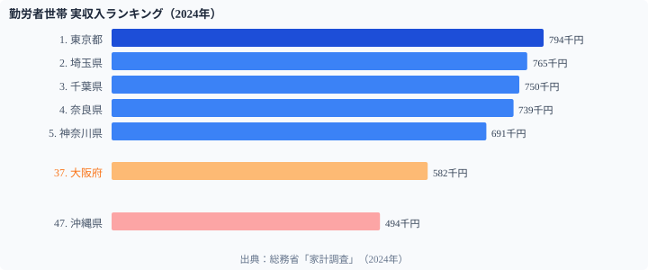

大阪府は日本第2の経済都市だ。しかし**勤労者世帯の月収ランキングでは37位（582千円）**にとどまる。一方、隣の奈良県は**4位（739千円）**だ。

これは矛盾ではない。**居住地の収入と就業地の経済力は別の話**だからだ。大阪の高収入勤労者の多くは奈良・兵庫・滋賀に居住している。家計調査は就業地ではなく居住地で集計されるため、通勤圏となる郊外県の世帯収入が押し上げられる構造がある。

この「ベッドタウン効果」を理解しないと、世帯収入ランキングの本質は見えてこない。

## 勤労者世帯の実収入ランキング（2024年）

<data-source url="https://www.e-stat.go.jp/dbview?sid=0000010212" label="e-Stat 社会・人口統計体系"></data-source>

**実収入が最も多いのは東京都**（794千円）。2位の埼玉（765千円）、3位の千葉（750千円）と続く。トップ10に関東から**6県**が入り、首都圏への集中が際立っている。

**最も少ないのは[沖縄県](/areas/47000)**（494千円）。1位の東京との差は約300千円、比率にして**1.61倍**の開きがある。

> [!NOTE]
> 家計調査の「実収入」は世帯主の勤め先収入に加え、配偶者の収入や社会保障給付なども含む税込総額。世帯人数や共働き比率の違いが県別の差に影響する。

## ベッドタウン効果──なぜ大阪が37位で奈良が4位なのか

**大阪府（37位・582千円）と奈良県（4位・739千円）**の逆転は、世帯収入データの本質を示す。

奈良県は大阪市・京都市への通勤圏だ。高収入の勤労者世帯が奈良に居住し、大阪や京都に通勤している。家計調査は**居住地で集計される**ため、奈良は「大阪経済の恩恵を受けつつ、大阪ほど生活コストが高くない」という好条件を反映している。

同様に、東京通勤圏の埼玉（2位）・千葉（3位）・栃木（7位）・茨城（8位）がいずれも高順位だ。

逆に大阪府・兵庫県が低い理由も同じ構造だ。**単身世帯比率の高い大都市部では「二人以上の勤労者世帯」の対象が限定**され、都市の経済力がそのまま世帯収入に反映されない。

> [!TIP]
> 移住を検討する際は「世帯収入ランキング」だけでなく、就業地の賃金水準・通勤時間・住居費・子育て支援の4軸で比較することが重要だ。高収入のベッドタウンは通勤コスト（時間・費用）が高い場合が多い。

[実収入ランキング](/ranking/actual-income-worker-households-per-month)

<ad-slot></ad-slot>

## 北陸が上位の理由──三世代同居が「二馬力」を支える

富山（6位・701千円）・福井（10位・674千円）・石川（11位・674千円）の北陸3県が上位に入る理由は、共働き率だけでは説明できない。

**三世代同居率が全国トップクラス**という構造が鍵だ。祖父母が育児をサポートすることで、夫婦ともにフルタイムで働ける環境が整っている。世帯主の収入に配偶者収入が加わる「二馬力」効果が世帯収入を押し上げる。

> [!NOTE]
> 大都市では保育所不足・家賃負担から、共働きでも片方がパート勤務になりやすい。北陸は三世代同居による育児シェアと持ち家による住居費節約が組み合わさって、「二馬力フル稼働」を実現している。

## 実収入と納税義務者割合の関係

横軸に実収入・縦軸に納税義務者割合をとると、**緩やかな正の相関**が見える。世帯収入が高い県ほど、住民に占める納税義務者の割合が高い傾向がある。

散布図の特徴：
- **右上（高収入×高納税者率）**：東京（794千円・51.5%）が突出。富山（701千円・49.1%）も高い
- **左下（低収入×低納税者率）**：沖縄（494千円・40.1%）・宮崎（508千円・41.2%）──高齢化率の高さが納税者割合を押し下げる
- **特異値**：奈良は収入4位（739千円）ながら納税者割合42.2%と低め。高齢の年金世帯も多い住宅地の特性を反映

[納税義務者割合ランキング](/ranking/taxpayer-ratio-per-pref-resident)

<ad-slot></ad-slot>

## 50年間の推移──失われた20年と2024年の最高値更新

全国平均の実収入を約50年間で追うと、**日本経済の歩みそのもの**が映し出される。

- **高度成長〜バブル期（1975-1997年）**：243千円から597千円へ2.5倍に増加
- **失われた20年（1997-2011年）**：597千円から507千円へ**約15%減少**。デフレ・構造改革・リーマンショックの影響
- **回復期（2012-2019年）**：緩やかに576千円まで持ち直す
- **コロナ禍以降（2020-2024年）**：2020年に給付金効果で急上昇。**2024年に629千円と全期間の最高値を更新**

50年間で名目収入は2.6倍に増加。ただし物価上昇を考慮すると実質的な購買力の伸びはより緩やかだ。

> [!WARNING]
> 2020年の急上昇は特別定額給付金（10万円）の影響が大きい。実態としての賃金水準の回復とは区別して見る必要がある。2024年の最高値更新は名目値であり、インフレ調整後の実質値は依然として低い水準にある。

## まとめ

世帯収入の地域差は単なる賃金格差にとどまらず、通勤圏構造・共働き率・産業構成・高齢化率など複合的な要因が絡み合っている。

最も示唆的なのは大阪37位・奈良4位の逆転だ。「経済力のある都市」と「世帯収入が高い県」は別物であることが、このデータで明確に示されている。世帯収入ランキングを読む際は、就業地の構造・通勤圏・世帯特性を考慮した解釈が不可欠だ。

## データ出典

- 総務省「家計調査」勤労者世帯実収入（2024年）
- 総務省「市町村税課税状況等の調」納税義務者割合
