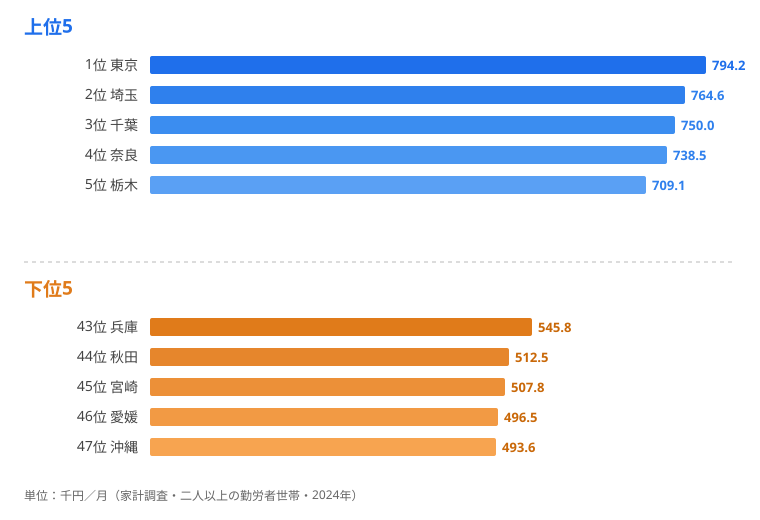

[大阪府](/areas/27000)は日本第2の経済都市です。しかし**勤労者世帯の月収では582千円にとどまり、47都道府県のなかでは下位**に沈みます。一方、隣の[奈良県](/areas/29000)は**739千円で上位グループ**に入ります。

これは矛盾ではありません。**居住地の収入と就業地の経済力は別の話**だからです。大阪で働く高収入の勤労者の多くは、奈良・兵庫・滋賀に住んでいます。家計調査は就業地ではなく居住地で集計されるため、通勤圏となる郊外県の世帯収入が押し上げられる構造があります。

この「ベッドタウン効果」を理解しないと、世帯収入ランキングの本質は見えてきません。本記事では、[勤労者世帯の実収入ランキング](/ranking/actual-income-worker-households-per-month)と、納税義務者割合との相関、そして50年の推移を重ね、「なぜ経済力と世帯収入が逆転するのか」という真因を掘り下げます。

## 勤労者世帯の実収入ランキング（2024年）

**実収入が最も多いのは東京都**で794.2千円です。2位の埼玉（764.6千円）、3位の千葉（750千円）、4位の奈良（738.5千円）、5位の栃木（709.1千円）と続きます。上位5県のうち東京・埼玉・千葉・栃木の4県が関東で、首都圏とその通勤圏への集中が際立っています。

**最も少ないのは[沖縄県](/areas/47000)**で493.6千円です。下位は47位の沖縄に続き、46位の愛媛（496.5千円）、45位の宮崎（507.8千円）、44位の秋田（512.5千円）、43位の兵庫（545.8千円）と並びます。1位の東京と47位の沖縄では約300千円、比率にして**1.61倍**の開きがあります。

ここで注目したいのは、下位グループに沖縄・宮崎・秋田といった地方圏だけでなく、**人口545万人を抱える大都市・兵庫県（43位）が含まれている**ことです。経済規模の大きさが世帯収入の高さに直結しないという、このランキングの核心がここに表れています。

> [!NOTE]
> 家計調査の「実収入」は世帯主の勤め先収入に加え、配偶者の収入や社会保障給付なども含む税込総額です。集計対象は「二人以上の勤労者世帯」で、世帯人数や共働き比率の違いが県別の差に大きく影響します。単身世帯や自営業世帯は含まれません。

<source-link href="/ranking/actual-income-worker-households-per-month">勤労者世帯の実収入ランキングをもっと見る</source-link>

## ベッドタウン効果──なぜ大阪が下位で奈良が上位なのか

**大阪府（582千円・下位）と奈良県（739千円・上位グループ）**の逆転は、世帯収入データの本質を示しています。

奈良県は大阪市・京都市への通勤圏です。高収入の勤労者世帯が奈良に住み、大阪や京都へ通勤しています。家計調査は**居住地で集計される**ため、奈良は「大阪経済の恩恵を受けつつ、大阪ほど生活コストが高くない」という好条件をそのまま反映しています。

同じ構造は東京圏でも見られます。実際、上位5県には東京の通勤圏である埼玉（2位）・千葉（3位）が並び、すぐ下にも栃木（5位）・茨城（7位）・神奈川（8位）が続きます。都心で稼ぎ、郊外に住む世帯が、これらの県の世帯収入を底上げしているのです。

逆に大阪府や兵庫県が低い理由も、同じ構造の裏返しです。**単身世帯比率の高い大都市部では、集計対象である「二人以上の勤労者世帯」のサンプルが偏り**、都市の経済力がそのまま世帯収入に反映されません。稼ぎ手は都心のオフィスにいても、世帯としては郊外県にカウントされてしまうわけです。

> [!WARNING]
> このランキングを「県民の豊かさ」と読み替えるのは危険です。順位が高い県は通勤コスト（時間・費用）が高い場合が多く、可処分時間や住居費を加味すると評価が変わります。逆に大阪・兵庫が下位でも、都市の賃金水準そのものが低いわけではありません。あくまで「居住地ベースの世帯収入」であって「就業地の賃金」ではない点に注意してください。

## 北陸が上位の理由──三世代同居が「二馬力」を支える

通勤圏効果だけでは説明できない上位県もあります。富山（6位・700.6千円）・福井（10位・674.3千円）・石川（11位・673.8千円）の北陸3県は、大都市の通勤圏ではないのに上位に食い込んでいます。

鍵となるのは**三世代同居率が全国トップクラス**という構造です。祖父母が育児をサポートすることで、夫婦ともにフルタイムで働ける環境が整っています。世帯主の収入に配偶者収入が加わる「二馬力」効果が、世帯収入を押し上げています。

つまり世帯収入の上位は、「都心で稼いで郊外に住む通勤圏型」と「同居家族で二馬力を実現する地方型」という、性格の異なる2つのパターンで構成されているのです。

> [!NOTE]
> 大都市では保育所不足や家賃負担から、共働きでも片方がパート勤務になりやすい傾向があります。北陸は三世代同居による育児シェアと、持ち家による住居費節約が組み合わさり、「二馬力フル稼働」を実現しやすい環境にあります。これは世帯収入を押し上げる一方で、世帯あたりの就業者数が多いことの裏返しでもあります。

## 実収入と納税義務者割合の相関──見かけの相関と真因

世帯収入が高い県は、住民に占める納税義務者の割合も高いのでしょうか。横軸に実収入、縦軸に納税義務者割合をとると、**緩やかな正の相関**が見えてきます。

ただし、この相関は「収入が高いから納税者が多い」という単純な因果ではありません。背景にあるのは**年齢構成**という共通要因です。具体的には、次のような傾向があります。

- 右上（高収入×高納税者率）：東京（794千円・51.5%）が突出しています。富山（701千円・49.1%）も高く、働き手の比率が高い県です
- 左下（低収入×低納税者率）：沖縄（494千円・40.1%）・宮崎（508千円・41.2%）が並びます。高齢化率の高さが納税者割合を押し下げています
- 例外：奈良は収入が上位グループながら納税者割合は42.2%と低めです。高齢の年金世帯も多い住宅地という特性を反映しています

奈良の例が示すように、**世帯収入の高さと納税者割合は必ずしも一致しません**。世帯収入は「働いている世帯」の実態を、納税者割合は「住民全体の年齢構成」を映しており、見ている対象が違うからです。相関の裏にある真因は、収入そのものではなく人口の年齢構成にあると考えられます。

> [!TIP]
> 県別データを比較するときは「分母が何か」を意識すると読み違いを防げます。世帯収入は勤労者世帯が分母、納税者割合は全住民が分母です。同じ県でも、どの集団を切り取るかで順位は入れ替わります。

<source-link href="/ranking/taxpayer-ratio-per-pref-resident">納税義務者割合ランキングをもっと見る</source-link>

## 50年間の推移──失われた20年と2024年の最高値更新

全国平均の実収入を約50年間で追うと、**日本経済の歩みそのもの**が映し出されます。長期で見ると、世帯収入は一本調子で増えてきたわけではありません。

- 高度成長〜バブル期（1975-1997年）：243千円から597千円へ2.5倍に増えました
- 失われた20年（1997-2011年）：597千円から507千円へ約15%減りました。デフレ・構造改革・リーマンショックの影響です
- 回復期（2012-2019年）：緩やかに576千円まで持ち直しました
- コロナ禍以降（2020-2024年）：2020年に給付金効果で急上昇し、**2024年に629千円と全期間の最高値を更新**しました

50年間で名目収入は2.6倍に増えました。ただし物価上昇を考慮すると、実質的な購買力の伸びはより緩やかです。世帯収入の地域差を読むときも、この「名目と実質のずれ」を念頭に置く必要があります。

> [!WARNING]
> 2020年の急上昇は特別定額給付金（10万円）の影響が大きく、賃金水準そのものの回復とは区別して見る必要があります。2024年の最高値更新も名目値であり、インフレ調整後の実質値は依然として低い水準にとどまります。

## まとめ

世帯収入の地域差は、単なる賃金格差にとどまりません。通勤圏構造・共働き率・産業構成・高齢化率といった複合的な要因が絡み合っています。

最も示唆的なのは、大阪が下位で奈良が上位という逆転です。「経済力のある都市」と「世帯収入が高い県」は別物であることが、このデータではっきりと示されています。世帯収入ランキングを読むときは、就業地の構造・通勤圏・世帯特性を考慮した解釈が欠かせません。数字を額面どおりに受け取るのではなく、「誰が、どこに住み、どう集計されているか」を問う視点を持ちたいところです。

## データ出典

- 総務省「家計調査」勤労者世帯実収入（2024年）
- 総務省「市町村税課税状況等の調」納税義務者割合
