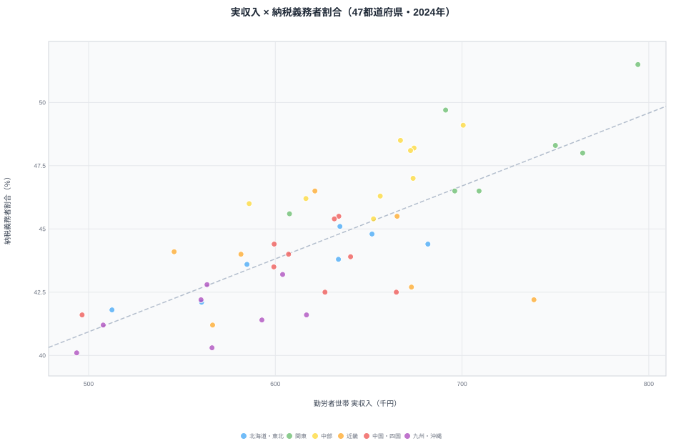

大阪府は日本第2の経済都市です。しかし**勤労者世帯の月収ランキングでは37位（582千円）**にとどまります。一方、隣の奈良県は**4位（739千円）**です。

これは矛盾ではありません。**居住地の収入と就業地の経済力は別の話**だからです。大阪の高収入勤労者の多くは奈良・兵庫・滋賀に居住しています。家計調査は就業地ではなく居住地で集計されるため、通勤圏となる郊外県の世帯収入が押し上げられる構造があります。

この「ベッドタウン効果」を理解しないと、世帯収入ランキングの本質は見えてきません。

## 勤労者世帯の実収入ランキング（2024年）

<data-source url="https://www.e-stat.go.jp/dbview?sid=0000010212" label="e-Stat 社会・人口統計体系"></data-source>

**実収入が最も多いのは東京都**（794千円）です。2位の埼玉（765千円）、3位の千葉（750千円）と続きます。トップ5には関東から3県が入り、首都圏への集中が際立っています。

**最も少ないのは[沖縄県](/areas/47000)**（494千円）です。1位の東京との差は約300千円、比率にして**1.61倍**の開きがあります。下位には沖縄・愛媛（497千円）・宮崎（508千円）が並びます。

<source-link href="/ranking/actual-income-worker-households-per-month">実収入ランキングの全47都道府県を見る</source-link>

> [!NOTE]
> 家計調査の「実収入」は世帯主の勤め先収入に加え、配偶者の収入や社会保障給付なども含む税込総額です。同じ「世帯」でも世帯人数や共働き比率が違えば収入は変わるため、この順位は「個人の賃金の高さ」ではなく「世帯としての稼ぐ力」を映している点に注意してください。

## ベッドタウン効果──大阪37位・奈良4位の逆転はなぜ起きるのか

**大阪府（37位・582千円）と奈良県（4位・739千円）**の逆転は、世帯収入データの本質を示しています。

奈良県は大阪市・京都市への通勤圏です。高収入の勤労者世帯が奈良に居住し、大阪や京都に通勤しています。家計調査は**居住地で集計される**ため、奈良は「大阪経済の恩恵を受けつつ、大阪ほど生活コストが高くない」という好条件を反映しています。

同様に、東京通勤圏の[埼玉](/areas/11000)（2位）・千葉（3位）・栃木（5位）・茨城（7位）・神奈川（8位）がいずれも高順位に並びます。一方で就業地そのものである大都市は順位を落とします。

大阪府・兵庫県が低い理由も同じ構造です。**単身世帯比率の高い大都市部では「二人以上の勤労者世帯」の対象が限定**され、都市の経済力がそのまま世帯収入に反映されません。兵庫県は43位（546千円）まで沈んでおり、大都市圏の中心ほど世帯収入の数字が低く出る傾向がはっきりと見えます。

> [!TIP]
> 移住を検討する際は「世帯収入ランキング」だけでなく、就業地の賃金水準・通勤時間・住居費・子育て支援の4軸で比較することが大切です。高収入のベッドタウンは、その収入を稼ぐための通勤コスト（時間・費用）が大きい場合が多いためです。

<ad-slot></ad-slot>

## 北陸が上位の理由──三世代同居が「二馬力」を支える

富山（6位・701千円）・福井（10位・674千円）・石川（11位・674千円）の北陸3県が上位に入る理由は、共働き率だけでは説明できません。

**三世代同居率が全国トップクラス**という構造が鍵になります。祖父母が育児をサポートすることで、夫婦ともにフルタイムで働ける環境が整っています。世帯主の収入に配偶者収入が加わる「二馬力」効果が世帯収入を押し上げているのです。北陸はベッドタウン効果ではなく、世帯内に働き手が複数いるという別の経路で上位に届いている点が、関東の通勤圏組とは対照的です。

> [!NOTE]
> 大都市では保育所不足・家賃負担から、共働きでも片方がパート勤務になりやすい傾向があります。北陸は三世代同居による育児シェアと持ち家による住居費節約が組み合わさって、「二馬力フル稼働」を実現しています。この点は、同じ高収入でも関東のベッドタウンとは成り立ちが異なります。

## 実収入と納税義務者割合の関係

世帯収入の高さは、その地域に住む人の「税を負担できる層」の厚みとも連動します。横軸に実収入・縦軸に納税義務者割合をとると、**緩やかな正の相関**（相関係数 r ≒ 0.74）が見えてきます。世帯収入が高い県ほど、住民に占める納税義務者の割合が高い傾向があります。

<data-source url="https://www.e-stat.go.jp/dbview?sid=0000020201" label="e-Stat 社会・人口統計体系"></data-source>

散布図を読み解くと、3つのグループが浮かび上がります。

- **右上（高収入×高納税者率）**：東京（794千円・51.5%）が突出しています。富山（701千円・49.1%）も右上に位置し、稼ぐ力と納税層の厚みが揃っています。
- **左下（低収入×低納税者率）**：沖縄（494千円・40.1%）・宮崎（508千円・41.2%）が並びます。高齢化率の高さが納税者割合を押し下げていると考えられます。
- **回帰線から外れる例**：奈良は収入4位（739千円）ながら納税者割合は42.2%と低めです。高齢の年金世帯も多い住宅地という特性を反映しており、「世帯としての稼ぐ力」と「就労人口の厚み」が必ずしも一致しないことを示しています。

ただし、これは相関であって因果ではありません。納税義務者割合は年齢構成（高齢化率）に強く影響されるため、収入の高さがそのまま納税者率を引き上げているとは限らない点に注意が必要です。

<source-link href="/ranking/taxpayer-ratio-per-pref-resident">納税義務者割合ランキングの全47都道府県を見る</source-link>

> [!WARNING]
> 相関係数 r ≒ 0.74 は「収入が高い県は納税者率も高い傾向」を示すだけで、片方がもう片方の原因であることまでは意味しません。納税義務者割合は退職して年金生活に入った世帯の比率に左右されるため、高齢化が進んだ県では収入水準と無関係に下がります。「収入を上げれば納税者率が上がる」と読み替えないようにしてください。

<ad-slot></ad-slot>

## 50年間の推移──失われた20年と2024年の最高値更新

全国平均の実収入を約50年間で追うと、**日本経済の歩みそのもの**が映し出されます。

- **高度成長〜バブル期（1975-1997年）**：243千円から597千円へ2.5倍に増加しました。
- **失われた20年（1997-2011年）**：597千円から507千円へ**約15%減少**しています。デフレ・構造改革・リーマンショックの影響が重なりました。
- **回復期（2012-2019年）**：緩やかに576千円まで持ち直しました。
- **コロナ禍以降（2020-2024年）**：2020年に給付金効果で急上昇し、**2024年に629千円と全期間の最高値を更新**しています。

50年間で名目収入は2.6倍に増えました。ただし物価上昇を考慮すると、実質的な購買力の伸びはより緩やかです。

> [!WARNING]
> 2020年の急上昇は特別定額給付金（10万円）の影響が大きく、実態としての賃金水準の回復とは区別して見る必要があります。2024年の最高値更新は名目値であり、インフレ調整後の実質値は依然として低い水準にあります。「過去最高＝暮らしが最も豊か」とは読めない点に注意してください。

## まとめ

世帯収入の地域差は単なる賃金格差にとどまらず、通勤圏構造・共働き率・産業構成・高齢化率など複合的な要因が絡み合っています。

最も示唆的なのは大阪37位・奈良4位の逆転です。「経済力のある都市」と「世帯収入が高い県」は別物であることが、このデータで明確に示されています。世帯収入ランキングを読む際は、就業地の構造・通勤圏・世帯特性を考慮した解釈が欠かせません。所得や財政に関する他の地域差は[行政・財政カテゴリ](/category/administrativefinancial)からも確認できます。

## データ出典

- 総務省「家計調査」勤労者世帯実収入（2024年）
- 総務省「市町村税課税状況等の調」納税義務者割合（2024年）
