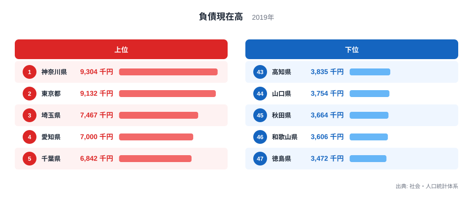

## 負債が多い県を、家計が苦しい県とは決められません

2019年の二人以上世帯における1世帯あたり負債現在高を都道府県別に比べると、神奈川県が9,304千円、つまり930万4,000円で最多です。東京都が913万2,000円で続き、最少の徳島県は347万2,000円です。神奈川県と徳島県の差は約2.7倍になります。

負債という言葉には悪い印象がありますが、家計の負債には住宅ローンなど、資産取得と結びついた借り入れが含まれます。負債額が大きいことだけで、返済が困難なのか、生活に余裕がないのかを判断することはできません。

> [!NOTE]
> 負債現在高は、調査時点で残っている借入金などの残高です。1年間に新しく借りた額や返済額、毎月の返済負担とは異なります。

このランキングは二人以上世帯の平均であり、単身世帯は対象の外です。さらに、借り入れのない世帯も含む平均なので、実際に負債を持つ世帯だけの平均とは違います。対象と平均の取り方を確認してから数字を読む必要があります。

## 上位には首都圏と大都市圏の県が並びます

<source-link href="/ranking/current-liabilities-balance-multi-person-households-per-household">負債現在高ランキングをもっと見る</source-link>

上位5都県は、神奈川県9,304千円、東京都9,132千円、埼玉県7,467千円、愛知県7,000千円、千葉県6,842千円です。首都圏の4都県と愛知県が並びます。住宅価格との関係はこの順位だけでは確認できず、別の住宅統計と照合すべき検証候補です。

6位の静岡県は6,518千円、7位の滋賀県は6,194千円です。大都市の中心部だけでなく、持ち家を取得する世帯が多い周辺県でも住宅ローン残高が大きくなる可能性があります。ただし、この指標だけでは負債の使途別内訳を確認できないため、住宅との関係は別データで検証が必要です。

下位5県は、高知県3,835千円、山口県3,754千円、秋田県3,664千円、和歌山県3,606千円、徳島県3,472千円です。地方圏の県が多く並びます。

> [!TIP]
> 負債現在高を見るときは、住宅・土地の資産額、年間収入、可処分所得、返済額を重ねると、「大きな借り入れ」と「重い返済負担」を分けて考えられます。

神奈川県と徳島県の差は5,832千円、金額に直すと583万2,000円です。しかし、住宅価格や世帯収入が異なるため、同じ500万円の負債でも家計への重さは同じではありません。

## 年齢構成や住宅取得は検証すべき仮説です

住宅ローンは、住宅を購入した後に返済が進むにつれて残高が減ります。そのため、住宅取得期にある世帯の割合や世帯主の年齢構成は、地域差を検証する際の候補になります。ただし、今回のランキング単独では、その関係を確認できません。

人口移動も検証候補です。若い家族が住宅取得を目的に都市近郊へ移る場合、その地域では負債を持つ世帯が増える可能性があります。反対に、住宅価格が低い地域や、親族から住宅を引き継ぐ割合が高い地域では、借入額が小さくなることがあります。

> [!WARNING]
> 平均負債額が低いことを、家計が豊かである証拠とはみなせません。住宅取得の少なさ、所得や資産の低さ、若年世帯の少なさが同じ方向に働く場合もあります。

平均値は、一部の大きな負債を持つ世帯に引き上げられることもあります。中央値や、負債を持つ世帯の割合、負債保有世帯だけの平均を確認できれば、典型的な家計像をより正確に捉えられます。

全国家計構造調査の地域値には標本調査としての振れもあります。順位が一つ違うことより、上位と下位でどの程度の幅があるか、複数年でも同じ傾向が続くかを見る方が安全です。特に近い値の県どうしを厳密な優劣として扱わず、調査対象、標本数、推計方法を確認して解釈する必要があります。

世帯主の年齢別に分ければ、住宅取得直後で残高が大きい世帯と、返済が進んだ世帯の違いが見えます。地域差を生活水準の差とみなす前に、比較する世帯のライフステージをそろえることが欠かせません。

同じ県の中でも世帯ごとの差は大きいため、県平均を個人の標準額とは決してみなしません。

## 家計の健全性は資産と返済能力で見ます

負債は家計の貸借対照表の片側にすぎません。住宅ローンが900万円残っていても、それを上回る住宅・土地や金融資産を持つ世帯と、資産が少ない世帯では状況が違います。純資産として資産から負債を差し引く視点が必要です。

返済能力を見るなら、負債額を年間収入や可処分所得で割った比率、毎月の返済額が収入に占める割合が役立ちます。金利条件や返済期間も重要です。残高の大きさだけでは、将来の返済負担を評価できません。

今回のデータは2019年の1時点です。その後の住宅価格、金利、所得、借り入れ行動の変化は反映していません。現在の家計状況を判断する際には、最新の全国家計構造調査や住宅・土地統計などを併せて確認してください。

最多の[神奈川県のデータブック](/areas/14000)と最少の[徳島県のデータブック](/areas/36000)では、所得や住宅に関する別の指標も比較できます。全県の値は[負債現在高ランキング](/ranking/current-liabilities-balance-multi-person-households-per-household)、家計関連の統計は[経済カテゴリ](/category/economy)から確認できます。

> [!NOTE]
> 地域比較では「負債がいくらあるか」と「返済できるか」を別の問いにしてください。前者は残高、後者は所得・資産・返済条件を含む評価です。

## 約2.7倍の差は住宅市場と世帯構成を検証する入口です

2019年の負債現在高は、神奈川県930万4,000円から徳島県347万2,000円まで約2.7倍の差がありました。上位に首都圏の都県が多く並ぶことは観察できますが、住宅価格や世帯構成が要因かどうかは別データでの検証が必要です。

ただし、負債の多さは困窮の順位ではありません。住宅という資産の取得、世帯主の年齢、所得、借り入れの有無、地域の住宅価格などは、県差を読み解くための検証候補です。このランキングだけでは個々の影響は確定できず、低い県についても返済負担が軽いと直ちに結論づけることはできません。

家計の実像に近づくには、資産現在高、純資産、年間収入、返済負担率、負債保有率を重ねます。負債ランキングは、地域の住宅取得と家計バランスを調べるための入口として使うのが適切です。

## データ出典

- 総務省統計局「社会・人口統計体系」（原資料：総務省統計局「全国家計構造調査」、2019年）
