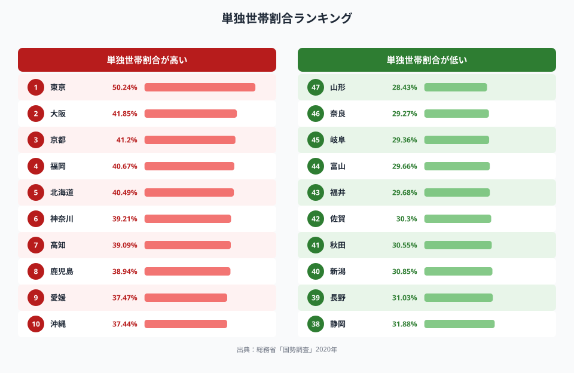
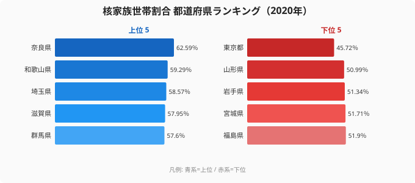
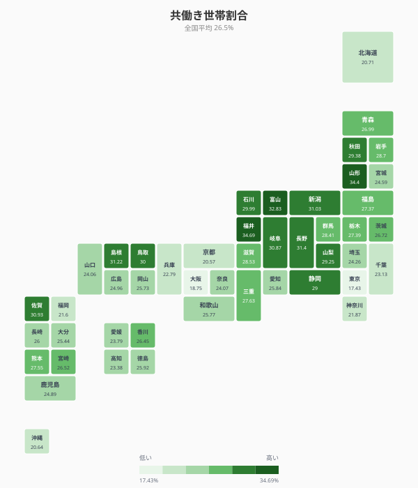
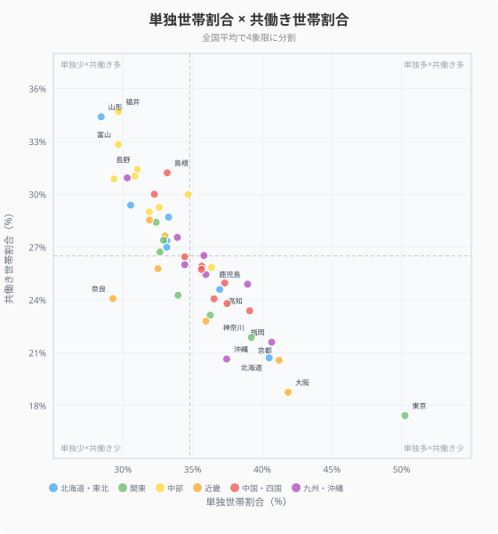
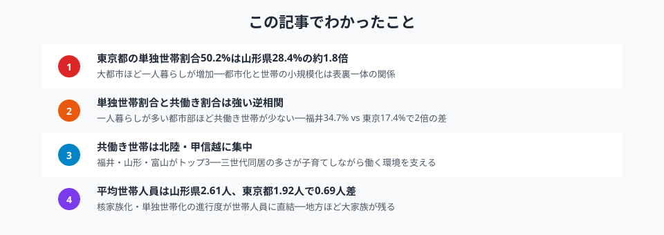

「一人暮らしが多い都道府県は？」「共働き世帯が多いのはどこ？」──世帯の構造は、その地域の暮らし方・働き方・子育て環境を映し出す鏡です。

この記事では、総務省「国勢調査」（2020年）のデータをもとに、**単独世帯割合・核家族世帯割合・共働き世帯割合・平均世帯人員**の4指標を47都道府県で比較します。ランキング・タイルマップ・散布図・まとめの4つの視点から、世帯構造の地域差とその背景を読み解きます。

## 単独世帯割合ランキング（2020年）

<data-source url="https://www.e-stat.go.jp/dbview?sid=0000010201" label="e-Stat 社会・人口統計体系"></data-source>

**単独世帯割合が最も高いのは[東京都](/areas/13000)**（50.24%）。全世帯の半数以上が一人暮らしという状況です。2位の大阪府（41.85%）、3位の京都府（41.20%）と続き、トップ5には福岡県（40.67%）、北海道（40.49%）が入ります。**大都市を抱える都道府県が上位を独占**しています。

一方、**最も低いのは[山形県](/areas/06000)**（28.43%）。奈良県（29.27%）、岐阜県（29.36%）、富山県（29.66%）と、日本海側や中部の県が下位に集まっています。1位の東京都と47位の山形県では**21.8ポイント、比率にして約1.8倍**の差があります。

注目すべきは**高知県（7位・39.09%）と鹿児島県（8位・38.94%）**が上位に入っている点です。大都市圏ではないにもかかわらず単独世帯が多いのは、高齢者の一人暮らしが多いことが背景にあります。

> [!NOTE]
> 単独世帯には、進学・就職による若年層の一人暮らしと、配偶者との死別による高齢者の一人暮らしの両方が含まれます。都市部は前者、地方の一部は後者の割合が高い傾向があります。

<source-link href="/ranking/single-person-household-ratio">単独世帯割合の全47県ランキングを見る</source-link>

## 核家族世帯割合

<data-source url="https://www.e-stat.go.jp/dbview?sid=0000010201" label="e-Stat 社会・人口統計体系"></data-source>

**核家族世帯割合**が最も高いのは奈良県（62.59%）、次いで和歌山県（59.29%）、埼玉県（58.57%）です。一方、最も低いのは[東京都](/areas/13000)（45.72%）。東京都は単独世帯が半数を超えるため、核家族の割合は相対的に低くなります。

核家族割合が高い奈良県（1位）は、大阪のベッドタウンとして「夫婦＋子ども」世帯が多い典型的な郊外型です。一方、[山形県](/areas/06000)は核家族割合が最下位（50.99%）ですが、これは三世代同居が多いため。

<source-link href="/ranking/nuclear-family-households-ratio">核家族世帯割合の全47県ランキングを見る</source-link>

## 平均世帯人員

<data-source url="https://www.e-stat.go.jp/dbview?sid=0000010201" label="e-Stat 社会・人口統計体系"></data-source>

**平均世帯人員**が最も多いのは[山形県](/areas/06000)（2.61人）、[福井県](/areas/18000)（2.57人）、佐賀県（2.51人）。いずれも三世代同居が残る地域です。最も少ないのは[東京都](/areas/13000)（1.92人）で、山形県との差は**0.69人**。全国平均は2.30人です。単独世帯も少なく、「大家族」の伝統が色濃く残っています。

<source-link href="/ranking/average-persons-per-general-household">一般世帯の平均人員の全47県ランキングを見る</source-link>

<ad-slot></ad-slot>

## 共働き世帯割合マップ──日本海側に集中

<data-source url="https://www.e-stat.go.jp/dbview?sid=0000010206" label="e-Stat 社会・人口統計体系"></data-source>

タイルマップで共働き世帯割合を見ると、**日本海側・中部地方に濃い緑色が集中するパターン**が鮮明です。

- **北陸3県が突出**: 福井（34.69%）・富山（32.83%）・石川（29.99%）は全国平均26.5%を大きく上回る
- **山形県（34.40%）が2位**: 東北の中でも突出しており、三世代同居の子育て支援が共働きを可能にしている
- **大都市圏は低い**: 東京（17.43%）・大阪（18.75%）・京都（20.57%）は全国下位3

北陸地方の共働き率の高さは、**製造業の集積による安定した雇用**と**三世代同居による子育てサポート**が両輪となっています。福井県は女性の就業率でも常にトップクラスに位置します。

> [!TIP]
> 共働き世帯割合の定義は「夫婦ともに就業者である世帯の全世帯に占める割合」です。分母が全世帯のため、単独世帯の多い都市部では構造的に値が低くなりやすい点に注意が必要です。

<source-link href="/ranking/dual-income-household-ratio">共働き世帯割合の全47県ランキングを見る</source-link>

## 単独世帯割合と共働き割合の関係

<data-source url="https://www.e-stat.go.jp/dbview?sid=0000010201" label="e-Stat 社会・人口統計体系"></data-source>

横軸に単独世帯割合、縦軸に共働き世帯割合をとると、**相関係数-0.86の強い逆相関**が見えます。一人暮らしが多い都道府県ほど、共働き世帯は少ないという明確なパターンです。

散布図の4象限で都道府県を分類すると：

- **右下（単独多×共働き少）**: 東京（50.2%/17.4%）・大阪（41.9%/18.8%）・京都（41.2%/20.6%）──大都市型。単身赴任・若年層の一人暮らしが多く、共働き夫婦世帯の割合は低い
- **左上（単独少×共働き多）**: 福井（29.7%/34.7%）・山形（28.4%/34.4%）・富山（29.7%/32.8%）──地方の大家族型。三世代同居が多く、夫婦ともに働く世帯が多い
- **右上（単独多×共働き多）**: 該当する県はほぼなし──この組み合わせは構造的に起こりにくい
- **左下（単独少×共働き少）**: 奈良（29.3%/24.3%）・兵庫（32.9%/22.8%）──大都市近郊のベッドタウン型。夫が通勤、妻は専業主婦というモデルが残りやすい

**東京と福井は両極端**です。東京は全世帯の半数が一人暮らしで共働き率17.4%、福井は単独世帯29.7%で共働き率34.7%。同じ日本でありながら、世帯構造は全く異なる姿を見せています。

<ad-slot></ad-slot>

## 世帯構造から見える地域の特徴

4つの指標を組み合わせると、都道府県の「世帯像」が立体的に浮かびます。

### 大都市型──東京・大阪・京都

単独世帯割合が40%超、核家族割合が低く、共働き率も低い。進学・就職で若年層が流入し一人暮らしが増える一方、高い住居費と通勤負荷が共働きを難しくしています。平均世帯人員は2人を下回り、東京は1.92人と全国最少です。

### 地方の大家族型──山形・福井・富山

単独世帯割合が30%以下、共働き率が30%超、平均世帯人員が2.5人以上。三世代同居が子育て・介護を家族内で完結させ、夫婦ともに就業する環境を支えています。住居費の安さと持ち家率の高さもこの構造を下支えしています。

### 大都市近郊型──奈良・埼玉・千葉

核家族割合が全国トップクラス。ベッドタウンとして「夫婦＋子ども」世帯の割合が高く、単独世帯は少ない。奈良県は核家族割合1位（62.59%）ですが共働き率は全国平均以下で、夫が大阪へ通勤する片働き世帯が多いことがうかがえます。

### 高齢単独型──高知・鹿児島・愛媛

大都市ではないのに単独世帯割合が高い（37～39%台）。高齢化率の高さと、配偶者との死別による高齢者の一人暮らしが主因です。平均世帯人員も2.1人前後と小さく、世帯の小規模化が進んでいます。

## まとめ

世帯構造の地域差を4つの指標で分析した結果をまとめます。

世帯構造は、都市化・高齢化・雇用環境・住宅事情が複雑に絡み合って形成されています。「一人暮らしが多い＝若者の街」とは限らず、高齢化による単独世帯増加も大きな要因です。また、「共働きが少ない＝女性が働いていない」わけではなく、単独世帯の多さによる構造的効果も見逃せません。

移住先の検討や地域の子育て環境を評価する際は、**単独世帯割合・共働き率・平均世帯人員を組み合わせて**総合的に判断することをおすすめします。

## データ出典

本記事のデータはe-Stat（政府統計の総合窓口）を基に作成しています。
