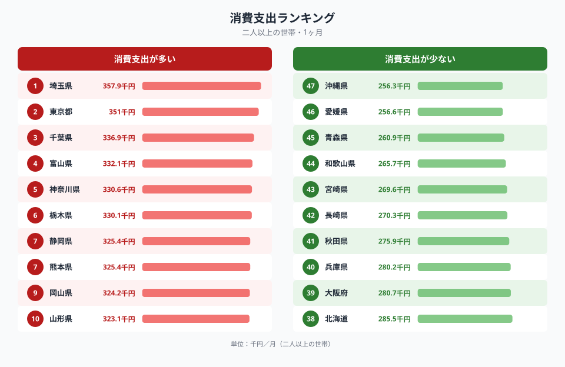
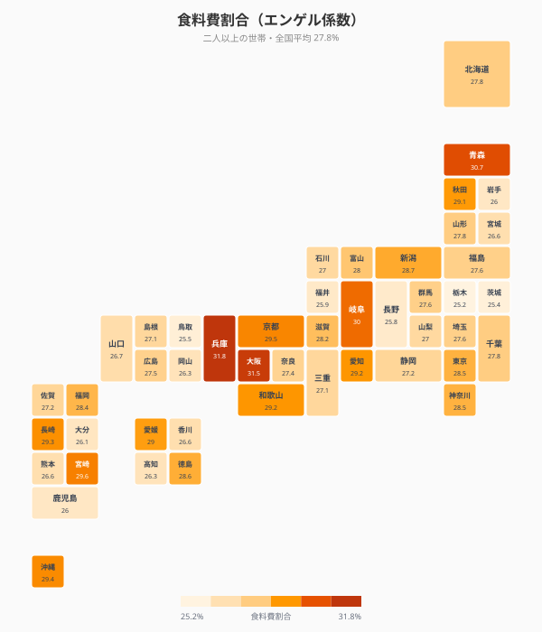
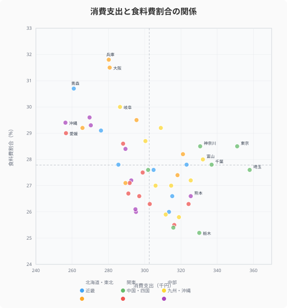
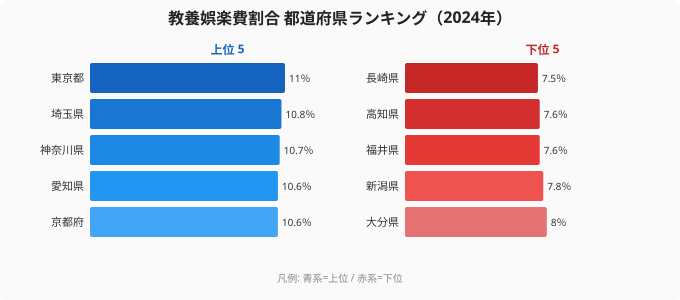
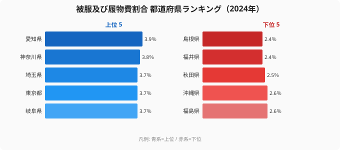
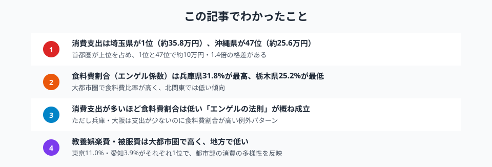

「自分の住んでいる県の生活費は高いのか」「都市部と地方で家計はどれくらい違うのか」──家計の支出構造は、暮らしのコストと豊かさを映し出す鏡です。

この記事では、総務省「家計調査」のデータ（二人以上の世帯）をもとに、**1ヶ月あたりの消費支出**を47都道府県で比較します。ランキング・タイルマップ・散布図の3つの視点から、家計支出の地域差とその背景を読み解きます。

## 消費支出ランキング（2024年）

<data-source url="https://www.e-stat.go.jp/dbview?sid=0000010212" label="e-Stat 社会・人口統計体系"></data-source>

**消費支出が最も多いのは埼玉県**（約35.8万円/月）。2位の[東京都](/areas/13000)（約35.1万円）、3位の千葉県（約33.7万円）と続き、**首都圏が上位3位を独占**しています。4位には富山県（約33.2万円）が入り、北陸の堅実な消費水準がうかがえます。5位は神奈川県（約33.1万円）で、トップ5のうち4県が南関東です。

一方、**最も少ないのは沖縄県**（約25.6万円）。愛媛県（約25.7万円）、青森県（約26.1万円）、和歌山県（約26.6万円）と続きます。1位の埼玉県と47位の沖縄県では**約10万円、1.4倍の格差**があります。

<source-link href="/ranking/consumption-expenditure-multi-person-households-per-month">消費支出の全47県ランキングを見る</source-link>

> [!NOTE]
> 消費支出は「二人以上の世帯」の1ヶ月あたり平均額です。単身世帯は含まず、世帯人数の違いが金額に影響する点にご注意ください。

## 食料費割合（エンゲル係数）の都道府県マップ

<data-source url="https://www.e-stat.go.jp/dbview?sid=0000010212" label="e-Stat 社会・人口統計体系"></data-source>

食料費が消費支出に占める割合、いわゆる**エンゲル係数**を都道府県マップで見ると、興味深いパターンが浮かびます。

- **近畿圏で高い** -- 兵庫県（31.8%）が全国1位、大阪府（31.5%）が2位。外食文化やデパ地下・商店街での食品購入が活発な地域特性を反映している可能性があります
- **北関東で低い** -- 栃木県（25.2%）が最低、茨城県（25.4%）が46位。消費支出自体が高めでありながら食料費の比率が低く、住居費や教養娯楽への配分が相対的に大きい
- **東北・九州は中〜高水準** -- 青森県（30.7%）が3位、宮崎県（29.6%）が5位と、所得水準が低い地域でエンゲル係数が高くなる傾向が見られます

全国の都道府県平均は**27.8%**。エンゲル係数が高い県と低い県では約6.6ポイントの差があり、**食費への支出配分は地域によって大きく異なる**ことがわかります。

<source-link href="/ranking/food-expenditure-ratio-multi-person-households">食料費割合の全47県ランキングを見る</source-link>

<ad-slot></ad-slot>

## 消費支出と食料費割合の関係

<data-source url="https://www.e-stat.go.jp/dbview?sid=0000010212" label="e-Stat 社会・人口統計体系"></data-source>

横軸に消費支出、縦軸に食料費割合をとると、**消費支出が多い県ほど食料費割合が低い**という「エンゲルの法則」に近い傾向が確認できます。

散布図の4象限で都道府県を分類すると：

- **右下（支出多い×食料費割合低い）**: 埼玉・千葉・栃木・富山 -- 支出が大きいが食費の比率は控えめで、家計に「ゆとり」がある構造
- **左上（支出少ない×食料費割合高い）**: 青森・宮崎・沖縄・愛媛 -- 支出が少ない中で食費の占める比率が高く、エンゲルの法則が顕著
- **右上（支出多い×食料費割合高い）**: 東京・神奈川 -- 支出総額が大きく、物価の高い都市部では食費も絶対額・比率ともに高い
- **左下（支出少ない×食料費割合低い）**: 該当は少ないが、大分・岩手あたり

注目すべきは**兵庫県と大阪府**です。消費支出は約28万円台と全国平均以下でありながら、食料費割合は31%超と全国トップクラス。支出が少ないにもかかわらず食費比率が高い、独特のパターンを示しています。

## 教養娯楽費の地域差

<data-source url="https://www.e-stat.go.jp/dbview?sid=0000010212" label="e-Stat 社会・人口統計体系"></data-source>

**教養娯楽費割合**では東京都（11.0%）・埼玉県（10.8%）・[神奈川県](/areas/14000)（10.7%）と大都市圏が上位を独占し、最下位の[長崎県](/areas/42000)（7.5%）と3.5ポイントの差があります。文化施設・レジャー施設へのアクセスや所得水準が影響していると考えられます。

<source-link href="/ranking/culture-recreation-expenditure-ratio-multi-person-households">教養娯楽費割合の全47県ランキングを見る</source-link>

## 被服費の地域差

<data-source url="https://www.e-stat.go.jp/dbview?sid=0000010212" label="e-Stat 社会・人口統計体系"></data-source>

**被服及び履物費割合**では[愛知県](/areas/23000)（3.9%）が1位。名古屋を中心としたファッション消費の活発さを反映しています。[神奈川県](/areas/14000)（3.8%）・埼玉県（3.7%）・東京都（3.7%）と都市部が続き、島根県（2.4%）が最下位です。福井県は教養娯楽費・被服費ともに下位で、食費以外の支出を抑える堅実な家計構造がうかがえます。

<source-link href="/ranking/clothing-footwear-expenditure-ratio-multi-person-households">被服及び履物費割合の全47県ランキングを見る</source-link>

> [!TIP]
> エンゲル係数が低いからといって「生活が豊か」とは限りません。住居費（持ち家率）・教育費・医療費など、地域ごとに「お金をかける項目」が異なります。複数の指標を組み合わせて見ることが大切です。

<ad-slot></ad-slot>

## まとめ

家計支出の地域差を4つの視点で分析した結果をまとめます。

家計の支出構造は、所得水準・物価・生活スタイル・地域の産業構造など、複合的な要因で決まります。首都圏の高い消費支出は所得水準と物価の高さを反映し、近畿圏の高いエンゲル係数は食文化との関連がうかがえます。

家計を見直す際は、全国平均との単純比較だけでなく、**同じ地方ブロック内での比較**や**支出割合の内訳**に着目すると、より実態に即した分析ができます。

## データ出典

本記事のデータはe-Stat（政府統計の総合窓口）を基に作成しています。
