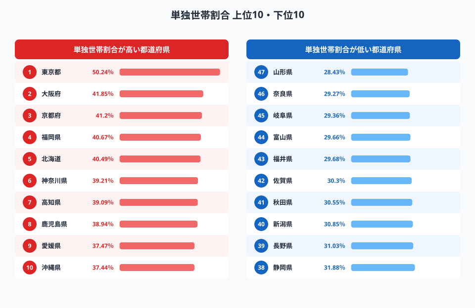
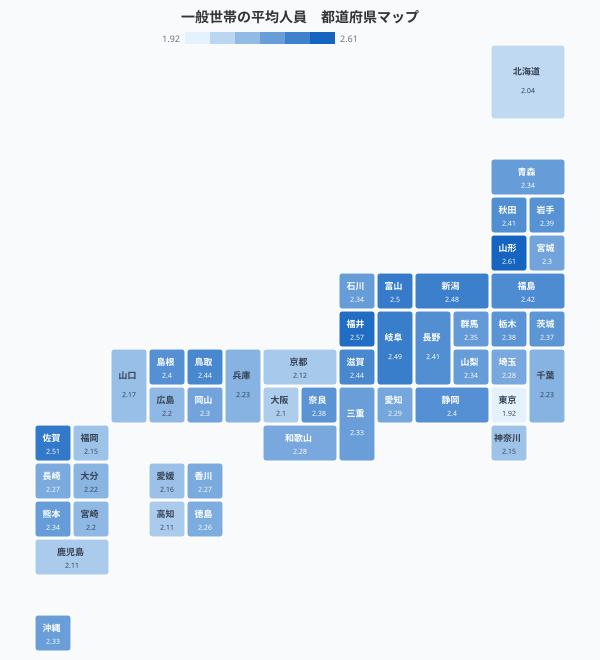
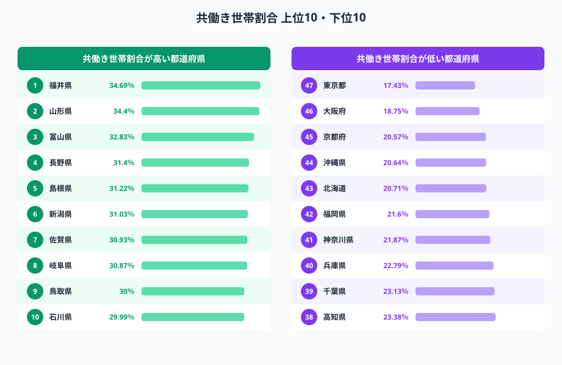
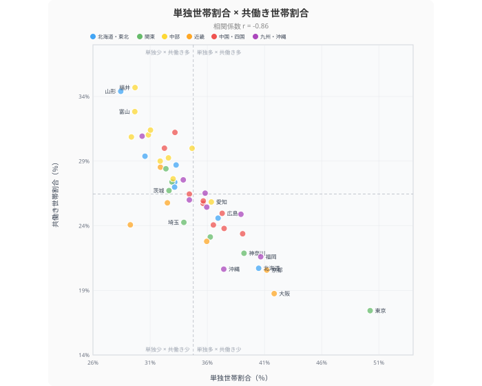

「夫婦と子ども2人」──かつて「標準世帯」と呼ばれた家族の姿は、統計上すでに少数派になっています。2020年国勢調査によると、一般世帯の平均人員は全国で**2.21人**。[東京都](/areas/13000)にいたっては**1.92人**で、世帯あたり2人を切りました。

本記事では、単独世帯割合・一般世帯の平均人員・核家族世帯割合・共働き世帯割合の4指標を使い、47都道府県の世帯構造をランキング形式で分析します。データから浮かび上がるのは、「小さな世帯」が急増する大都市圏と、三世代同居・共働きが根づく地方との鮮明なコントラストです。

> [!NOTE]
> 本記事のデータはすべて2020年国勢調査に基づきます。単独世帯割合は一般世帯に占める1人世帯の割合、共働き世帯割合は「夫婦のいる一般世帯」に占める「夫・妻ともに就業」の世帯の割合です。

## 単独世帯割合ランキング──東京は2世帯に1世帯が「ひとり暮らし」

<data-source url="https://www.e-stat.go.jp/dbview?sid=0000010201" label="e-Stat 社会・人口統計体系"></data-source>

**1位は東京都の50.24%**。都内の一般世帯のじつに半数以上がひとり暮らしです。大阪府（41.85%）、京都府（41.20%）と三大都市圏の府が続きます。上位10には福岡県（39.76%）、北海道（39.43%）、高知県（37.19%）など、大学・若年労働力の流入が多い県や高齢化が進む県が並びます。

一方、**最も単独世帯が少ないのは[山形県](/areas/06000)の28.43%**。奈良県（29.27%）、岐阜県（29.36%）と、三世代同居の文化が残る地域が下位を占めます。

トップの東京都と最下位の山形県の差は**21.81ポイント**。同じ日本でも、世帯の「形」はまるで別の国のように異なっています。

> [!TIP]
> 単独世帯の増加は、若年層の晩婚化・非婚化と高齢者の独居化の両方によって進んでいます。東京都の場合、20〜30代の単身者と65歳以上の独居高齢者が同時に増えている「二重の単独化」が特徴です。

<source-link href="/ranking/single-person-household-ratio">47都道府県の単独世帯割合ランキングをもっと見る</source-link>

## 一般世帯の平均人員マップ──「2人世帯」が標準になった日本

<data-source url="https://www.e-stat.go.jp/dbview?sid=0000010201" label="e-Stat 社会・人口統計体系"></data-source>

マップの色が濃いほど1世帯あたりの人数が多い県です。**三大都市圏（東京1.92人、大阪2.10人、北海道2.04人）が薄色**で、世帯が小さいことが一目でわかります。

逆に**色が濃い＝世帯が大きいのは日本海側と九州**。山形県（2.61人）、[福井県](/areas/18000)（2.57人）、佐賀県（2.51人）がトップ3です。これらの県に共通するのは、三世代同居の割合が高いこと。親世代と子世代が同居することで、1世帯あたりの人数が押し上げられます。

全国平均は2.21人。1960年代の4人台から半世紀余りで半減した計算です。

### 平均人員が「1人台」に突入した東京都の意味

東京都の1.92人は、世帯の過半数が1人世帯であることを数値的にも裏づけています。共同住宅（マンション・アパート）の供給が多く、単身での入居が容易なインフラが整っていることが背景にあります。一方で、子育て世帯にとっては住居費の高さが都外流出の要因となり、世帯規模をさらに縮小させる悪循環が生まれています。

<source-link href="/ranking/average-persons-per-general-household">47都道府県の一般世帯平均人員ランキングをもっと見る</source-link>

<ad-slot></ad-slot>

## 共働き世帯割合ランキング──北陸・東北が圧倒的に強い

<data-source url="https://www.e-stat.go.jp/dbview?sid=0000010206" label="e-Stat 社会・人口統計体系"></data-source>

**共働き1位は福井県（34.69%）**。山形県（34.40%）、富山県（32.83%）と北陸・東北勢がトップ3を独占します。上位10のうち8県が中部・東北地方に集中しており、「北陸＝共働き王国」というデータ上のパターンがはっきり表れています。

対照的に、**最も共働き割合が低いのは東京都の17.43%**。大阪府（18.75%）、京都府（20.57%）と大都市圏が下位を占めます。福井県の34.69%は東京都の約2倍にあたります。

### なぜ北陸で共働きが多いのか

北陸地方の共働き率が高い背景には複数の要因があります。

- **三世代同居率が高い**：祖父母が子どもの面倒を見ることで、夫婦ともにフルタイムで働ける
- **製造業の集積**：工場勤務など女性の就労先が豊富
- **保育インフラの充実**：待機児童が少なく、保育所の入所が容易
- **通勤時間の短さ**：都市部のような長時間通勤がなく、仕事と家事の両立がしやすい

> [!TIP]
> 東京都の共働き割合が低いのは、「共働きしたくない」のではなく、「単独世帯が多すぎて夫婦世帯自体の比率が低い」ことが主因です。夫婦のいる世帯に限定した場合、共働き率の地域差はやや縮まります。

<source-link href="/ranking/dual-income-household-ratio">47都道府県の共働き世帯割合ランキングをもっと見る</source-link>

## 単独世帯割合 × 共働き世帯割合──大都市と地方の対極構造

<data-source url="https://www.e-stat.go.jp/" label="e-Stat 社会・人口統計体系"></data-source>

**相関係数は r = -0.86**。強い負の相関です。つまり、**単独世帯が多い県ほど共働き世帯が少なく、単独世帯が少ない県ほど共働き世帯が多い**という関係がはっきり見えます。

### 右下の象限──「単独多×共働き少」の大都市圏

東京都（単独50.2%・共働き17.4%）、大阪府（単独41.9%・共働き18.8%）、京都府（単独41.2%・共働き20.6%）がこの象限に位置します。若年単身者と高齢独居が多く、夫婦世帯の比率自体が低いため、共働き割合も低くなる構造です。

### 左上の象限──「単独少×共働き多」の北陸・東北

福井県（単独31.4%・共働き34.7%）、山形県（単独28.4%・共働き34.4%）、富山県（単独31.8%・共働き32.8%）が典型です。三世代同居が子育てを支え、夫婦ともに就業しやすい環境が整っています。

この散布図は、日本の世帯構造が「**都市型（小さい世帯・単身中心）」と「地方型（大きい世帯・共働き中心）」に二極化**していることを如実に示しています。

<source-link href="/correlation?x=single-person-household-ratio&y=dual-income-household-ratio">単独世帯割合×共働き世帯割合の相関を都道府県別に見る</source-link>

<ad-slot></ad-slot>

## 核家族世帯割合──「核家族」すら減っている東京

単独世帯の増加は、核家族世帯の割合にも影響を与えています。核家族世帯割合の都道府県ランキングでは、意外な結果が出ます。

**核家族割合の最下位は東京都**です。「核家族化」が進んでいるはずの都市部で、なぜ核家族割合が低いのか。答えは単純で、**単独世帯が全世帯の半分を占めるため、相対的に核家族の割合が押し下げられている**のです。

1位の奈良県（62.59%）や3位の埼玉県（58.57%）は、大阪・東京のベッドタウンとして「夫婦＋子ども」型の世帯が多い郊外住宅地のパターンを反映しています。

<source-link href="/ranking/nuclear-family-households-ratio">47都道府県の核家族世帯割合ランキングをもっと見る</source-link>

## まとめ

日本の世帯構造は、かつての「夫婦と子ども2人」という標準モデルから大きく変容しています。東京都では2世帯に1世帯がひとり暮らし。一般世帯の平均人員は2人を割り込みました。一方で、北陸・東北では三世代同居と共働きが依然として社会の基盤を支えています。

この「都市型」と「地方型」の二極化は、住宅政策、保育政策、介護政策のすべてに影響を与えます。全国一律の「世帯」像を前提とした制度設計は、もはや現実に合わなくなっているのかもしれません。

## データ出典

- e-Stat 社会・人口統計体系（人口・世帯）statsDataId: 0000010201 — 単独世帯割合・一般世帯平均人員・核家族世帯割合（2020年国勢調査）
- e-Stat 社会・人口統計体系（労働）statsDataId: 0000010206 — 共働き世帯割合（2020年国勢調査）
