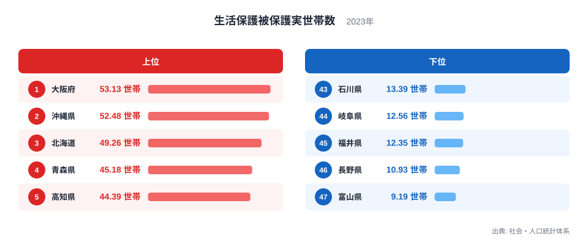
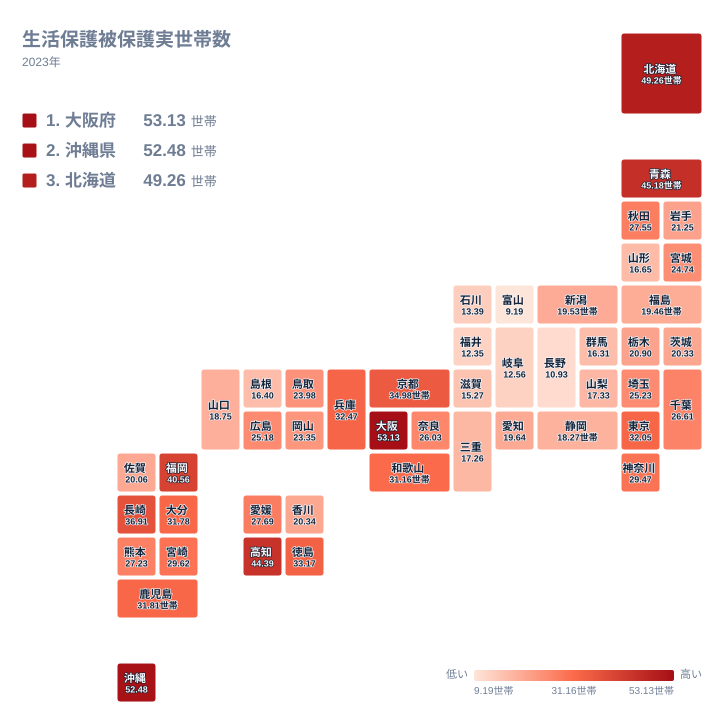

生活保護は、経済的に困窮した世帯の生活を支える国の制度です。この記事で扱う生活保護被保護実世帯数は、2023年に社会・人口統計体系で公表された値で、人口千人当たりの世帯数として都道府県別に集計されています。

全国の値を並べると、最も高い大阪府は53.13世帯、最も低い富山県は9.19世帯となっており、上位と下位の間には5倍を超える開きがあります。この差は単純な「困っている人が多いか少ないか」という話には収まりません。高齢化の進み方、産業構造、住宅事情、そして自治体の窓口運用の違いが折り重なって、この数字を形づくっています。

この記事では、上位と下位のそれぞれの県に共通する背景を、人口構造と産業の面から読み解いていきます。

## 上位と下位の顔ぶれ

<source-link href="/ranking/households-on-public-assistance-per-1000">生活保護被保護実世帯数ランキングをもっと見る</source-link>

上位を見ると、大阪府が53.13世帯で1位、沖縄県が52.48世帯で2位、北海道が49.26世帯で3位、青森県が45.18世帯で4位、高知県が44.39世帯で5位と続きます。いずれも大都市圏の中心部を抱えるか、あるいは本州から離れた地理条件を持つ地域です。

大阪府は西日本を代表する規模の都市機能を持つ一方で、高度経済成長期に労働需要を支えた単身男性の高齢化が進んだ地域を抱えています。沖縄県は全国でも出生率が高い一方、平均所得が低く、非正規雇用の比率が高いという特徴があります。北海道は炭鉱業や造船業の縮小によって地域経済が転換を迫られ、青森県と高知県はともに人口減少と高齢化が全国平均より早く進んでいる県です。

下位に目を移すと、富山県が9.19世帯で47位、長野県が10.93世帯で46位、福井県が12.35世帯で45位、岐阜県が12.56世帯で44位、石川県が13.39世帯で43位となっています。北陸から中部にかけて連なるこれらの県には、共通の特徴があります。持ち家率が全国でも高い水準にあり、三世代同居を含む多世代世帯の比率が高く、製造業を中心に安定した雇用機会が地域内に存在してきました。

## 地理で見る分布

タイルマップで全国を見渡すと、生活保護率が高い地域は近畿の一部と沖縄、北海道、東北の一部、四国の一部に分かれて存在しており、単純に東西や都市部と地方部で二分できる分布ではないことがわかります。むしろ、それぞれの地域が抱える固有の事情が数字に表れています。

大阪府や京都府のような都市部では、単身高齢者の増加と、生活保護受給者を支援する社会資源が集積していることが影響しています。都市部は公共交通機関やケースワーカーによる支援体制が整っているため、困窮した人が生活の場を求めて集まりやすいという側面もあります。一方、沖縄県や高知県のような地方部では、若年層の雇用機会が限られ、非正規雇用や季節労働に依存する家計が多いことが背景にあります。

北陸や中部の低い地域は、この逆の構図です。製造業の集積によって安定した雇用が地域内で確保され、持ち家と多世代同居によって単身高齢者が生活保護に頼らずに暮らせる仕組みが、社会の中に組み込まれてきました。

> [!NOTE]
> この数値は人口千人当たりの世帯数であり、受給者の個人数ではありません。単身世帯が多い地域ほど、同じ人数の受給者がいても世帯数としては多く数えられる点に注意してください。

## 人口構造と産業構造から見る要因

生活保護率の地域差を生む最も大きな要因のひとつが、高齢単身世帯の比率です。配偶者との死別や離別によって一人暮らしとなった高齢者は、年金だけでは生活費を賄えない場合に生活保護を利用します。大都市圏では核家族化が早くから進み、高齢期に子どもと同居しない世帯が多いため、この構造が顕著に表れます。

産業構造の違いも大きな要素です。製造業の集積地では、正社員としての長期雇用が地域の標準的な働き方として定着してきました。これに対して、観光業やサービス業への依存度が高い地域、あるいは基幹産業が縮小してきた地域では、非正規雇用や季節による収入変動が生活基盤を不安定にしやすい傾向があります。沖縄県の観光業や北海道のかつての炭鉱業は、その典型的な例です。

住宅費の違いも見逃せません。都市部では家賃負担が重く、収入が少ない世帯ほど生活を維持することが難しくなります。反対に、持ち家率が高く地価も比較的落ち着いている地域では、住居費の負担が軽く、同じ収入でも生活を成り立たせやすいという事情があります。

さらに、親族との同居慣行も影響します。三世代同居が根付いている地域では、高齢者や失業した家族を世帯内で支え合う仕組みが機能しやすく、生活保護に至る前の段階で生活が下支えされます。北陸地方の低い数値は、この慣行の強さを反映していると考えられます。

> [!WARNING]
> 生活保護率の高低は、その地域の困窮度を測る唯一の指標ではありません。制度の利用資格があっても実際に申請していない世帯の割合(捕捉率)は地域によって差があり、また単身世帯が多い地域ほど同じ困窮度でも世帯数としての数値が高く出やすいという世帯構成の違いもあります。数値だけで地域の福祉水準を単純に比較することは避けてください。

## この指標を読み解くときの視点

生活保護率を都道府県間で比較する際は、その地域がどのような人口構成と産業構造を持っているかをあわせて見ることが欠かせません。高齢単身世帯が多いのか、非正規雇用の比率が高いのか、あるいは持ち家と多世代同居が定着しているのか。こうした背景を踏まえることで、単なる順位表以上の理解が得られます。

同じカテゴリの他の指標と重ねて見ることで、地域ごとの社会保障の姿がより立体的に見えてきます。[同じカテゴリの統計一覧](/category/socialsecurity)から関連する指標もあわせて確認してみてください。

> [!TIP]
> この指標を読むときは、高齢化率や単身世帯率、非正規雇用率といった関連指標と重ねて見ると、なぜその県で数値が高いのか低いのかの背景がより具体的につかめます。単独の数値だけで結論を出さず、複数の指標を組み合わせて考えることをおすすめします。

大阪府と沖縄県は、それぞれ異なる背景を持ちながら生活保護率が高い代表的な県です。[大阪府のデータ](/areas/27000)と[沖縄県のデータ](/areas/47000)を見比べると、都市型と地方型という二つの異なる要因の現れ方を確認できます。

## データ出典

出典: 社会・人口統計体系(2023年)
