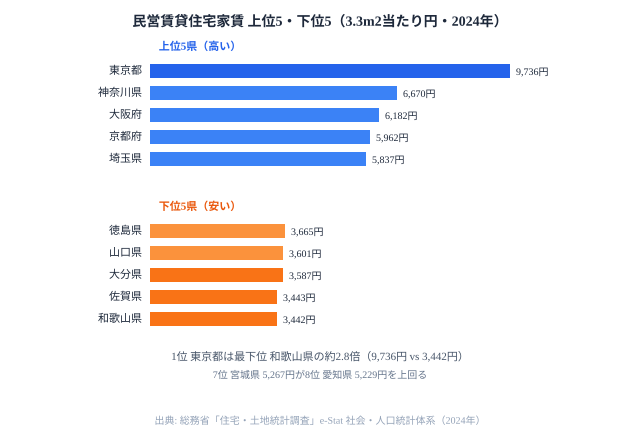

リモートワークが当たり前になり「住む場所」を選べる時代が来ました。ならば、住居コストの地域差はどれほどなのでしょうか。

東京で民営賃貸住宅の家賃は3.3m2あたり**9,736円**です。富山は**3,867円**で、同じ面積を2,500円以上安く住めます。しかも東京の持ち家住宅の面積は**90.5m2**なのに対し、富山は**167.5m2**と約1.85倍も広いのです。家賃が高い県ほど狭く、安い県ほど広い──直感に反する逆転が、データの上ではっきりと現れます。

この記事では総務省「住宅・土地統計調査」をもとに、**家賃の50年推移・都道府県別格差・持ち家率・空き家率・家賃×住宅面積の相関**を可視化し、「住む場所を変えること」の具体的な住居コスト効果を検証します。結論を先に言えば、家賃と住宅面積のあいだには明確な負の相関があり、その正体は気候と地価という構造要因にあります。

> [!NOTE]
> 家賃データは「民営賃貸住宅の1か月3.3m2（1坪）当たり家賃」で、総務省「住宅・土地統計調査」に基づくe-Stat社会・人口統計体系のデータを使用しています。住宅面積は「持ち家住宅の延べ床面積（都道府県別平均）」です。家賃と住宅面積は調査年が異なるため、絶対値の厳密比較ではなくトレンドの把握として参照してください。

## 家賃ランキング──東京9,736円 vs 和歌山3,442円

まずは2024年の家賃そのものを、上位5県と下位5県で見てみます。

最上位は東京都の**9,736円**です。2位の神奈川県（6,670円）に3,000円以上の大差をつけており、3位大阪府（6,182円）、4位京都府（5,962円）、5位埼玉県（5,837円）と、上位は三大都市圏とその周辺が占めています。需要が集中し供給が地価で頭打ちになる大都市では、家賃が高止まりするのが基本構造です。

下位を見ると、最も安いのは和歌山県の**3,442円**で、46位の佐賀県（3,443円）とわずか1円差で並びます。45位大分県（3,587円）、44位山口県（3,601円）、43位徳島県（3,665円）と、下位5県は西日本の非大都市圏が連なります。1位東京と47位和歌山の差は約2.8倍で、同じ広さの部屋に住むだけで支出が3倍近く変わる計算になります。

上位のなかで注目したいのが**7位の宮城県（5,267円）**です。仙台市への都市機能の集中と東日本大震災後の復興需要が家賃を押し上げ、製造業の集積地である**8位の愛知県（5,229円）**を上回りました。人口規模では愛知が圧倒しているのに家賃で逆転している点は、家賃が「人口の多さ」だけでなく「住宅供給と需要のバランス」で決まることを示しています。さらに意外な高順位として、**長崎県が全国11位（4,883円）**に入ります。坂が多く平地が限られる地形で住宅供給に制約があり、人口規模に比して家賃が高くなる構造が背景にあります。

<source-link href="/ranking/private-rental-housing-rent-per-3-3m2">47都道府県の民営賃貸住宅家賃ランキングをもっと見る</source-link>

> [!WARNING]
> 家賃の「順位」は人口の多さと一致しません。宮城が愛知を上回り、長崎が11位に入るように、供給制約（地形・震災復興・都市化のスピード）が需要以上に効くケースがあります。「大都市＝高い／地方＝安い」という単純な二分では読み違えます。

<ad-slot></ad-slot>

## 50年間の家賃推移──バブル急騰・20年停滞・2024年再上昇

家賃の水準は、長い時間軸で見ると大きく性格を変えてきました。全国平均（3.3m2当たり）の50年は、おおむね3つのフェーズに分けられます。

**第1期（1975〜1997年）高度成長〜バブル急騰**: 約1,500円から4,028円へ、22年で2.7倍に上昇しました。とくに1987〜1993年のバブル期は年100〜200円ペースで急騰しています。地価の上昇が賃料に転嫁され、家賃が右肩上がりだった時代です。

**第2期（1998〜2018年）20年停滞**: 4,253円から4,339円まで、20年間でわずか2%の変動にとどまりました。デフレ経済の影響で、家賃が上がりも下がりもしない時代が続いたのです。

**第3期（2019年〜）再上昇**: 2019年に一度4,216円まで下がった後、2024年には4,467円へ再上昇しています。建築資材の高騰と人手不足による新築コストの上昇が、賃料に転嫁され始めているのが要因です。

この推移が示すのは、家賃の地域差そのものも時代によって伸縮するということです。地価が暴れたバブル期には大都市と地方の差が最も開き、停滞期には差が固定化されました。2024年からの再上昇局面で、その差がふたたび広がるのか縮むのかは、移住を考える人にとって見逃せない論点になります。

> [!TIP]
> 2000年代の「停滞」は名目値の話です。この間も物価は微減〜横ばいだったため、実質ベースではほぼ変わっていません。2024年の上昇は名目・実質ともに明確な転換点になる可能性があり、「いま地方が安い」状態がいつまで続くかを見極める手がかりになります。

## 持ち家率60%・空き家率14%の逆説──安定した「所有」と増え続ける「空洞」

住む場所のコストを考えるとき、家賃と並んで重要なのが「持ち家」と「空き家」の動きです。

**持ち家比率は45年間ほぼ横ばい**です。1978年の60.4%から2023年の60.9%まで、0.5ポイントしか変動していません。「日本人の6割がマイホームを持つ」という構造は、半世紀のあいだ変わっていないのです。

一方で、**空き家比率は7.6%から13.8%へほぼ倍増**しました。2023年時点では全国の住宅の約7戸に1戸が空き家です。所有の割合が安定しているのに空き家だけが増えるのは、一見すると矛盾しているように見えます。

> [!WARNING]
> 持ち家率の「安定」と空き家の「増加」は矛盾しません。人口減少・世帯の小規模化により、持ち家を持つ世帯の割合が変わらなくても、誰も住まない住宅が増え続けている構造です。空き家の多くは過疎地域に集中しており、「持ち家を持てる地域」と「持ち家が余る地域」が重なっています。地方移住では、家賃の安さの裏側にこの「空洞」があることも織り込んで読む必要があります。

都道府県別に見ると、持ち家比率が最も高いのは**秋田県の77.1%**、最も低いのは**沖縄県の42.6%**で、その差は35ポイントにのぼります。沖縄は台風対策のRC造で建築コストが高く、持ち家取得のハードルが高いことが影響しています。

<source-link href="/ranking/owner-occupied-housing-ratio">47都道府県の持ち家比率ランキングをもっと見る</source-link>

<source-link href="/ranking/vacant-housing-ratio">47都道府県の空き家比率ランキングをもっと見る</source-link>

<ad-slot></ad-slot>

## 家賃 × 住宅面積の負の相関──「安い県ほど広い家」の構造

ここまでの家賃ランキングに、もう一つの指標「持ち家住宅の延べ面積」を重ねると、この記事の核心が見えてきます。家賃が安い県ほど、持ち家住宅の延べ面積が広いという**明確な負の相関**です。

**「安くて広い」の北陸・東北**: 富山（3,867円・167.5m2）、福井（3,927円・163.5m2）、山形（3,875円・159.9m2）が「安くて広い」象限に集中します。豪雪地帯で広い住宅が必要という気候要因に加え、地価の安さが面積の広さを支えています。雪国では作業場や物置を兼ねた広い間取りが標準で、安い地価がそれを可能にしているのです。

**「高くて狭い」の首都圏**: 東京（9,736円・90.5m2）、神奈川（6,670円・97.9m2）が「高くて狭い」象限に位置します。東京の持ち家住宅は富山の**54%の広さ**しかありません。地価が住宅面積の上限を強く規定し、家賃の高さと住宅の狭さが同じ原因（土地の希少性）から生じていることがわかります。

**沖縄の特異なポジション**: 沖縄は家賃が4,614円と中位ですが、面積は106.0m2と全国44位にとどまります。台風対策のRC造で建築コストが高く、「安いわけでも広いわけでもない」特殊な位置にあります。家賃の安さがそのまま広さに結びつかない例外であり、負の相関が万能でないことを示す好例です。

この相関の正体は「家賃が安いから広い」という因果ではなく、**地価という共通の背景要因**が家賃と住宅面積の両方を逆向きに動かしている点にあります。地価が安い地域は家賃も低く、同じ予算でより広い土地・住宅を確保できる──だから「安くて広い」が成立するのです。

> [!NOTE]
> ここで使う面積軸は「持ち家住宅の延べ面積」であり、賃貸住宅の面積ではありません。家賃（賃貸）と面積（持ち家）を直接かけ合わせているため、厳密には別の住み方の指標を並べています。ただし持ち家のゆとりはその地域の住環境全体を反映するため、地方移住の判断材料としては有効です。「賃貸で借りても同じだけ広い」と早合点しない点に注意してください。

## まとめ──住む場所を変えることの住居コスト効果

50年間のデータから浮かぶ構造を整理すると、住居コストは大きく3つの地域タイプに分かれます。

- **最高コスト圏（東京）**: 家賃は3.3m2あたり9,736円、持ち家面積は90.5m2で、高コストかつ狭小です。地価の希少性が両方を規定しています。
- **中高コスト圏（神奈川・大阪など）**: 家賃は6,000〜7,000円台、持ち家面積は95〜110m2で、都市の利便とコストが均衡する中間層です。
- **低コスト・広居圏（富山・福井・山形）**: 家賃は3,800〜4,000円、持ち家面積は155〜167m2で、低コストかつ広大です。気候要因と安い地価が「安くて広い」を支えています。

リモートワークが可能な職種なら、東京から富山への移住で「家賃を約60%削減しながら住宅面積を1.85倍に拡大」できる計算になります。ただし、仕事の選択肢・教育環境・医療アクセスといった家賃以外の要素も、住む場所の満足度を左右します。「安くて広い」だけが移住の動機になるわけではありませんが、住居コストの地域差はライフプランの意思決定に直結するデータとして活用できます。住宅コストを含むより広い生活コストの地域差は[費目で変わる物価の地域差](/blog/consumer-price-regional-gap)で、住む場所の損得を左右する人口移動の構造は[40道府県が「人口流出」──東京一極集中のリアル](/blog/population-migration-tokyo-concentration)で、家計のゆとりを示す[貯蓄額の県別格差](/blog/savings-balance-gap)とあわせて読むと、移住判断の解像度が上がります。住宅・建設まわりの他の指標は[建設・住宅カテゴリ](/category/construction)から横断できます。

## データ出典

- 総務省「住宅・土地統計調査」各年（家賃・持ち家比率・空き家比率・住宅面積）
- [e-Stat 社会・人口統計体系](https://www.e-stat.go.jp/dbview?sid=0000010208)
