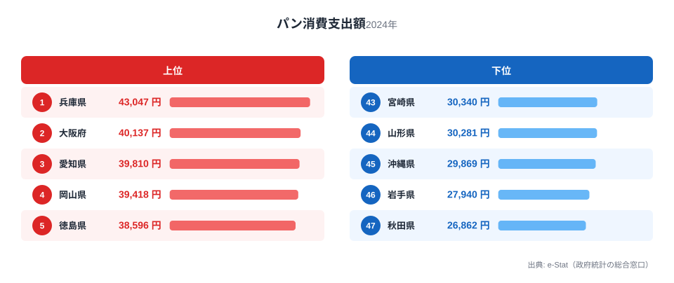
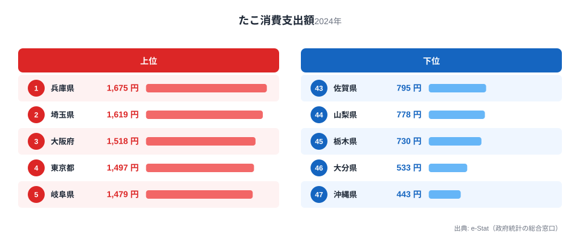

コーヒー、パン、たこ。一見バラバラに見える3品目が、実はすべて兵庫県の消費支出額で全国1位です。総務省「家計調査」の品目別データ（2024年、都道府県庁所在市）を見ると、兵庫の食卓には共通する一本の線が浮かび上がります。それは「港町・神戸」が育てた洋食文化と、「明石」の海が育てた魚食文化が、同じ県内で同居しているという構図です。

この記事では、コーヒー消費支出額10,098円（全国1位）、パン消費支出額43,047円（全国1位）、たこ消費支出額1,675円（全国1位）という3つの数字から、兵庫がなぜ「日本一のコーヒー県」であり「日本一のパン県」であり「日本一のたこ県」でもあるのかを、データにもとづいて解き明かします。

> [!NOTE]
> 本記事の数値はすべて総務省「家計調査（品目別支出額）」2024年の都道府県庁所在市・二人以上世帯データです。兵庫県は神戸市の家計簿から集計されており、県全域の平均ではなく神戸市民の消費行動を反映しています。

## コーヒー消費支出額 — 全国1位10,098円、開港の記憶が飲み物に残る

<source-link href="/ranking/coffee-consumption-expenditure">コーヒー消費支出額ランキングをもっと見る</source-link>

兵庫県のコーヒー消費支出額は10,098円で全国1位です。2位の滋賀県（全国2位・9,799円）、3位の山形県（全国3位・9,446円）を上回り、最下位の鹿児島県（全国47位・5,614円）とは約1.8倍の差があります。

神戸は1868年の開港以来、外国人居留地を通じて西洋の食文化がいち早く流入した街です。喫茶店文化が明治期から根づき、戦後は「神戸物語」に象徴されるような独自のコーヒー消費習慣が定着しました。単身世帯ではなく二人以上世帯のデータであることを踏まえると、家庭でコーヒーを淹れる習慣が世代を超えて受け継がれていると読み取れます。東京都（全国4位・9,364円）も上位に入っており、喫茶店文化や自家焙煎の盛んな土地柄はコーヒー消費と相性が良く、「都市の洋食文化」と「地方の喫茶店文化」の両方から支えられていることがうかがえます。

## パン消費支出額 — 全国1位43,047円、コーヒーと並ぶ洋食の街

<source-link href="/ranking/bread-consumption-expenditure">パン消費支出額ランキングをもっと見る</source-link>

パン消費支出額も兵庫県が43,047円で全国1位です。2位の大阪府（全国2位・40,137円）、3位の愛知県（全国3位・39,810円）と続き、最下位の秋田県（全国47位・26,862円）とは約1.6倍の差があります。

兵庫のパン消費が突出しているのは偶然ではありません。神戸はコーヒーと同様に、開港とともに西洋式のパン食文化が持ち込まれた土地です。神戸のパン屋は昭和初期から独自のブランドを築き、朝食にパンを選ぶ家庭が関西の他地域より多いことが、家計調査の数字にそのまま表れています。コーヒーとパンがともに全国1位という組み合わせは、「朝はパンとコーヒー」という洋食型の朝食習慣が兵庫（特に神戸市）の家庭に根づいていることの裏付けといえます。上位の大阪府・愛知県も同じく都市部で、パン食は都市の食生活パターンと強く結びついていることが読み取れます。

## たこ消費支出額 — 全国1位1,675円、明石の海が育てた魚食文化

<source-link href="/ranking/octopus-consumption-expenditure">たこ消費支出額ランキングをもっと見る</source-link>

たこ消費支出額は兵庫県が1,675円で全国1位です。2位の埼玉県（全国2位・1,619円）、3位の大阪府（全国3位・1,518円）が続きますが、最下位の沖縄県（全国47位・443円）とは約3.8倍もの開きがあり、3品目の中で最も地域差が大きい数字です。

兵庫のたこ消費を支えているのは、言うまでもなく明石海峡の存在です。明石だこは激しい潮流にもまれて身が締まることで知られ、地元では「たこ飯」や「明石焼き（玉子焼き）」として日常的に食卓へ上ります。コーヒーやパンが「開港・都市化」による洋食文化の広がりだったのに対し、たこは「地元の海の幸」という真逆の理由で全国トップに立っている点が興味深いところです。同じ兵庫県内でも、洋食化した神戸の朝食と、明石海峡の海の恵みという、成り立ちの異なる二つの食文化が同居しているのです。

> [!WARNING]
> 家計調査の数値は「支出額」であり「消費量」ではありません。物価水準や購入頻度の違いも反映されるため、明石だこの漁獲量自体を直接示す数字ではない点に注意が必要です。また明石焼き（玉子焼き）は「その他の外食」など別区分に計上される場合があり、たこそのものの購入額だけでは兵庫の食文化の全体像を測りきれない面もあります。

## 兵庫の食卓を貫くもの

コーヒー・パン・たこという一見無関係な3品目を貫く軸は、「開港都市・神戸」と「漁港・明石」という2つの顔を持つ兵庫県の地理的多様性です。コーヒーとパンは、神戸が幕末の開港以来受け入れてきた西洋の食文化がそのまま家計に定着した結果であり、都市部での洋食型の朝食習慣を映しています。一方でたこは、明石海峡という日本有数の好漁場を抱える兵庫ならではの、地元産の海の幸への支出です。

同じ「食卓の全国1位県」でも成り立ちは対照的です。[和歌山の食卓](/blog/wakayama-food-culture)がみかん産地としての農産物依存を示すのに対し、兵庫は「輸入された食文化」と「地元の海産物」という二重構造で1位を獲得しています。1つの県庁所在地の家計簿に、開港都市としての歴史と漁港を抱える地理条件の両方が刻まれているのが兵庫の食卓の特徴です。

> [!TIP]
> コーヒーとパンがともに全国1位という組み合わせは、47都道府県の中でも珍しい「洋食セット制覇」です。両方が1位の県は他になく、兵庫の家庭が「朝食は洋食」という生活スタイルを強く持っていることの証左といえます。たこの支出額と合わせて見ると、兵庫は「洋食の朝」と「和食・海鮮の夜」という二重の食生活を持つ県だと読み解けます。

## まとめ

- コーヒー消費支出額は兵庫県が10,098円で全国1位、2位滋賀県（9,799円）を上回る
- パン消費支出額も兵庫県が43,047円で全国1位、コーヒーと合わせて「洋食セット制覇」の珍しい組み合わせ
- たこ消費支出額は兵庫県が1,675円で全国1位、最下位沖縄県（443円）とは約3.8倍の開き
- 兵庫の食卓は「開港都市・神戸」の洋食文化と「明石海峡」の海産物文化という二重構造で全国トップを形成している

兵庫県の地域プロフィールは[兵庫県のページ](/areas/28000)で他の指標もあわせて確認できます。家計調査にもとづく他の経済指標は[経済カテゴリ一覧](/category/economy)からご覧いただけます。

## データ出典

総務省統計局「家計調査（品目別支出額）」2024年、都道府県庁所在市・二人以上世帯のデータを使用。e-Stat（政府統計の総合窓口）経由で取得・集計しています。
