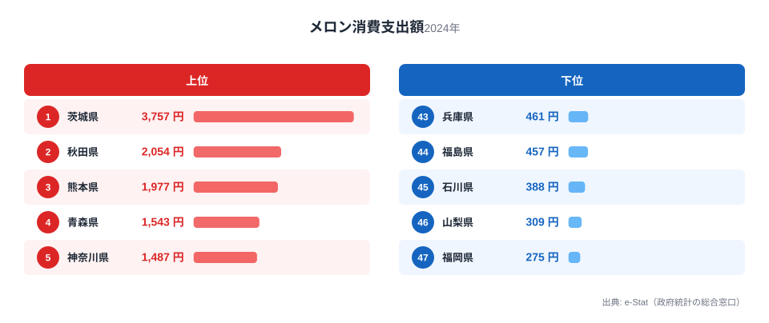
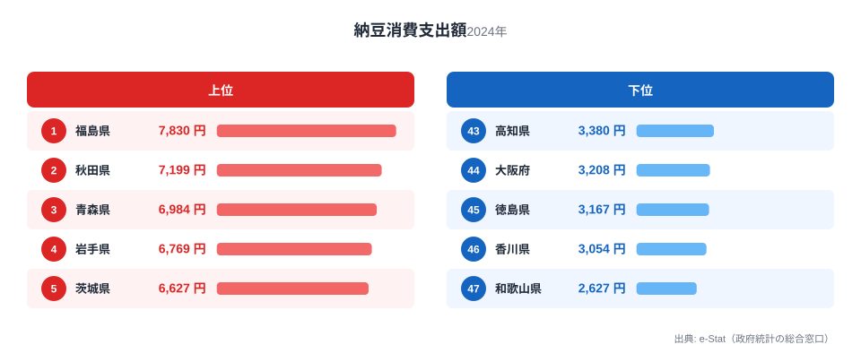
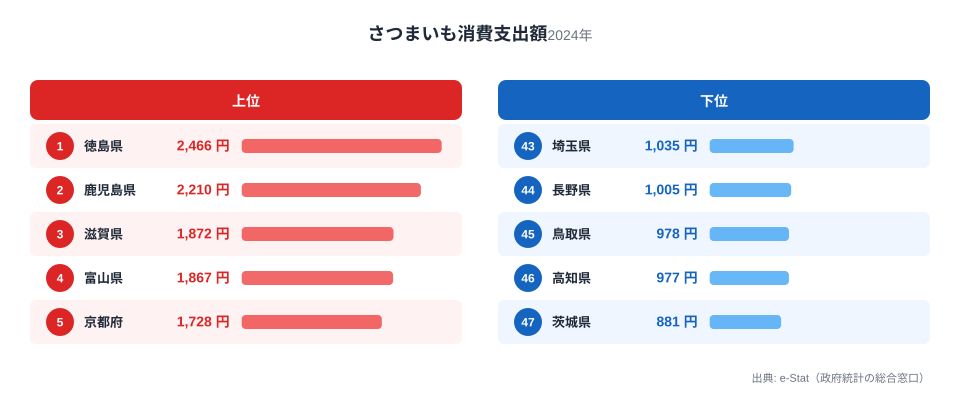
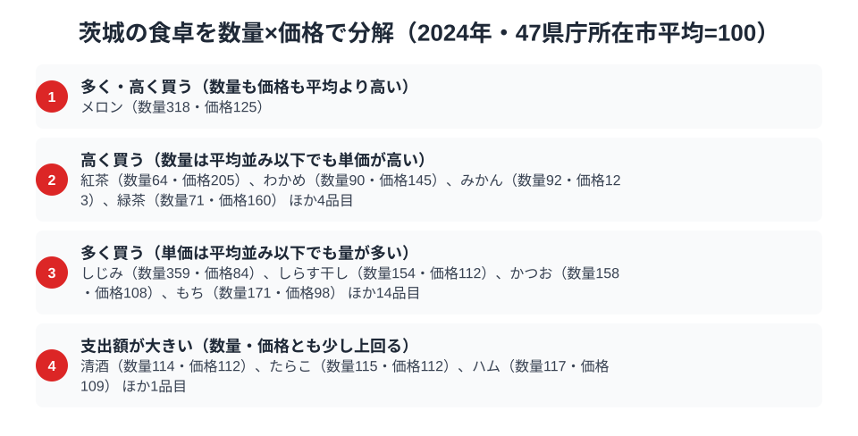

茨城と聞いて食卓を思い浮かべるなら、まず出てくるのは「メロン」と「納豆」ではないでしょうか。実際に家計調査のデータを見ると、[茨城県](/areas/08000)はメロンの消費支出額で全国1位という結果が出ています。年間3,757円、2位の秋田県2,054円を大きく引き離す圧勝です。

ところが、もう一方の代名詞である納豆は全国5位にとどまります。「水戸納豆」として全国区の知名度を持つ茨城が、なぜ支出額では1位を取れないのか。さらに、産地としてのイメージがあまりない「さつまいも」では全国最下位という結果も出ています。この記事では、家計調査（品目別）の実データから、メロン・納豆・さつまいもの3品目を通して茨城の食卓の内訳を掘り下げます。

> [!NOTE]
> このデータは総務省統計局「家計調査（品目別）」の**都道府県庁所在市・二人以上世帯**を対象にした年間消費支出額です。全国を代表するとは限りませんが、都市部の家計における実際の購入傾向を示す公式統計として広く使われています。

## メロン — 全国1位3,757円、産地の底力

<source-link href="/ranking/melon-consumption-expenditure">メロン消費支出額ランキングをもっと見る</source-link>

茨城県のメロン消費支出額は3,757円で全国1位です。秋田県は2,054円で全国2位、熊本県は1,977円で全国3位となっており、茨城は他県の約1.8倍という圧倒的な水準にあります。

茨城県は「アンデスメロン」や「イバラキング」など複数のブランドメロンを生産する全国有数の産地です。鉾田市を中心とする県南地域の砂質土壌がメロン栽培に適しており、生産量そのものが全国トップクラスであることが、地元消費の多さにも直結していると考えられます。地元で採れたものを地元で食べる「地産地消」が支出額に色濃く表れた結果と言えるでしょう。

## 納豆 — 全国5位6,627円、なぜ本場が1位ではないのか

<source-link href="/ranking/natto-consumption-expenditure">納豆消費支出額ランキングをもっと見る</source-link>

「水戸納豆」で全国的に知られる茨城県ですが、納豆消費支出額は6,627円で全国5位にとどまります。福島県は7,830円で全国1位、秋田県は7,199円で全国2位、青森県は6,984円で全国3位となっており、実は東北勢が上位を占めています。

[仮説] 茨城が本場でありながら1位を逃す理由の1つは、「ブランド力と日常消費量は必ずしも一致しない」という構造にあると考えられます。水戸納豆は贈答用・土産用としての側面が強く、全国区の知名度を築いた一方、日常的に食卓に上る頻度では東北地方（特に会津地方や秋田・青森）の食習慣の方が根強いという見方です。検証には家庭内消費量の詳細な購入頻度データが必要で、支出額だけでは断定できません。

## さつまいも — 全国最下位881円、産地に恵まれない理由

<source-link href="/ranking/sweet-potato-consumption-expenditure">さつまいも消費支出額ランキングをもっと見る</source-link>

家計調査の全502品目の中で、茨城が唯一「最下位」に沈むのがさつまいもです。徳島県は2,466円で全国1位、鳴門金時で知られる名産地ですが、茨城の881円は徳島の3分の1をやや上回る程度にとどまります。

茨城県は農業産出額で全国トップクラスの県ですが、その内訳はメロン・ピーマン・れんこん・栗など多品目に分散しています。さつまいもの都道府県別収穫量では茨城も上位に入る年がありますが、[徳島の食卓](/blog/tokushima-food-culture)のように県全体のブランドとして「鳴門金時」のような突出した産地イメージを持つわけではなく、消費者の購入行動としては他の野菜・果物に選択が分散していると考えられます。産地であることと、支出額で1位になることは、必ずしも一致しないという茨城の食卓のもう1つの側面がここに表れています。

> [!WARNING]
> 家計調査の支出額は「金額ベース」の統計であり、消費量（重量・個数）とは異なります。単価が高い品目は消費量が少なくても支出額が上位に出やすく、逆に単価が安い品目は消費量が多くても支出額では目立ちにくい点に注意が必要です。また、れんこんやピーマンなど茨城の主要な農産物の一部は、家計調査の個別集計品目に含まれていないため、この記事の3品目だけで茨城の農業の全体像を語ることはできません。

## 茨城の食卓を貫くもの

メロン・納豆・さつまいもの3品目を通して見えてくるのは、「圧倒的な産地優位（メロン）」と「知名度先行型の準位（納豆）」と「分散する農業構造（さつまいも）」という、決して一枚岩ではない茨城の食の姿です。[福島の食卓](/blog/fukushima-food-culture)が桃・日本酒・納豆の3品目すべてで全国1位を独占するのとは対照的に、茨城は「産地であること」と「消費支出額で1位を取ること」が必ずしも重ならない県だと言えます。これは、農業産出額全国トップクラスの多品目生産県ならではの特徴かもしれません。

> [!TIP]
> 茨城のように「1位」「中位」「最下位」が同じ食卓の中に混在するケースは、単一品目の全国1位だけを見ていては気づけません。[経済カテゴリ一覧](/category/economy)から他の食品ランキングもあわせて見ると、その県の農業構造がどのくらい分散しているか、逆にどれだけ特定品目に集中しているかが見えてきます。

## 数量×価格で分解する水戸市の食卓

<source-link href="/ranking/melon-consumption-quantity">メロン消費量ランキングをもっと見る</source-link>

家計調査の支出額は「金額=数量×価格」という式に分解できます。品目ごとに47都道府県庁所在市の平均を100とした指数に直すと、メロン・納豆・さつまいもの支出額の順位だけでは見えなかった、「たくさん食べているのか、単価の高いものを買っているのか」という別の読み方が見えてきます。

メロン消費量は47市の中でも際立って多く、数量指数は318に達します。価格指数も125とやや高めで、量と単価の両方が平均を上回る数少ない品目です。単に高いメロンを少しだけ買っているのではなく、地元で穫れたメロンをたっぷり食べたうえで、単価もやや上のものを選んでいる構図がうかがえます。

対照的に、しじみは数量指数359とメロンを上回るほど多く買われていますが、価格指数は84で全国平均より安く仕入れています。霞ヶ浦・北浦を抱える茨城では、しじみは日常的に手に入る身近な食材であり、たくさん食べても単価は上がらない「量の食文化」の典型例と言えるでしょう。反対に紅茶は数量指数64と購入量そのものは平均を下回るのに、価格指数は205と全国平均の2倍以上あります。頻繁に飲む品目ではないものの、飲むときは単価の高い茶葉を選ぶ、という「高く買う」側の読み方がここには当てはまります。

> [!TIP]
> 支出額の順位だけを見ると「メロンは1位、納豆は5位」という結果しかわかりません。数量指数と価格指数に分解すると、しじみのように「安いから多く食べている」のか、紅茶のように「あまり飲まないが高いものを選ぶ」のか、同じ食卓の中でも品目によって性格が違うことが見えてきます。

> [!NOTE]
> ここでの指数は「47都道府県庁所在市の単純平均=100」を基準にした相対値であり、家計調査の全国値そのものではありません。また価格指数は支出額÷数量から逆算した金額なので、同じ品目でも安い等級を多く買うか高い等級を少し買うかによって数字が変わり、純粋な価格水準を測るものではない点に注意してください。対象は2024年・二人以上世帯・水戸市の年間値です。

## まとめ

- メロン消費支出額は3,757円で全国1位、2位秋田県の2,054円を大きく引き離す
- 納豆消費支出額は6,627円で全国5位、1位の福島県は7,830円
- さつまいも消費支出額は881円で全国最下位、1位徳島県の2,466円の3分の1をやや上回る程度
- 茨城は農業産出額トップクラスながら、支出額の順位は品目によって大きく異なる
- 「産地であること」と「消費支出額1位」は必ずしも一致しないことを示す好例

## データ出典

総務省統計局「家計調査（品目別）」2024年、都道府県庁所在市・二人以上世帯の年間消費支出額。e-Stat（政府統計の総合窓口）経由で取得。
