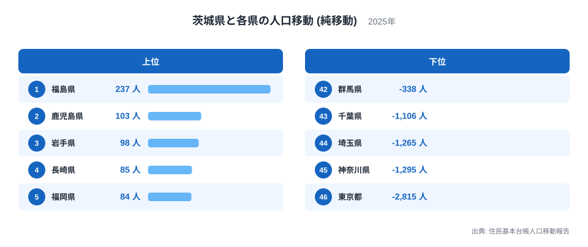
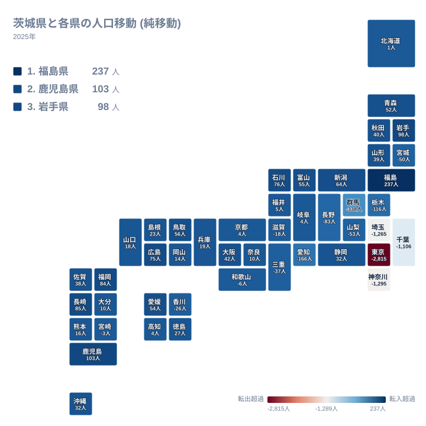
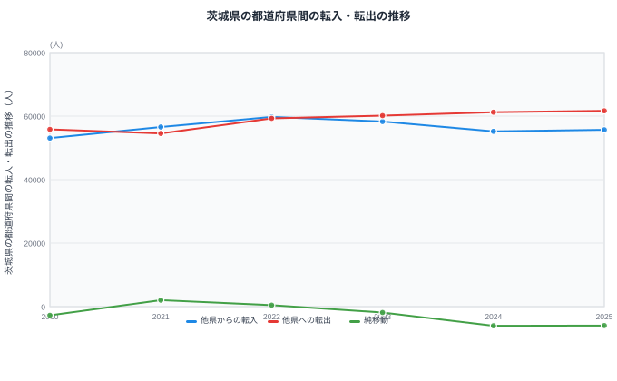

茨城県は関東地方の北東部に位置し、福島県、栃木県、埼玉県、千葉県という4つの県と陸で接しています。住民基本台帳人口移動報告の都道府県間の純移動データを見ると、茨城県は隣接する福島県からは人を得ている一方、同じく隣接する栃木県・埼玉県・千葉県との間ではいずれもマイナスとなっています。

純移動とは、ある県から見て別の県との間で転入した人数から転出した人数を引いた差のことです。移動した人の総数そのものではなく、あくまで差し引きの値である点に注意が必要です。この記事では茨城県と各県の純移動データをもとに、茨城県がどの方向から人を集め、どの方向へ人を明け渡しているのかを見ていきます。

## 相手県別にみる純移動

<source-link href="/ranking/moving-in-excess-rate">転入超過率ランキング</source-link>

茨城県が最も多くの人を得ている相手は福島県で、純移動は237人です。2位は鹿児島県で103人、3位は岩手県で98人、4位は長崎県で85人、5位は福岡県で84人と続きます。1位の福島県を除けば、上位は鹿児島県や長崎県、福岡県といった九州や東北の遠方の県が並んでおり、単純な距離の近さだけで説明できる順位ではありません。全国の転入超過率ランキングと合わせて見ると、茨城県の全国的な位置づけも確認できます。

一方で最も多くの人を失っている相手は東京都で、純移動はマイナス2,815人です。45位は神奈川県でマイナス1,295人、44位は埼玉県でマイナス1,265人、43位は千葉県でマイナス1,106人と続き、下位4県はいずれも首都圏の県が占めています。42位の群馬県もマイナス338人と、上位・下位ともに関東地方の県が目立つ結果になっています。

> [!NOTE]
> 茨城県が陸で接する福島県・栃木県・埼玉県・千葉県の4県のうち、プラスなのは福島県だけで、純移動はプラス237人、全46県中1位です。栃木県・埼玉県・千葉県はいずれもマイナスで、特に埼玉県はマイナス1,265人、千葉県はマイナス1,106人と大きな流出になっています。

## 地図でみる純移動の広がり

地図の中で茨城県自体のマスに色が付いていないのは、茨城県から茨城県への移動というデータがそもそも存在しないためです。この地図は茨城県と、それ以外の46都道府県との関係だけを表しています。

地図全体を見渡すと、青みがかった色で示される純移動プラスの県が東北・九州・四国など全国に広く散らばっている一方、赤みがかった色で示される純移動マイナスの県は関東地方の南側に集中していることがわかります。茨城県が接する4つの県のうち、純移動がプラスなのは北隣の福島県だけで、237人という1位の値を記録しています。

残る3つの隣接県、すなわち栃木県、埼玉県、千葉県はすべて純移動がマイナスです。栃木県はマイナス116人で40位、埼玉県はマイナス1,265人で44位、千葉県はマイナス1,106人で43位となっており、いずれも茨城県の南から西にかけて位置する県です。北隣の福島県だけがプラスで、南・西に接する3県がそろってマイナスという構図が、この地図から読み取れます。

> [!WARNING]
> 茨城県の純移動ランキング上位には、鹿児島県・長崎県・福岡県といった、茨城県から遠く離れた九州の県が並びます。2位の鹿児島県はプラス103人で、隣接する栃木県のマイナス116人よりも大きなプラス幅です。地理的な近さだけで純移動の大きさを予想すると、この記事の上位県の並びを見誤ります。

## 遠方の県との関係

茨城県が人を得ている上位の県を見ると、2位の鹿児島県、3位の岩手県、4位の長崎県、5位の福岡県と、九州や東北の県が目立ちます。6位の石川県、7位の広島県、8位の新潟県、9位の鳥取県、10位の富山県も含めると、茨城県は特定の地方に偏らず、全国の幅広い地域から人を集めていることがわかります。県内には研究機関や大学が集積する地域もあり、進学や就職を通じて遠方の県との結びつきが生まれている可能性がありますが、この点はデータからは断定できません。

一方で東京都との関係は突出しています。[茨城県のデータ](/areas/08000)と[東京都のデータ](/areas/13000)を見比べると、マイナス2,815人という値は46県の中で最も大きなマイナス幅であり、45位の神奈川県のマイナス1,295人を大きく上回っています。茨城県は遠方の県からは少しずつ人を集めながら、首都圏の中心である東京都に対しては大きく人を明け渡すという、2つの異なる方向性を同時に抱えています。

## 転入・転出の推移

この図は茨城県と全国すべての県との間でやり取りされた転入・転出・純移動の推移を示しています。他県からの転入は2020年が53,079人、2021年が56,580人、2022年が59,752人、2023年が58,289人、2024年が55,186人、2025年が55,683人と推移しています。他県への転出は2020年が55,823人、2021年が54,551人、2022年が59,292人、2023年が60,152人、2024年が61,226人、2025年が61,643人です。

純移動は2020年がマイナス2,744人、2021年がプラス2,029人、2022年がプラス460人、2023年がマイナス1,863人、2024年がマイナス6,040人、2025年がマイナス5,960人となっています。6年間のうち、2021年と2022年の2年だけがプラスで、それ以外の4年はマイナスです。特に2024年のマイナス6,040人は6年間で最も大きな落ち込みであり、2025年もマイナス5,960人とほぼ同じ水準が続いています。

> [!TIP]
> 純移動の符号が年によって入れ替わる場合は、転入と転出のどちらが動いたのかを確認することが読み解きのコツです。茨城県の場合、2021年から2022年にかけては転入が56,580人から59,752人へと増えたことでプラスに転じましたが、2023年以降は転出が60,000人を超える水準まで増え続け、純移動のマイナス幅が急速に広がっています。転入・転出の実数はいずれも相手県別の値ではなく全国合計であるという点も、相手県別ランキングとあわせて読むときに忘れないでください。

## まとめ

- 茨城県が最も人を得ている相手は福島県で、純移動は237人です。
- 茨城県が最も人を失っている相手は東京都で、純移動はマイナス2,815人です。
- 茨城県が接する4県のうち、純移動がプラスなのは北隣の福島県だけです。
- 上位の県には鹿児島県や岩手県、長崎県、福岡県など、遠方の県が多く含まれています。
- 全国合計の純移動は2020年から2025年の間で、2021年と2022年を除きマイナスです。
- 2024年と2025年は転出が61,000人を超え、この6年間で最もマイナス幅の大きい2年になっています。

茨城県の人口移動の全体像は、[人口動態のテーマ](/themes/population-dynamics)や[人口・世帯の統計一覧](/category/population)からも確認できます。

## データ出典

- 出典: 住民基本台帳人口移動報告
- 年: 2025年(相手県別の純移動)、2020年から2025年(転入・転出・純移動の推移)
