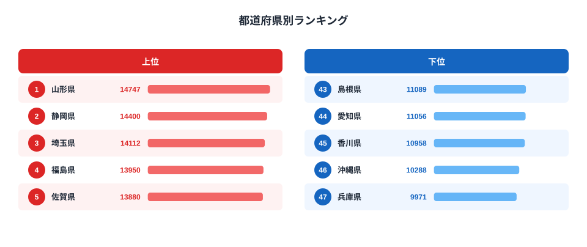

「夏に暑い県ほどアイスをよく買う」——そう思っていませんか。ところが2024年の家計調査データを見ると、1位は**山形県（14,747円）**であり、沖縄県は46位（10,288円）にとどまります。真夏の猛暑が続く東北・内陸の県がなぜ上位を占め、温暖な南の県が下位に沈むのか。この逆説的な地域差には、日本の食文化と気候の思わぬ関係が隠れています。

2024年の47都道府県の消費支出データでは、1位の山形県（14,747円）と最下位の兵庫県（9,971円）の差は**約1.5倍**。絶対額にして4,776円の開きがあります。「少ない差では？」と思うかもしれませんが、毎年積み重なるこの差は、地域の食文化の根深い違いを示しています。この記事では、上位・下位の地域パターンを読み解き、「なぜそうなるか」の構造的な理由に迫ります。

## アイスクリーム消費支出の上位・下位（2024年）

2024年のアイスクリーム・シャーベット消費支出額ランキングで、上位5県と下位5県は以下のとおりです。

<source-link href="/ranking/icecream-consumption-expenditure">アイスクリーム・シャーベット消費支出額ランキングをすべて見る</source-link>

上位5県は**山形（14,747円）・静岡（14,400円）・埼玉（14,112円）・福島（13,950円）・佐賀（13,880円）**です。一方、下位5県は**兵庫（9,971円）・沖縄（10,288円）・香川（10,958円）・愛知（11,056円）・島根（11,089円）**となっています。

> [!NOTE]
> 本データは総務省「家計調査」をもとにした都道府県庁所在市の二人以上世帯の年間支出額です。世帯全体のアイスクリーム・シャーベットへの支出を集計したものであり、個人の消費量とは異なります。農村部や地方都市では世帯規模が大きい傾向があり、これも消費額に影響します。

注目すべきは、上位に**東北（山形・福島・岩手）と北陸（石川）**が常連として登場することです。これはデータの1年だけの現象ではなく、2007年以降の長期トレンドでも一貫して見られるパターンです。2007年から2024年にかけての歴代1位を振り返ると、石川県・山形県・福島県がほぼ独占的に首位を争い続けています。

## 東北・北陸が上位に来る理由

東北や北陸がアイス消費で上位に来る理由は、「夏の暑さ」だけでは説明できません。むしろ複合的な要因が絡み合っています。

**第一に、冬が長い地域では夏のコントラストが大きいことです。**山形県や福島県は盆地気候のため、夏は全国でも有数の猛暑を記録します。山形市は最高気温の国内最高記録（40.8℃、2023年改記）を持つ地域でもあります。ただし「夏が暑い=アイス消費が多い」という単純な相関だけでなく、**冬に家族が家にこもる文化**や、**祭りや行事でのスイーツ購入習慣**も背景にあると考えられます。

**第二に、家族世帯の多さと世帯規模の影響です。**東北・北陸の県は、二世帯・三世帯同居の割合が高く、家族全員分のアイスを購入する機会が多くなります。家計調査は「二人以上の世帯」を対象にしており、世帯人数が多い地域では自然と購入額が増える構造があります。

**第三に、地域のアイスへの文化的親しみです。**山形県は「ずんだ」「さくらんぼ」などの素材を使ったアイスやスイーツ文化が根強く、地元スーパーや道の駅でもご当地アイスが充実しています。地域の食文化がアイスへの親和性を高めているとも言えます。

> [!TIP]
> 山形県はさくらんぼ（生産量全国1位）・ラフランス（洋梨全国1位）・スイカ（生産量上位）など果物の産地として知られます。こうした地域の食材が地元スーパーのご当地アイスや道の駅のスイーツとして身近に存在することが、アイス消費文化の根付きを後押ししています。「果物が豊富=デザート文化が豊か」という背景は消費行動にも波及しやすく、食材と消費の関連は[砂糖消費格差](/ranking/sugar-consumption-prefecture-gap)などでも類似パターンが確認できます。

## 「暑いはず」の県が下位に沈む逆説

上位の傾向と対照的に、下位のグループにも興味深いパターンが見えます。

**沖縄県（46位・10,288円）**は、温暖な気候から「アイス消費が多そう」という印象を持ちやすい県です。しかし家計調査のデータでは一貫して下位に位置しています。その理由として考えられるのは、沖縄独自の食文化です。沖縄では暑さをしのぐ飲み物・食べ物として、**さんぴん茶（ジャスミン茶）やフルーツ、かき氷（ぜんざい）など**の代替品が発展してきました。アイスクリームよりもかき氷や地元スイーツで暑さを和らげる文化が定着しているため、スーパーで購入するアイスの支出額が相対的に低くなると考えられます。

**愛知県（44位・11,056円）**と**兵庫県（最下位・9,971円）**については、都市部の単身・少人数世帯の多さが影響していると考えられます。名古屋市（愛知県庁所在市）や神戸市（兵庫県庁所在市）は大都市であり、単身世帯や共働き世帯が多く、家でまとめ買いするよりもコンビニや外食でその都度購入するスタイルが浸透しています。家計調査は「二人以上世帯」対象のため、こうした世帯構成の違いが数字に反映されやすい面もあります。

**香川県（45位・10,958円）**については、讃岐うどんを中心とした食文化が強く根付いており、スイーツ・デザート系の支出全体が相対的に抑えられているという仮説も考えられます。実際、香川県は「砂糖消費量」では上位に入るものの（讃岐うどんのつゆに砂糖を使う文化）、アイス支出は下位という組み合わせは興味深い対比です。

> [!WARNING]
> 家計調査は「都道府県庁所在市」の世帯データを基準としており、県全体の購買行動を完全に代表するわけではありません。県内でも都市部と農村部で消費傾向が大きく異なる場合があります。また、コンビニや外食でのアイス購入は家計調査に反映されにくい（家計簿に記録しにくい小額支出）ため、実際の消費量とは乖離がある可能性があります。

## 長期トレンド：石川・山形・福島の三つ巴

2007年以降のデータを振り返ると、1位争いは**石川・山形・福島**の三県が繰り返し登場していることがわかります。石川県は2011〜2012年・2014〜2015年・2017年・2019〜2020年・2022年と計7回首位を獲得しており、北陸・アイス消費の代名詞的な存在となってきました。福島県は2009〜2010年・2023年、山形県は2018年・2024年に首位を奪い、東北勢が近年台頭しています。

こうした上位常連県に共通するのは、「夏は猛暑・冬は厳寒」という寒暖差の大きさです。石川県（金沢）も山形県・福島県も、夏の最高気温が35℃を超える一方、冬は雪が積もる内陸・日本海側の気候帯にあります。暑い季節のコントラストがアイスへの需要を高め、かつ地域の食文化として根付いていることが長期首位争いを支えていると考えられます。

全体的な傾向として、2007年の全国1位（佐賀県8,951円）と2024年の全国1位（山形県14,747円）を比べると、18年間で約65%の増加となります。物価上昇もありますが、それ以上にアイスが「夏の贅沢品」から「年間を通じた日常食品」へと位置づけが変わったことが、全国的な支出増加の背景にあります。

## まとめ

- **1位は山形県（14,747円）**、最下位は兵庫県（9,971円）で約1.5倍の格差（2024年）
- 上位は東北（山形・福島・岩手）・北陸（石川）・埼玉など、夏の気温差が大きい内陸県が多い
- 下位は沖縄（独自スイーツ文化）・愛知・兵庫（大都市の少人数世帯）・香川が並ぶ
- 「暑い=アイスを買う」という単純な相関は成立せず、家族世帯の規模・地域食文化・代替スイーツの存在が大きく左右する
- 全国的に消費額は2007年比で60%以上増加しており、アイスは「夏の贅沢」から「年間の日常食品」へ変化

アイスの消費行動は、暑さだけでなく**世帯構成・食文化・地域の嗜好品傾向**が複合的に絡み合う指標です。自分の県が上位か下位かを確認しながら、「その背景にある食文化や家族構成の違い」に思いを巡らせると、身近な統計が地域理解の入り口になります。山形（1位）と兵庫（最下位）で年間4,776円の差は、毎日積み重なる家庭の食習慣の違いを静かに映しています。

関連する消費支出データとして、[バナナ消費量ランキング](/ranking/banana-consumption-quantity)や[砂糖消費格差](/ranking/sugar-consumption-prefecture-gap)も参照すると、食の地域差のパターンをより広い視点で捉えることができます。また、[山形県の地域プロフィール](/areas/06000)では、農業・食文化を中心とした指標を横断的に確認できます。食費・消費支出に関する他の統計は[経済カテゴリ](/category/economy)からご覧いただけます。

## データ出典

総務省「家計調査」（二人以上世帯・都道府県庁所在市）をもとに集計。最新データは2024年。e-Stat経由で整備。調査は毎年実施されており、家計簿方式によるサンプル調査のため、サンプル数の少ない県では年次変動が大きい場合があります。
