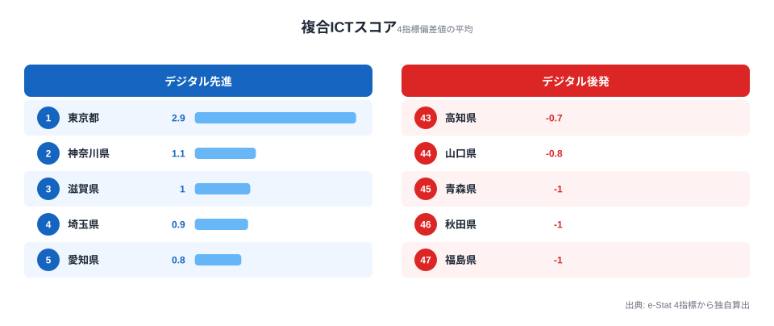
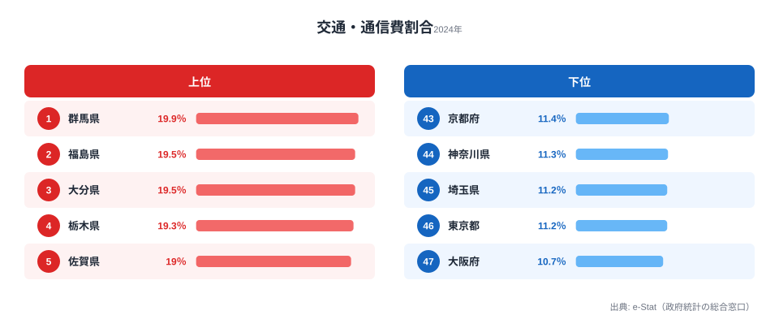
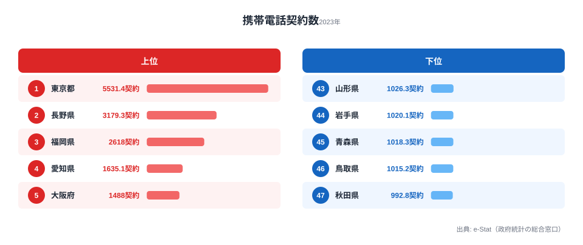
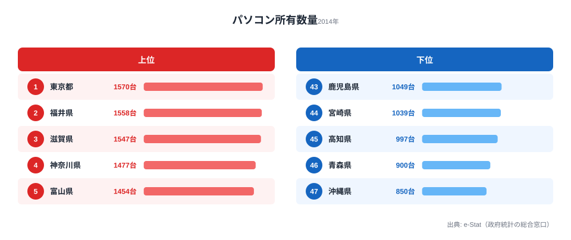
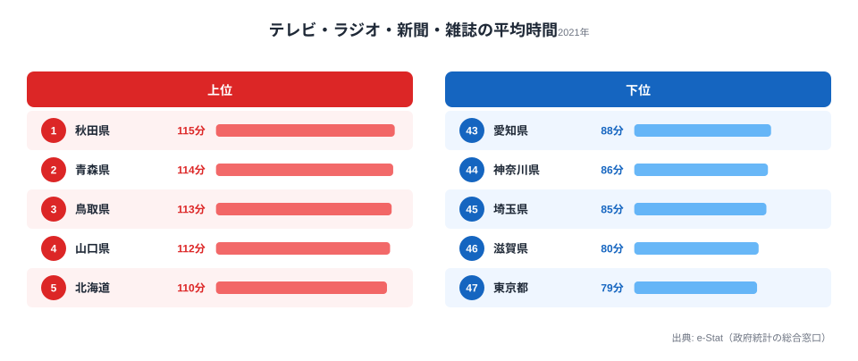

「都市と地方のデジタル格差」と言うとき、私たちは何を比べているのでしょうか。

スマートフォンの普及率はすでに全国的に高くなっています。携帯電話の契約数は多くの県で人口を上回っています。それでも「デジタル格差」が残るとすれば、**何が本質的な差を生んでいるのでしょうか**。

この記事では4つのICT関連指標を組み合わせた複合スコアで47都道府県を分析し、特に**「交通・通信費割合」という指標が都市と地方で全く異なる中身を持つ**という構造的な逆説を解析します。先に結論を言えば、残された格差の主因はデバイスの有無ではなく、生活習慣と地域の交通構造にあります。

> [!NOTE]
> 本記事の複合ICTスコアは、PC所有数（2014年度）・携帯電話契約数（2023年）・交通通信費割合（2024年）・テレビ等の旧メディア消費時間（2021年・有業男性）の4指標を各々偏差値化（zスコア）し、平均したものです。交通・通信費割合と旧メディア消費時間は「低いほどデジタル先進」として符号を反転しています。4指標は取得年度が異なるため、厳密な同時点比較ではなく構造的傾向の把握として読んでください。値は本記事のデータファイル（4指標の都道府県値）から再計算で再現できます。

## 複合ICTスコアランキング──東京が突出、東北が下位

**東京都（+2.88）**が圧倒的な1位です。PC所有・携帯契約ともに全国トップで、旧メディア消費時間は最短、交通・通信費割合も最低水準と、全指標が揃って突出しています。2位は神奈川県（+1.09）で、首都圏のベッドタウンとして所得・PC普及がともに高い構図です。

ここで注目したいのが、**滋賀県（+0.99）が3位**に入っている点です。人口約140万人の地方県でありながら、京都府（4位以下）や愛知県（+0.83・5位）と肩を並べ、東京・神奈川・埼玉という首都圏勢に次ぐ位置にいます。大都市を持たない県で唯一トップ5圏に食い込んでおり、後の章で「なぜ滋賀なのか」を掘り下げます。

下位は福島県（-1.02）・秋田県（-1.02）・青森県（-1.00）と、東北地方が最下層に集中しています。山口県（-0.75）・高知県（-0.69）がそれに続きます。これらの県はPC・携帯のデバイス普及で大きく劣るわけではなく、後述するように旧メディア消費の長さと交通構造がスコアを押し下げています。

## 交通費型 vs 通信費型──同じ「交通・通信費」でも中身が全く違う

この分析で最も重要な構造的発見は、**「交通・通信費割合」という指標が都市と地方で意味が異なる**ことです。まず実際の割合ランキングを見てみましょう。

割合が高い（=家計を圧迫している）上位は群馬県（19.9％）・福島県（19.5％）・大分県（19.5％）と地方県が並び、最も低いのは大阪府（10.7％）・東京都（11.2％）という都市部です。最大と最小で約1.9倍の開きがあります。

<source-link href="/ranking/transport-communication-expenditure-ratio-multi-person-households">47都道府県の交通・通信費割合ランキングをもっと見る</source-link>

問題は、この「割合」の中身が地域によって全く別物だという点です。

**都市部（東京・大阪・神奈川）**では、「交通・通信費」の主要成分は**スマートフォン・インターネット代（通信費）**です。公共交通が充実しているため自動車維持費がほとんどかかりません。割合が低いのは「通信に使う金額が小さい」からというより、「家計全体が大きいため相対的に割合が下がる」ことも作用しています。

**地方（東北・山陰・九州南部）**では、「交通・通信費」の主要成分は**自動車維持費（ガソリン・車検・保険）**です。一家に複数台の車を持ち、その維持費が家計を圧迫しています。携帯電話の契約数が少ないわけではありません──**交通費が「通信費」を家計の中で押しのけている**のです。実際、[通信費が家計を最も圧迫する県の分析](/blog/communication-cost-burden)でも、通信費単体の負担と「交通・通信費割合」は別の動きをしていることが確認できます。

> [!WARNING]
> この構造的差異は政策設計に直結します。「交通・通信費割合が高い地方のデジタル格差を解消するには通信費補助を」という発想は的外れになりかねません。地方の「デジタル格差」の実体は、通信費負担ではなく自動車依存からくる家計構造の問題だからです。車社会から公共交通へのシフトや在宅勤務化のほうが、間接的に「デジタル格差」指標を改善する可能性があります。

携帯電話の契約数ランキングを見ると、東京（5,531契約/千人）が突出して多い一方、秋田（993）・鳥取（1,015）が最少で、最大と最少で約5.6倍の開きがあります。ただし下位の地方県も「人口1人あたり1契約前後」は確保しており、デバイスとしてのスマートフォンが行き渡っていないわけではありません。

<source-link href="/ranking/mobile-phone-contract-count-per-1000">47都道府県の携帯電話契約数ランキングをもっと見る</source-link>

つまり、都市部は携帯契約が多く交通・通信費割合が低い「通信費型」、地方は携帯契約は平均的でも交通・通信費割合が高い「交通費型」という、2つのクラスターが存在しているのです。

## なぜ滋賀が上位なのか──製造業共働き県のICT優位

[滋賀県のプロフィール](/areas/25000)を見ると、複合ICTスコアが大都市を持たない県で唯一トップ5圏（3位・+0.99）に達する理由は、3つの要因が重なっていることがわかります。

**①PC所有が全国3位（1,547台/千世帯）**です。製造業が盛んな滋賀は世帯収入が高く、PCへの投資余力があります。1位の東京（1,570台）に肉薄する水準で、首都圏を除けば福井に次ぐ高さです。

**②旧メディア消費時間が最短クラス**です。滋賀県の有業男性のテレビ・ラジオ等の消費時間は80分で、東京（79分）に次ぐ全国2番目の短さでした。共働き率が高く生産性意識の強い生活習慣が、デジタル媒体へのシフトを後押ししていると考えられます。

**③交通・通信費割合が低め**です。大津・草津・彦根など都市部に人口が集中し、完全な車依存ではない交通構造が割合を相対的に下げています。

> [!TIP]
> 滋賀の上位入りは「ITベンチャーが集まる都市」型ではなく、「製造業の高所得 × 都市近郊の地理 × 効率的な生活習慣」という条件の組み合わせによるものです。同様の条件が揃う地方県は、大都市でなくてもICTスコアが向上しうることを示しています。地方DXを考えるときは、企業誘致だけでなく生活時間の使い方にも目を向ける価値があります。

<source-link href="/ranking/pc-ownership-multi-person-households-per-1000">47都道府県のPC所有数量ランキングをもっと見る</source-link>

## 旧メディア消費時間──東北・九州がテレビ長時間視聴

PC普及率と旧メディア（テレビ・ラジオ等）の消費時間の間には、**負の相関**があります。PCが多い県ほど旧メディアの消費時間が短い傾向があり、情報接触手段のデジタル移行が進んでいることを示しています。

消費時間が最も長いのは秋田（115分）・青森（114分）・鳥取（113分）で、最も短いのは東京（79分）・滋賀（80分）です。東京は「PC多い・旧メディア少ない」の極にあり、青森・秋田は「PC少ない・旧メディア多い」のポジションにあります。複合ICTスコアの下位に東北が並ぶのは、この旧メディア消費の長さが大きく効いています。

<source-link href="/ranking/average-broadcast-media-consumption-time-employed-man">47都道府県のテレビ等消費時間（男性）ランキングをもっと見る</source-link>

旧メディア消費時間が長い地域のDX推進には、単にデバイスを普及させるだけでなく、**コンテンツ消費習慣の変化を促す施策**が必要になります。なお、テレビ等の消費時間には男女差もあり、[テレビ・ラジオ視聴時間の男女差の分析](/blog/ict-media-consumption-gender-gap)も合わせて読むと、世帯内のメディア接触構造がより立体的に見えてきます。

## 4指標の格差構造──格差の主因は「生活習慣・地域構造」

4指標の偏差値内訳を上位県・下位県で見比べると、格差を生む主因が見えてきます。

上位県は4指標がそろって平均以上に揃っています。特に東京は全指標で突出しています。

これに対して**下位県で格差を生む主因は「旧メディア消費が長い」と「交通・通信費割合が高い」**の2指標です。PC所有や携帯契約は全国的に普及が進んでいるため指標間の差が小さく、**生活習慣（メディア接触パターン）と地域構造（車依存度）がスコアを引き下げる主因**になっています。

これは「デジタルデバイス格差」の時代から「デジタル活用・習慣格差」の時代への移行を示しています。

## まとめ

4指標分析から浮かぶデジタル格差の構造は次のとおりです。

1. **「デジタル格差」の主因は習慣・構造です**。デバイスの普及格差は縮小しました。残る格差の主因は旧メディアの消費習慣と地域の交通構造（車依存度）です。
2. **都市は「通信費型」、地方は「交通費型」です**。同じ「交通・通信費割合」指標でも意味が全く異なります。政策設計でこの差を見落とすと施策が的外れになります。
3. **滋賀の上位入りが示すヒント**があります。大都市でなくても「製造業の高所得 × 都市近郊の地理 × 効率的な生活習慣」の組み合わせでICTスコアは上がります。地方DXへの示唆と言えます。

ICT格差の次の課題はハードウェアの普及ではなく、テレワーク・オンライン行政手続き・デジタルリテラシー教育といったソフト面の充実です。情報通信に関する他のデータは[ICT・情報通信カテゴリ](/category/ict)から一覧できます。

## データ出典

- [e-Stat 社会・人口統計体系](https://www.e-stat.go.jp/) — PC所有（2014年度）・携帯契約（2023年）・交通通信費割合（2024年）・旧メディア消費時間（2021年・有業男性）。複合ICTスコアは上記4指標を偏差値化して独自算出しています。
