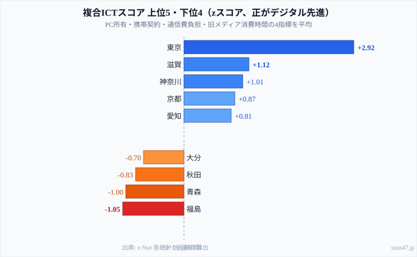

「都市と地方のデジタル格差」と言うとき、私たちは何を比べているのでしょうか。

スマートフォンの普及率はすでに全国的に高く、携帯電話の契約数は多くの県で人口を上回っています。それでも「デジタル格差」が残るとすれば、**何が本質的な差を生んでいるのか**を考える必要があります。

この記事では4つのICT関連指標を組み合わせた複合スコアで47都道府県を分析し、特に**「交通・通信費割合」という指標が都市と地方で全く異なる中身を持つ**という構造的な逆説を解きほぐしていきます。先に結論を述べると、残された格差の正体はデバイスの有無ではなく、生活習慣と地域の交通構造にあります。情報通信に関する他の指標は[ICTカテゴリのランキング一覧](/category/ict)からも横断的に確認できます。

> [!NOTE]
> 分析で使う4指標はデータ取得年度が異なります（PC所有：2014年、携帯契約：2023年、通信費：2024年、メディア消費：2021年）。各指標を偏差値化（zスコア）し、交通・通信費割合と旧メディア消費時間は「低いほどデジタル先進」として符号を反転。4指標の平均をスコアとしています。年度がそろっていないため厳密な順位ではなく、構造的傾向の把握として読んでください。

## 複合ICTスコアランキング──東京が突出し、東北が下位に沈む

**東京都（+2.92）**が圧倒的な首位に立ちます。PC所有・携帯契約ともに全国トップで、旧メディア消費時間は最短、通信費割合も低い水準に収まっており、全指標が突出しています。2位以下に大きく差をつけており、デジタル接触のあらゆる側面で東京が「先進」であることが数字に表れています。

2位以下で注目したいのは、**滋賀県（+1.12）が2位**に入っている点です。人口約140万人の地方県でありながら、神奈川（+1.01）・京都（+0.87）・愛知（+0.81）を上回ります。大都市圏ではない県が上位に食い込む理由は、この記事の後半で詳しく見ていきます。上位を見渡すと、東京を除けば「製造業が盛んで都市近郊に人口が集まる県」が並んでおり、単純な人口規模だけでは説明できない構造が浮かびます。

一方で下位は、福島県（-1.05）・青森県（-1.00）・秋田県（-0.83）と東北地方が集中します。大分（-0.70）もここに連なります。これらの県はPCや携帯の普及そのものが極端に低いわけではありません。むしろスコアを押し下げているのは、旧メディアの長時間消費と交通・通信費割合の高さという、生活様式に根ざした2指標です。なぜ東北が下位に沈むのかは、デバイスの問題ではなく、後述する「交通費型」の家計構造で説明できます。

<source-link href="/ranking/pc-ownership-multi-person-households-per-1000">47都道府県のPC所有数量ランキングをもっと見る</source-link>

<ad-slot></ad-slot>

## 交通費型 vs 通信費型──同じ「交通・通信費」でも中身が真逆

この分析で最も重要な構造的発見は、**「交通・通信費割合」という指標が都市と地方で意味が異なる**ことです。同じ数字を見ても、その内訳は正反対になります。

**都市部（東京・大阪・神奈川）**では、「交通・通信費」の主要成分は**スマートフォン・インターネット代（通信費）**です。公共交通が充実しているため自動車維持費がほとんどかかりません。割合が低いのは「通信に使う金額が家計全体の中で小さい」からというより、「家計全体が大きいため相対的に割合が下がる」側面もあります。つまり都市の低さは「通信費型」の低さなのです。

**地方（東北・山陰・九州南部）**では、「交通・通信費」の主要成分は**自動車維持費（ガソリン・車検・保険）**になります。一家に複数台の車を持ち、その維持費が家計を圧迫します。携帯電話の契約数が少ないわけではありません──**交通費が「通信費」を家計の中で押しのけている**のです。地方の高さは「交通費型」の高さだと言えます。

> [!WARNING]
> この構造的な違いは政策設計に直結します。「交通・通信費割合が高い地方のデジタル格差を解消するには通信費補助を」という発想は的外れになりかねません。地方の「デジタル格差」の実体は、通信費負担ではなく自動車依存からくる家計構造の問題だからです。順位だけを見て地方を「通信が弱い」と読み違えると、施策がずれてしまいます。

携帯電話契約数と交通・通信費割合を重ねて見ると、この構造がよく分かります。都市部では携帯契約が多く交通・通信費割合が低い（通信費型）、地方では携帯契約は平均的でも交通・通信費割合が高い（交通費型）という、2つのクラスターが存在します。同じ「交通・通信費が家計に占める割合」という1つの指標が、地域によって全く別の物語を語っているのです。

<source-link href="/ranking/transport-communication-expenditure-ratio-multi-person-households">47都道府県の交通・通信費割合ランキングをもっと見る</source-link>
<source-link href="/ranking/mobile-phone-contract-count-per-1000">47都道府県の携帯電話契約数ランキングをもっと見る</source-link>

## なぜ滋賀が上位なのか──製造業共働き県のICT優位

滋賀県の複合ICTスコアが全国2位（+1.12）に達する理由は、3つの要因が重なっているからです。大都市ではない滋賀が上位に来る背景には、地理と産業構造の組み合わせがあります。

**①PC所有が全国3位（1,547台／千世帯）**になっています。製造業が盛んな滋賀は世帯収入が高く、PCへの投資余力があります。世帯あたりの台数で見ても全国上位で、家庭のデジタル基盤がしっかり整っていることが分かります。

**②旧メディア消費時間が最短クラス**にとどまります。滋賀県の男性のテレビ・ラジオ消費時間は短く、共働き率が高く生産性意識が強い生活習慣が、デジタル媒体へのシフトを後押ししていると考えられます。テレビに長時間向き合う余裕が少ない生活が、結果的にデジタル接触を増やしています。

**③交通・通信費割合が低め**に収まります。大津・草津・彦根など都市部に人口が集まり、完全な車依存ではない交通構造になっているため、通信費割合が相対的に下がります。前述の「交通費型」の重しが、滋賀では比較的軽いのです。

> [!TIP]
> 滋賀の上位入りは「ITベンチャーが集まる都市」型ではなく、「製造業共働き×都市近郊地理×生活習慣の効率性」という要因の組み合わせです。同じような条件がそろう地方県は、ハードを増やさなくてもICTスコアが上がる余地があると読めます。地方DXを考えるときは、人口規模より生活様式と交通構造に注目すると示唆が得られます。

<source-link href="/ranking/pc-ownership-multi-person-households-per-1000">PC所有数量ランキングをもっと見る</source-link>

<ad-slot></ad-slot>

## 旧メディア消費時間──東北・九州がテレビ長時間視聴

PC普及率と旧メディア（テレビ・ラジオ）消費時間の間には**負の相関**があります。PCが多い県ほどテレビ・ラジオの消費時間が短い傾向があり、情報接触手段のデジタル移行が進んでいることを示しています。

東京都は「PCが多く、旧メディアが少ない」という極端な位置にあります。青森県・秋田県は反対に「PCが少なく、旧メディアが多い」ポジションです。この対比は、デバイスの普及度と情報接触の習慣が連動していることを示しており、下位県のスコアを押し下げる大きな要因になっています。普及そのものの水準は[PC所有数量ランキング](/ranking/pc-ownership-multi-person-households-per-1000)と[テレビ等消費時間（男性）ランキング](/ranking/average-broadcast-media-consumption-time-employed-man)を並べて見ると、この負の相関が読み取れます。

旧メディア消費時間が長い地域のDX推進では、単にデバイスを普及させるだけでは足りません。**コンテンツ消費習慣そのものの変化を促す施策**が必要になります。テレビからスマートフォンへ情報源を移す動機づけがなければ、端末だけ配っても活用は進まないからです。

<source-link href="/ranking/average-broadcast-media-consumption-time-employed-man">47都道府県のテレビ等消費時間（男性）ランキングをもっと見る</source-link>

## 4指標の格差構造──主因は「生活習慣・地域構造」

4指標の偏差値内訳を上位県と下位県で比べると、格差を生む主因が見えてきます。上位県は4指標すべてが平均以上にそろっており、特に東京は全指標で突出しています。

これに対して、**下位県で格差を生む主因は「旧メディア消費が長い」と「交通・通信費割合が高い」**の2指標です。PC所有や携帯契約は全国的に普及が進んでいるため指標間の差が小さく、**生活習慣（メディア接触パターン）と地域構造（車依存度）がスコアを引き下げる主因**になっています。デバイスの数ではなく、それをどう使い、家計のどこに負担が乗っているかが、格差の輪郭を決めているのです。

これは「デジタルデバイス格差」の時代から「デジタル活用・習慣格差」の時代への移行を示しています。端末を持っているかどうかではなく、どのメディアにどれだけ時間を割くか、どんな交通環境で暮らすかが、次の格差の軸になりつつあります。

## まとめ

4指標分析から浮かび上がるデジタル格差の構造を整理します。

1. **「デジタル格差」の主因は習慣と構造です**。デバイスの普及格差は縮小しました。残る格差の主因は、旧メディア消費の習慣と地域の交通構造（車依存度）です。
2. **都市は「通信費型」、地方は「交通費型」です**。同じ「交通・通信費割合」という指標でも、内訳が真逆になります。政策設計でこの差を見落とすと施策が的外れになります。
3. **滋賀の上位入りが示すヒント**があります。大都市でなくても「製造業共働き×都市近郊地理×効率的な生活習慣」の組み合わせでICTスコアは上がります。地方DXへの示唆になります。

ICT格差の次の課題は、ハードウェアの普及ではありません。テレワーク・オンライン行政手続き・デジタルリテラシー教育といった、ソフト面の充実が問われています。

## データ出典

- e-Stat 社会・人口統計体系 — PC所有（2014年）・携帯契約（2023年）・交通通信費（2024年）・旧メディア消費（2021年）
- 複合ICTスコアは上記4指標を偏差値化し独自に算出
